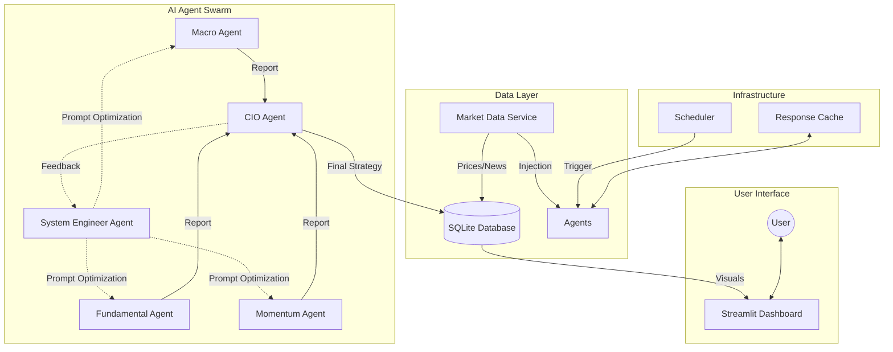
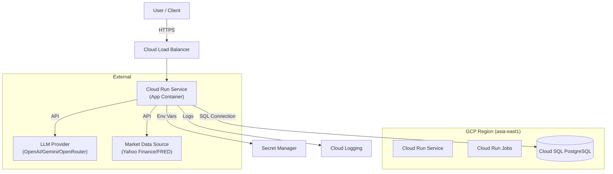

# AI Investment Advisor Platform


> **[English](#english) | [繁體中文 (Traditional Chinese)](#traditional-chinese)**

---

<a id="english"></a>

## 🇺🇸 Project Overview

An advanced, automated investment advisory system powered by a swarm of AI agents. This platform leverages Large Language Models (LLMs) to perform multi-dimensional market analysis—combining technical momentum, fundamental valuation, and macroeconomic trends—to generate professional-grade investment strategies.

### 🌟 Key Features

*   **Multi-Agent Architecture**:
    *   **Macro Agent**: Analyzes global economic trends, interest rates, and geopolitical events.
    *   **Fundamental Agent**: Evaluates company financials, earnings reports, and valuation metrics.
    *   **Momentum Agent**: Tracks price action, trends, and technical indicators.
    *   **CIO Agent (Chief Investment Officer)**: Synthesizes all inputs to make final portfolio allocation decisions.
    *   **System Engineer Agent (Self-Optimization)**: Monitors feedback from the CIO and automatically optimizes other agents' prompts to improve analysis quality continuously.
*   **Real-time Data Injection**: Prevents AI hallucinations by injecting live market data (prices, financials, news) directly into agent prompts.
*   **Dynamic Scheduling for US Market**: Default schedule aligns with US mid-session (02:00 Taipei Time / 13:00 ET) to capture real-time market dynamics.
*   **Smart Caching System**: Optimizes API costs and latency with granular Time-To-Live (TTL) settings.
*   **Interactive Dashboard**: Real-time monitoring of portfolio, reports, and **Optimization History**.

### 🏗️ System Architecture



#### ☁️ Cloud Infrastructure Architecture

This diagram illustrates the recommended deployment setup on Google Cloud Platform (GCP).



### 🚀 Quick Start

#### Prerequisites
*   Docker Desktop installed
*   An LLM API Key (OpenAI, Google Gemini, or OpenRouter)

#### Installation

1.  **Clone the repository**
    ```bash
    git clone https://github.com/neohsiung/AI-Investment-Advisor.git
    cd AI-Investment-Advisor
    ```

2.  **Configure Environment**
    Copy the example environment file and add your API keys:
    ```bash
    cp .env.example .env
    # Edit .env with your favorite editor
    vim .env
    ```

3.  **Start the System**

    **Option A: Docker (Recommended for Production)**
    ```bash
    chmod +x start.sh
    ./start.sh
    ```

    **Option B: Local Development**
    ```bash
    chmod +x start_local.sh
    ./start_local.sh
    ```
    *This will create a virtual environment, install dependencies, optionally migrate data (if DB_TYPE=postgres), and launch the dashboard.*

4.  **Access Dashboard**
    Open your browser and navigate to:
    [http://localhost:8501](http://localhost:8501)

### ☁️ Cloud Deployment & Data Migration Strategy

This system is designed to be cloud-native (GCP Cloud Run / Spot VMs). When moving from local execution to the cloud:

1.  **Infrastructure Setup**:
    *   **Database**: Provision a PostgreSQL instance (e.g., Cloud SQL).
    *   **Compute**: Deploy the container to Cloud Run or a Spot VM.
    *   **Env Vars**: Set `DB_TYPE=postgres`, `DB_HOST`, `DB_USER`, `DB_PASS` in the cloud environment.

2.  **Data Migration**:
    *   **Strategy A (Remote Migration)**: Run `scripts/migrate_data.py` locally while connecting to the remote database via a proxy.
    *   **Strategy B (VM Migration)**: Upload the SQLite file to the VM and run the migration script internally.

### 🛠️ Management

The system is designed for "always-on" operation on a server or local machine (e.g., MacBook M3).

*   **Stop Services**: `./stop.sh`
*   **View Logs**: `docker compose logs -f`
*   **Update**: `git pull` then `./start.sh`

### 📂 Project Structure

```
.
├── data/               # Persistent data (Database, Cache)
├── prompts/            # System prompts for AI agents
├── src/
│   ├── agents/         # AI Agent implementations
│   ├── pages/          # Streamlit dashboard pages
│   ├── services/       # Business logic services
│   ├── utils/          # Utilities (Logger, Cache, Time)
│   ├── dashboard.py    # Main dashboard entry point
│   ├── scheduler.py    # Background task scheduler
│   └── workflow.py     # Main analysis workflow
├── Dockerfile          # Container definition
├── docker-compose.yml  # Service orchestration
└── requirements.txt    # Python dependencies
```

### ⚠️ Disclaimer

**This software is for educational and research purposes only.**

*   The investment strategies generated by this system are based on AI analysis and historical data, which do not guarantee future results.
*   The authors and contributors are not financial advisors.
*   Always conduct your own due diligence and consult with a certified financial planner before making any investment decisions.

### 📄 License

This project is licensed under the MIT License - see the LICENSE file for details.

#### License Compliance & Third-Party Code
This project uses open-source libraries. A partial list of licenses includes:
*   **MIT / Apache 2.0 / BSD**: Most dependencies (Pandas, Streamlit, etc.).
*   **LGPL**: Some utility libraries (e.g., `chardet` via `requests`).

**Compliance Note**:
This project is intended for usage as a standalone application. The source code is provided under MIT, but users should be aware of the licenses of the dependencies if they plan to redistribute or bundle this software. We run automated license checks (`pip-licenses`) in our CI/CD pipeline to ensure no viral GPL code is inadvertently introduced.

---

<a id="traditional-chinese"></a>

## 🇹🇼 專案概覽 (Project Overview)

這是一個由 **台灣團隊** 開發，採用 AI 代理人集群 (AI Agent Swarm) 驅動的自動化投資顧問系統。本平台利用大型語言模型 (LLMs) 進行多維度市場分析——結合**技術面動能**、**基本面估值**與**總體經濟趨勢**——致力於生成專業級的投資策略建議。

### 🌟 核心功能 (Key Features)

*   **多代理人架構 (Multi-Agent Architecture)**:
    *   **總經專家 (Macro Agent)**: 分析全球經濟趨勢、利率政策與地緣政治事件。
    *   **基本面專家 (Fundamental Agent)**: 評估公司財報、營收增長與核心估值指標。
    *   **動能專家 (Momentum Agent)**: 追蹤價格行為、市場趨勢與技術指標。
    *   **投資長 (CIO Agent)**: 綜合所有專家報告，進行資產配置與最終決策。
    *   **系統工程師 (System Engineer Agent)**: 監控 CIO 的回饋，自動優化其他 Agent 的 Prompt，實現持續自我進化。
*   **即時數據注入 (Real-time Data Injection)**: 透過串接即時市場數據 (股價、財報、新聞)，防止 AI 產生幻覺 (Hallucinations)。
*   **美股時段動態排程**: 預設排程對應美股盤中時段 (台北時間 02:00 / 美東時間 13:00)，精準捕捉市場動態。
*   **智慧快取系統**: 透過精細的 TTL (Time-To-Live) 設定，優化 API 成本與回應速度。
*   **互動式儀表板**: 透過 Streamlit 提供即時投資組合監控、報告檢視與**優化歷史紀錄**。

### 🏗️ 系統架構 (System Architecture)

*(請參考上方英文版架構圖)*

#### ☁️ 雲端基礎設施架構

本系統建議部署於 Google Cloud Platform (GCP)，架構設計如下：
*(請參考上方英文版雲端架構圖)*

### 🚀 快速開始 (Quick Start)

#### 前置需求
*   已安裝 Docker Desktop
*   一組 LLM API Key (OpenAI, Google Gemini, 或 OpenRouter)

#### 安裝步驟

1.  **複製專案代碼**
    ```bash
    git clone https://github.com/neohsiung/AI-Investment-Advisor.git
    cd AI-Investment-Advisor
    ```

2.  **設定環境變數**
    複製範例設定檔並填入您的 API Key：
    ```bash
    cp .env.example .env
    # 使用您喜歡的編輯器編輯 .env
    vim .env
    ```

3.  **啟動系統**

    **方案 A: Docker (生產環境推薦)**
    ```bash
    chmod +x start.sh
    ./start.sh
    ```

    **方案 B: 本機開發 (Local Development)**
    ```bash
    chmod +x start_local.sh
    ./start_local.sh
    ```
    *此指令會建立虛擬環境、安裝依賴套件、遷移數據 (若使用 PostgreSQL) 並啟動 Dashboard。*

4.  **存取儀表板**
    打開瀏覽器並前往：
    [http://localhost:8501](http://localhost:8501)

### ☁️ 雲端部署與數據遷移

本系統採雲端原生設計 (Cloud Native)，支援 GCP Cloud Run 或 Spot VMs。當您準備從本機遷移至雲端時：

1.  **基礎建設**:
    *   **資料庫**: 建立 PostgreSQL 實例 (如 Cloud SQL)。
    *   **運算資源**: 部署容器至 Cloud Run。
    *   **環境變數**: 設定 `DB_TYPE=postgres`, `DB_HOST` 等連線資訊。

2.  **數據遷移**:
    *   使用 `scripts/migrate_data.py` 腳本，可將本機 SQLite (`data/portfolio.db`) 數據無痛遷移至雲端 PostgreSQL。

### 🛠️ 管理指南

*   **停止服務**: `./stop.sh`
*   **查看日誌**: `docker compose logs -f`
*   **更新系統**: `git pull` 然後執行 `./start.sh`

### 📂 專案結構

```
.
├── data/               # 持久化數據 (Database, Cache)
├── prompts/            # AI Agent 的系統提示詞 (Prompts)
├── src/
│   ├── agents/         # AI Agent 實作邏輯
│   ├── pages/          # Streamlit Dashboard 頁面
│   ├── services/       # 業務邏輯服務層
│   ├── utils/          # 通用工具 (Logger, Cache, Time)
│   ├── dashboard.py    # Dashboard 程式入口
│   ├── scheduler.py    # 背景排程器
│   └── workflow.py     # 主要分析工作流
├── Dockerfile          # 容器定義檔
├── docker-compose.yml  # 服務編排檔
└── requirements.txt    # Python 依賴套件
```

### ⚠️ 免責聲明 (Disclaimer)

**本軟體僅供教育與研究用途。**

*   本系統生成的投資策略是基於 AI 分析與歷史數據，**不保證**未來的獲利結果。
*   作者與貢獻者並非財務顧問。
*   在做出任何投資決策前，請務必自行評估風險並諮詢專業財務顧問。

### 📄 授權條款 (License)

本專案採用 **MIT License** 授權 - 詳情請見 LICENSE 文件。

#### 授權合規與第三方代碼
本專案使用了多個開源函式庫，包含但不限於 MIT, Apache 2.0, BSD 等寬鬆授權。
我們在 CI/CD 流程中引入了自動化授權檢核 (`pip-licenses`)，以確保不會引入具傳染性的 GPL 程式碼，保障您的使用權益。
