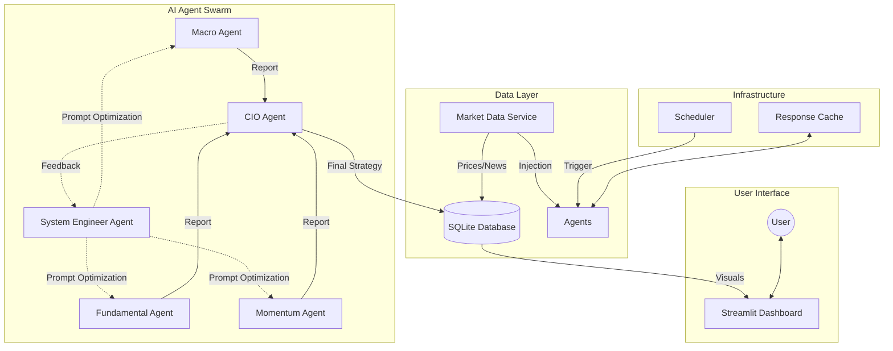

# AI Investment Advisor Platform


An advanced, automated investment advisory system powered by a swarm of AI agents. This platform leverages Large Language Models (LLMs) to perform multi-dimensional market analysis—combining technical momentum, fundamental valuation, and macroeconomic trends—to generate professional-grade investment strategies.

## 🌟 Key Features

*   **Multi-Agent Architecture**:
    *   **Macro Agent**: Analyzes global economic trends, interest rates, and geopolitical events.
    *   **Fundamental Agent**: Evaluates company financials, earnings reports, and valuation metrics.
    *   **Momentum Agent**: Tracks price action, trends, and technical indicators.
    *   **CIO Agent (Chief Investment Officer)**: Synthesizes all inputs to make final portfolio allocation decisions.
    *   **System Engineer Agent (Self-Optimization)**: Monitors feedback from the CIO and automatically optimizes other agents' prompts to improve analysis quality continuously.
*   **Real-time Data Injection**: Prevents AI hallucinations by injecting live market data (prices, financials, news) directly into agent prompts.
*   **Dynamic Scheduling for US Market**: Default schedule aligns with US mid-session (02:00 Taipei Time / 13:00 ET) to capture real-time market dynamics.
*   **Smart Caching System**: Optimizes API costs and latency with granular Time-To-Live (TTL) settings.
*   **Interactive Dashboard**: Real-time monitoring of portfolio, reports, and **Optimization History**.

## 🏗️ System Architecture



### ☁️ Cloud Infrastructure Architecture

This diagram illustrates the recommended deployment setup on Google Cloud Platform (GCP).

```mermaid
graph TD
    User["User / Client"] -- HTTPS --> LB["Cloud Load Balancer"]
    LB --> CR["Cloud Run Service<br>(App Container)"]
    
    subgraph GCP Region (asia-east1)
        CR -->|SQL Connection| SQL[("Cloud SQL<br>PostgreSQL")]
        CR -->|Env Vars| SM["Secret Manager"]
        CR -->|Logs| CL["Cloud Logging"]
    end
    
    subgraph External
        CR -->|API| LLM["LLM Provider<br>(OpenAI/Gemini/OpenRouter)"]
        CR -->|API| Data["Market Data Source<br>(Yahoo Finance/FRED)"]
    end
```

## 🚀 Quick Start

### Prerequisites
*   Docker Desktop installed
*   An LLM API Key (OpenAI, Google Gemini, or OpenRouter)

### Installation

1.  **Clone the repository**
    ```bash
    git clone https://github.com/neohsiung/AI-Investment-Advisor.git
    cd AI-Investment-Advisor
    ```

2.  **Configure Environment**
    Copy the example environment file and add your API keys:
    ```bash
    cp .env.example .env
    # Edit .env with your favorite editor
    vim .env
    ```

3.  **Start the System**

    **Option A: Docker (Recommended for Production)**
    ```bash
    chmod +x start.sh
    ./start.sh
    ```

    **Option B: Local Development**
    ```bash
    chmod +x start_local.sh
    ./start_local.sh
    ```
    *This will create a virtual environment, install dependencies, optionally migrate data (if DB_TYPE=postgres), and launch the dashboard.*

4.  **Access Dashboard**
    Open your browser and navigate to:
    [http://localhost:8501](http://localhost:8501)

## ☁️ Cloud Deployment & Data Migration Strategy

This system is designed to be cloud-native (GCP Cloud Run / Spot VMs). When moving from local execution to the cloud:

### 1. Infrastructure Setup
*   **Database**: Provision a PostgreSQL instance (e.g., Cloud SQL).
*   **Compute**: Deploy the container to Cloud Run or a Spot VM.
*   **Env Vars**: Set `DB_TYPE=postgres`, `DB_HOST`, `DB_USER`, `DB_PASS` in the cloud environment.

### 2. Data Migration Strategy
You don't need to start from scratch. Use one of the following strategies to migrate your local SQLite data (`data/portfolio.db`) to the production PostgreSQL database.

#### Strategy A: Remote Migration (Recommended for Cloud SQL)
Run the migration script **locally**, connecting to the remote database via a secure proxy.

1.  **Start Cloud SQL Auth Proxy** (if using GCP Cloud SQL):
    ```bash
    ./cloud_sql_proxy -instances=<INSTANCE_CONNECTION_NAME>=tcp:5432
    ```
2.  **Update Local .env**:
    Set `DB_TYPE=postgres`, `DB_HOST=localhost` (tunnel), etc.
3.  **Run Migration**:
    ```bash
    python3 scripts/migrate_data.py --source data/portfolio.db
    ```

#### Strategy B: VM-Based Migration
If deploying on a VM (e.g., Compute Engine), you can move the DB file and migrate internally.

1.  **Transfer Database File**:
    ```bash
    scp data/portfolio.db user@vm-ip:/tmp/portfolio.db
    ```
2.  **SSH into VM & Run**:
    ```bash
    # Inside the container or VM environment
    export DB_TYPE=postgres
    # ... set other DB env vars ...
    python3 scripts/migrate_data.py --source /tmp/portfolio.db
    ```

## 🛠️ Management

The system is designed for "always-on" operation on a server or local machine (e.g., MacBook M3).

*   **Stop Services**: `./stop.sh`
*   **View Logs**: `docker compose logs -f`
*   **Update**: `git pull` then `./start.sh`

## 📂 Project Structure

```
.
├── data/               # Persistent data (Database, Cache)
├── prompts/            # System prompts for AI agents
├── src/
│   ├── agents/         # AI Agent implementations
│   ├── pages/          # Streamlit dashboard pages
│   ├── services/       # Business logic services
│   ├── utils/          # Utilities (Logger, Cache, Time)
│   ├── dashboard.py    # Main dashboard entry point
│   ├── scheduler.py    # Background task scheduler
│   └── workflow.py     # Main analysis workflow
├── Dockerfile          # Container definition
├── docker-compose.yml  # Service orchestration
└── requirements.txt    # Python dependencies
```

## ⚠️ Disclaimer

**This software is for educational and research purposes only.**

*   The investment strategies generated by this system are based on AI analysis and historical data, which do not guarantee future results.
*   The authors and contributors are not financial advisors.
*   Always conduct your own due diligence and consult with a certified financial planner before making any investment decisions.

## 📄 License

This project is licensed under the MIT License - see the LICENSE file for details.

### License Compliance & Third-Party Code
This project uses open-source libraries. A partial list of licenses includes:
*   **MIT / Apache 2.0 / BSD**: Most dependencies (Pandas, Streamlit, etc.).
*   **LGPL**: Some utility libraries (e.g., `chardet` via `requests`).

**Compliance Note**:
This project is intended for usage as a standalone application. The source code is provided under MIT, but users should be aware of the licenses of the dependencies if they plan to redistribute or bundle this software. We run automated license checks (`pip-licenses`) in our CI/CD pipeline to ensure no viral GPL code is inadvertently introduced.
