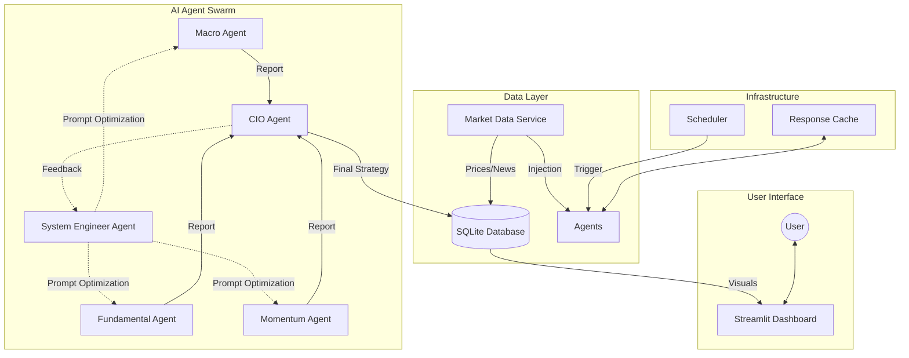

# AI Investment Advisor Platform


An advanced, automated investment advisory system powered by a swarm of AI agents. This platform leverages Large Language Models (LLMs) to perform multi-dimensional market analysis—combining technical momentum, fundamental valuation, and macroeconomic trends—to generate professional-grade investment strategies.

## 🌟 Key Features

*   **Multi-Agent Architecture**:
    *   **Macro Agent**: Analyzes global economic trends, interest rates, and geopolitical events.
    *   **Fundamental Agent**: Evaluates company financials, earnings reports, and valuation metrics.
    *   **Momentum Agent**: Tracks price action, trends, and technical indicators.
    *   **CIO Agent (Chief Investment Officer)**: Synthesizes all inputs to make final portfolio allocation decisions.
    *   **System Engineer Agent (Self-Optimization)**: Monitors feedback from the CIO and automatically optimizes other agents' prompts to improve analysis quality continuously.
*   **Real-time Data Injection**: Prevents AI hallucinations by injecting live market data (prices, financials, news) directly into agent prompts.
*   **Dynamic Scheduling for US Market**: Default schedule aligns with US mid-session (02:00 Taipei Time / 13:00 ET) to capture real-time market dynamics.
*   **Smart Caching System**: Optimizes API costs and latency with granular Time-To-Live (TTL) settings.
*   **Interactive Dashboard**: Real-time monitoring of portfolio, reports, and **Optimization History**.

## 🏗️ System Architecture



## 🚀 Quick Start

### Prerequisites
*   Docker Desktop installed
*   An LLM API Key (OpenAI, Google Gemini, or OpenRouter)

### Installation

1.  **Clone the repository**
    ```bash
    git clone https://github.com/neohsiung/AI-Investment-Advisor.git
    cd AI-Investment-Advisor
    ```

2.  **Configure Environment**
    Copy the example environment file and add your API keys:
    ```bash
    cp .env.example .env
    # Edit .env with your favorite editor
    vim .env
    ```

3.  **Start the System**
    Run the startup script to build and launch the Docker containers:
    ```bash
    ./start.sh
    ```

4.  **Access Dashboard**
    Open your browser and navigate to:
    [http://localhost:8501](http://localhost:8501)

## 🛠️ Management

The system is designed for "always-on" operation on a server or local machine (e.g., MacBook M3).

*   **Stop Services**: `./stop.sh`
*   **View Logs**: `docker compose logs -f`
*   **Update**: `git pull` then `./start.sh`

## 📂 Project Structure

```
.
├── data/               # Persistent data (Database, Cache)
├── prompts/            # System prompts for AI agents
├── src/
│   ├── agents/         # AI Agent implementations
│   ├── pages/          # Streamlit dashboard pages
│   ├── utils/          # Utilities (Logger, Cache, Time)
│   ├── dashboard.py    # Main dashboard entry point
│   ├── scheduler.py    # Background task scheduler
│   └── workflow.py     # Main analysis workflow
├── Dockerfile          # Container definition
├── docker-compose.yml  # Service orchestration
└── requirements.txt    # Python dependencies
```

## ⚠️ Disclaimer

**This software is for educational and research purposes only.**

*   The investment strategies generated by this system are based on AI analysis and historical data, which do not guarantee future results.
*   The authors and contributors are not financial advisors.
*   Always conduct your own due diligence and consult with a certified financial planner before making any investment decisions.

## 📄 License

This project is licensed under the MIT License - see the LICENSE file for details.
