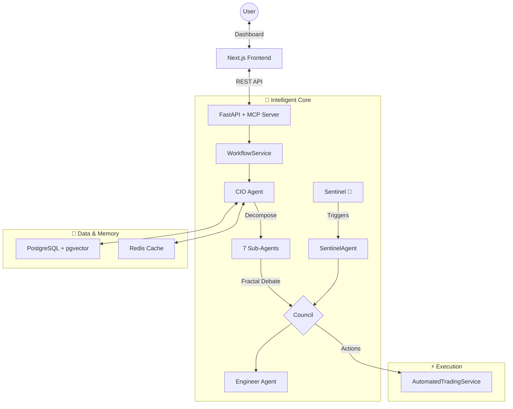

# AI Investment Advisor

<p align="center">
  <a href="https://www.star-history.com/neohsiung/AI-Investment-Advisor">
  <picture>
   <source media="(prefers-color-scheme: dark)" srcset="https://api.star-history.com/badge?repo=neohsiung/AI-Investment-Advisor&theme=dark" />
   <source media="(prefers-color-scheme: light)" srcset="https://api.star-history.com/badge?repo=neohsiung/AI-Investment-Advisor" />
   
  </picture>
  </a>
</p>

<p align="center">
  <a href="https://github.com/neohsiung/AI-Investment-Advisor/stargazers"></a>
  &nbsp;
  <a href="https://github.com/neohsiung/AI-Investment-Advisor/network/members"></a>
  &nbsp;
  <a href="https://github.com/neohsiung/AI-Investment-Advisor/issues"></a>
  &nbsp;
  <a href="https://github.com/neohsiung/AI-Investment-Advisor/blob/main/LICENSE"></a>
</p>

<p align="center">
  
  
  
  
  
  
  
</p>

<p align="center">
  
</p>

<p align="center">
  <strong>English</strong> |
  <a href="READMEs/README.zh-TW.md">繁體中文</a> |
  <a href="READMEs/README.ja-JP.md">日本語</a>
</p>

---

> [!WARNING]
> **Not investment advice. Trades real money at your own risk.** This is autonomous trading software — if configured with live broker credentials, it will place real orders with real money. Provided "AS IS" with no warranty (see [LICENSE](LICENSE) / [NOTICE](NOTICE)). Always start in paper/demo mode and understand the code before connecting a funded account.

> [!TIP]
> **Your portfolio has 7 agents watching it 24/7.** This platform orchestrates a multi-agent swarm to autonomously monitor, debate, and rebalance your investments — the way a hedge fund brain would.

**You just put $10,000 into a brokerage. How do you decide what to buy, when to hedge, and when to exit?**

AI Investment Advisor is an autonomous quantitative platform that deploys a **7-Agent Swarm** powered by **Fractal Debate** — a multi-round adversarial reasoning framework that eliminates single-model hallucinations. A CIO Agent decomposes investment questions, delegates to domain experts, orchestrates debate, and executes trades automatically via eToro's API.

> **Debates that converge > predictions that hallucinate.**

---

## ✨ Features

<table>
  <tr>
    <td width="50%" valign="top">
      <h3>🧬 Fractal Debate</h3>
      <p>Multi-agent adversarial reasoning across 7 specialized agents. Eliminates single-model hallucinations through structured disagreement and convergence.</p>
    </td>
    <td width="50%" valign="top">
      <h3>🦅 10-Dimension Sentinel</h3>
      <p>VIX, price, news, macro, allocation drift — autonomous risk radar that never sleeps. Auto-triggers hedging and rebalancing.</p>
    </td>
  </tr>
  <tr>
    <td width="50%" valign="top">
      <h3>⚡ Auto-Hedging</h3>
      <p>Millisecond-precision position liquidation via eToro API. Dual-track webhooks for rapid emergency response during market crashes.</p>
    </td>
    <td width="50%" valign="top">
      <h3>🧠 OpenClaw Architecture</h3>
      <p>Per-agent WAL (Write-Ahead Logging) with independent workspaces. Eliminates context overflow amnesia in long financial analyses.</p>
    </td>
  </tr>
  <tr>
    <td width="50%" valign="top">
      <h3>📊 Hybrid RAG</h3>
      <p>BM25 + temporal-decay semantic search via pgvector + Redis. Decisions are grounded in deep historical context, not just recent data.</p>
    </td>
    <td width="50%" valign="top">
      <h3>🔐 Enterprise-Grade Security</h3>
      <p>Fernet encryption at rest, parameterized SQL only, hardened Docker images, and SHA256 signal verification.</p>
    </td>
  </tr>
  <tr>
    <td width="50%" valign="top">
      <h3>📡 Full Observability</h3>
      <p>OpenTelemetry 1.39 + SigNoz APM. Distributed traces, metrics, and logs across all agents and services.</p>
    </td>
    <td width="50%" valign="top">
      <h3>🔄 Scheduled Workflows</h3>
      <p>Celery Beat orchestrates daily checks, weekly reports, and sentinel ticks. Set it and forget it.</p>
    </td>
  </tr>
</table>

---

## 🏗️ Architecture


```mermaid
graph TD
    User((User)) <-->|Dashboard| FE["Next.js Frontend"]
    FE <-->|REST API| API["FastAPI + MCP Server"]

    subgraph "🧠 Intelligent Core"
        API --> WF["WorkflowService"]
        WF --> CIO["CIO Agent"]
        CIO -->|Decompose| SUB["7 Sub-Agents"]
        SUB -->|Fractal Debate| COUNCIL{"Council"}
        COUNCIL --> ENG["Engineer Agent"]
        SENT["Sentinel 🦅"] -->|Triggers| SA["SentinelAgent"]
        SA --> COUNCIL
    end

    subgraph "💾 Data & Memory"
        PG["PostgreSQL + pgvector"]
        RD["Redis Cache"]
    end

    subgraph "⚡ Execution"
        TRADE["AutomatedTradingService"]
    end

    COUNCIL -->|Actions| TRADE
    CIO <--> PG
    CIO <--> RD
```

### 3-Tier LLM Routing

| Tier | Purpose | Example Models |
|:-----|:--------|:---------------|
| **Advanced 🚀** | Deep analysis, CIO decisions | GPT-4o, Claude 3.5 Sonnet |
| **Smart 🧠** | Debate, reasoning, classification | Gemini 1.5 Pro |
| **Fast ⚡** | Formatting, screening, extraction | GPT-4o-mini, Ollama local |

### 3-Tier Data Storage

| Tier | Engine | Use Case |
|:-----|:-------|:---------|
| **Hot 🔥** | Redis | Semantic cache, real-time state |
| **Warm ☀️** | PostgreSQL + pgvector | Structured records, vector search |
| **Cold ❄️** | File System | Raw reports, historical backtests |

---

## 🛠️ Tech Stack

| Category | Technology |
|:---------|:-----------|
| **Language** | Python 3.11, TypeScript |
| **Backend** | FastAPI, MCP (Model Context Protocol), Celery |
| **Frontend** | Next.js 15 (App Router), Streamlit (legacy) |
| **AI/ML** | LiteLLM, DSPy, OpenAI / Gemini / Claude / Ollama multi-provider |
| **Database** | PostgreSQL 16 + pgvector, Redis, SQLite (dev) |
| **Infra** | Docker Compose, Nginx, SigNoz, OpenTelemetry 1.39 |
| **Trading** | eToro API (automated fractional trading) |
| **Data Sources** | Polygon, Tiingo, Finnhub, AlphaVantage, FMP, FRED, TAVILY |
| **Notifications** | Telegram, LINE, Email (SMTP) |

---

## 🚀 Quick Start

### Prerequisites

- Docker & Docker Compose
- Python 3.10+ (for local development)
- Node.js 20+ (for frontend development)

### Launch (self-host, one command)

```bash
git clone https://github.com/neohsiung/AI-Investment-Advisor.git
cd AI-Investment-Advisor
./start.sh selfhost
```

This auto-generates every required secret, defaults to **paper trading
mode** (no real orders, ever, until you opt in), builds and starts the
full stack, and applies database migrations. See
**[docs/SELF_HOSTING.md](docs/SELF_HOSTING.md)** for the first-run LLM
provider setup, cost expectations, and how to switch to live trading
when you're ready.

For local development instead of the hardened self-host profile, use
`./start.sh dev` (includes SigNoz APM, n8n, and debugging tools).

| Service | URL |
|:--------|:----|
| Gateway (nginx, prod only) | [http://127.0.0.1:8088](http://127.0.0.1:8088) |
| Next.js Dashboard | [http://localhost:3001](http://localhost:3001) |
| FastAPI / MCP Server | [http://localhost:8000](http://localhost:8000) (dev: 8001) |
| SigNoz APM | [http://127.0.0.1:8080](http://127.0.0.1:8080) |

> The dev stack's nginx publishes no host port — reach the frontend and API
> directly on the ports above. The gateway exists in production only.

---

## 📁 Project Structure

```
AI-Investment-Advisor/
├── .agent/              # Agent governance layer (rules, skills, workflows)
│   ├── rules/           #   Coding, testing, security, commit standards
│   ├── skills/          #   15 specialized capability packages
│   └── workflows/       #   Operational playbooks
├── alembic/             # Database migrations (PostgreSQL)
├── config/              # Model routing, LLM seed data, persona definitions
├── deployment/          # Helm charts, PostgreSQL manifests
├── frontend/            # Next.js 15 dashboard (TypeScript)
├── infra/               # Nginx reverse proxy, SigNoz observability config
├── k8s/                 # Kubernetes manifests (future deployment)
├── prompts/             # Agent system prompts (CIO, Sentinel, sub-agents)
├── scripts/             # Ops: DB seed, deployment, health checks
├── services/            # Microservice entrypoints
│   ├── mcp_server/      #   FastAPI + MCP server (main backend)
│   ├── notification/    #   Telegram / LINE / Email service
│   ├── scheduler/       #   Celery Beat scheduler
│   └── dashboard/       #   Streamlit dashboard (legacy)
├── src/                 # Core Python package
│   ├── agents/          #   Agent definitions + skills (eToro trade, research)
│   ├── api/             #   FastAPI route handlers
│   ├── config/          #   App configuration, data source matrix
│   ├── domain/          #   Domain models
│   ├── infrastructure/  #   Celery, LLM gateway, OTel instrumentation
│   ├── repositories/    #   Database access (ORM + raw SQL)
│   ├── services/        #   Business logic services
│   └── workflow/        #   Daily / weekly workflow orchestrators
├── tests/               # Unit, integration, e2e tests
├── workspace/           # Multi-agent workspace (WAL, identity, memory)
├── AGENTS.md            # AI coding assistant context (unified standard)
├── CHANGELOG.md         # Version history (Keep a Changelog format)
├── SECURITY.md          # Security policy & vulnerability reporting
├── docker-compose.yml   # Development stack
├── docker-compose.prod.yml  # Production stack
├── pyproject.toml       # Python project config & dependencies
└── start.sh             # One-command full-stack launcher
```

---

## 🤖 AI Agent Context

This project uses [AGENTS.md](AGENTS.md) as the unified context file for all AI coding assistants (Antigravity, Claude Code, Cursor, Copilot, Gemini CLI). It provides:

- Project identity and architecture overview
- Key technical constraints and conventions
- Build, test, and lint commands
- Directory semantics and documentation references

> For deeper governance rules, skills, and workflows, see the [`.agent/`](.agent/README.md) directory.

---

## 📏 Governance & Standards

| Standard | File |
|:---------|:-----|
| Engineering & coding | [`.agent/rules/engineering-standards.md`](.agent/rules/engineering-standards.md) |
| Git commit format | [`.agent/rules/git-commit-format.md`](.agent/rules/git-commit-format.md) |
| Documentation | [`.agent/rules/documentation-standards.md`](.agent/rules/documentation-standards.md) |
| Observability | [`.agent/rules/observability-standards.md`](.agent/rules/observability-standards.md) |
| Security policy | [`SECURITY.md`](SECURITY.md) |

---

## 🤝 Contributing

Contributions are welcome! Here's how to get started:

1. Fork the repository
2. Create a feature branch (`git checkout -b feature/my-feature`)
3. Run the tests (`pytest tests/ -x --tb=short`)
4. Commit your changes and open a pull request

Please open an issue first for major changes so we can discuss the approach.

---

## 📚 Documentation

- 📖 **Full Wiki**: See the [Wiki](https://github.com/neohsiung/AI-Investment-Advisor/wiki) for architectural blueprints, data source matrix, and contribution guides.
- 📝 **Changelog**: See [`CHANGELOG.md`](CHANGELOG.md) for version history.

---

## Star History

<a href="https://www.star-history.com/?repos=neohsiung%2FAI-Investment-Advisor&type=date&legend=top-left">
 <picture>
   <source media="(prefers-color-scheme: dark)" srcset="https://api.star-history.com/image?repos=neohsiung/AI-Investment-Advisor&type=date&theme=dark&legend=top-left" />
   <source media="(prefers-color-scheme: light)" srcset="https://api.star-history.com/image?repos=neohsiung/AI-Investment-Advisor&type=date&legend=top-left" />
   
 </picture>
</a>

---

## 📄 License & Disclaimer

- **License**: [Apache License 2.0](LICENSE)
- **Disclaimer**: This project autonomously analyzes markets and, if configured with live broker credentials, can place real trades with real money. It is not financial advice, provided "AS IS" with no warranty. See [NOTICE](NOTICE) for the full disclaimer.

---

<p align="center">
  <strong>Stop guessing. Start debating. Let agents converge on truth.</strong>
</p>

<p align="center">
  Apache License 2.0 &copy; <a href="https://github.com/neohsiung">AI Investment Advisor Contributors</a>
</p>
