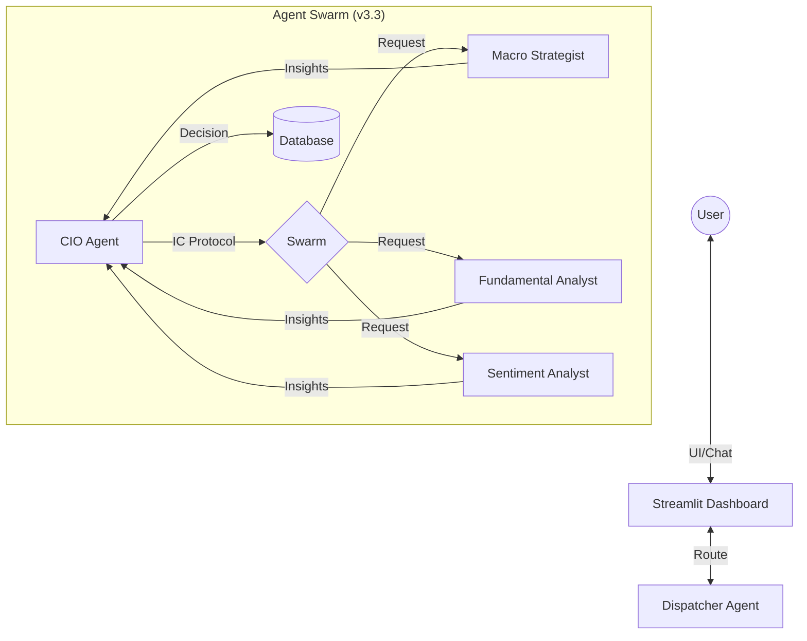

# AI Investment Advisor (v3.3)


> **[繁體中文 (Traditional Chinese)](#zh) | [English](#en)**

<a id="zh"></a>

## 🇹🇼 專案概覽 (Project Overview)

**AI Investment Advisor** 是一個由 **自我修正 (Self-Correcting)** AI Agent 集群驅動的自動化投資顧問系統。它模擬頂級對沖基金運作，整合 **Task Planning (任務規劃)**、**LiteLLM (多模型路由)** 與 **Swarm Intelligence (蜂群智慧)**，提供全自動化的市場分析與投資決策。

### 🔄 核心機制 (Core Mechanisms)

<details>
<summary><b>🌟 v3.3 新增功能 (New Features)</b></summary>

| 功能模組 | 描述 |
| :--- | :--- |
| **🧠 任務規劃引擎** | **TaskPlanningService** 將高層目標 (如週報) 自動分解為可執行的任務序列 (DAG)，並根據複雜度動態選擇模型 (Fast/Smart/Advanced)。 |
| **⚡ Redis 記憶系統** | 引入 **Adaptive Compression** 技術，利用 Redis 高速存取短期記憶，並透過 **Cross-Session Context** 實現長期思維連續性。 |
| **🐝 蜂群洞察 (Swarm)** | 整合 **Macro, Fundamental, Sentiment** 三維度訊號，由 CIO Agent 進行 **Gap Filling** (補倉) 與 Alpha 候選股最終仲裁。 |
| **🏆 量化反饋迴圈** | **Engineer Agent** 利用 **DSPy** 自動重寫表現不佳 Agent 的 Prompt，確保持續進化。 |
| **🏗️ 現代化基礎架構** | 支援 **Docker Compose / K8s** 部署，採用 Clean Architecture。測試覆蓋率 > 75%。 |

</details>

### 🚀 快速開始 (Quick Start)

```bash
# 1. 下載與設定
git clone https://github.com/neohsiung/AI-Investment-Advisor.git
cd AI-Investment-Advisor
cp .env.example .env

# 2. 啟動 (Docker Compose)
./start.sh
```
*Dashboard: [http://localhost:8501](http://localhost:8501)*

### 📚 文檔索引 (Documentation)

完整文檔位於 `wiki/` 目錄：

- **架構設計**:
    - [系統全景圖 (System Landscape)](wiki/04_架構觀點-Architect_Views/系統全景圖-System-Landscape.md)
    - [任務規劃引擎 (Task Planning)](wiki/04_架構觀點-Architect_Views/任務規劃與執行引擎-Task-Planning-Engine.md)
    - [記憶系統架構 (Memory System)](wiki/04_架構觀點-Architect_Views/記憶系統與Redis架構-Memory-Redis-Architecture.md)
    - [底層通信協議 (Agent Mesh Protocols)](wiki/04_架構觀點-Architect_Views/底層通信協議-Agent-Mesh-Protocols.md)
- **開發者指南**:
    - [環境設定 (Environment Setup)](wiki/03_開發者指南-Developer_Guide/環境設定與本地開發-Environment-Local-Dev.md)
    - [服務層指南 (Service Blueprints)](wiki/03_開發者指南-Developer_Guide/服務層開發指南-Service-Layer-Blueprints.md)
- **工程手冊**:
    - [研究與最佳實踐 (Research & Best Practices)](wiki/05_工程手冊-Engineering_Handbook/研究與最佳實踐-Research-Best-Practices.md)
    - [設計模式導讀 (Design Patterns Intro)](wiki/05_工程手冊-Engineering_Handbook/設計模式導讀-Design-Patterns-Intro.md)

### 🏗️ 系統架構 (Architecture)


```mermaid
graph TD
    User((User)) <-->|UI/Chat| DASH[Streamlit Dashboard]
    DASH <-->|Route| DISP[Dispatcher Agent]
    
    subgraph "Agent Swarm (v3.3)"
        CIO[CIO Agent]
        MACRO[Macro Strategist]
        FUND[Fundamental Analyst]
        SENT[Sentiment Analyst]
        
        CIO -->|IC Protocol| SWARM{Swarm}
        SWARM -->|Request| MACRO & FUND & SENT
        MACRO & FUND & SENT -->|Insights| CIO
        CIO -->|Decision| DB[(Database)]
    end
```

參閱詳細架構與協議：[代理人戰略協定 (Agent Swarm Protocol)](wiki/04_架構觀點-Architect_Views/代理人戰略協定-Agent-Swarm-Protocol.md)

---

<a id="en"></a>

## 🇺🇸 Project Overview

**AI Investment Advisor** is an advanced, automated quantitative investment system empowered by a **Self-Correcting Agent Swarm**. Simulating a **Billion-Dollar Hedge Fund**, it employs specialized AI Agents (CIO, Macro, Fundamental, Momentum) to perform global market research, while an **HR Unit** continuously monitors and optimizes their performance using **DSPy**.

This is not just a chatbot; it is an **autonomous financial analysis system capable of self-evolution**.

### 🌟 Key Features

| Feature Module | Description |
| :--- | :--- |
| **🏆 Quantitative Feedback Loop** | **Engineer Agent** reads performance metrics and CIO feedback, automatically rewriting Prompts for underperforming agents via **DSPy**. |
| **🏦 Institutional Personas** | **CIO** focuses on Risk-Adjusted Returns; **Macro/Fundamental/Momentum** analysts have dedicated data pipelines. |
| **🏗️ Modern Infrastructure** | **Kubernetes** ready, built with **Clean Architecture** (Factory, Repository, DI). **75%+ Test Coverage**. |
| **🔍 Intelligent Search** | Integrated **Tavily API** as primary search engine with DuckDuckGo fallback for reliable web research. |
| **🧠 Agent Mesh Protocol** | **MCP (Model Context Protocol)** server support enabling cross-agent tool sharing and **HR 360 Feedback**. |

### 🚀 Quick Start

#### 1. Clone Repository
```bash
git clone https://github.com/neohsiung/AI-Investment-Advisor.git
cd AI-Investment-Advisor
```

#### 2. Configure Environment
Copy the example config and add your API Keys.
```bash
cp .env.example .env
# vim .env
```

#### 3. Start System
```bash
# Option A: Docker Compose (Recommended)
./start.sh

# Option B: Kubernetes (Advanced)
./start.sh --k8s
```
*Access the Dashboard at: [http://localhost:8501](http://localhost:8501)*

### 📚 Documentation

Detailed documentation is available in the `wiki/` directory:

- **Getting Started**:
    - [Quickstart & User Guide](wiki/01_使用者手冊-User_Manual/快速啟動與操作指南-Quickstart-User-Guide.md)
- **Product Specs**:
    - [Evolutionary Roadmap](wiki/02_產品經理-Product_Managers/產品演進藍圖-Evolutionary-Roadmap.md)
    - [Core System Specs](wiki/02_產品經理-Product_Managers/Specs/核心系統規格-Core-System-Specs.md)
- **Developer Guide**:
    - [Environment & Local Dev](wiki/03_開發者指南-Developer_Guide/環境設定與本地開發-Environment-Local-Dev.md)
    - [Service Layer Blueprints](wiki/03_開發者指南-Developer_Guide/服務層開發指南-Service-Layer-Blueprints.md)
    - [Frontend & UX Layer](wiki/03_開發者指南-Developer_Guide/前端架構與UX層-Frontend-UX-Layer.md)
    - [Testing & External Services](wiki/03_開發者指南-Developer_Guide/測試與外部服務整合-Testing-External-Services.md)
- **Architecture & Engineering**:
    - [System Landscape](wiki/04_架構觀點-Architect_Views/系統全景圖-System-Landscape.md)
    - [Architectural Philosophies](wiki/04_架構觀點-Architect_Views/架構哲學-Architectural-Philosophies.md)
    - [Agent Mesh Protocols](wiki/04_架構觀點-Architect_Views/底層通信協議-Agent-Mesh-Protocols.md)
    - [Research & Best Practices](wiki/05_工程手冊-Engineering_Handbook/研究與最佳實踐-Research-Best-Practices.md)
    - [Design Patterns Intro](wiki/05_工程手冊-Engineering_Handbook/設計模式導讀-Design-Patterns-Intro.md)

### ⚠️ Disclaimer
**For Educational and Research Purposes Only.**
This software is a simulation of an investment system. It is not financial advice. Usage in real trading is at your own risk.

### 📄 License
MIT License.
