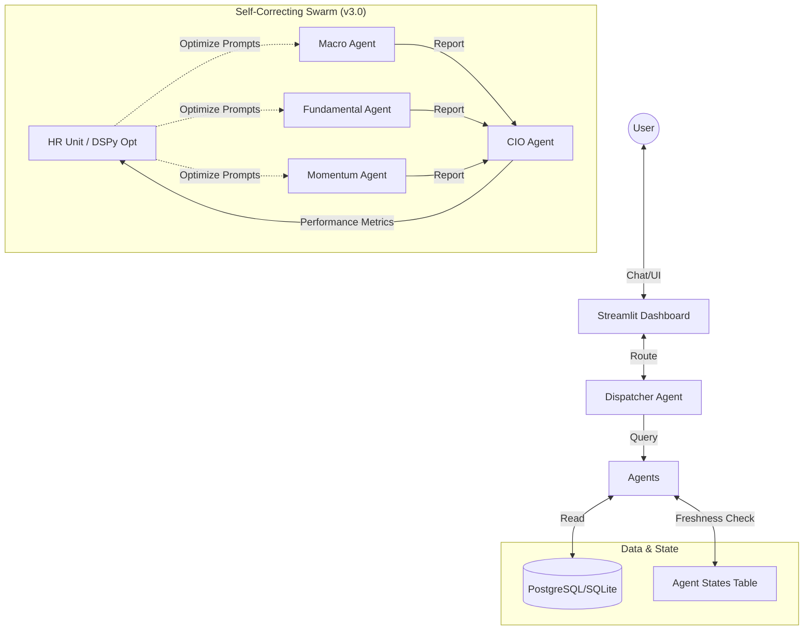

# AI Investment Advisor Platform (v3.0)


> **[English](#english) | [繁體中文 (Traditional Chinese)](#traditional-chinese)**

---

<a id="english"></a>

## 🇺🇸 Project Overview

**AI Investment Advisor** is an advanced, automated quantitative investment system empowered by a **Self-Correcting Agent Swarm**. Simulating a **Billion-Dollar Hedge Fund**, it employs specialized AI Agents (CIO, Macro, Fundamental, Momentum) to perform market research and portfolio management, while an **HR Unit** continuously monitors and optimizes their performance using **DSPy**.

### 🌟 Key Features (v3.0)

*   **Self-Correcting Loop (New)**:
    *   **HR Unit**: A dedicated "Human Resources" module that evaluates agent outputs.
    *   **DSPy Optimization**: Automatically refines prompts and logic based on feedback/backtest results.
*   **Multi-Agent Architecture**:
    *   **CIO Agent**: Portfolio allocation & strategy synthesis.
    *   **Fundamental Agent**: Evaluates financials and valuation.
    *   **Momentum Agent**: Tracks technical trends and price action.
    *   **Dispatcher Agent**: Interactive chat interface for user queries.
    *   **System Engineer Agent**: Maintains system health and optimizations.
*   **Adaptive Intelligence**:
    *   **Smart Freshness**: Skips redundant analysis to save costs.
    *   **Model Tiering**: Smart Tier (Gemini 1.5 Pro) for complex tasks, Fast Tier (Flash) for routine.
*   **Enterprise-Grade**:
    *   **Real-time Data**: Injects live market data (Yahoo Finance, FRED) to prevent hallucinations.
    *   **Clean Architecture**: Modular design for scalability and testing.

### 🏗️ System Architecture


```mermaid
graph TD
    User((User)) <-->|Chat/UI| DASH[Streamlit Dashboard]
    DASH <-->|Route| DISP[Dispatcher Agent]
    
    DISP -->|Query| Agents
    
    subgraph "Self-Correcting Swarm (v3.0)"
        HR[HR Unit / DSPy Opt]
        MA[Macro Agent]
        FA[Fundamental Agent]
        MO[Momentum Agent]
        CIO[CIO Agent]
        
        MA & FA & MO -->|Report| CIO
        CIO -->|Performance Metrics| HR
        HR -.->|Optimize Prompts| MA & FA & MO
    end

    subgraph Data & State
        DB[(PostgreSQL/SQLite)]
        States[Agent States Table]
    end

    Agents <-->|Freshness Check| States
    Agents <-->|Read| DB
```

### ⚙️ Core Workflows
1.  **Event-Driven (Daily)**: News -> Light CIO -> Main CIO -> Strategy.
2.  **Sector Strategy (Weekly)**: Macro -> CIO Strategy -> Screener -> Deep Research -> Synthesis.
3.  **Self-Correction**: Feedback -> HR Eval -> DSPy Optimizer -> Better Agents.

### 🚀 Quick Start

#### Prerequisites
*   Docker Desktop installed
*   An LLM API Key (OpenAI, Google Gemini, or OpenRouter)

#### Installation

1.  **Clone the repository**
    ```bash
    git clone https://github.com/neohsiung/AI-Investment-Advisor.git
    cd AI-Investment-Advisor
    ```

2.  **Configure Environment**
    ```bash
    cp .env.example .env
    # Edit .env with your API Keys
    vim .env
    ```

    **Key Environment Variables:**

    | Variable | Description | Required | Default |
    |----------|-------------|----------|---------|
    | `API_KEY` | LLM Provider Key (Google/OpenAI) | **Yes** | - |
    | `SMTP_USER` | Email for reports | Yes | - |
    | `SMTP_PASSWORD`| App Password | Yes | - |
    | `DB_TYPE` | `sqlite` or `postgres` | No | sqlite |

3.  **Start the System** (Recommended)
    ```bash
    ./start.sh
    ```
    *Builds Docker containers and launches Dashboard (http://localhost:8501) + Scheduler.*

    **Alternative: Local Dev (Python 3.11)**
    ```bash
    # See wiki/Python-Environment-Setup for details
    pip install -r requirements.txt
    python src/cli.py --mode dashboard
    ```

### 📚 Documentation (Wiki)
For detailed guides, please refer to our **[Project Wiki](wiki/Home.md)**:

*   **🚀 Deployment**: [Deployment Options](wiki/01_User_Manual/Deployment-Options.md), [GCP Guide](wiki/03_Developer_Guide/Deployment-GCP-CloudRun.md).
*   **📖 Manuals**: [User Guide](wiki/01_User_Manual/User-Guide.md), [CLI Reference](wiki/03_Developer_Guide/CLI-Reference.md).
*   **🏗️ Architecture**: [System Overview](wiki/04_Architect_View/System-Overview.md), [HR Protocol](wiki/02_Product_Manager_Corner/Specs/05_hr_protocol.md).

---

<a id="traditional-chinese"></a>

## 🇹🇼 專案概覽 (Project Overview)

**AI Investment Advisor** 是一個由 **自我修正 (Self-Correcting)** AI Agent 集群驅動的自動化投資顧問系統。它模擬了**頂級對沖基金**的運作架構，聘請了專業的 AI Agent (投資長、總經、基本面、動能) 進行市場分析，並設有 **HR Unit (人力資源部)** 利用 **DSPy** 技術監控並優化 Agent 的表現。

### 🌟 核心功能 (v3.0)

*   **自我修正迴圈 (Self-Correcting Loop)**:
    *   **HR Unit**: 專職監控 Agent 產出品質的模組。
    *   **DSPy 優化**: 根據回測與反饋，自動優化 Agent 的 Prompt 與推論邏輯。
*   **多重 Agent 架構**:
    *   **CIO Agent (投資長)**: 負責資產配置與最終決策。
    *   **Fundamental Agent (基本面)**: 評估財報與估值。
    *   **Momentum Agent (動能)**: 追蹤價格趨勢。
    *   **Dispatcher (調度員)**: 處理使用者對話與任務分派。
*   **企業級架構**:
    *   **整潔架構 (Clean Architecture)**: 高度模組化，易於測試與擴展。
    *   **即時數據**: 串接 Yahoo Finance 與 FRED，避免 AI 幻覺。

### 🏗️ 系統架構 (System Architecture)

*(請見上方英文區塊的架構圖)*

*   **Agent Swarm**: 各司其職的 AI 專家團隊。
*   **HR / DSPy Loop**: v3.0 的核心創新，讓系統越用越聰明。

### 🚀 快速開始 (Quick Start)

1.  **下載**: `git clone https://github.com/neohsiung/AI-Investment-Advisor.git`
2.  **設定**: `cp .env.example .env` (填入 API Key)
3.  **啟動**:
    ```bash
    ./start.sh
    ```
    *系統將自動以 Docker 啟動。瀏覽器打開: [http://localhost:8501](http://localhost:8501)*

### 📚 完整文檔 (Wiki)
所有技術手冊與指南皆已移至 **[Project Wiki](wiki/Home.md)**：

*   **新手入門**: [使用者手冊 (User Guide)](wiki/01_User_Manual/User-Guide.md)、[CLI 工具指南](wiki/03_Developer_Guide/CLI-Reference.md)。
*   **深入理解**: [系統架構全貌](wiki/04_Architect_View/System-Overview.md)、[HR 協議與自我修正](wiki/02_Product_Manager_Corner/Specs/05_hr_protocol.md)。

---

### ⚠️ Disclaimer
**本軟體僅供教育研究。** AI 投資建議不保證獲利，投資前請務必自行評估風險。

### 📄 License
MIT License.
