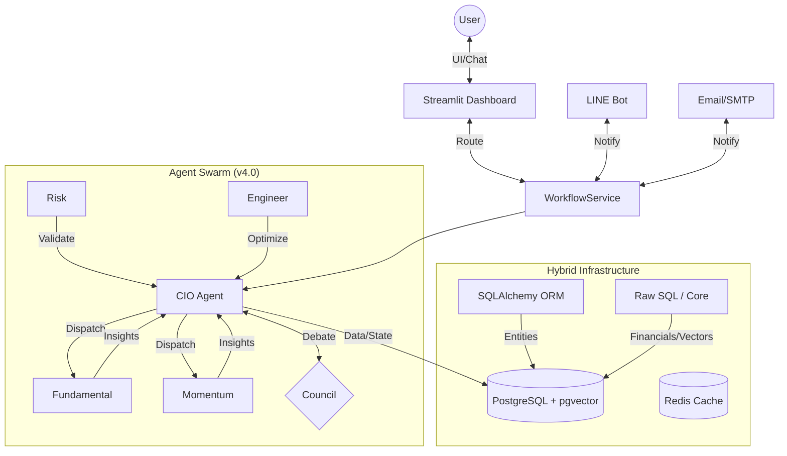

# AI Investment Advisor (v4.0)

### 版本紀錄 (Version History)
| Date | Version | Description | Author |
| :--- | :--- | :--- | :--- |
| 2026-02-17 | v4.0.0 | **Hybrid Storage Strategy**: Unified PostgreSQL + pgvector, SQLAlchemy ORM for entities. | Neo |
| 2026-02-16 | v3.9.0 | **Omni-Channel Unification**: Integrated Email notifications into Dashboard & ChannelMatrix. | Neo |
| 2026-02-16 | v3.8.1 | **Sentinel Refinement**: Smart Alert Deduplication (24h Cool-down) & Omni-Channel Fixes. | Neo |
| 2026-02-15 | v3.6.1 | **Standardized Multi-Channel Callbacks**: Unified adapter interface & webhook routing. | Neo |


> **[繁體中文 (Traditional Chinese)](#zh) | [English](#en)**

<a id="zh"></a>

## 🇹🇼 專案概覽

**AI Investment Advisor** 是由 **自我修正 (Self-Correcting)** AI Agent 集群驅動的自動化投資顧問系統。v4.0 版本正式確立了 **Hybrid Storage Strategy**，統一採用 PostgreSQL 處理結構化交易資料與語義嵌入，並導入 ORM 提升管理效率。

### 🌟 核心能力 (Core Capabilities)

| 模組 | 描述 |
| :--- | :--- |
| **🗄️ 混合健壯存儲** | **PostgreSQL + pgvector**：統一處理金融數據、JSONB 配置與語義記憶。 |
| **🧠 7 Agent + Council** | CIO/Fundamental/Momentum/Macro/Sentiment/Risk/Engineer Agent 集群，由 Council 碎形辯論仲裁。 |
| **⚖️ 槓桿引擎** | 精確計算 **TNV (總名義價值)**、**NLV (淨清算價值)** 與 **槓桿比率 (Leverage Ratio)**。 |
| **🌍 多渠道通知** | 統一 **ChannelMatrix**：支援 LINE、Email、Slack、Telegram 的動態熱載入與一鍵驗證。 |
| **🔭 哨兵監聽** | **SentinelService** 7×24 監聽；具備 **24h 智能冷卻** 與加權風險評分機制。 |
| **⚡ 任務規劃引擎** | DAG 任務分解，依複雜度動態路由模型 (Fast/Smart/Advanced)。 |
| **🏆 自我進化** | **Engineer Agent** 利用 DSPy 自動優化 Agent Prompt 與模型參數。 |
| **🏗️ 現代架構** | Clean Architecture · **SQLAlchemy ORM + Raw SQL** · 測試覆蓋率 > 75%。 |

### 🚀 快速開始

```bash
# 1. 下載與設定
git clone https://github.com/neohsiung/AI-Investment-Advisor.git
cd AI-Investment-Advisor
cp .env.example .env

# 2. 啟動 (Docker Compose - 包含 PostgreSQL + Redis)
docker-compose up -d
```
*Dashboard: [http://localhost:8501](http://localhost:8501)*

### 🏗️ 系統架構


```mermaid
graph TD
    User((User)) <-->|UI/Chat| DASH[Streamlit Dashboard]
    DASH <-->|Route| WF[WorkflowService]
    LINE[LINE Bot] <-->|Notify| WF
    EMAIL[Email/SMTP] <-->|Notify| WF

    subgraph "Agent Swarm (v4.0)"
        CIO[CIO Agent]
        FUND[Fundamental]
        MOM[Momentum]
        RISK[Risk]
        ENG[Engineer]
        
        CIO -->|Dispatch| FUND & MOM
        FUND & MOM -->|Insights| CIO
        CIO <-->|Debate| COUNCIL{Council}
        RISK -->|Validate| CIO
        ENG -->|Optimize| CIO
    end

    subgraph "Hybrid Infrastructure"
        DB[(PostgreSQL + pgvector)]
        RD[(Redis Cache)]
        
        ORM[SQLAlchemy ORM] -->|Entities| DB
        SQL[Raw SQL / Core] -->|Financials/Vectors| DB
    end

    WF --> CIO
    CIO -->|Data/State| DB
```

### 📚 文檔索引

完整文檔位於 `wiki/` 目錄：

- **使用者手冊**: [快速啟動指南](wiki/01_使用者手冊-User_Manual/快速啟動與操作指南-Quickstart-User-Guide.md)
- **產品規格**:
    - [演進藍圖](wiki/02_產品經理-Product_Managers/產品演進藍圖-Evolutionary-Roadmap.md)
    - [核心系統規格](wiki/02_產品經理-Product_Managers/Specs/核心系統規格-Core-System-Specs.md)
- **開發者指南**:
    - [環境設定](wiki/03_開發者指南-Developer_Guide/環境設定與本地開發-Environment-Local-Dev.md)
    - [服務層指南](wiki/03_開發者指南-Developer_Guide/服務層開發指南-Service-Layer-Blueprints.md)
    - [券商整合指南](wiki/03_開發者指南-Developer_Guide/券商整合指南-Broker-Integration-Guide.md)
- **架構觀點**:
    - [系統全景圖](wiki/04_架構觀點-Architect_Views/系統全景圖-System-Landscape.md)
    - [通信協議](wiki/04_架構觀點-Architect_Views/底層通信協議-Agent-Mesh-Protocols.md)
- **工程手冊**:
    - [文件規範](wiki/05_工程手冊-Engineering_Handbook/02_規範標準-Standards/文件規範-Wiki-Standard.md)
    - [代碼規範](.agent/rules/coding-standards.md)
    - [資安規範](.agent/rules/security-standards.md)

---

<a id="en"></a>

## 🇺🇸 Project Overview

**AI Investment Advisor** is an advanced automated quantitative investment system powered by a **Self-Correcting Agent Swarm**. Simulating a billion-dollar hedge fund, it employs 7 specialized AI Agents with Council arbitration, multi-broker execution, and 24/7 sentinel monitoring.

### 🌟 Key Features

| Module | Description |
| :--- | :--- |
| **🧠 7-Agent Swarm + Council** | CIO/Fundamental/Momentum/Macro/Sentiment/Risk/Engineer agents with Fractal Debate arbitration. |
| **⚖️ Leverage Engine (v3.6)** | Precise calculation of **TNV**, **NLV**, and **Leverage Ratio**. |
| **🌍 Multi-Broker** | Unified `IBroker` interface for **Etoro**, **Futu**, **IBKR** with centralized **RiskManager**. |
| **🔭 Sentinel & Council** | 24/7 **4-Dimensional** monitoring with **Smart Cool-down** (24h deduplication) & weighted risk scoring. |
| **🤝 Interaction (v3.6)** | **InteractionService** enabling Omni-Channel (LINE/Slack/Telegram) workflows & human approval. |
| **⚡ Task Planning** | DAG-based decomposition with dynamic model routing (Fast/Smart/Advanced). |
| **🔌 MCP Integration** | Polygon + FMP + FRED + Tavily as standardized agent tools. |
| **🏆 Self-Evolution** | **Engineer Agent** auto-rewrites underperforming prompts via **DSPy**. |
| **🏗️ Modern Infra** | Clean Architecture · Docker/K8s · 75% Test Coverage. |

### 🚀 Quick Start

```bash
# 1. Clone & Configure
git clone https://github.com/neohsiung/AI-Investment-Advisor.git
cd AI-Investment-Advisor
cp .env.example .env

# 2. Start (Docker Compose)
./start.sh
```
*Dashboard: [http://localhost:8501](http://localhost:8501)*

### 📚 Documentation

Detailed documentation in the `wiki/` directory:

- **Getting Started**: [Quickstart Guide](wiki/01_使用者手冊-User_Manual/快速啟動與操作指南-Quickstart-User-Guide.md)
- **Product Specs**:
    - [Evolutionary Roadmap](wiki/02_產品經理-Product_Managers/產品演進藍圖-Evolutionary-Roadmap.md)
    - [Core System Specs](wiki/02_產品經理-Product_Managers/Specs/核心系統規格-Core-System-Specs.md)
- **Developer Guide**:
    - [Environment Setup](wiki/03_開發者指南-Developer_Guide/環境設定與本地開發-Environment-Local-Dev.md)
    - [Service Layer](wiki/03_開發者指南-Developer_Guide/服務層開發指南-Service-Layer-Blueprints.md)
- **Architecture**:
    - [System Landscape](wiki/04_架構觀點-Architect_Views/系統全景圖-System-Landscape.md)
- **Engineering**:
    - [Doc Standards](wiki/05_工程手冊-Engineering_Handbook/02_規範標準-Standards/文件規範-Wiki-Standard.md)

### ⚠️ Disclaimer
**For Educational and Research Purposes Only.**
This software simulates an investment system. It is not financial advice. Real trading usage is at your own risk.

### 📄 License
MIT License.
