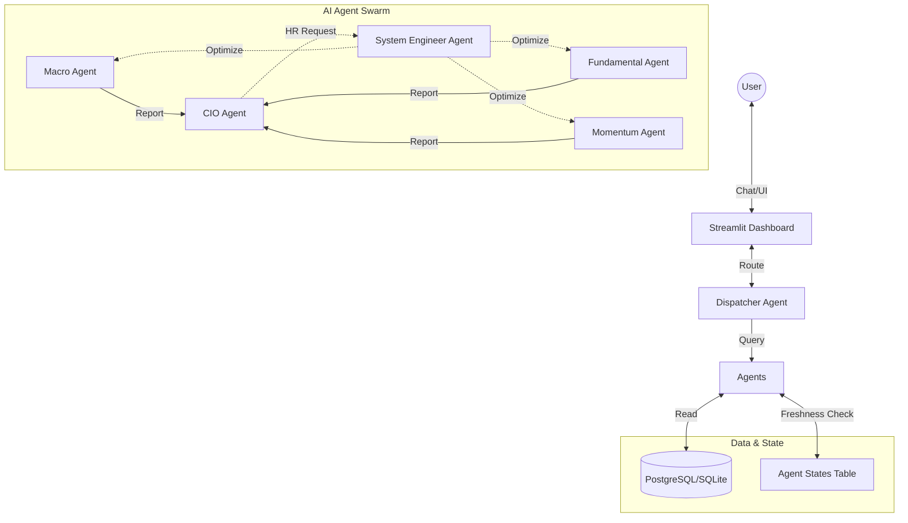
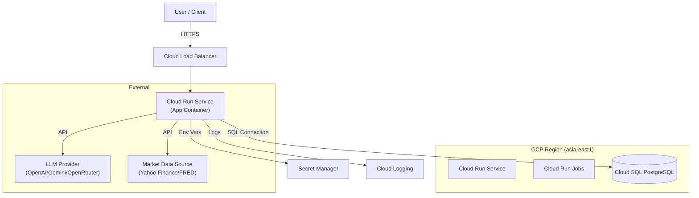

# AI Investment Advisor Platform


> **[English](#english) | [繁體中文 (Traditional Chinese)](#traditional-chinese)**

---

<a id="english"></a>

## 🇺🇸 Project Overview

An advanced, automated investment advisory system powered by a swarm of AI agents. This platform leverages Large Language Models (LLMs) to perform multi-dimensional market analysis—combining technical momentum, fundamental valuation, and macroeconomic trends—to generate professional-grade investment strategies.

### 🌟 Key Features

*   **Multi-Agent Architecture**:
    *   **Fundamental Agent**: Evaluates company financials, earnings reports, and valuation metrics.
    *   **Momentum Agent**: Tracks price action, trends, and technical indicators.
    *   **Dispatcher Agent (New)**: Interactive chat interface that routes user questions to specific experts.
    *   **CIO Agent (Chief Investment Officer)**: Synthesizes all inputs to make final portfolio allocation decisions. Enforces **HR Protocols** to monitor agent activity.
    *   **System Engineer Agent (Self-Optimization)**: Monitors feedback and optimizes prompts.
*   **Adaptive Intelligence**:
    *   **Smart Freshness**: Skip analysis if data hasn't changed (hashing), saving costs.
    *   **Model Tiering**: Uses **Smart Tier** (e.g., Gemini 1.5 Pro) for complex reasoning and **Fast Tier** (e.g., Gemini 1.5 Flash) for routine tasks.
*   **Real-time Data Injection**: Prevents AI hallucinations by injecting live market data.
*   **Interactive Dashboard**: Real-time monitoring, **Advisor Chat**, and Settings.

### 🏗️ System Architecture


```mermaid
graph TD
    User((User)) <-->|Chat/UI| DASH[Streamlit Dashboard]
    DASH <-->|Route| DISP[Dispatcher Agent]
    
    DISP -->|Query| Agents
    
    subgraph AI Agent Swarm
        MA[Macro Agent]
        FA[Fundamental Agent]
        MO[Momentum Agent]
        CIO[CIO Agent]
        
        MA -->|Report| CIO
        FA -->|Report| CIO
        MO -->|Report| CIO
        
        CIO -.->|HR Request| SEA[System Engineer Agent]
        SEA -.->|Optimize| MA & FA & MO
    end

    subgraph Data & State
        DB[(PostgreSQL/SQLite)]
        States[Agent States Table]
    end

    Agents <-->|Freshness Check| States
    Agents <-->|Read| DB
```

### ⚙️ Core Workflows
1.  **Event-Driven (Daily)**: News -> Light CIO -> Main CIO -> Strategy.
2.  **Sector Strategy (Weekly)**: Macro -> CIO Strategy -> Screener -> Deep Research -> Synthesis.
3.  **Data Lifecycle**: Tech indicators (3 days) vs Macro (Permanent).
4.  **Manual Injection**: User uploads -> Agent summary.

#### ☁️ Cloud Infrastructure Architecture

This diagram illustrates the recommended deployment setup on Google Cloud Platform (GCP).


```mermaid
graph TD
    User["User / Client"] -- HTTPS --> LB["Cloud Load Balancer"]
    LB --> CR["Cloud Run Service<br>(App Container)"]

    subgraph "GCP Region (asia-east1)"
        CloudRun[Cloud Run Service]
        CloudJobs[Cloud Run Jobs]
        CloudSQL[(Cloud SQL PostgreSQL)]
    end

    CR -->|Env Vars| SM["Secret Manager"]
    CR -->|Logs| CL["Cloud Logging"]
    CR -->|SQL Connection| CloudSQL

    subgraph External
        CR -->|API| LLM["LLM Provider<br>(OpenAI/Gemini/OpenRouter)"]
        CR -->|API| Data["Market Data Source<br>(Yahoo Finance/FRED)"]
    end
```

### 🚀 Quick Start

#### Prerequisites
*   Docker Desktop installed
*   An LLM API Key (OpenAI, Google Gemini, or OpenRouter)

#### Installation

1.  **Clone the repository**
    ```bash
    git clone https://github.com/neohsiung/AI-Investment-Advisor.git
    cd AI-Investment-Advisor
    ```

2.  **Configure Environment**
    Copy the example environment file and add your API keys:
    ```bash
    cp .env.example .env
    # Edit .env with your favorite editor
    vim .env
    ```

    **Environment Variables Reference:**

    | Category | Variable | Required | Default | Description |
    |----------|----------|----------|---------|-------------|
    | **Email** | `SMTP_HOST` | Yes | smtp.gmail.com | SMTP Server Address |
    | | `SMTP_PORT` | Yes | 587 | SMTP Port (TLS) |
    | | `SMTP_USER` | Yes | - | Sender Email Address |
    | | `SMTP_PASSWORD` | Yes | - | App Password (Not Login Pwd) |
    | | `EMAIL_RECIPIENT` | Yes | - | Report Receiver Email |
    | **Database** | `DB_TYPE` | No | sqlite | `sqlite` or `postgres` |
    | | `DB_HOST` | If Postgres | localhost | Database Host |
    | | `DB_PORT` | If Postgres | 5432 | Database Port |
    | | `DB_USER` | If Postgres | postgres | Database User |
    | | `DB_PASS` | If Postgres | postgres | Database Password |
    | | `DB_NAME` | If Postgres | portfolio | Database Name |
    | **AI** | `AI_PROVIDER` | No | Google Gemini | AI Service Provider |
    | | `AI_MODEL` | No | gemini-1.5-pro | Model Name |
    | | `API_KEY` | **Yes** | - | API Key for the Provider |
    | **Data** | `FRED_API_KEY` | No | - | FRED Economic Data API Key |

3.  **Start the System**

    **Option A: Docker (Recommended for Production)**
    ```bash
    chmod +x start.sh
    ./start.sh
    ```
    > **Note:** This command uses `docker-compose up -d --build` to compile and start containers (Dashboard, Scheduler, Database) in the background. Logs can be viewed via `docker start logs -f`.

    **Option B: Local Development (Python Virtual Env)**
    ```bash
    chmod +x start_local.sh
    ./start_local.sh
    ```
    > **Note:** Improved for local debugging. No Docker required. Supports `src` hot-reloading.

    **Option C: Google Cloud Platform (GCP)**
    For production deployment on GCP (Cloud Run or Spot VM), please refer to the specific scripts:
    *   **VM Setup**: `./setup_vm.sh` (Automates Docker installation on Debian-based VMs)
    *   **Cloud Run Jobs**: `./deploy.sh` (Deploys Serverless Scheduler Jobs)
    *   *See [Wiki](wiki/Deployment-Options.md) for full GCP guide.*
    ```bash
    chmod +x start_local.sh
    ./start_local.sh
    ```
    *This will create a virtual environment, install dependencies, optionally migrate data (if DB_TYPE=postgres), and launch the dashboard.*

4.  **Access Dashboard**
    Open your browser and navigate to:
    [http://localhost:8501](http://localhost:8501)

### 📚 Documentation (Wiki)
For detailed guides, please refer to our **[Project Wiki](wiki/Home.md)**:

*   **🚀 Deployment**:
    *   **[Deployment Options](wiki/Deployment-Options.md)**: Choose between **[Local SQLite](wiki/Deployment-Local-SQLite.md)** or **[GCP Cloud Run](wiki/Deployment-GCP-CloudRun.md)**.
    *   **[Migration Guide](wiki/Database-Migration-Guide.md)**: How to move data between Local and Cloud.
*   **📖 Manuals**:
    *   **[User Guide](wiki/User-Guide.md)**: Dashboard features and data management.
    *   **[System Overview](wiki/System-Overview.md)**: detailed architecture.
*   **🛡️ Audit**:
    *   **[Security Report](wiki/Security-Audit-Report.md)**: Vulnerability analysis.
    *   **[Architecture Review](wiki/04_Architect_View/Clean-Architecture-Review.md)**: Clean Architecture analysis.
*   **🛠️ Developer**:
    *   **[Testing Guide](wiki/03_Developer_Guide/Testing-Guide.md)**: How to run tests and mock dependencies.

### 🚀 Quick Start (Local)

1.  **Clone**: `git clone https://github.com/neohsiung/AI-Investment-Advisor.git`
2.  **Env**: `cp .env.example .env` (Add API Keys)
3.  **Run**: `./start.sh`
4.  **Visit**: [http://localhost:8501](http://localhost:8501)

### 📂 Project Structure

```
.
├── wiki/               # 📚 Detailed Documentation & Guides
├── data/               # Persistent data (Database, Cache)
├── src/                # Source code (Agents, Dashboard, Services)
├── docker-compose.yml  # Service orchestration
└── start.sh            # One-click startup script
```

### ⚠️ Disclaimer
**This software is for educational purposes only.** Strategies are generated by AI and do not guarantee results. Consult a financial advisor before investing.

### 📄 License
MIT License. See [LICENSE](LICENSE) for details.

---

<a id="traditional-chinese"></a>

## 🇹🇼 專案概覽 (Project Overview)

這是一個由 AI 代理人集群 (Agnet Swarm) 驅動的自動化投資顧問系統。詳細功能與架構請見 **[中文 Wiki](wiki/Home.md)**。

### 📚 完整文檔 (Wiki)
所有技術手冊與指南皆已移至 **[Project Wiki](wiki/Home.md)**：

*   **🚀 部署與維運**:
    *   **[部署方案選擇](wiki/Deployment-Options.md)**: 包含 **[本地 SQLite](wiki/Deployment-Local-SQLite.md)** 與 **[GCP Cloud Run](wiki/Deployment-GCP-CloudRun.md)**。
    *   **[資料遷移指南](wiki/Database-Migration-Guide.md)**: 本地與雲端資料庫的雙向遷移教學。
*   **多重 Agent 架構**:
    *   **Fundamental Agent (基本面)**: 評估財報、營收與估值。
    *   **Momentum Agent (動能)**: 追蹤股價趨勢與技術指標。
    *   **Dispatcher Agent (調度員 - NEW)**: 互動式對話介面，自動將您的問題分派給合適的專家。
    *   **CIO Agent (投資長)**: 綜合所有資訊做出最終決策，並執行 **HR 協議** (監控 Agent 活躍度)。
    *   **System Engineer Agent (系統工程師)**: 監控回饋並自動優化 Prompt。
*   **自適應智能 (Adaptive Intelligence)**:
    *   **智慧新鮮度 (Smart Freshness)**: 若數據未變更則跳過分析，節省成本。
    *   **模型分級 (Model Tiering)**: 採用 **Smart Tier** (如 Gemini 1.5 Pro) 處理複雜推理，**Fast Tier** (如 Gemini 1.5 Flash) 處理例行任務。
*   **🛠️ 開發者專區**:
    *   **[測試指南 (Testing Guide)](wiki/03_Developer_Guide/Testing-Guide.md)**: 單元測試與 Mock 策略說明。
*   **即時數據注入**: 避免 AI 幻覺，直接注入即時市場數據。
*   **互動式儀表板**: 即時監控資產、**顧問聊天室** 與 優化設定。

### 🏗️ 系統架構 (System Architecture)


```mermaid
graph TD
    User((User)) <-->|Chat/UI| DASH[Streamlit Dashboard]
    DASH <-->|Route| DISP[Dispatcher Agent]
    
    DISP -->|Query| Agents
    
    subgraph AI Agent Swarm
        MA[Macro Agent]
        FA[Fundamental Agent]
        MO[Momentum Agent]
        CIO[CIO Agent]
        
        MA -->|Report| CIO
        FA -->|Report| CIO
        MO -->|Report| CIO
        
        CIO -.->|HR Request| SEA[System Engineer Agent]
        SEA -.->|Optimize| MA & FA & MO
    end

    subgraph Data & State
        DB[(PostgreSQL/SQLite)]
        States[Agent States Table]
    end

    Agents <-->|Freshness Check| States
    Agents <-->|Read| DB
```

### ⚙️ 核心功能流程 (Core Workflows)
1.  **事件驅動分析 (Daily)**: News -> Light CIO -> Main CIO -> Strategy
2.  **板塊導向策略 (Weekly)**: Macro -> CIO Strategy -> Screener -> Deep Research -> Synthesis
3.  **資料生命週期**: 技術指標 (3天) vs 宏觀數據 (永久)
4.  **手動注入**: 使用者上傳 -> Agent 摘要並存入 Vector DB

### 🚀 快速開始 (本地端)

1.  **下載**: `git clone https://github.com/neohsiung/AI-Investment-Advisor.git`
2.  **設定**:
    ```bash
    # 設定 .env
    cp .env.example .env
    # 使用編輯器填入您的 API Key 與 Email 設定
    vim .env
    ```

    **環境變數說明 (Environment Variables):**

    | 分類 | 變數名稱 | 必填 | 預設值 | 描述 |
    |------|----------|------|--------|------|
    | **Email** | `SMTP_HOST` | 是 | smtp.gmail.com | SMTP 伺服器 |
    | | `SMTP_PORT` | 是 | 587 | SMTP 連接埠 |
    | | `SMTP_USER` | 是 | - | 寄件者信箱 |
    | | `SMTP_PASSWORD` | 是 | - | 應用程式密碼 |
    | | `EMAIL_RECIPIENT` | 是 | - | 收件者信箱 |
    | **資料庫** | `DB_TYPE` | 否 | sqlite | `sqlite` 或 `postgres` |
    | | `DB_HOST` | 若為 PG | localhost | 資料庫主機 |
    | | `DB_PORT` | 若為 PG | 5432 | 資料庫連接埠 |
    | | `DB_USER` | 若為 PG | postgres | 資料庫使用者 |
    | | `DB_PASS` | 若為 PG | postgres | 資料庫密碼 |
    | | `DB_NAME` | 若為 PG | portfolio | 資料庫名稱 |
    | **AI** | `AI_PROVIDER` | 否 | Google Gemini | AI 提供者 |
    | | `AI_MODEL` | 否 | gemini-1.5-pro | 模型名稱 |
    | | `API_KEY` | **是** | - | 對應的 API Key |
    | **數據源** | `FRED_API_KEY` | 否 | - | FRED 經濟數據 API Key |

3.  **啟動系統 (Start System)**

    **選項 A: Docker (推薦/雲端)**
    ```bash
    chmod +x start.sh
    ./start.sh
    ```
    > 自動編譯並在背景啟動所有服務 (儀表板、排程器、資料庫)。

    **選項 B: 本地開發 (Local Dev)**
    ```bash
    chmod +x start_local.sh
    ./start_local.sh
    ```
    > 適合開發除錯，支援程式碼熱重載，無需 Docker。

    **選項 C: Google Cloud Platform (GCP)**
    *   **VM 設定**: `./setup_vm.sh` (自動化安裝 Docker 環境)
    *   **Cloud Run**: `./deploy.sh` (部署 Serverless 作業)
    *   *詳見 [Wiki](wiki/Deployment-Options.md)*

4.  **使用**: 瀏覽器打開 [http://localhost:8501](http://localhost:8501)

### ⚠️ 免責聲明
**本軟體僅供教育研究。** AI 投資建議不保證獲利，投資前請務必自行評估風險。

### 📄 授權
MIT License.
