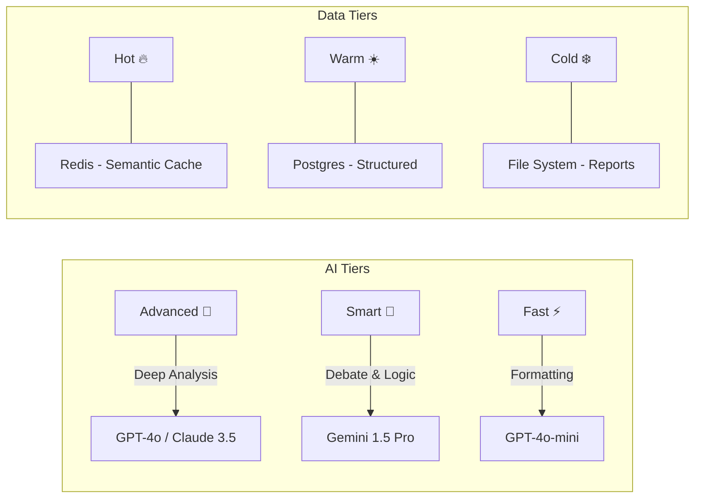
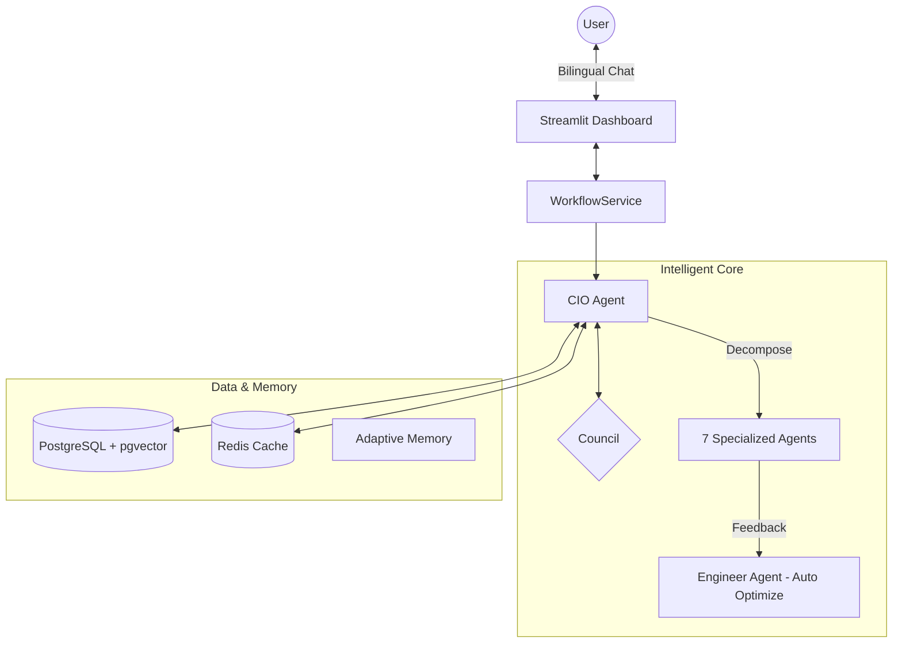

# AI Investment Advisor (v1.0.0)

### 版本紀錄 (Version History)
| Date | Version | Description | Author |
| :--- | :--- | :--- | :--- |
| 2026-02-20 | v1.0.0 | **Production Release**: Officially transitioned to production. Standardized all documentation and architectural tiers. | Neo |
| 2026-02-17 | v4.0.0-rc | **Premium Governance Sync**: Unified single-source README distilled from Wiki. Implemented Atomic Sync (Rule #12). | Neo |
| 2026-02-16 | v3.9.0-rc | **Security Hardening**: Hardened Base Images (Rule #11) & Secrets Isolation. | Neo |

<p align="center">
  
  
  
  
  
</p>

---

> **[繁體中文 (Traditional Chinese)](#zh) | [English](#en)**

<a id="zh"></a>

## 🇹🇼 專案概覽 (Project Overview)

**AI Investment Advisor** 是一個模仿頂級對沖基金架構的自動化投資與風險管理系統。它結合了 **7 Agent Swarm (智能體集群)**、**Council Debate (評議會辯論)** 與 **Hybrid Storage (混合儲存)**，旨在提供專業級的自適應投資建議。

### 🚀 核心優勢
- **🧠 智能進化集群**: 由 CIO Agent 領銜，協同 Fundamental, Momentum, Macro 等專家智能體，透過 **Fractal Debate (碎形辯論)** 演算法產出決策。
- **⚖️ 精確槓桿管理**: 獨有的槓桿引擎，嚴格區分 Gross/Net NLV，模擬真實專業交易員的風險曝險控制。
- **🔭 7x24 事件哨兵**: 哨兵系統 (Sentinel) 同步監聽市場與總經事件，具備 **24 小時智能降噪** 功能。
- **🗄️ 混合健壯架構**: PostgreSQL 處理結構化數據，pgvector 實現語義記憶 RAG，確保決策具備歷史脈絡。
- **🛡️ 規範驅動開發**: 堅持 Clean Architecture 與 Rule-based 治理，代碼覆蓋率長期維持 > 75%。

### 📐 策略性分層架構 (Strategic Tiered Architecture)

本專案採用高度優化的分層策略，確保成本與效能的完美平衡：


```mermaid
graph LR
    subgraph "AI Tiers"
        A[Advanced 🚀] -->|Deep Analysis| LLMA[GPT-4o / Claude 3.5]
        B[Smart 🧠] -->|Debate & Logic| LLMB[Gemini 1.5 Pro]
        C[Fast ⚡] -->|Formatting| LLMC[GPT-4o-mini]
    end
    
    subgraph "Data Tiers"
        Hot[Hot 🔥] --- RD[Redis - Semantic Cache]
        Warm[Warm ☀️] --- PG[Postgres - Structured]
        Cold[Cold ❄️] --- FS[File System - Reports]
    end
```

*   **3-Tier AI 路由**:
    *   **Advanced (🚀)**: 高難度分析 (GPT-4o / Claude 3.5 Sonnet)。
    *   **Smart (🧠)**: 邏輯推理與辯論 (Gemini 1.5 Pro)。
    *   **Fast (⚡)**: 格式化輸出與初步篩選 (GPT-4o-mini)。
*   **3-Tier 數據存儲**:
    *   **Hot (🔥)**: Redis 用於語義緩存與即時狀態。
    *   **Warm (☀️)**: PostgreSQL 用於結構化交易紀錄與中維度分析。
    *   **Cold (❄️)**: 文件系統用於原始報告與歷史復盤。

### 🛠️ 技術棧 (Technical Stack)
- **核心**: Python 3.10+ (Local), Python 3.11 (Docker) - Optimized for Async I/O
- **智能體**: DSPy, OpenAI/Gemini/Claude Multi-Tier Routing
- **基礎設施**: Docker Compose, PostgreSQL 15, Redis (Cache/Memory)
- **數據協議**: MCP (Model Context Protocol), TAVILY, Polygon, FMP

### 📦 快速開始
```bash
# 1. 複製專案並準備憑證
git clone https://github.com/neohsiung/AI-Investment-Advisor.git && cd AI-Investment-Advisor
cp .env.example .env

# 2. 一鍵啟動 (自動建置 PostgreSQL 與 Redis)
./start.sh
```
*本地 Dashboard 入口: [http://localhost:8501](http://localhost:8501)*

### 🏗️ 系統架構圖 (Architecture)
詳細深挖請見 [架構哲學-Architectural-Philosophies](架構哲學-Architectural-Philosophies)。


```mermaid
graph TD
    User((User)) <-->|Bilingual Chat| DASH[Streamlit Dashboard]
    DASH <--> WF[WorkflowService]
    
    subgraph "Intelligent Core"
        CIO[CIO Agent] <--> COUNCIL{Council}
        CIO -->|Decompose| SUB[7 Specialized Agents]
        SUB -->|Feedback| ENG[Engineer Agent - Auto Optimize]
    end

    subgraph "Data & Memory"
        PG[(PostgreSQL + pgvector)]
        RD[(Redis Cache)]
        MEM[Adaptive Memory]
    end

    WF --> CIO
    CIO <--> PG & RD
```

### �️ 治理與規範 (Governance & Standards)

為了確保 AI 協作的高一致性，本專案實施嚴格的治理規範：
- **[文件維護標準](.agent/rules/documentation-standards.md)**: 規範 Wiki 扁平化連結與雙語排版。
- **[設計與代碼規範](.agent/rules/engineering-standards.md)**: 強制測試隔離與 Clean Architecture。
- **[原子提交規範](.agent/rules/git-commit-format.md)**: 確保開發軌跡清晰且具備雙語描述。

### �📚 文檔索引
- **快速入門**: [快速啟動與操作指南-Quickstart-User-Guide](快速啟動與操作指南-Quickstart-User-Guide)
- **架構深挖**: [架構哲學-Architectural-Philosophies](架構哲學-Architectural-Philosophies)
- **開發者手冊**: [Engineering Standards](.agent/rules/engineering-standards.md)
- **API 與數據**: [金融數據矩陣與整合成本-Financial-Data-Matrix-Cost](金融數據矩陣與整合成本-Financial-Data-Matrix-Cost)

---

<a id="en"></a>

## 🇺🇸 Project Overview

**AI Investment Advisor** is a sophisticated, autonomous investment ecosystem designed to simulate the decision-making pipeline of a quantitative hedge fund. It leverages a self-optimizing swarm of **7 AI Agents** anchored by a **Council of Arbitrators** and a high-performance **Hybrid Storage Strategy**.

### 🚀 Key Capabilities
- **🧠 Swarm Intelligence (v1.0)**: CIO-led architecture coordinating specialized agents (Fundamental, Momentum, Macro, etc.) through Fractal Debate for superior Alpha.
- **⚖️ Precision Leverage Engine**: Real-time tracking of Gross/Net NLV and margin utilization with professional-grade risk reporting.
- **🔭 Sentinel & Council**: 24/7 scanning of 4D market events with **Smart Deduplication** (24h cooldown) and noise filtering.
- **🗄️ Hybrid RAG Memory**: PostgreSQL + pgvector unified backbone for high-speed financial calculation and semantic decision history.
- **🏆 Self-Optimizing Loop**: Integrated **Engineer Agent** using **DSPy** to auto-refine prompts based on execution performance.

### 📐 Strategic Tiered Architecture

This project employs a highly optimized layering strategy to balance cost and performance:


```mermaid
graph LR
    subgraph "AI Tiers"
        A[Advanced 🚀] -->|Deep Analysis| LLMA[GPT-4o / Claude 3.5]
        B[Smart 🧠] -->|Debate & Logic| LLMB[Gemini 1.5 Pro]
        C[Fast ⚡] -->|Formatting| LLMC[GPT-4o-mini]
    end
    
    subgraph "Data Tiers"
        Hot[Hot 🔥] --- RD[Redis - Semantic Cache]
        Warm[Warm ☀️] --- PG[Postgres - Structured]
        Cold[Cold ❄️] --- FS[File System - Reports]
    end
```

*   **3-Tier AI Routing**:
    *   **Advanced (🚀)**: Complex analysis (GPT-4o / Claude 3.5 Sonnet).
    *   **Smart (🧠)**: Reasoning and Council debates (Gemini 1.5 Pro).
    *   **Fast (⚡)**: Data formatting and initial screening (GPT-4o-mini).
*   **3-Tier Data Storage**:
    *   **Hot (🔥)**: Redis for semantic caching and real-time state.
    *   **Warm (☀️)**: PostgreSQL for structured trade records and mid-tier analytics.
    *   **Cold (❄️)**: File system for raw reports and historical backtests.

### 🛠️ Built With
- **Language**: Python 3.10+ (Local), Python 3.11 (Docker)
- **AI Core**: Multi-LLM Tiered Routing (Advanced 🚀, Smart 🧠, Fast ⚡)
- **Infrastructure**: Dockerized PostgreSQL 15, Redis semantic cache
- **Data Layers**: MCP (Model Context Protocol), TAVILY Search, Financial Modeling Prep

### 📦 Quick Start
```bash
./start.sh
```
*Access the AI Dashboard at [http://localhost:8501](http://localhost:8501)*

### �️ Governance & Standards

To ensure high-fidelity AI collaboration, the project enforces strict governance:
- **[Documentation Standards](.agent/rules/documentation-standards.md)**: Enforces flat-linking and bilingual formatting for the Wiki.
- **[Engineering Standards](.agent/rules/engineering-standards.md)**: Mandates test isolation and Clean Architecture.
- **[Git Commit Standards](.agent/rules/git-commit-format.md)**: Ensures atomic commits with professional bilingual summaries.

### �📚 Deep Dives
Visit our full [Wiki](Home) for architectural blueprints and contribution guides.

### 📄 License & Disclaimer
- **License**: MIT License.
- **Disclaimer**: For educational purposes only. Not financial advice.

---
<p align="center">Built with ❤️ for Modern Quantitative Investing</p>
