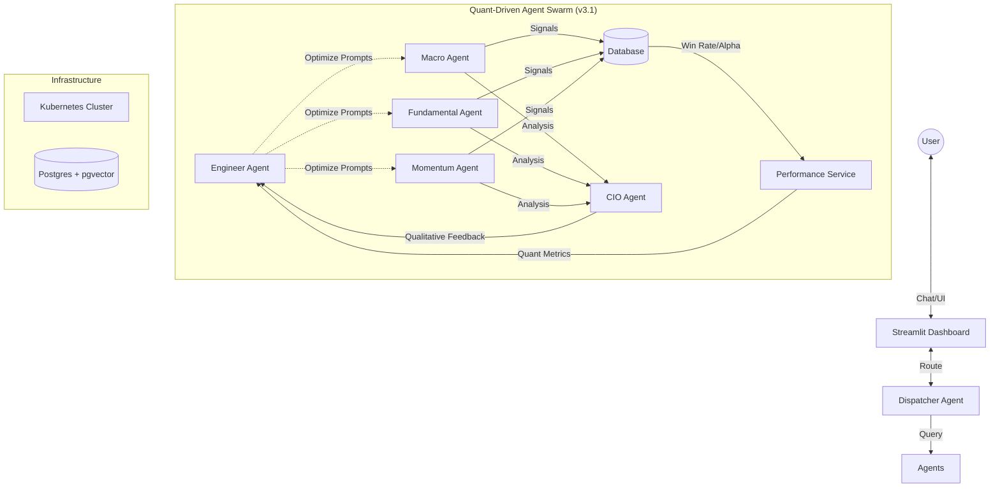

# AI Investment Advisor Platform (v3.0)


> **[English](#english) | [繁體中文 (Traditional Chinese)](#traditional-chinese)**

---

<a id="english"></a>

## 🇺🇸 Project Overview

**AI Investment Advisor** is an advanced, automated quantitative investment system empowered by a **Self-Correcting Agent Swarm**. Simulating a **Billion-Dollar Hedge Fund**, it employs specialized AI Agents (CIO, Macro, Fundamental, Momentum) to perform market research and portfolio management, while an **HR Unit** continuously monitors and optimizes their performance using **DSPy**.

### 🌟 Key Features (v3.1 - Quant Optimized)

*   **Quantitative Feedback Loop (Active)**:
    *   **Engineer Agent**: A specialized "Meta-Agent" that reads performance metrics (Win Rate, Alpha) and qualitative feedback from the CIO.
    *   **Auto-Tuning**: Automatically rewrites Agent Prompts using **DSPy** logic to correct underperformance.
*   **Institutional-Grade Personas**:
    *   **CIO**: Modeled after top Hedge Fund Managers (Bridgewater/Citadel), focusing on Risk-Adjusted Returns.
    *   **Macro/Fundamental/Momentum**: Specialized analysts with distinct data pipelines and reasoning frameworks.
*   **Modern Infrastructure**:
    *   **Kubernetes Ready**: Full K8s deployment manifests (`k8s/`) for scalable operations.
    *   **Vector Database**: `pgvector` integration for future RAG/Long-term Memory.

### 🏗️ System Architecture


```mermaid
graph TD
    User((User)) <-->|Chat/UI| DASH[Streamlit Dashboard]
    DASH <-->|Route| DISP[Dispatcher Agent]
    
    DISP -->|Query| Agents
    
    subgraph "Quant-Driven Agent Swarm (v3.1)"
        ENG[Engineer Agent]
        MA[Macro Agent]
        FA[Fundamental Agent]
        MO[Momentum Agent]
        CIO[CIO Agent]
        PERF[Performance Service]
        
        MA & FA & MO -->|Signals| DB[(Database)]
        MA & FA & MO -->|Analysis| CIO
        DB -->|Win Rate/Alpha| PERF
        CIO -->|Qualitative Feedback| ENG
        PERF -->|Quant Metrics| ENG
        ENG -.->|Optimize Prompts| MA & FA & MO
    end

    subgraph Infrastructure
        K8S[Kubernetes Cluster]
        POSTGRES[(Postgres + pgvector)]
    end
```

### ⚙️ Core Workflows
1.  **Daily Tactical Check**: Momentum/Sentiment analysis -> Signal Generation -> CIO Review.
2.  **Weekly Strategy**: Deep Dive (Macro + Fundamental) -> Portfolio Rebalancing -> Report.
3.  **Optimization Loop (Weekly)**:
    *   System calculates Agent Win Rates based on past signals vs current price.
    *   **Engineer Agent** reviews Performance + CIO Feedback.
    *   Prompts are auto-updated to fix weaknesses (e.g., "Momentum Agent is too aggressive in bear markets").

### 🚀 Quick Start

#### Prerequisites
*   Docker Desktop installed
*   An LLM API Key (OpenAI, Google Gemini, or OpenRouter)

#### Installation

1.  **Clone the repository**
    ```bash
    git clone https://github.com/neohsiung/AI-Investment-Advisor.git
    cd AI-Investment-Advisor
    ```

2.  **Configure Environment**
    ```bash
    cp .env.example .env
    # Edit .env with your API Keys
    vim .env
    ```

    **Key Environment Variables:**

    | Variable | Description | Required | Default |
    |----------|-------------|----------|---------|
    | `API_KEY` | LLM Provider Key (Google/OpenAI) | **Yes** | - |
    | `SMTP_USER` | Email for reports | Yes | - |
    | `SMTP_PASSWORD`| App Password | Yes | - |
    | `DB_TYPE` | `sqlite` or `postgres` | No | sqlite |

3.  **Start the System**
    ```bash
    # Default: Docker Compose (Local)
    ./start.sh

    # Option: Kubernetes (Minikube/Cloud)
    ./start.sh --k8s
    
    # Cleanup
    ./start.sh --clean
    ```
    *Builds containers and launches Dashboard (http://localhost:8501).*

    **Alternative: Cloud Deployment**
    Follow the [GCP Guide](wiki/03_Developer_Guide/Deployment-GCP-CloudRun.md) for production deployment. The `start.sh` script is designed to work with both local Minikube and remote clusters.

### 📚 Documentation (Wiki)
For detailed guides, please refer to our **[Project Wiki](wiki/Home.md)**:

*   **🚀 Deployment**: [Deployment Options](wiki/01_User_Manual/Deployment-Options.md), [GCP Guide](wiki/03_Developer_Guide/Deployment-GCP-CloudRun.md).
*   **📖 Manuals**: [User Guide](wiki/01_User_Manual/User-Guide.md), [CLI Reference](wiki/03_Developer_Guide/CLI-Reference.md).
*   **🏗️ Architecture**: [System Overview](wiki/04_Architect_View/System-Overview.md), [HR Protocol](wiki/02_Product_Manager_Corner/Specs/05_hr_protocol.md).

---

<a id="traditional-chinese"></a>

## 🇹🇼 專案概覽 (Project Overview)

**AI Investment Advisor** 是一個由 **自我修正 (Self-Correcting)** AI Agent 集群驅動的自動化投資顧問系統。它模擬了**頂級對沖基金**的運作架構，聘請了專業的 AI Agent (投資長、總經、基本面、動能) 進行市場分析，並設有 **HR Unit (人力資源部)** 利用 **DSPy** 技術監控並優化 Agent 的表現。

### 🌟 核心功能 (v3.1 - 量化優化版)

*   **量化反饋迴圈 (已啟用)**:
    *   **工程師 Agent (Engineer)**: 類似 "Meta-Agent"，負責讀取績效指標 (勝率、Alpha) 與 CIO 的質化反饋。
    *   **自動調校 (Auto-Tuning)**: 若發現某分析師表現不佳，會利用 **DSPy** 邏輯自動重寫其 Prompt。
*   **機構級角色設定 (Institutional Personas)**:
    *   **CIO**: 模擬頂級對沖基金經理 (如 Bridgewater/Citadel)，專注於風險調整後報酬。
    *   **總經/基本面/動能分析師**: 根據華爾街標準 (Goldman Sachs/CMT) 設定的專業分析角色。
*   **現代化基礎設施**:
    *   **Kubernetes Ready**: 完整的 K8s 部署清單 (`k8s/`)，支援彈性擴展。
    *   **向量資料庫**: 整合 `pgvector`，為未來的 RAG (長期記憶) 奠定基礎。

### 🏗️ 系統架構 (System Architecture)

*(架構圖請參考上方英文區塊的 "Quant-Driven Agent Swarm")*

*   **Quant-Driven Swarm**: 數據驅動的 AI 專家團隊。
*   **Engineer Optimization**: 系統會根據 "勝率" 自動優化分析師的大腦。

### ⚙️ 核心流程 (Core Workflows)
1.  **每日戰術 (Daily Tactical)**: 動能/情緒分析 -> 產生訊號 -> CIO 審閱 -> 戰術報告。
2.  **每週戰略 (Weekly Strategy)**: 深度研究 (總經+基本面) -> 資產再平衡 -> 戰略報告。
3.  **優化迴圈 (Optimization Loop)**:
    *   系統計算過去訊號的準確度 (Win Rate)。
    *   **工程師 Agent** 檢視績效數據 + CIO 反饋。
    *   自動修正弱點 (例如："修正動能分析師在熊市中過於激進的問題")。

### 🚀 快速開始 (Quick Start)

1.  **下載**: `git clone https://github.com/neohsiung/AI-Investment-Advisor.git`
2.  **設定**: `cp .env.example .env` (填入 API Key)
3.  **啟動 (Start)**:
    ```bash
    # 預設: Docker Compose (本地端)
    ./start.sh

    # 選項: Kubernetes (Minikube/雲端)
    ./start.sh --k8s

    # 清除 (Cleanup)
    ./start.sh --clean
    ```
    *系統將自動啟動。瀏覽器打開: [http://localhost:8501](http://localhost:8501)*

### 📚 完整文檔 (Wiki)
所有技術手冊與指南皆已移至 **[Project Wiki](wiki/Home.md)**：

*   **新手入門**: [使用者手冊 (User Guide)](wiki/01_User_Manual/User-Guide.md)、[CLI 工具指南](wiki/03_Developer_Guide/CLI-Reference.md)。
*   **深入理解**: [系統架構全貌](wiki/04_Architect_View/System-Overview.md)、[HR 協議與自我修正](wiki/02_Product_Manager_Corner/Specs/05_hr_protocol.md)。

---

### ⚠️ Disclaimer
**本軟體僅供教育研究。** AI 投資建議不保證獲利，投資前請務必自行評估風險。

### 📄 License
MIT License.
