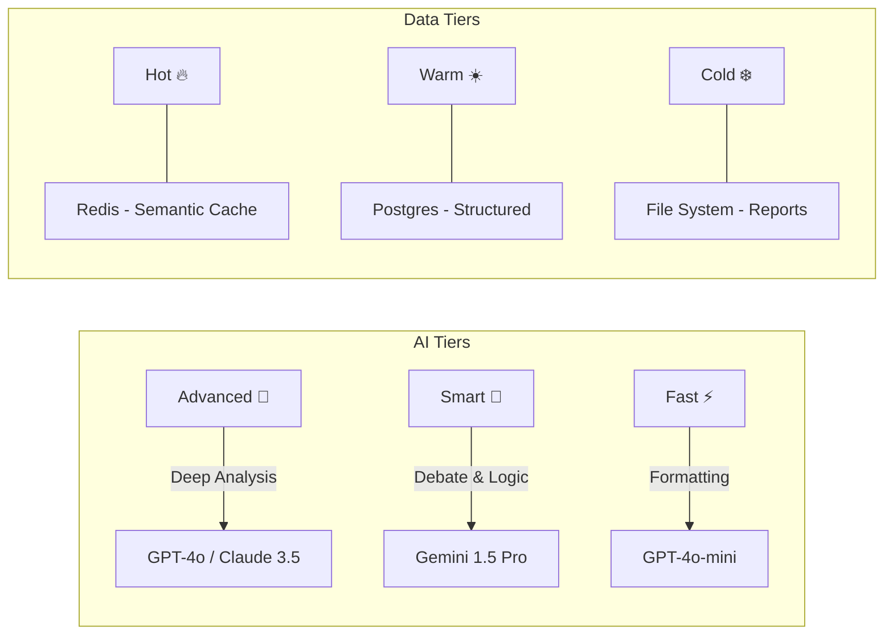
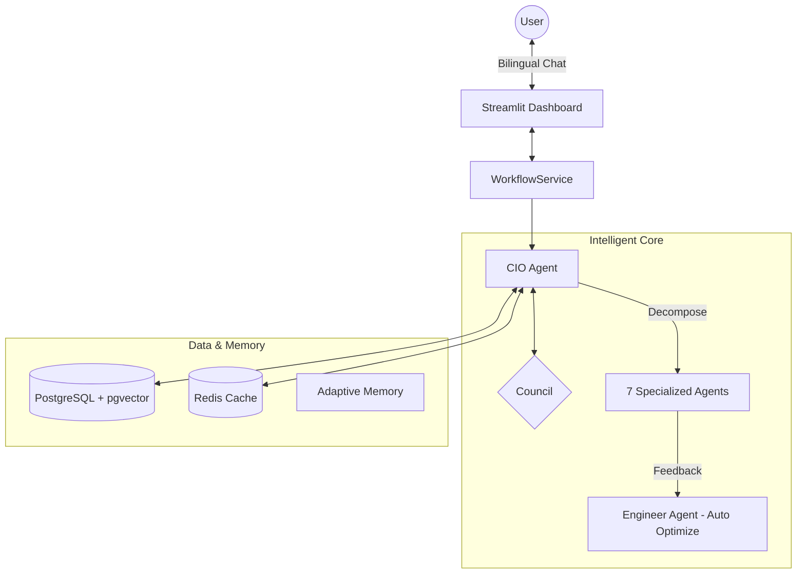

# AI Investment Advisor (v1.1.0)

### 版本紀錄 (Version History)
| Date | Version | Description | Author |
| :--- | :--- | :--- | :--- |
| 2026-02-21 | v1.1.0 | **Microservices Monorepo & Observability**: Integrated SigNoz APM, OpenTelemetry, and Standalone Notification Service into the architecture. | Neo |
| 2026-02-20 | v1.0.0 | **Production Release**: Officially transitioned to production. Standardized all documentation and architectural tiers. | Neo |
| 2026-02-17 | v4.0.0-rc | **Premium Governance Sync**: Unified single-source README distilled from Wiki. Implemented Atomic Sync (Rule #12). | Neo |
| 2026-02-16 | v3.9.0-rc | **Security Hardening**: Hardened Base Images (Rule #11) & Secrets Isolation. | Neo |

<p align="center">
  
  
  
  
  
</p>

---

> **[繁體中文 (Traditional Chinese)](#zh) | [English](#en)**

<a id="zh"></a>

## 🇹🇼 專案概覽 (Project Overview)

> **Elevator Pitch**:
> AI Investment Advisor 是一個模仿頂級對沖基金大腦架構的自動化量化投資平台。透過搭載 **7 Agent Swarm (智能體集群)** 與獨家的 **Fractal Debate (碎形辯論)** 演算法，系統能自主掃描全球市場巨量異質數據，執行 3-Tier 分層並發決策，並無縫整合至全通路 (LINE/Slack) 進行毫秒級的 Auto-Hedging 防禦。此專案具備高度的工程規範驅動 (Rule-driven) 特性，兼具專業風控層與自演化 Alpha 尋求能力。

**AI Investment Advisor** 結合了前端儀表板、混合儲存 (Hybrid Storage) 與多元模型調度，旨在為現代量化投資者提供一套能落地運行且成本可控的專業級自適應投資建議系統。

### 🚀 核心效益與功能亮點 (Key Features & Outcomes)
- **🧠 智能進化集群 (Swarm Intelligence)**: 由 CIO Agent 領銜協同 Fundamental, Momentum 等專家智能體，消除單一模型幻覺 (Hallucinations)，提升決策勝率與可解釋性。
- **⏱️ 毫秒級自動化防禦 (Auto-Defense via Webhooks)**: 內建 `AutomatedTradingService` 與 `SentinelService`，可在偵測到 VIX 飆升或外部暴跌訊號時（如 TradingView），免人工干預**自動執行清倉與避險機制**。
- **⚖️ 專業級風控與槓桿管理 (Institutional Risk Management)**: 獨有的槓桿引擎，嚴格追蹤 Gross/Net NLV，配有 24 小時動態異常降噪與 Margin Call 熔斷機制。
- **🗄️ 混合 RAG 與記憶檢索 (Hybrid Memory Architecture)**: 以 PostgreSQL 作為結構化核心，輔以 pgvector 實現語義記憶 RAG，確保 AI 決策具備深度的歷史復盤脈絡與一致性。
- **🔬 自導演算法工程師 (Code-Level Alpha Seeking)**: 內置 `SystemEngineerAgent`，能運用遺傳演算法 (Genetic Algorithm) 自行撰寫、回測並迭代因子 (Alpha) 程式碼，持續演化交易邏輯。

### 📐 策略性分層架構 (Strategic Tiered Architecture)

本專案採用高度優化的分層策略，確保成本與效能的完美平衡：


```mermaid
graph LR
    subgraph "AI Tiers"
        A[Advanced 🚀] -->|Deep Analysis| LLMA[GPT-4o / Claude 3.5]
        B[Smart 🧠] -->|Debate & Logic| LLMB[Gemini 1.5 Pro]
        C[Fast ⚡] -->|Formatting| LLMC[GPT-4o-mini]
    end
    
    subgraph "Data Tiers"
        Hot[Hot 🔥] --- RD[Redis - Semantic Cache]
        Warm[Warm ☀️] --- PG[Postgres - Structured]
        Cold[Cold ❄️] --- FS[File System - Reports]
    end
```

*   **3-Tier AI 路由**:
    *   **Advanced (🚀)**: 高難度分析 (GPT-4o / Claude 3.5 Sonnet)。
    *   **Smart (🧠)**: 邏輯推理與辯論 (Gemini 1.5 Pro)。
    *   **Fast (⚡)**: 格式化輸出與初步篩選 (GPT-4o-mini)。
*   **3-Tier 數據存儲**:
    *   **Hot (🔥)**: Redis 用於語義緩存與即時狀態。
    *   **Warm (☀️)**: PostgreSQL 用於結構化交易紀錄與中維度分析。
    *   **Cold (❄️)**: 文件系統用於原始報告與歷史復盤。

### 🛠️ 技術棧 (Technical Stack)
- **架構**: Microservices Monorepo (Dashboard, MCP Server, Notification, Scheduler)
- **核心**: Python 3.10+ (Local), Python 3.11 (Docker) - Optimized for Async I/O
- **智能體**: DSPy, OpenAI/Gemini/Claude Multi-Tier Routing
- **基礎設施**: Docker Compose, PostgreSQL 16, Redis, SigNoz (Local APM 觀測平台)
- **資料與遙測**: MCP (Model Context Protocol), OpenTelemetry, TAVILY, Polygon, FMP

### 📦 快速開始
```bash
# 1. 複製專案並準備憑證
git clone https://github.com/neohsiung/AI-Investment-Advisor.git && cd AI-Investment-Advisor
cp .env.example .env

# 2. 一鍵啟動 (自動建置 PostgreSQL 與 Redis)
./start.sh
```
*本地 Dashboard 入口: [http://localhost:8501](http://localhost:8501)*

### 🏗️ 系統架構圖 (Architecture)
詳細深挖請見 [架構哲學-Architectural-Philosophies](架構哲學-Architectural-Philosophies)。


```mermaid
graph TD
    User((User)) <-->|Bilingual Chat| DASH[Streamlit Dashboard]
    DASH <--> WF[WorkflowService]
    
    subgraph "Intelligent Core"
        CIO[CIO Agent] <--> COUNCIL{Council}
        CIO -->|Decompose| SUB[7 Specialized Agents]
        SUB -->|Feedback| ENG[Engineer Agent - Auto Optimize]
    end

    subgraph "Data & Memory"
        PG[(PostgreSQL + pgvector)]
        RD[(Redis Cache)]
        MEM[Adaptive Memory]
    end

    WF --> CIO
    CIO <--> PG & RD
```

### �️ 治理與規範 (Governance & Standards)

為了確保 AI 協作的高一致性，本專案實施嚴格的治理規範：
- **[文件維護標準](.agent/rules/documentation-standards.md)**: 規範 Wiki 扁平化連結與雙語排版。
- **[設計與代碼規範](.agent/rules/engineering-standards.md)**: 強制測試隔離與 Clean Architecture。
- **[原子提交規範](.agent/rules/git-commit-format.md)**: 確保開發軌跡清晰且具備雙語描述。

### �📚 文檔索引
- **快速入門**: [快速啟動與操作指南-Quickstart-User-Guide](快速啟動與操作指南-Quickstart-User-Guide)
- **架構深挖**: [架構哲學-Architectural-Philosophies](架構哲學-Architectural-Philosophies)
- **開發者手冊**: [Engineering Standards](.agent/rules/engineering-standards.md)
- **API 與數據**: [金融數據矩陣與整合成本-Financial-Data-Matrix-Cost](金融數據矩陣與整合成本-Financial-Data-Matrix-Cost)

---

<a id="en"></a>

## 🇺🇸 Project Overview

> **Elevator Pitch**:
> AI Investment Advisor is an automated quantitative investment platform architected to mirror the central nervous system of a top-tier hedge fund. Powered by a **7 Agent Swarm** and an exclusive **Fractal Debate** algorithmic framework, the system autonomously ingests heterogeneous global market data, executing high-stakes decisions via a 3-Tier concurrency engine. It seamlessly integrates with omni-channel platforms (LINE/Slack) to deploy millisecond-precision Auto-Hedging defenses. Driven by rigorous engineering standards, it delivers professional-grade risk management combined with self-evolving Alpha generation.

**AI Investment Advisor** synthesizes a frontend dashboard, Hybrid Storage, and multi-model orchestration, aiming to provide modern quantitative investors with a production-ready, cost-optimized, and adaptive professional advisory system.

### 🚀 Key Capabilities & Outcomes
- **🧠 Swarm Intelligence (v1.0)**: A CIO-led cluster coordinating domain experts (Fundamental, Momentum, Macro) via Fractal Debate, eliminating single-model hallucinations and boosting decision win rates and explainability.
- **⏱️ Automated Millisecond Defense (Auto-Defense via Webhooks)**: Built-in `AutomatedTradingService` and `Sentinel` autonomously execute emergency liquidation and hedging upon extreme signal detection (e.g., VIX spikes, TradingView alerts) with zero human intervention.
- **⚖️ Institutional Risk Engine (Precision Leverage Engine)**: Professional-grade tracking of Gross/Net NLV and margin utilization with 24-hour smart dynamic noise reduction and dynamic Circuit Breakers.
- **🗄️ Hybrid RAG Memory (Hybrid Memory Architecture)**: Employs PostgreSQL as the structured backbone alongside pgvector for semantic retrieval-augmented generation (RAG), guaranteeing historical consistency and context-aware decisions.
- **🔬 Autonomous Quant Engineer (Code-Level Alpha Seeking)**: The integrated `SystemEngineerAgent` utilizes genetic algorithms to write, backtest, and iterate Alpha creation scripts, ensuring the trading logic continually evolves without manual intervention.

### 📐 Strategic Tiered Architecture

This project employs a highly optimized layering strategy to balance cost and performance:


```mermaid
graph LR
    subgraph "AI Tiers"
        A[Advanced 🚀] -->|Deep Analysis| LLMA[GPT-4o / Claude 3.5]
        B[Smart 🧠] -->|Debate & Logic| LLMB[Gemini 1.5 Pro]
        C[Fast ⚡] -->|Formatting| LLMC[GPT-4o-mini]
    end
    
    subgraph "Data Tiers"
        Hot[Hot 🔥] --- RD[Redis - Semantic Cache]
        Warm[Warm ☀️] --- PG[Postgres - Structured]
        Cold[Cold ❄️] --- FS[File System - Reports]
    end
```

*   **3-Tier AI Routing**:
    *   **Advanced (🚀)**: Complex analysis (GPT-4o / Claude 3.5 Sonnet).
    *   **Smart (🧠)**: Reasoning and Council debates (Gemini 1.5 Pro).
    *   **Fast (⚡)**: Data formatting and initial screening (GPT-4o-mini).
*   **3-Tier Data Storage**:
    *   **Hot (🔥)**: Redis for semantic caching and real-time state.
    *   **Warm (☀️)**: PostgreSQL for structured trade records and mid-tier analytics.
    *   **Cold (❄️)**: File system for raw reports and historical backtests.

### 🛠️ Built With
- **Architecture**: Microservices Monorepo (Dashboard, MCP Server, Notification, Scheduler)
- **Language**: Python 3.10+ (Local), Python 3.11 (Docker)
- **AI Core**: Multi-LLM Tiered Routing (Advanced 🚀, Smart 🧠, Fast ⚡)
- **Infrastructure**: Dockerized PostgreSQL 16, Redis semantic cache, SigNoz (Local APM Observability)
- **Data & Telemetry**: MCP (Model Context Protocol), OpenTelemetry, TAVILY Search, Financial Modeling Prep

### 📦 Quick Start
```bash
./start.sh
```
*Access the AI Dashboard at [http://localhost:8501](http://localhost:8501)*

### �️ Governance & Standards

To ensure high-fidelity AI collaboration, the project enforces strict governance:
- **[Documentation Standards](.agent/rules/documentation-standards.md)**: Enforces flat-linking and bilingual formatting for the Wiki.
- **[Engineering Standards](.agent/rules/engineering-standards.md)**: Mandates test isolation and Clean Architecture.
- **[Git Commit Standards](.agent/rules/git-commit-format.md)**: Ensures atomic commits with professional bilingual summaries.

### �📚 Deep Dives
Visit our full [Wiki](Home) for architectural blueprints and contribution guides.

### 📄 License & Disclaimer
- **License**: MIT License.
- **Disclaimer**: For educational purposes only. Not financial advice.

---
<p align="center">Built with ❤️ for Modern Quantitative Investing</p>
