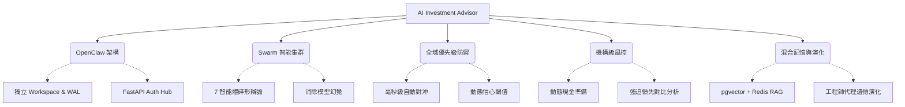
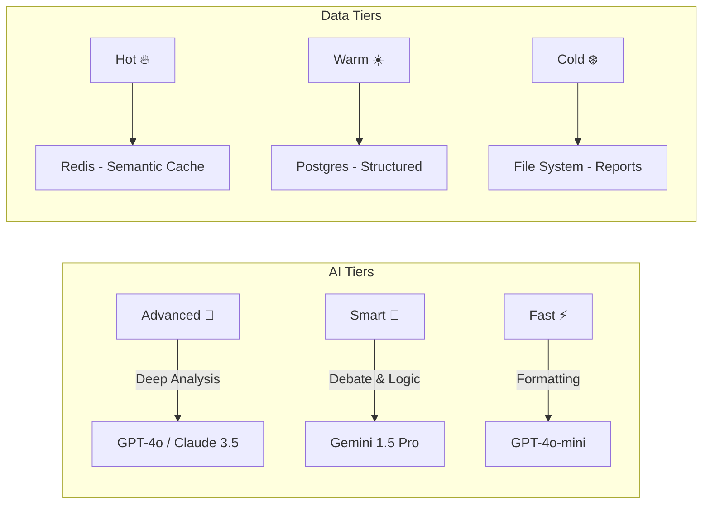
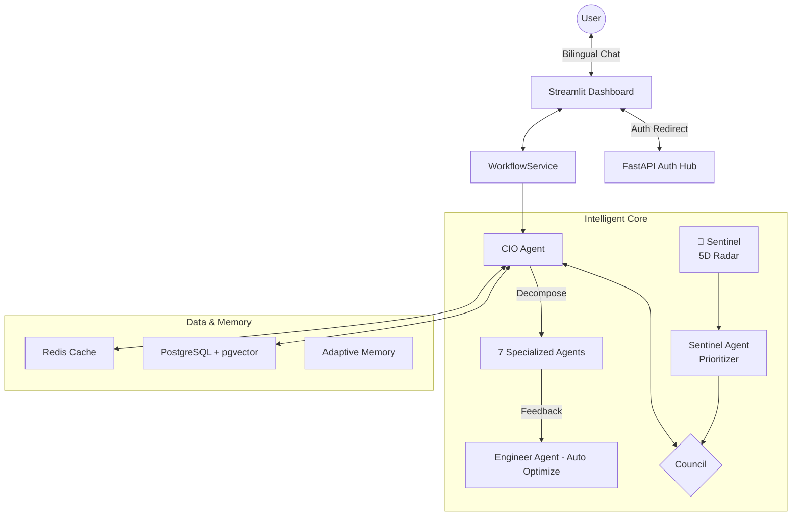
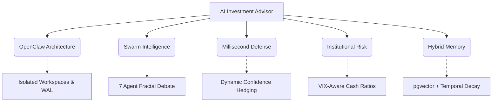

# AI Investment Advisor

<details>
<summary><b>📜 版本紀錄 (Version History)</b></summary>

| Date | Version | Description | Author |
| :--- | :--- | :--- | :--- |
| 2026-03-22 | v6.3.1 | **CI-Test Optimization**: Implemented Incremental Testing and Bandit scoping, reducing pre-commit check time from 10m+ to <30s. | Antigravity |
| 2026-03-22 | v6.3.0 | **CI-Test Skill Integration**: Added `ci-test` Agent Dev Skill for comprehensive pre-commit quality and security checks. | Antigravity |
| 2026-03-22 | v6.2.0 | **Pending Orders Guard & Notification Preprocessing**: Pre-checks Pending Orders to save Council processing, enhances High Cash Ratio handling for Aggressive profiles, and optimizes Markdown notifications for LINE and Telegram. | Antigravity |

| 2026-03-21 | v6.1.0 | **Investment Validation Frameworks & Commits**: Enforced Trunk-Based Development commit rules and integrated three specialized AI runtimes (Envisioning, Attacker's Lens, Alpha Synthesis). | Antigravity |
| 2026-03-20 | v6.0.0 | **eToro Auth & ID Resolution Final Fix**: Resolved "InvalidKey" and "Instrument ID not found" errors by stripping double-quoted credentials and adding mandatory search fields. | Antigravity |
| 2026-03-20 | v5.9.0 | **Robust eToro Execution & Metadata Recovery**: Implemented Metadata Reverse Lookup & Re-fetch Retry for unknown IDs (VTI Fix). Coverage: 72%. | Antigravity |
| 2026-03-19 | v5.8.0 | **Dynamic eToro Discovery & CI Resilience**: Removed hardcoded instrument IDs; implemented dynamic resolution; resolved `DailyWorkflow` test regressions. | Antigravity |
| 2026-03-15 | v5.7.0 | **FastAPI Auth Hub Migration**: 已將 Google OAuth 遷移至 FastAPI 後端，徹底解決 Streamlit iframe 沙盒與 Cookie 同步引發之登入迴圈問題。 | Antigravity |
| 2026-03-14 | v5.6.0 | **Weekly Report Optimization & Progressive Debate** - 優化 WeeklyWorkflow，注入即時宏觀指標並實作多層次深度辯論 (Progressive Synthesis) 演算法。 | Antigravity |
| 2026-03-14 | v5.5.0 | **Action Extraction Refinement & Bilingual Standardization** - 優化 ActionExtractor 提取邏輯與強韌性，並完成核心 Wiki 頁面之雙語標準化。 | Antigravity |
| 2026-03-12 | v2.0.0 | **Sentinel Multi-Tier Buffering & CI Resilience**: Standardized `user_id` context for service initialization and resolved high-priority test regressions. | Antigravity |
| 2026-03-08 | v1.9.0 | **Multi-Account isolation & Performance Resilience**: Implemented account-level data isolation across DB and Repository layers. Hardened `PerformanceService` to handle dynamic market data formats and column mappings. | Antigravity |
| 2026-03-08 | v1.8.0 | **Data Source Standardization & FinancialData.Net**: Categorized FinancialData.Net as P1, established standardized key naming convention (`source_{id}_{field}`), and synchronized system-wide architecture blueprints. | Antigravity |
| 2026-03-08 | v1.7.0 | **Dynamic Risk & Generalized Research**: Implemented Inflation-adjusted Cash Ratio, Risk Profile Consistency Check, and Generalized Ticker Comparative Analysis. | Antigravity |
| 2026-03-08 | v1.6.0 | **Security Hardening & Centralized Redaction**: Upgraded `WebhookService` to SHA256 and centralized secret redaction in `BaseAgent` to protect state logs. Updated dependencies to latest secure versions. | Antigravity |
| 2026-03-01 | v1.5.0 | **Tech Stack Modernization**: Upgraded OpenTelemetry to 1.39.1 and Protobuf to 5.x. Formally removed `futu-api` and refined Sentinel fallback logic for cleaner architecture. | Antigravity |
| 2026-03-01 | v1.4.0 | **Data Source Centralization & Readwise Integration**: Refactored the Data Source Matrix into a unified registry for UI and Sentinel parity. Implemented Readwise API into the core tracking radar, and introduced the Architecture-First Preflight Check rule. | Antigravity |
| 2026-02-28 | v1.3.0 | **OpenClaw Architecture & Agent Evolution**: Completed Phase 1-4. Implemented Independent Workspaces, QMD Retrieval Engine (BM25+Decay), Dual-Track Webhooks, and WAL Protocol with Token Safety Pads. | Agent |
| 2026-02-28 | v1.2.2 | **Observability & Audit Alignment**: Fixed OTel connectivity via `host.docker.internal`. Implemented `user_id` audit tracking in `prompt_history` and enhanced agent session persistence. | Antigravity |
| 2026-02-27 | v1.2.1 | **Data Provider Standardization**: Standardized Fred, Finnhub, and AlphaVantage providers. Resolved test collection errors and restored coverage to 72%. | Antigravity |
| 2026-02-27 | v1.2.0 | **Dynamic AI Orchestration**: Implemented dynamic confidence thresholds, 1-10 scoring, and bilingual "English Thinking" directives. Optimized CIO report parsing. | Antigravity |
| 2026-02-21 | v1.1.0 | **Microservices Monorepo & Observability**: Integrated SigNoz APM, OpenTelemetry, and Standalone Notification Service into the architecture. | Neo |
| 2026-02-20 | v1.0.0 | **Production Release**: Officially transitioned to production. Standardized all documentation and architectural tiers. | Neo |
| 2026-02-17 | v4.0.0-rc | **Premium Governance Sync**: Unified single-source README distilled from Wiki. Implemented Atomic Sync (Rule #12). | Neo |
| 2026-02-16 | v3.9.0-rc | **Security Hardening**: Hardened Base Images (Rule #11) & Secrets Isolation. | Neo |

</details>

<p align="center">
  
  
  
  
  
</p>

---

> **[繁體中文 (Traditional Chinese)](#zh) | [English](#en)**

<a id="zh"></a>

## 🇹🇼 專案概覽 (Project Overview)

> **Elevator Pitch**:
> AI Investment Advisor 是一個模仿頂級對沖基金大腦架構的自動化量化投資平台。透過搭載 **7 Agent Swarm (智能體集群)** 與獨家的 **Fractal Debate (碎形辯論)** 演算法，系統能自主掃描全球市場巨量異質數據，執行 3-Tier 分層並發決策，並無縫整合至全通路 (LINE/Slack) 進行毫秒級的 Auto-Hedging 防禦。此專案具備高度的工程規範驅動 (Rule-driven) 特性，兼具專業風控層與自演化 Alpha 尋求能力。

**AI Investment Advisor** 結合了前端儀表板、混合儲存 (Hybrid Storage) 與多元模型調度，旨在為現代量化投資者提供一套能落地運行且成本可控的專業級自適應投資建議系統。

### 🚀 核心效益與功能亮點 (Key Features & Outcomes)

> [!NOTE]
> 透過事件驅動與多模型分層調度，我們確保在極端市場波動下，系統能具備高穩定性的毫秒級應變能力。


```mermaid
graph TD
    A[AI Investment Advisor] --> B(OpenClaw 架構)
    A --> C(Swarm 智能集群)
    A --> D(全域優先級防禦)
    A --> E(機構級風控)
    A --> F(混合記憶與演化)
    
    B -.-> B1[獨立 Workspace & WAL]
    B -.-> B2[FastAPI Auth Hub]
    
    C -.-> C1[7 智能體碎形辯論]
    C -.-> C2[消除模型幻覺]
    
    D -.-> D1[毫秒級自動對沖]
    D -.-> D2[動態信心閾值]
    
    E -.-> E1[動態現金準備]
    E -.-> E2[強迫領先對比分析]
    
    F -.-> F1[pgvector + Redis RAG]
    F -.-> F2[工程師代理遺傳演化]
```

- **微型大腦演化 (OpenClaw)**: 九大 Agent 具備專屬 Workspace 與 WAL 協議，終結高長度財報推論斷片現象。
- **智能進化集群 (Swarm Intelligence)**: CIO 領銜多代理人碎形辯論，消除模型幻覺，提升決策可解釋性。
- **全域自動防禦 (Auto-Defense)**: Sentinel 全維度掃描，觸發結構化 `[CONVINCING_ACTION]`，支援毫秒級快速避險。
- **機構級風控 (Institutional Risk)**: 整合通膨與 VIX 的動態現金比例，並強制執行標的成長領先對比分析。
- **QMD 混合檢索 (Hybrid Retrieval)**: 結合 BM25 與時間衰減的 PostgreSQL/Redis 架構，確保決策具備深度的歷史脈絡。

### 📐 策略性分層架構 (Strategic Tiered Architecture)

本專案採用高度優化的分層策略，確保成本與效能的完美平衡：


```mermaid
graph LR
    subgraph "AI Tiers"
        A["Advanced 🚀"] -->|Deep Analysis| LLMA["GPT-4o / Claude 3.5"]
        B["Smart 🧠"] -->|Debate & Logic| LLMB["Gemini 1.5 Pro"]
        C["Fast ⚡"] -->|Formatting| LLMC["GPT-4o-mini"]
    end
    
    subgraph "Data Tiers"
        Hot["Hot 🔥"] --> RD["Redis - Semantic Cache"]
        Warm["Warm ☀️"] --> PG["Postgres - Structured"]
        Cold["Cold ❄️"] --> FS["File System - Reports"]
    end
```

- **3-Tier AI 路由**:
  - **Advanced (🚀)**: 高難度分析 (GPT-4o / Claude 3.5 Sonnet)。
  - **Smart (🧠)**: 邏輯推理與辯論 (Gemini 1.5 Pro)。
  - **Fast (⚡)**: 格式化輸出與初步篩選 (GPT-4o-mini)。
- **3-Tier 數據存儲**:
  - **Hot (🔥)**: Redis 用於語義緩存與即時狀態。
  - **Warm (☀️)**: PostgreSQL 用於結構化交易紀錄與中維度分析。
  - **Cold (❄️)**: 文件系統用於原始報告與歷史復盤。

### 🛠️ 技術棧 (Technical Stack)

- **架構**: Microservices Monorepo (Dashboard, MCP Server, Notification, Scheduler)
- **核心**: Python 3.10+ (Local), Python 3.11 (Docker) - Optimized for Async I/O
- **智能體**: DSPy, OpenAI/Gemini/Claude Multi-Tier Routing
- **基礎設施**: Docker Compose, PostgreSQL 16, Redis, SigNoz (Local APM 觀測平台)
- **資料與遙測**: [MCP (Model Context Protocol)](https://modelcontextprotocol.io), **OpenTelemetry 1.39.1**, [TAVILY](https://tavily.com), [Polygon](https://polygon.io), [FMP](https://financialmodelingprep.com/developer/docs/), [Tiingo](https://api.tiingo.com), [Finnhub](https://finnhub.io/docs/api), [AlphaVantage](https://www.alphavantage.co/documentation/), [FinancialData.Net](https://financialdata.net/documentation), [FRED](https://fred.stlouisfed.org/docs/api/fred/)

### 📦 快速開始

```bash
# 1. 複製專案並準備憑證
git clone https://github.com/neohsiung/AI-Investment-Advisor.git && cd AI-Investment-Advisor
cp .env.example .env

# 2. 一鍵啟動 (自動建置 PostgreSQL 與 Redis)
./start.sh
```

*本地 Dashboard 入口: [http://localhost:8501](http://localhost:8501)*

### 🏗️ 系統架構圖 (Architecture)

詳細深挖請見 [架構哲學-Architectural-Philosophies](架構哲學-Architectural-Philosophies)。


```mermaid
graph TD
    User((User)) <-->|Bilingual Chat| DASH["Streamlit Dashboard"]
    DASH <-->|Auth Redirect| HUB["FastAPI Auth Hub"]
    DASH <--> WF["WorkflowService"]
    
    subgraph "Intelligent Core"
        CIO["CIO Agent"] <--> COUNCIL{Council}
        CIO -->|Decompose| SUB["7 Specialized Agents"]
        SUB -->|Feedback| ENG["Engineer Agent - Auto Optimize"]
        S["🦅 Sentinel<br/>5D Radar"] --> SA["Sentinel Agent<br/>Prioritizer"]
        SA --> COUNCIL
    end

    subgraph "Data & Memory"
        PG["PostgreSQL + pgvector"]
        RD["Redis Cache"]
        MEM["Adaptive Memory"]
    end

    WF --> CIO
    CIO <--> PG
    CIO <--> RD
```

### ️ 治理與規範 (Governance & Standards)

為了確保 AI 協作的高一致性，本專案實施嚴格的治理規範：

- **[文件維護標準](documentation-standards)**: 規範 Wiki 扁平化連結與雙語排版。
- **[設計與代碼規範](engineering-standards)**: 強制測試隔離與 Clean Architecture，搭配 `ci-test` 技能執行預提交檢查。
- **[原子提交規範](git-commit-format)**: 確保開發軌跡清晰且具備雙語描述。


### 📚 文檔索引

- **快速入門**: [快速啟動與操作指南-Quickstart-User-Guide](快速啟動與操作指南-Quickstart-User-Guide)
- **架構深挖**: [架構哲學-Architectural-Philosophies](架架構哲學-Architectural-Philosophies)
- **開發者手冊**: [Engineering Standards](engineering-standards)
- **API 與數據**: [金融數據矩陣與整合成本-Financial-Data-Matrix-Cost](金融數據矩陣與整合成本-Financial-Data-Matrix-Cost)

---

<a id="en"></a>

## 🇺🇸 Project Overview

> **Elevator Pitch**:
> AI Investment Advisor is an automated quantitative investment platform architected to mirror the central nervous system of a top-tier hedge fund. Powered by a **7 Agent Swarm** and an exclusive **Fractal Debate** algorithmic framework, the system autonomously ingests heterogeneous global market data, executing high-stakes decisions via a 3-Tier concurrency engine. It seamlessly integrates with omni-channel platforms (LINE/Slack) to deploy millisecond-precision Auto-Hedging defenses. Driven by rigorous engineering standards, it delivers professional-grade risk management combined with self-evolving Alpha generation.

**AI Investment Advisor** synthesizes a frontend dashboard, Hybrid Storage, and multi-model orchestration, aiming to provide modern quantitative investors with a production-ready, cost-optimized, and adaptive professional advisory system.

### 🚀 Key Capabilities & Outcomes

> [!NOTE]
> The platform leverages an event-driven framework and Tiered orchestration to guarantee zero blind spots during high-volatility market events.


```mermaid
graph TD
    A[AI Investment Advisor] --> B(OpenClaw Architecture)
    A --> C(Swarm Intelligence)
    A --> D(Millisecond Defense)
    A --> E(Institutional Risk)
    A --> F(Hybrid Memory)
    
    B -.-> B1[Isolated Workspaces & WAL]
    C -.-> C1[7 Agent Fractal Debate]
    D -.-> D1[Dynamic Confidence Hedging]
    E -.-> E1[VIX-Aware Cash Ratios]
    F -.-> F1[pgvector + Temporal Decay]
```

- **OpenClaw Architecture**: Agents hold independent structural states (WAL Protocol) to eliminate context overflow amnesia.
- **Swarm Intelligence**: Multi-agent fractal debate coordinates domain experts, eliminating single-model hallucinations.
- **Millisecond Defense**: `AutomatedTradingService` executes via dynamic thresholds and dual-track webhooks for rapid auto-hedging.
- **Institutional Risk**: Enforces Risk Profile Consistency, drift detection, and generalized comparative analysis.
- **QMD Hybrid Retrieval**: Synthesizes exact BM25 text rank with historically-weighted semantic decisions using Postgres and Redis.

### 📐 Strategic Tiered Architecture

This project employs a highly optimized layering strategy to balance cost and performance:


```mermaid
graph LR
    subgraph "AI Tiers"
        A["Advanced 🚀"] -->|Deep Analysis| LLMA["GPT-4o / Claude 3.5"]
        B["Smart 🧠"] -->|Debate & Logic| LLMB["Gemini 1.5 Pro"]
        C["Fast ⚡"] -->|Formatting| LLMC["GPT-4o-mini"]
    end
    
    subgraph "Data Tiers"
        Hot["Hot 🔥"] --> RD["Redis - Semantic Cache"]
        Warm["Warm ☀️"] --> PG["Postgres - Structured"]
        Cold["Cold ❄️"] --> FS["File System - Reports"]
    end
```

- **3-Tier AI Routing**:
  - **Advanced (🚀)**: Complex analysis (GPT-4o / Claude 3.5 Sonnet).
  - **Smart (🧠)**: Reasoning and Council debates (Gemini 1.5 Pro).
  - **Fast (⚡)**: Data formatting and initial screening (GPT-4o-mini).
- **3-Tier Data Storage**:
  - **Hot (🔥)**: Redis for semantic caching and real-time state.
  - **Warm (☀️)**: PostgreSQL for structured trade records and mid-tier analytics.
  - **Cold (❄️)**: File system for raw reports and historical backtests.

### 🛠️ Built With

- **Architecture**: Microservices Monorepo (Dashboard, MCP Server, Notification, Scheduler)
- **Language**: Python 3.10+ (Local), Python 3.11 (Docker)
- **AI Core**: Multi-LLM Tiered Routing (Advanced 🚀, Smart 🧠, Fast ⚡)
- **Infrastructure**: Dockerized PostgreSQL 16, Redis semantic cache, SigNoz (Local APM Observability)
- **Data & Telemetry**: [MCP (Model Context Protocol)](https://modelcontextprotocol.io), **OpenTelemetry 1.39.1**, [TAVILY Search](https://tavily.com), [Polygon](https://polygon.io), [Tiingo](https://api.tiingo.com), [Finnhub](https://finnhub.io/docs/api), [AlphaVantage](https://www.alphavantage.co/documentation/), [FMP](https://financialmodelingprep.com/developer/docs/), [FinancialData.Net](https://financialdata.net/documentation), [FRED](https://fred.stlouisfed.org/docs/api/fred/)

### 📦 Quick Start

```bash
./start.sh
```

*Access the AI Dashboard at [http://localhost:8501](http://localhost:8501)*

### �️ Governance & Standards

To ensure high-fidelity AI collaboration, the project enforces strict governance:

- **[Documentation Standards](documentation-standards)**: Enforces flat-linking and bilingual formatting for the Wiki.
- **[Engineering Standards](engineering-standards)**: Mandates test isolation and Clean Architecture, enforced via `ci-test` pre-commit checks.
- **[Git Commit Standards](git-commit-format)**: Ensures atomic commits with professional bilingual summaries.


### �📚 Deep Dives

Visit our full [Wiki](Home) for architectural blueprints and contribution guides.

### 📄 License & Disclaimer

- **License**: MIT License.
- **Disclaimer**: For educational purposes only. Not financial advice.

---
<p align="center">Built with ❤️ for Modern Quantitative Investing</p>
