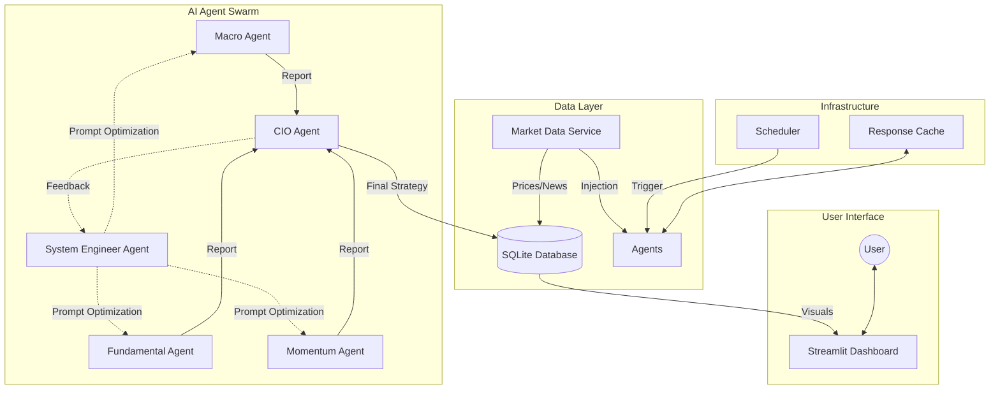
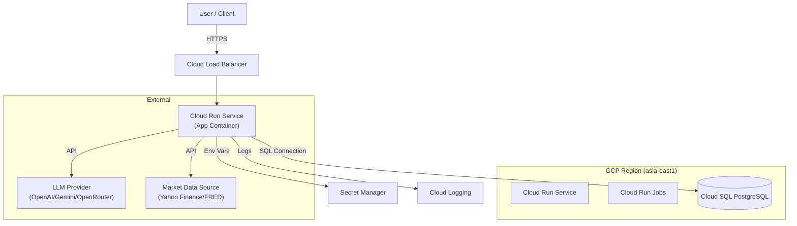

# AI Investment Advisor Platform


> **[English](#english) | [繁體中文 (Traditional Chinese)](#traditional-chinese)**

---

<a id="english"></a>

## 🇺🇸 Project Overview

An advanced, automated investment advisory system powered by a swarm of AI agents. This platform leverages Large Language Models (LLMs) to perform multi-dimensional market analysis—combining technical momentum, fundamental valuation, and macroeconomic trends—to generate professional-grade investment strategies.

### 🌟 Key Features

*   **Multi-Agent Architecture**:
    *   **Macro Agent**: Analyzes global economic trends, interest rates, and geopolitical events.
    *   **Fundamental Agent**: Evaluates company financials, earnings reports, and valuation metrics.
    *   **Momentum Agent**: Tracks price action, trends, and technical indicators.
    *   **CIO Agent (Chief Investment Officer)**: Synthesizes all inputs to make final portfolio allocation decisions.
    *   **System Engineer Agent (Self-Optimization)**: Monitors feedback from the CIO and automatically optimizes other agents' prompts to improve analysis quality continuously.
*   **Real-time Data Injection**: Prevents AI hallucinations by injecting live market data (prices, financials, news) directly into agent prompts.
*   **Dynamic Scheduling for US Market**: Default schedule aligns with US mid-session (02:00 Taipei Time / 13:00 ET) to capture real-time market dynamics.
*   **Smart Caching System**: Optimizes API costs and latency with granular Time-To-Live (TTL) settings.
*   **Interactive Dashboard**: Real-time monitoring of portfolio, reports, and **Optimization History**.

### 🏗️ System Architecture


```mermaid
graph TD
    subgraph Data Layer
        MD[Market Data Service] -->|Prices/News| DB[(SQLite Database)]
        MD -->|Injection| Agents
    end

    subgraph AI Agent Swarm
        MA[Macro Agent]
        FA[Fundamental Agent]
        MO[Momentum Agent]

        MA -->|Report| CIO[CIO Agent]
        FA -->|Report| CIO
        MO -->|Report| CIO

        CIO -.->|Feedback| SEA[System Engineer Agent]
        SEA -.->|Prompt Optimization| MA
        SEA -.->|Prompt Optimization| FA
        SEA -.->|Prompt Optimization| MO
    end

    subgraph User Interface
        CIO -->|Final Strategy| DB
        DB -->|Visuals| DASH[Streamlit Dashboard]
        User((User)) <--> DASH
    end

    subgraph Infrastructure
        SCH[Scheduler] -->|Trigger| Agents
        CACHE[Response Cache] <--> Agents
    end
```

#### ☁️ Cloud Infrastructure Architecture

This diagram illustrates the recommended deployment setup on Google Cloud Platform (GCP).


```mermaid
graph TD
    User["User / Client"] -- HTTPS --> LB["Cloud Load Balancer"]
    LB --> CR["Cloud Run Service<br>(App Container)"]

    subgraph "GCP Region (asia-east1)"
        CloudRun[Cloud Run Service]
        CloudJobs[Cloud Run Jobs]
        CloudSQL[(Cloud SQL PostgreSQL)]
    end

    CR -->|Env Vars| SM["Secret Manager"]
    CR -->|Logs| CL["Cloud Logging"]
    CR -->|SQL Connection| CloudSQL

    subgraph External
        CR -->|API| LLM["LLM Provider<br>(OpenAI/Gemini/OpenRouter)"]
        CR -->|API| Data["Market Data Source<br>(Yahoo Finance/FRED)"]
    end
```

### 🚀 Quick Start

#### Prerequisites
*   Docker Desktop installed
*   An LLM API Key (OpenAI, Google Gemini, or OpenRouter)

#### Installation

1.  **Clone the repository**
    ```bash
    git clone https://github.com/neohsiung/AI-Investment-Advisor.git
    cd AI-Investment-Advisor
    ```

2.  **Configure Environment**
    Copy the example environment file and add your API keys:
    ```bash
    cp .env.example .env
    # Edit .env with your favorite editor
    vim .env
    ```

3.  **Start the System**

    **Option A: Docker (Recommended for Production)**
    ```bash
    chmod +x start.sh
    ./start.sh
    ```

    **Option B: Local Development**
    ```bash
    chmod +x start_local.sh
    ./start_local.sh
    ```
    *This will create a virtual environment, install dependencies, optionally migrate data (if DB_TYPE=postgres), and launch the dashboard.*

4.  **Access Dashboard**
    Open your browser and navigate to:
    [http://localhost:8501](http://localhost:8501)

### 📚 Documentation (Wiki)
For detailed guides, please refer to our **[Project Wiki](wiki/Home.md)**:

*   **🚀 Deployment**:
    *   **[Deployment Options](wiki/Deployment-Options.md)**: Choose between **[Local SQLite](wiki/Deployment-Local-SQLite.md)** or **[GCP Cloud Run](wiki/Deployment-GCP-CloudRun.md)**.
    *   **[Migration Guide](wiki/Database-Migration-Guide.md)**: How to move data between Local and Cloud.
*   **📖 Manuals**:
    *   **[User Guide](wiki/User-Guide.md)**: Dashboard features and data management.
    *   **[System Overview](wiki/System-Overview.md)**: detailed architecture.
*   **🛡️ Audit**:
    *   **[Security Report](wiki/Security-Audit-Report.md)**: Vulnerability analysis.
    *   **[Architecture Review](wiki/Clean-Architecture-Review.md)**: Clean Architecture analysis.

### 🚀 Quick Start (Local)

1.  **Clone**: `git clone https://github.com/neohsiung/AI-Investment-Advisor.git`
2.  **Env**: `cp .env.example .env` (Add API Keys)
3.  **Run**: `./start.sh`
4.  **Visit**: [http://localhost:8501](http://localhost:8501)

### 📂 Project Structure

```
.
├── wiki/               # 📚 Detailed Documentation & Guides
├── data/               # Persistent data (Database, Cache)
├── src/                # Source code (Agents, Dashboard, Services)
├── docker-compose.yml  # Service orchestration
└── start.sh            # One-click startup script
```

### ⚠️ Disclaimer
**This software is for educational purposes only.** Strategies are generated by AI and do not guarantee results. Consult a financial advisor before investing.

### 📄 License
MIT License. See [LICENSE](LICENSE) for details.

---

<a id="traditional-chinese"></a>

## 🇹🇼 專案概覽 (Project Overview)

這是一個由 AI 代理人集群 (Agnet Swarm) 驅動的自動化投資顧問系統。詳細功能與架構請見 **[中文 Wiki](wiki/Home.md)**。

### 📚 完整文檔 (Wiki)
所有技術手冊與指南皆已移至 **[Project Wiki](wiki/Home.md)**：

*   **🚀 部署與維運**:
    *   **[部署方案選擇](wiki/Deployment-Options.md)**: 包含 **[本地 SQLite](wiki/Deployment-Local-SQLite.md)** 與 **[GCP Cloud Run](wiki/Deployment-GCP-CloudRun.md)**。
    *   **[資料遷移指南](wiki/Database-Migration-Guide.md)**: 本地與雲端資料庫的雙向遷移教學。
*   **📖 操作手冊**:
    *   **[使用者指南](wiki/User-Guide.md)**: 儀表板操作與數據匯入。
    *   **[系統總覽](wiki/System-Overview.md)**: 架構與核心邏輯。
*   **🛡️ 稽核報告**:
    *   **[資安審計](wiki/Security-Audit-Report.md)**: 安全性掃描結果。
    *   **[架構審查](wiki/Clean-Architecture-Review.md)**: Clean Architecture 分析。

### 🚀 快速開始 (本地端)

1.  **下載**: `git clone https://github.com/neohsiung/AI-Investment-Advisor.git`
2.  **設定**: `cp .env.example .env` (填入 API Key)
3.  **啟動**: `./start.sh`
4.  **使用**: 瀏覽器打開 [http://localhost:8501](http://localhost:8501)

### ⚠️ 免責聲明
**本軟體僅供教育研究。** AI 投資建議不保證獲利，投資前請務必自行評估風險。

### 📄 授權
MIT License.
