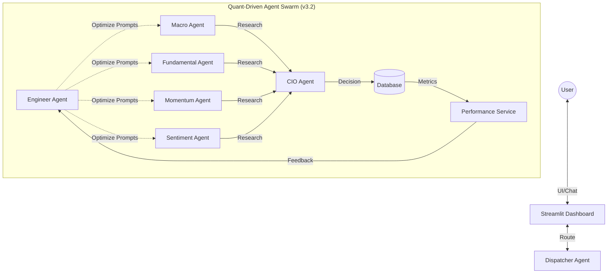

# AI Investment Advisor (v3.2)


> **[繁體中文 (Traditional Chinese)](#zh) | [English](#en)**

<a id="zh"></a>

## 🇹🇼 專案概覽 (Project Overview)

**AI Investment Advisor** 是一個由 **自我修正 (Self-Correcting)** AI Agent 集群驅動的自動化投資顧問系統。它不僅僅是一個聊天機器人，而是模擬頂級對沖基金運作的**自主進化金融分析平台**。

本系統聘請了專業的 AI Agent (投資長、總經、基本面、動能) 進行 24/7 全天候市場分析，並設有 **HR Unit (人力資源部)** 利用 **DSPy** 技術持續監控並優化 Agent 的表現。

### 🌟 核心功能 (Key Features)

| 功能模組 | 描述 |
| :--- | :--- |
| **🏆 量化反饋迴圈** | **Engineer Agent** 讀取績效指標 (Win Rate, Alpha) 與 CIO 反饋，利用 **DSPy** 自動重寫表現不佳 Agent 的 Prompt。 |
| **🏦 機構級角色設定** | **CIO (投資長)** 專注風險調整後報酬；**總經/基本面/動能/情緒** 分析師各司其職，擁有獨立數據管道。 |
| **🏗️ 現代化基礎架構** | 支援 **Kubernetes** 集群部署，採用 **Clean Architecture** (Factory, Repository, DI) 確保系統穩健性與可測試性。 |
| **🧠 長期記憶與 RAG** | 整合 **pgvector** 向量資料庫，支援歷史決策檢索與上下文增強生成。 |

### 🚀 快速開始 (Quick Start)

#### 1. 下載專案
```bash
git clone https://github.com/neohsiung/AI-Investment-Advisor.git
cd AI-Investment-Advisor
```

#### 2. 設定環境
複製範例設定檔並填入您的 API Key (Google Gemini / OpenAI)。
```bash
cp .env.example .env
# vim .env
```

#### 3. 啟動系統
```bash
# 方式 A: Docker Compose (最推薦)
./start.sh

# 方式 B: Kubernetes (進階)
./start.sh --k8s
```
*系統啟動後，請訪問 Dashboard: [http://localhost:8501](http://localhost:8501)*

### 📚 文檔索引 (Documentation)

本專案擁有完整的文檔體系，位於 `wiki/` 目錄：

- **新手入門**:
    - [使用手冊 (User Guide)](wiki/01_使用者手冊-User_Manual/使用手冊-User-Guide.md)
    - [部署選項 (Deployment Options)](wiki/01_使用者手冊-User_Manual/部署選項-Deployment-Options.md)
- **產品規格**:
    - [產品藍圖 (Roadmap)](wiki/02_產品經理-Product_Managers/產品藍圖-Roadmap.md)
    - [代理人規格 (Agent Specs)](wiki/02_產品經理-Product_Managers/Specs/代理人規格-Agent-Specs.md)
- **開發者指南**:
    - [環境設定 (Setup)](wiki/03_開發者指南-Developer_Guide/環境設定-Python-Environment-Setup.md)
    - [測試指南 (Testing)](wiki/03_開發者指南-Developer_Guide/測試指南-Testing-Guide.md)
- **架構設計**:
    - [系統概觀 (System Overview)](wiki/04_架構觀點-Architect_Views/系統概觀-System-Overview.md)
    - [AI 代理集群 (Agent Swarm)](wiki/04_架構觀點-Architect_Views/AI集群架構-AI-Agent-Swarm.md)

### 🏗️ 系統架構 (Architecture)


```mermaid
graph TD
    User((User)) <-->|UI/Chat| DASH[Streamlit Dashboard]
    DASH <-->|Route| DISP[Dispatcher Agent]
    
    subgraph "Quant-Driven Agent Swarm (v3.2)"
        ENG[Engineer Agent]
        MA[Macro Agent]
        FA[Fundamental Agent]
        MO[Momentum Agent]
        SA[Sentiment Agent]
        CIO[CIO Agent]
        
        MA & FA & MO & SA -->|Research| CIO
        CIO -->|Decision| DB[(Database)]
        DB -->|Metrics| PERF[Performance Service]
        PERF -->|Feedback| ENG
        ENG -.->|Optimize Prompts| MA & FA & MO & SA
    end
```

---

<a id="en"></a>

## 🇺🇸 Project Overview

**AI Investment Advisor** is an advanced, automated quantitative investment system empowered by a **Self-Correcting Agent Swarm**. Simulating a **Billion-Dollar Hedge Fund**, it employs specialized AI Agents (CIO, Macro, Fundamental, Momentum) to perform global market research, while an **HR Unit** continuously monitors and optimizes their performance using **DSPy**.

This is not just a chatbot; it is an **autonomous financial analysis system capable of self-evolution**.

### 🌟 Key Features

| Feature Module | Description |
| :--- | :--- |
| **🏆 Quantitative Feedback Loop** | **Engineer Agent** reads performance metrics and CIO feedback, automatically rewriting Prompts for underperforming agents via **DSPy**. |
| **🏦 Institutional Personas** | **CIO** focuses on Risk-Adjusted Returns; **Macro/Fundamental/Momentum** analysts have dedicated data pipelines. |
| **🏗️ Modern Infrastructure** | **Kubernetes** ready, built with **Clean Architecture** (Factory, Repository, DI) for robustness and testability. |
| **🧠 Long-Term Memory & RAG** | **pgvector** integration for historical decision retrieval and RAG (Retrieval-Augmented Generation). |

### 🚀 Quick Start

#### 1. Clone Repository
```bash
git clone https://github.com/neohsiung/AI-Investment-Advisor.git
cd AI-Investment-Advisor
```

#### 2. Configure Environment
Copy the example config and add your API Keys.
```bash
cp .env.example .env
# vim .env
```

#### 3. Start System
```bash
# Option A: Docker Compose (Recommended)
./start.sh

# Option B: Kubernetes (Advanced)
./start.sh --k8s
```
*Access the Dashboard at: [http://localhost:8501](http://localhost:8501)*

### 📚 Documentation

Detailed documentation is available in the `wiki/` directory:

- **Getting Started**:
    - [User Guide](wiki/01_使用者手冊-User_Manual/使用手冊-User-Guide.md)
    - [Deployment Options](wiki/01_使用者手冊-User_Manual/部署選項-Deployment-Options.md)
- **Product Specs**:
    - [Roadmap](wiki/02_產品經理-Product_Managers/產品藍圖-Roadmap.md)
    - [Agent Specs](wiki/02_產品經理-Product_Managers/Specs/代理人規格-Agent-Specs.md)
- **Developer Guide**:
    - [Environment Setup](wiki/03_開發者指南-Developer_Guide/環境設定-Python-Environment-Setup.md)
    - [Testing Guide](wiki/03_開發者指南-Developer_Guide/測試指南-Testing-Guide.md)
- **Architecture**:
    - [System Overview](wiki/04_架構觀點-Architect_Views/系統概觀-System-Overview.md)
    - [Agent Swarm](wiki/04_架構觀點-Architect_Views/AI集群架構-AI-Agent-Swarm.md)

### ⚠️ Disclaimer
**For Educational and Research Purposes Only.**
This software is a simulation of an investment system. It is not financial advice. Usage in real trading is at your own risk.

### 📄 License
MIT License.
