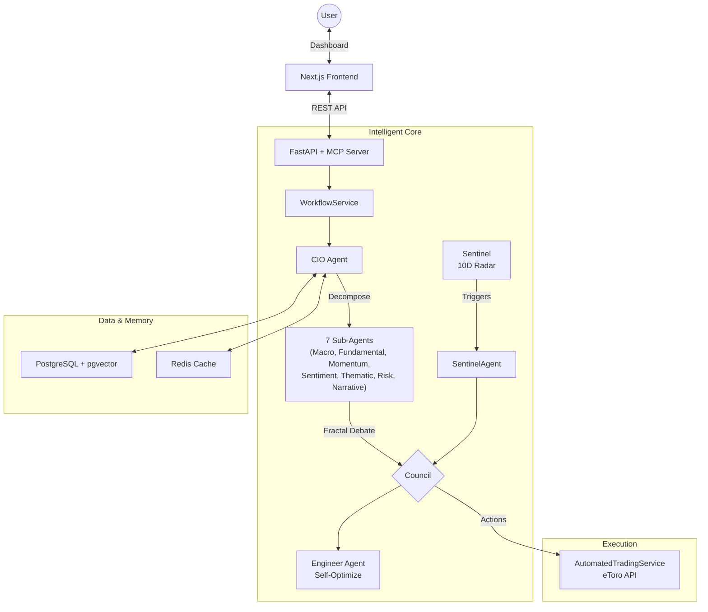

# AI Investment Advisor

> 🧠 Autonomous quantitative investment platform — 7-agent swarm with fractal debate, 3-tier LLM routing, and automated eToro trading.
>
> 自主量化投資平台 — 7 智能體集群碎形辯論、三層 LLM 路由、自動化 eToro 交易。

<p align="center">
  
  
  
  
  
  
</p>

---

## What Is This?

AI Investment Advisor mirrors the decision-making architecture of a top-tier hedge fund. A **CIO Agent** decomposes investment questions, delegates to **7 specialized sub-agents**, orchestrates a **Fractal Debate** to eliminate model hallucinations, and produces actionable portfolio decisions — all executed automatically via eToro's trading API.

The platform features a **3-Tier LLM routing engine** (Advanced / Smart / Fast) for cost-optimized AI inference, a **10-Dimension Sentinel** for autonomous risk monitoring, and a **hybrid storage layer** (PostgreSQL + pgvector + Redis) for semantic memory and real-time state.

---

## Architecture


```mermaid
graph TD
    User((User)) <-->|Dashboard| FE["Next.js Frontend"]
    FE <-->|REST API| API["FastAPI + MCP Server"]

    subgraph "Intelligent Core"
        API --> WF["WorkflowService"]
        WF --> CIO["CIO Agent"]
        CIO -->|Decompose| SUB["7 Sub-Agents<br/>(Macro, Fundamental, Momentum,<br/>Sentiment, Thematic, Risk, Narrative)"]
        SUB -->|Fractal Debate| COUNCIL{"Council"}
        COUNCIL --> ENG["Engineer Agent<br/>Self-Optimize"]
        SENT["Sentinel<br/>10D Radar"] -->|Triggers| SA["SentinelAgent"]
        SA --> COUNCIL
    end

    subgraph "Data & Memory"
        PG["PostgreSQL + pgvector"]
        RD["Redis Cache"]
    end

    subgraph "Execution"
        TRADE["AutomatedTradingService<br/>eToro API"]
    end

    COUNCIL -->|Actions| TRADE
    CIO <--> PG
    CIO <--> RD
```

### 3-Tier LLM Routing

| Tier | Purpose | Example Models |
|:-----|:--------|:---------------|
| **Advanced 🚀** | Deep analysis, CIO decisions | GPT-4o, Claude 3.5 Sonnet |
| **Smart 🧠** | Debate, reasoning, classification | Gemini 1.5 Pro |
| **Fast ⚡** | Formatting, screening, extraction | GPT-4o-mini, Ollama local |

### 3-Tier Data Storage

| Tier | Engine | Use Case |
|:-----|:-------|:---------|
| **Hot 🔥** | Redis | Semantic cache, real-time state |
| **Warm ☀️** | PostgreSQL + pgvector | Structured records, vector search |
| **Cold ❄️** | File System | Raw reports, historical backtests |

---

## Key Features

| Feature | Description |
|:--------|:------------|
| 🧬 **Fractal Debate** | Multi-agent adversarial reasoning eliminates single-model hallucinations |
| 🦅 **10D Sentinel** | VIX, price, news, macro, allocation drift — autonomous risk radar |
| ⚡ **Auto-Hedging** | Millisecond-precision position liquidation via eToro API |
| 🧠 **OpenClaw Architecture** | Per-agent WAL (Write-Ahead Logging) prevents context overflow amnesia |
| 📊 **Hybrid RAG** | BM25 + temporal-decay semantic search via pgvector + Redis |
| 🔐 **Fernet Encryption** | All API keys encrypted at rest with `LLMCredentialCipher` |
| 📡 **OpenTelemetry** | Full observability via SigNoz APM (traces, metrics, logs) |
| 🔄 **Celery Beat** | Scheduled workflows: daily checks, weekly reports, sentinel ticks |

---

## Tech Stack

| Category | Technology |
|:---------|:-----------|
| **Language** | Python 3.11, TypeScript |
| **Backend** | FastAPI, MCP (Model Context Protocol), Celery |
| **Frontend** | Next.js 15 (App Router), Streamlit (legacy) |
| **AI/ML** | LiteLLM, DSPy, OpenAI / Gemini / Claude / Ollama multi-provider |
| **Database** | PostgreSQL 16 + pgvector, Redis, SQLite (dev) |
| **Infra** | Docker Compose, Nginx, SigNoz, OpenTelemetry 1.39 |
| **Trading** | eToro API (automated fractional trading) |
| **Data Sources** | Polygon, Tiingo, Finnhub, AlphaVantage, FMP, FRED, TAVILY |
| **Notifications** | Telegram, LINE, Email (SMTP) |

---

## Quick Start

### Prerequisites

- Docker & Docker Compose
- Python 3.10+ (for local development)
- Node.js 20+ (for frontend development)

### Launch

```bash
# 1. Clone & configure
git clone https://github.com/neohsiung/AI-Investment-Advisor.git
cd AI-Investment-Advisor
cp .env.example .env
# Edit .env — set APP_SECRET_KEY and LLM_CREDENTIAL_KEY

# 2. Start all services (PostgreSQL, Redis, API, Frontend, Scheduler)
./start.sh
```

| Service | URL |
|:--------|:----|
| Next.js Dashboard | [http://localhost:3000](http://localhost:3000) |
| FastAPI / MCP Server | [http://localhost:8000](http://localhost:8000) |
| Streamlit (legacy) | [http://localhost:8501](http://localhost:8501) |
| SigNoz APM | [http://localhost:3301](http://localhost:3301) |

---

## Project Structure

```
AI-Investment-Advisor/
├── .agent/              # Agent governance layer (rules, skills, workflows)
│   ├── rules/           #   Coding, testing, security, commit standards
│   ├── skills/          #   15 specialized capability packages
│   └── workflows/       #   Operational playbooks
├── alembic/             # Database migrations (PostgreSQL)
├── config/              # Model routing, LLM seed data, persona definitions
├── deployment/          # Helm charts, PostgreSQL manifests
├── frontend/            # Next.js 15 dashboard (TypeScript)
├── infra/               # Nginx reverse proxy, SigNoz observability config
├── k8s/                 # Kubernetes manifests (future deployment)
├── prompts/             # Agent system prompts (CIO, Sentinel, sub-agents)
├── scripts/             # Ops: DB seed, deployment, health checks
├── services/            # Microservice entrypoints
│   ├── mcp_server/      #   FastAPI + MCP server (main backend)
│   ├── notification/    #   Telegram / LINE / Email service
│   ├── scheduler/       #   Celery Beat scheduler
│   └── dashboard/       #   Streamlit dashboard (legacy)
├── src/                 # Core Python package
│   ├── agents/          #   Agent definitions + skills (eToro trade, research)
│   ├── api/             #   FastAPI route handlers
│   ├── config/          #   App configuration, data source matrix
│   ├── domain/          #   Domain models
│   ├── infrastructure/  #   Celery, LLM gateway, OTel instrumentation
│   ├── repositories/    #   Database access (ORM + raw SQL)
│   ├── services/        #   Business logic services
│   └── workflow/        #   Daily / weekly workflow orchestrators
├── tests/               # Unit, integration, e2e tests
├── workspace/           # Multi-agent workspace (WAL, identity, memory)
├── AGENTS.md            # AI coding assistant context (unified standard)
├── CHANGELOG.md         # Version history (Keep a Changelog format)
├── SECURITY.md          # Security policy & vulnerability reporting
├── docker-compose.yml   # Development stack
├── docker-compose.prod.yml  # Production stack
├── pyproject.toml       # Python project config & dependencies
└── start.sh             # One-command full-stack launcher
```

---

## AI Agent Context

This project uses [AGENTS.md](AGENTS.md) as the unified context file for all AI coding assistants. It provides:

- Project identity and architecture overview
- Key technical constraints and conventions
- Build, test, and lint commands
- Directory semantics
- Documentation references

> For deeper governance rules, skills, and workflows, see the [`.agent/`](.agent/README.md) directory.

---

## Governance & Standards

| Standard | File |
|:---------|:-----|
| Engineering & coding | [`.agent/rules/engineering-standards.md`](.agent/rules/engineering-standards.md) |
| Git commit format | [`.agent/rules/git-commit-format.md`](.agent/rules/git-commit-format.md) |
| Documentation | [`.agent/rules/documentation-standards.md`](.agent/rules/documentation-standards.md) |
| Observability | [`.agent/rules/observability-standards.md`](.agent/rules/observability-standards.md) |
| Security policy | [`SECURITY.md`](SECURITY.md) |

---

## Documentation

- 📖 **Full Wiki**: See the [Wiki repository](https://github.com/neohsiung/AI-Investment-Advisor/wiki) for architectural blueprints, data source matrix, and contribution guides.
- 📝 **Changelog**: See [`CHANGELOG.md`](CHANGELOG.md) for version history.

---

## License & Disclaimer

- **License**: [MIT License](LICENSE)
- **Disclaimer**: This project is for **educational and research purposes only**. It is not financial advice. Trading involves risk — use at your own discretion.

---

<p align="center">Built with ❤️ for Modern Quantitative Investing</p>
