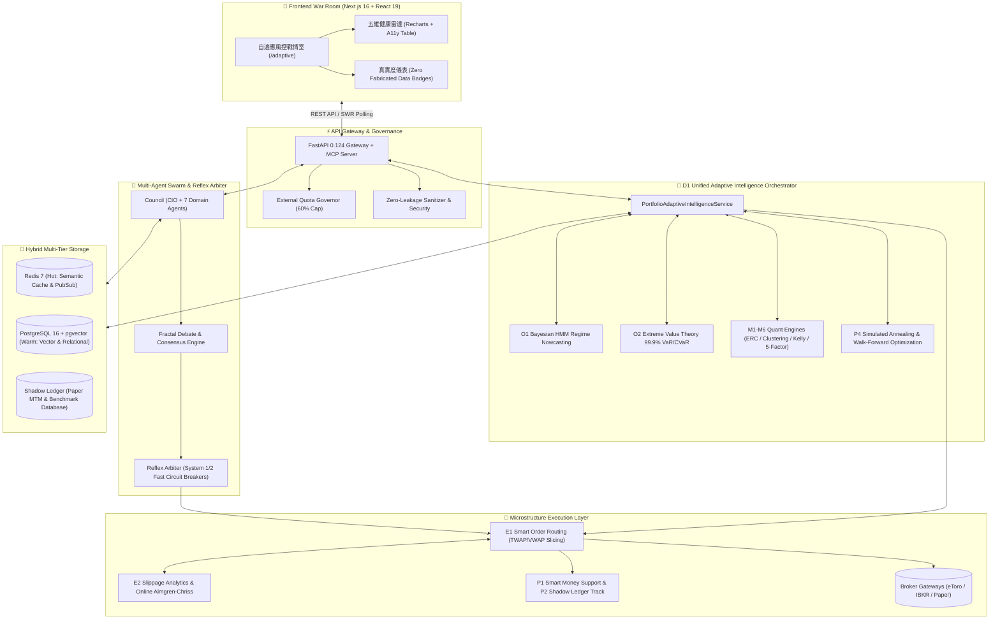

# AI Investment Advisor

<p align="center">
  <a href="https://www.star-history.com/neohsiung/AI-Investment-Advisor">
  <picture>
   <source media="(prefers-color-scheme: dark)" srcset="https://api.star-history.com/badge?repo=neohsiung/AI-Investment-Advisor&theme=dark" />
   <source media="(prefers-color-scheme: light)" srcset="https://api.star-history.com/badge?repo=neohsiung/AI-Investment-Advisor" />
   
  </picture>
  </a>
</p>

<p align="center">
  <a href="https://github.com/neohsiung/AI-Investment-Advisor/stargazers"></a>
  &nbsp;
  <a href="https://github.com/neohsiung/AI-Investment-Advisor/network/members"></a>
  &nbsp;
  <a href="https://github.com/neohsiung/AI-Investment-Advisor/issues"></a>
  &nbsp;
  <a href="https://github.com/neohsiung/AI-Investment-Advisor/blob/main/LICENSE"></a>
</p>

<p align="center">
  
  
  
  
  
  
  
</p>

<p align="center">
  
</p>

<p align="center">
  <strong>English</strong> |
  <a href="READMEs/README.zh-TW.md">繁體中文</a> |
  <a href="READMEs/README.ja-JP.md">日本語</a>
</p>

---

> [!WARNING]
> **Not investment advice. Trades real money at your own risk.** This is autonomous quantitative trading software — if configured with live broker credentials, it will execute real orders with real money. Provided "AS IS" with no warranty (see [LICENSE](LICENSE) / [NOTICE](NOTICE)). Always start in paper/demo mode and understand the system before connecting a funded account.

> [!TIP]
> **Your portfolio has an institutional-grade quantitative brain watching it 24/7.** This platform orchestrates an autonomous multi-agent swarm, Bayesian regime nowcasting, Extreme Value Theory (EVT) tail risk defenses, multi-factor alpha synthesis, and real-time smart order routing — the way a modern quantitative hedge fund operates.

---

## 📌 Executive Summary

**You just allocated capital to the market. How do you continuously identify Alpha, adapt to macro regime shifts, withstand extreme tail risk, and execute trades without getting picked off by predatory algorithms?**

**AI Investment Advisor** is an autonomous quantitative investment and adaptive intelligence platform. It fuses **Fractal Debate Swarm Intelligence** (eliminating single-model hallucinations through structured multi-agent disagreement) with a battle-tested **Multi-Layer Quantitative & Risk Engine**:
- **D1 & UI1 Adaptive War Room**: Real-time five-dimensional health radar (Regime Alignment, Diversification Efficiency, Factor Balance, Tail Risk Resilience, Capital Safety) with **Zero Fabricated Data Provenance**.
- **O1 Bayesian Dynamic Regime**: Continuous 3-state Hidden Markov Model (HMM) nowcasting with soft mixture blending for dynamic cash buffering and target Beta dampening.
- **O2 Extreme Value Theory Defense**: Peaks-Over-Threshold (POT) Generalized Pareto Distribution (GPD) calculating closed-form 99.9% VaR/CVaR black swan protections.
- **M1–M6 Quantitative Engines**: Risk-parity volatility targeting, dynamic correlation clustering, opportunity cost hurdles, fractional Kelly sizing, stress testing, and regime-conditioned 5-factor alpha synthesis.
- **E1–E2 Smart Execution**: ADV20 liquidity limits, randomized TWAP/VWAP slicing, Perold (1988) Implementation Shortfall attribution, and online Almgren-Chriss impact calibration.
- **P1–P4 Strategy Evolution**: Anchored VWAP + POC support, independent shadow paper ledger, actionable Telegram/Slack hubs, and Walk-Forward simulated annealing backtesting.

---

## ✨ Core Capabilities & Feature Matrix

<table>
  <tr>
    <td width="50%" valign="top">
      <h3>📊 UI1 Adaptive War Room (/adaptive)</h3>
      <p>Next.js 16 (React 19) war room featuring Recharts 5-Dimensional Health Radar, accessible semantic fallback table, SWR 30s auto-polling, and <b>Zero Fabricated Data Guarantee</b> with clear provenance badges (Holdings, Macro, Tail Risk).</p>
    </td>
    <td width="50%" valign="top">
      <h3>🧠 D1 Unified Adaptive Orchestrator</h3>
      <p>Synthesizes M1~M6, E1~E2, O1~O2, and P4 into a single [0, 100] health score and actionable rebalance plan, categorizing portfolio state into OPTIMAL, BALANCED, CAUTION, or CRITICAL.</p>
    </td>
  </tr>
  <tr>
    <td width="50%" valign="top">
      <h3>🔮 O1 Bayesian Dynamic Regime (HMM)</h3>
      <p>Replaces rigid heuristic thresholds with a continuous 3-state Hidden Markov Model. Computes Shannon regime entropy and soft mixture blending to smoothly manage cash buffers and target Beta without whipsaws.</p>
    </td>
    <td width="50%" valign="top">
      <h3>🦅 O2 EVT Tail Risk & Black Swan Defense</h3>
      <p>Breaks past normal distribution blindspots using Extreme Value Theory (POT + GPD). Extrapolates 99.9% closed-form VaR and Expected Shortfall (CVaR) with fat-tail amplification ratios.</p>
    </td>
  </tr>
  <tr>
    <td width="50%" valign="top">
      <h3>🧬 P4 Strategy Auto-Evolution & Annealing</h3>
      <p>Simulated annealing over multi-dimensional parameter grids with Metropolis acceptance. Validates out-of-sample efficiency via Walk-Forward Optimization (WFO &ge; 0.55) to eliminate curve-fitting.</p>
    </td>
    <td width="50%" valign="top">
      <h3>⚡ E1 & E2 Smart Order Routing (SOR)</h3>
      <p>ADV20 1.5% liquidity guards with Rollover queues, randomized &plusmn;15% TWAP/VWAP slicing, Perold Implementation Shortfall attribution, and online Almgren-Chriss &eta; calibration.</p>
    </td>
  </tr>
  <tr>
    <td width="50%" valign="top">
      <h3>🛡️ M1–M6 Quantitative Risk Engines</h3>
      <p>Dynamic volatility targeting (14% cap), Pearson correlation clustering (30% cluster cap), non-linear opportunity cost hurdle ($2.5 \times$ roundtrip), fractional Kelly sizing, and multi-factor alpha ensemble.</p>
    </td>
    <td width="50%" valign="top">
      <h3>🤖 7-Agent Fractal Debate Swarm</h3>
      <p>Adversarial reasoning across 7 domain agents (CIO, Sentiment, Fundamental, Valuation, Technical, Risk, Sentinel) backed by Reflex Arbiter low-latency circuit breakers.</p>
    </td>
  </tr>
  <tr>
    <td width="50%" valign="top">
      <h3>📝 P1–P3 Trade Protection & Shadow Ledger</h3>
      <p>Anchored VWAP and POC cost basis support with native trailing stop-loss (TSL), independent paper shadow ledger (7–14 day graduation gate), and two-way actionable alerts (Telegram/Slack).</p>
    </td>
    <td width="50%" valign="top">
      <h3>🔐 Enterprise Security & Observability</h3>
      <p>Fernet encryption at rest, OpenTelemetry 1.39 + SigNoz APM, Zero-Leakage Sanitizer, and 60% External Quota Governor across all external APIs.</p>
    </td>
  </tr>
</table>

---

## 🏗️ System Architecture


```mermaid
flowchart TD
    subgraph UI ["🎨 Frontend War Room (Next.js 16 + React 19)"]
        WAR["自適應風控戰情室 (/adaptive)"]
        RADAR["五維健康雷達 (Recharts + A11y Table)"]
        PROV["真實度儀表 (Zero Fabricated Data Badges)"]
        WAR --> RADAR
        WAR --> PROV
    end

    subgraph Gateway ["⚡ API Gateway & Governance"]
        API["FastAPI 0.124 Gateway + MCP Server"]
        GOV["External Quota Governor (60% Cap)"]
        SAN["Zero-Leakage Sanitizer & Security"]
        API --> GOV
        API --> SAN
    end

    subgraph Intelligence ["🧠 D1 Unified Adaptive Intelligence Orchestrator"]
        D1["PortfolioAdaptiveIntelligenceService"]
        O1["O1 Bayesian HMM Regime Nowcasting"]
        O2["O2 Extreme Value Theory 99.9% VaR/CVaR"]
        M1M6["M1-M6 Quant Engines (ERC / Clustering / Kelly / 5-Factor)"]
        P4["P4 Simulated Annealing & Walk-Forward Optimization"]
        D1 <--> O1
        D1 <--> O2
        D1 <--> M1M6
        D1 <--> P4
    end

    subgraph Swarm ["🤖 Multi-Agent Swarm & Reflex Arbiter"]
        COUNCIL["Council (CIO + 7 Domain Agents)"]
        DEBATE["Fractal Debate & Consensus Engine"]
        ARBITER["Reflex Arbiter (System 1/2 Fast Circuit Breakers)"]
        COUNCIL --> DEBATE
        DEBATE --> ARBITER
    end

    subgraph Execution ["🚀 Microstructure Execution Layer"]
        E1["E1 Smart Order Routing (TWAP/VWAP Slicing)"]
        E2["E2 Slippage Analytics & Online Almgren-Chriss"]
        P1P2["P1 Smart Money Support & P2 Shadow Ledger Track"]
        E1 <--> E2
        E1 --> BROKER[("Broker Gateways (eToro / IBKR / Paper)")]
    end

    subgraph Storage ["💾 Hybrid Multi-Tier Storage"]
        REDIS[("Redis 7 (Hot: Semantic Cache & PubSub)")]
        PG[("PostgreSQL 16 + pgvector (Warm: Vector & Relational)")]
        SHADOW[("Shadow Ledger (Paper MTM & Benchmark Database)")]
    end

    UI <-->|REST API / SWR Polling| API
    API <--> D1
    API <--> COUNCIL
    D1 --> E1
    ARBITER --> E1
    E1 --> P1P2
    D1 <--> Storage
    COUNCIL <--> Storage
```

---

## 3-Tier Multi-Dimensional Model & Storage Architecture

### 3-Tier LLM Routing
| Tier | Purpose | Recommended Models | Fallback / Cost Strategy |
|:-----|:--------|:-------------------|:--------------------------|
| **Advanced 🚀** | Deep quantitative reasoning, CIO arbitration, strategy evolution | Claude 3.5 Sonnet, GPT-4o | Rate-limited with priority queuing |
| **Smart 🧠** | Multi-agent fractal debate, sentiment & SEC filing analysis | Gemini 1.5 Pro, DeepSeek-V3 | High concurrency, mid-tier latency |
| **Fast ⚡** | Reflex circuit breakers, market screening, structured extraction | GPT-4o-mini, Local Ollama | Sub-second latency, zero cloud cost |

### 3-Tier Data Architecture
| Tier | Storage Engine | Purpose & Retention |
|:-----|:---------------|:--------------------|
| **Hot 🔥** | Redis 7 | Real-time ticker ticks, semantic query cache, circuit-breaker flags, rate limits |
| **Warm ☀️** | PostgreSQL 16 + pgvector | Structured trade logs, HMM transition matrices, factor weights, RAG embeddings |
| **Cold ❄️** | Encrypted Storage / JSONL | Daily cold backups (`workflow_cold_backup.jsonl`), multi-year Walk-Forward logs |

---

## 🛠️ Tech Stack

| Category | Technology |
|:---------|:-----------|
| **Language** | Python 3.10 / 3.11, TypeScript 5.x |
| **Backend** | FastAPI 0.124, MCP (Model Context Protocol), Celery Beat, Pydantic V2 |
| **Frontend** | Next.js 16 (App Router), React 19, Recharts 2.15, Tailwind CSS, SWR |
| **Quantitative Core** | NumPy, SciPy, Pandas, Extreme Value Theory (GPD/POT), Bayesian HMM |
| **Database** | PostgreSQL 16 + pgvector, Redis 7, SQLAlchemy 2.0, Alembic |
| **Infra & Observability** | Docker Compose, Nginx, SigNoz APM, OpenTelemetry 1.39 |
| **Brokers & Execution** | eToro API, Interactive Brokers (IBKR), Paper Simulation Engine |
| **Market Data** | Polygon, Tiingo, Finnhub, AlphaVantage, FMP, FRED, Tavily |
| **Actionable Alerts** | Telegram Bot (Inline Buttons), Slack (Block Kit), Email (SMTP) |
| **Quality & Security** | Vitest, Pytest, Ruff, Bandit SAST, Zero-Leakage Sanitizer |

---

## 🚀 Quick Start

### Prerequisites
- Docker & Docker Compose (v2.20+)
- Python 3.10+ (for local development)
- Node.js 20+ (for frontend development)

### Launch (Turnkey Self-Host, One Command)
```bash
git clone https://github.com/neohsiung/AI-Investment-Advisor.git
cd AI-Investment-Advisor
./install.sh
```

`install.sh` verifies prerequisites, generates cryptographic secrets, protects database keys, runs an onboarding wizard to configure your **Operating Cost Profile** (Frugal, Balanced, or Aggressive), builds the containers, applies database migrations, seeds safe defaults (`ai_trading_enabled=false`), and health-gates the deployment.

For comprehensive self-hosting, environment configuration, and manual operation:
👉 **[單機自架維運手冊 (Self-Hosting Guide)](wiki/06_SRE_Observability/單機自架手冊-Self-Hosting-Guide.md)**

| Service / War Room | Access URL | Description |
|:-------------------|:-----------|:------------|
| **自適應風控戰情室 (Radar)** | [http://127.0.0.1:8088/adaptive](http://127.0.0.1:8088/adaptive) | D1 五維健康雷達、O1 體制、O2 EVT 尾部抗性與數據真實度儀表 |
| **總覽控制台 (Command)** | [http://127.0.0.1:8088/](http://127.0.0.1:8088/) | 實時投組淨值、部位分佈與綜合概覽 |
| **績效分析 (Performance)** | [http://127.0.0.1:8088/performance](http://127.0.0.1:8088/performance) | 投組歷史收益、夏普比率、最大回撤追蹤 |
| **策略回測 (Backtest)** | [http://127.0.0.1:8088/backtest](http://127.0.0.1:8088/backtest) | M4 凱利回測與 P4 模擬退火演化參數診斷 |
| **評議會辯論 (Decisions)** | [http://127.0.0.1:8088/decisions](http://127.0.0.1:8088/decisions) | 7 位 Agent 碎形辯論過程、分歧度與裁決紀錄 |
| **健康監控 (Health)** | [http://127.0.0.1:8088/health](http://127.0.0.1:8088/health) | 閉環自我學習反饋、系統營運與快取指標 |
| **擴展中心 (Extensions)** | [http://127.0.0.1:8088/extensions](http://127.0.0.1:8088/extensions) | 外部數據源、通知通道、工具與技能配置 |
| **成本與設定 (Settings)** | [http://127.0.0.1:8088/settings](http://127.0.0.1:8088/settings) | Frugal / Balanced / Aggressive 成本檔案切換 |

---

## 📁 Project Structure

```
AI-Investment-Advisor/
├── .agent/              # Agent governance layer (rules, skills, workflows)
│   ├── rules/           #   Coding, testing, security, commit standards
│   ├── skills/          #   15 specialized capability packages
│   └── workflows/       #   Operational playbooks
├── alembic/             # Database migrations (PostgreSQL)
├── config/              # Model routing, LLM seed data, persona definitions
├── deployment/          # Helm charts, PostgreSQL manifests
├── frontend/            # Next.js 16 dashboard (TypeScript + React 19 + Recharts)
│   ├── src/app/adaptive #   UI1 自適應風控戰情室 (Radar, Provenance, O1/O2)
│   ├── src/app/health   #   系統健康與閉環指標面板
│   └── src/components   #   響應式組件、側邊欄、圖表封裝
├── infra/               # Nginx reverse proxy, SigNoz observability config
├── prompts/             # Agent system prompts (CIO, Sentinel, sub-agents)
├── scripts/             # Ops: pre-push checks, DB seeds, deployment gates
├── src/                 # Core Quantitative & AI Python package
│   ├── agents/          #   Agent definitions + skills (eToro trade, research)
│   ├── api/v1/          #   FastAPI route handlers (adaptive, transactions, etc.)
│   ├── config/          #   App configuration, settings schemas, owner resolution
│   ├── domain/          #   Domain models & schemas
│   ├── infrastructure/  #   Celery, LLM gateway, OTel instrumentation
│   ├── repositories/    #   Database access (ORM + raw SQL + shadow ledger)
│   └── services/        #   Core Quantitative Services (M1~M6, E1~E2, O1~O2, P1~P4, D1)
├── tests/               # Test suites (unit, integration, bdd, contract)
├── wiki/                # Centralized project knowledge base & documentation
│   ├── 00_Product_Strategy/
│   ├── 01_System_Architecture/
│   ├── 02_Frontend_UX/
│   ├── 03_Backend_Intelligence/
│   ├── 04_Data_Storage/
│   ├── 05_Quality_Assurance/
│   └── 06_SRE_Observability/
├── AGENTS.md            # AI coding assistant unified context
├── CHANGELOG.md         # Version history (Keep a Changelog format)
├── SECURITY.md          # Security policy & vulnerability reporting
├── docker-compose.yml   # Development stack
└── install.sh           # One-command full-stack installer
```

---

## 📏 Governance & Quality Engineering

All contributions adhere to strict quality gates:

| Quality Gate | Tool / Standard | Description |
|:-------------|:----------------|:------------|
| **Local Pre-Push Gate** | `./scripts/pre_push_check.sh` | 4-stage local guard: Ruff syntax, Bandit SAST, Wiki links, and 331+ regression tests |
| **Frontend Test Suite** | `cd frontend && npm test` | Vitest + React Testing Library (35 tests covering all pages, SWR polling & A11y) |
| **Frontend Type Safety** | `npm run typecheck` | TypeScript strict check with zero emit errors |
| **Backend Security** | Bandit SAST | Zero high/medium vulnerability baseline |
| **Wiki Link Integrity** | `verify_wiki_links.py` | Automated flat-link verification across all 170+ documentation pages |
| **Coding Standards** | [`.agent/rules/engineering-standards.md`](.agent/rules/engineering-standards.md) | Async I/O, error handling, contract-driven schemas |
| **Git Commit Format** | [`.agent/rules/git-commit-format.md`](.agent/rules/git-commit-format.md) | Conventional Commits (`feat`, `fix`, `test`, `docs`, `refactor`) |

---

## 📚 Documentation & Knowledge Base

- 📖 **Full Wiki**: See the [Wiki](https://github.com/neohsiung/AI-Investment-Advisor/wiki) (or local [`wiki/Home.md`](wiki/Home.md)) for 170+ architectural blueprints, quantitative engine derivations, and PRD specifications.
- 🎨 **自適應戰情室規格 (UI1)**: [`wiki/02_Frontend_UX/自適應戰情室雷達儀表板-Adaptive-Radar-Dashboard.md`](wiki/02_Frontend_UX/自適應戰情室雷達儀表板-Adaptive-Radar-Dashboard.md)
- 🧠 **統一自適應智慧中樞 (D1)**: [`wiki/03_Backend_Intelligence/統一投組自適應智慧聚合服務-Portfolio-Adaptive-Intelligence.md`](wiki/03_Backend_Intelligence/統一投組自適應智慧聚合服務-Portfolio-Adaptive-Intelligence.md)
- 🔮 **貝氏體制轉移現在預測 (O1)**: [`wiki/03_Backend_Intelligence/貝葉斯隱馬爾可夫體制轉移與在線現在預測-Bayesian-HMM-Regime.md`](wiki/03_Backend_Intelligence/貝葉斯隱馬爾可夫體制轉移與在線現在預測-Bayesian-HMM-Regime.md)
- 🦅 **極值理論尾部風險外推 (O2)**: [`wiki/03_Backend_Intelligence/黑天鵝極值理論尾部風險外推-Extreme-Value-Theory.md`](wiki/03_Backend_Intelligence/黑天鵝極值理論尾部風險外推-Extreme-Value-Theory.md)
- 🧬 **策略自動演化回測 (P4)**: [`wiki/03_Backend_Intelligence/策略自動演化回測與參數網格退火-Strategy-Auto-Evolution.md`](wiki/03_Backend_Intelligence/策略自動演化回測與參數網格退火-Strategy-Auto-Evolution.md)
- 📝 **Changelog**: See [`CHANGELOG.md`](CHANGELOG.md) for version evolution.

---

## 📄 License & Disclaimer

- **License**: [Apache License 2.0](LICENSE)
- **Disclaimer**: This system autonomously analyzes financial markets and can execute real trades with real money when configured. It does not constitute financial advice. Provided "AS IS" with no warranty. See [NOTICE](NOTICE) for terms.

<p align="center">
  <strong>Stop guessing. Start debating. Let adaptive intelligence govern your portfolio.</strong>
</p>

<p align="center">
  Apache License 2.0 &copy; <a href="https://github.com/neohsiung">AI Investment Advisor Contributors</a>
</p>
