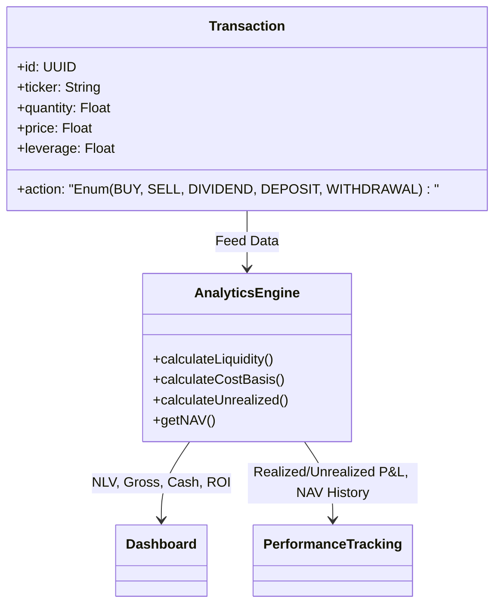

# 核心指標計算規範 (Core Metrics Specification)

本文件依據 **規範驅動設計 (Spec-Driven Design)** 原則，定義系統內部所有核心財務指標的計算標準與術語，確保跨模組計算結果的一致性。

## 1. 核心術語與計算公式 (Standard Terminology)

| 內部標準術語 (Term) | 描述 (Description) | 計算公式 (Standard Formula) |
| :--- | :--- | :--- |
| **可用現金 (Available Cash)** | 帳戶中尚未用於購買資產的美元資金。用於支付保證金、隔夜費或新部位資金。 | `credits - ∑(ordersForOpen[i].amount)` |
| **持股成本 / 保證金投入 (Margin Invested)** | 手動交易、複製跟單及 Smart Portfolios 的**當前投入的真實資金淨額**。針對槓桿交易，此處僅計算實際扣除的保證金 (Margin)，而非名目價值 (Nominal Value)。 | `∑((數量 * 買入價) / 槓桿倍數)` |
| **獲利 / 虧損 (Profit/Loss)** | 所有**未平倉**部位價值與開倉價值的差異。含已實現利息、紅利與未實現漲跌。 | `∑(未平倉部位即時價值 - 開倉價值)` |
| **資產淨值 (Net Liquidation Value - NLV)** | **全域核心指標**。您帳戶的總資產價值，包含現金與實質投入的保證金以及浮動盈虧。 | `可用現金 + 保證金投入 + 浮動盈虧` |
| **總曝險 (Gross Exposure)** | **風險指標**。帳戶控制的資產名義價值 (含槓桿)。 | `可用現金 + ∑(持倉數量 * 當前市價 * 槓桿倍數)` |
| **總權益 (Equity)** | **單一券商指標**。特定券商帳戶內的淨值。 | `∑(該券商分項淨值)`。**關係：NLV = ∑(Equity)** |

---

## 2. 當前對齊目標 (Reconciliation Targets)
*截至 v4.2.3*

*   **目標現金 (Target Cash)**: **$316.58**
*   **目標淨值 (Target NLV)**: **$991.03**
*   **保證金投入 (Margin Invested)**: **$674.45**

---

## 2. 頁面邏輯映射 (Page Mapping)

### A. 總覽儀表板 (Dashboard Overview)
*   **NLV (Net Liquidity Value)**: 對應內部標準 `資產淨值 (Equity / NAV)`。
*   **GROSS**: 對應內部標準 `總曝險規模 (Gross Exposure)`。
*   **CASH**: 對應內部標準 `可動用流動性 (Liquidity)`。
*   **TOTAL P&L**: 對應內部標準 `累積淨盈虧 (Net Earnings)`。
*   **ROI**: `(累積淨盈虧 / (累計總入金 - 累計總出金)) * 100%`。

### B. 績效追蹤頁面 (Portfolio Performance)
*   **已實現損益 (Realized P&L)**: 僅計算已平倉部位及股息的盈虧累計。
*   **未實現損益 (Unrealized P&L)**: 對應持倉的 `未實現損益`。
*   **累積投入資本 (Margin Invested)**: 對應 `累計真實投入保證金` (真實投入帳戶的本金，不含槓桿名目金額)。
*   **歷史趨勢 (Growth Chart)**: 使用每日定時記錄的 `資產淨值 (NAV)` 快照進行繪製。

---

## 3. 數據流與模型 (Data Modeling)

## 4. 特殊情境處理 (Special Cases)
*   **槓桿倍數 (Leverage)**: 預設為 1.0x。若持倉設定槓桿，其對 `總曝險規模 (Gross Exposure)` 的影響為線性放大。在資料庫交易紀錄中，買入與賣出的扣款對象為 `可動用流動性`，其金額為名目價值除以槓桿 (`(price * quantity) / leverage`)。
*   **手續費 (Fees)**: 手續費會直接扣除 `可動用流動性`，並包含在 `已投入本金` (買入時) 或 `已實現損益` (賣出時) 的計算中。
