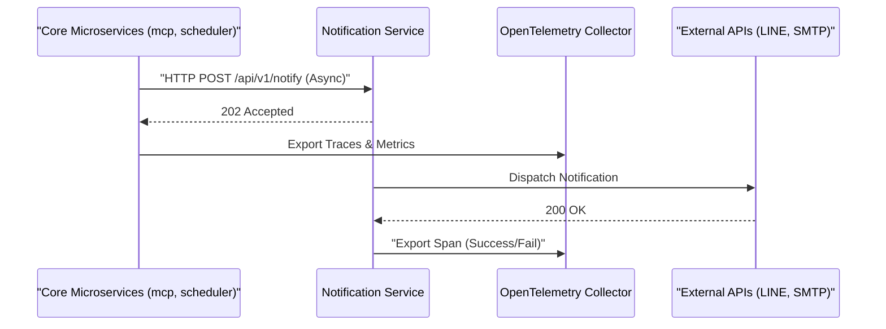

### 版本紀錄 (Version History)
| Date | Version | Description | Author |
| :--- | :--- | :--- | :--- |
| 2026-03-01 | v5.3 | **Reliability Patch**: 強化 ClickHouse 雙端口健康檢查並記錄儲存層技術選型與競爭防護 | Antigravity |
| 2026-02-28 | v5.2 | **Mac Networking Fix**: 使用 `host.docker.internal` 橋接提升 OTel 可靠性 | Antigravity |
| 2026-02-27 | v5.1 | **Observability Boost**: 實作 `@trace_external_call` 自動追蹤與資料庫集群統一 | Antigravity |
| 2026-02-21 | v5.0 | **Initial Release**: Established standards for Monorepo telemetry and asynchronous notification buses. | Neo |

# 系統可觀測性與通知規範 (Observability & Notification Standards)

> **[繁體中文 (Traditional Chinese)](#zh) | [English](#en)**

## 🇹🇼 可觀測性與統一通知匯流排

本規範定義 AI Investment Advisor 中微服務架構的遙測 (Telemetry) 與通知 (Notification) 處理標準。以確保在微服務架構下，系統具備高可觀察性且核心業務進程不會因外部 I/O 而阻塞。

### 1. 遙測資料標準化 (OpenTelemetry Standard)
所有微服務必須透過 **OpenTelemetry (OTel)** 進行遙測打點：
- **結構化日誌 (Structured Logging)**: 必須使用 `python-json-logger` 將日誌輸出為 JSON 格式，標記對應的 `trace_id` 與 `span_id`，確保日誌可供檢索系統（如 SigNoz/ClickHouse）解析。
- **邊界傳透 (Context Propagation)**: 全域 Tracing 必須在 FastAPI、gRPC 以及資料庫 SQLAlchemy 層層傳透，以完整追蹤請求生命週期。
- **使用者感知追蹤 (User-Aware Tracing)**: trace 必須包含 `user_id` 標籤，確保多帳戶架構下的日誌可依使用者維度過濾。相關實作見 `CouncilAgentAdapter`。
- **外部呼叫自動追蹤 (External Call Tracing)**: 針對外部 API 呼叫，必須使用 `src/utils/tracing.py` 中的 `@trace_external_call` 裝飾器，自動捕獲 HTTP Method、URL、Status Code 等 Meta Data 輸出至 SigNoz。
- **資料庫統一 (DB Unification)**: 所有服務必須統一指向單一 PostgreSQL 集群（透過 `docker-compose.yml` 配置），嚴禁混用 SQLite 或分散式叢集以確保服務地圖 (Service Map) 的準確性。

### 2. 資料存儲層：ClickHouse 深度解析 (Storage: ClickHouse Deep Dive)
- **核心角色**: ClickHouse 為本系統可觀測性的核心分析路徑 (Hot Path)。它作為 SigNoz 的存儲後端，專門負責海量遙測數據（Spans, Logs, Metrics）的寫入與即時聚合分析。
- **為何選擇 ClickHouse?**: 
    - **列式存儲優勢**: 遙測數據具有高度重複性與特定過濾維度 (如 `service_name`, `status_code`)，ClickHouse 的列式壓縮率高達 10x 以上，且查詢速度比傳統 RDBMS 或 Elasticsearch 快數倍。
    - **穩定性 lesson learned**: **嚴禁單一端口檢查**。ClickHouse 提供 HTTP (8123) 與 TCP (9000) 雙端口。若健康檢查僅監測 8123，會導致 OTel Collector 在 TCP 端口尚未就緒時嘗試連接，造成初始化崩潰（Race Condition）。
- **技術替代方案評估 (Alternatives)**:
    - **Elasticsearch (ELK Stack)**: 全文檢索極佳，但記憶體消耗巨大且在處理大量 Trace 聚合時效能不如 ClickHouse。
    - **Managed SaaS (Datadog/Sentry)**: 零維運成本，但違反本計畫之「資料隱私」與「成本控制」原則。
    - **Prometheus/Loki (Grafana Stack)**: 生態系強大，但通常需要多個專門後端，不如 SigNoz/ClickHouse 整合性高。

### 3. 自託管監控優先 (Self-Hosted Backend First)

### 3. 統一通知匯流排 (Unified Notification Bus)
- **禁止私自呼叫 API**: 主交易引擎 (Workflow, Sentinel) **嚴禁**自行實作 SMTP 或 LINE API 的呼叫。
- **解耦合與佇列**: 所有的通知（包含報告與警報）必須封裝為標準的 JSON Payload，透過非同步 `HTTP POST` 發送至隔離的 **Standalone Notification Microservice**。該服務將接管通知的排隊 (Queuing)、重試 (Retry) 與去重 (Deduplication) 機制。

### 視覺化架構 (Visual Architecture)

---

## 🇺🇸 Observability & Unified Notification Bus

This standard delineates the telemetry and notification protocols within the AI Investment Advisor's microservice architecture. It guarantees high observability and ensures that external I/O does not block core business processes.

### 1. Telemetry Standardization (OpenTelemetry)
All microservices must emit telemetry via **OpenTelemetry (OTel)**:
- **Structured Logging**: `python-json-logger` must be utilized to output logs in JSON format. Every log must carry its respective `trace_id` and `span_id` for accurate parsing by systems like SigNoz and ClickHouse.
- **Context Propagation**: Global Tracing must propagate across HTTP (FastAPI), gRPC, and database (SQLAlchemy) boundaries to maintain the lifecycle of requests.
- **User-Aware Tracing**: Spans must include a `user_id` attribute to allow filtering logs by user in multi-account deployments. Refer to `CouncilAgentAdapter` for implementation.

### 2. Self-Hosted Backend First
- **Data Privacy**: Telemetry data (Metrics, Traces, Logs) must be uniformly exported to a locally hosted **SigNoz APM** cluster using the `OTEL_EXPORTER_OTLP_ENDPOINT`.
- **macOS Dev Environment**: Use `http://host.docker.internal:4317` and `host-gateway` in `extra_hosts` for reliable container-to-host bridging.
- Exporting sensitive telemetry data (which may contain Prompts or financial portfolios) to uncontrolled third-party SaaS platforms is strictly prohibited.

### 3. Unified Notification Bus
- **No Direct API Calls**: Primary engines (Workflow, Sentinel) are **strictly forbidden** from directly executing SMTP or LINE API calls.
- **Decoupling and Queuing**: All notifications (reports and alerts) must be encapsulated as a standardized JSON Payload and dispatched via asynchronous `HTTP POST` to an isolated **Standalone Notification Microservice**. This service assumes responsibility for message queuing, retry mechanisms, and deduplication.
