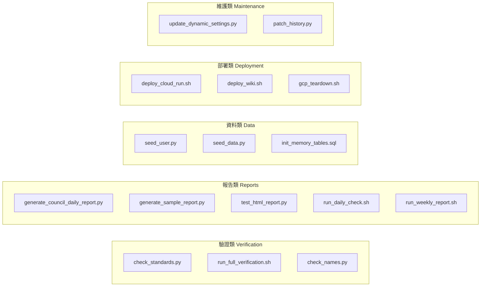

# 腳本操作手冊 (Scripts Operations Guide)

### 版本紀錄 (Version History)
| Date | Version | Description | Author |
| :--- | :--- | :--- | :--- |
| 2026-02-21 | v1.0 | 初版：完整記錄 17 個腳本的用途、參數與使用方式 | Antigravity |

---

<a id="zh"></a>

## 🇹🇼 腳本總覽

本專案在 `scripts/` 目錄下提供多種自動化腳本，涵蓋驗證、部署、資料種子、報告生成與維護等功能。所有 Python 腳本預設從專案根目錄執行，Shell 腳本會自動定位專案根目錄。

### 腳本分類總覽



---

## 🔍 驗證類腳本 (Verification Scripts)

### 1. `check_standards.py` — 統一驗證工具

| 項目 | 說明 |
| :--- | :--- |
| **檔案** | [`scripts/check_standards.py`](check_standards.py) |
| **語言** | Python |
| **用途** | 一次執行所有專案品質檢查 |

**執行方式**：
```bash
python scripts/check_standards.py
```

**執行的檢查項目**：
1. **Unit Tests** — `pytest --cov=src --cov-report=term-missing tests/`
2. **Security Scan** — `python3 -m bandit -r src/ -ll`
3. **Wiki Integrity** — `python3 .agent/skills/wiki-maintainer/scripts/verify_wiki_links.py`

**退出碼**：`0` = 全部通過，`1` = 有檢查失敗

---

### 2. `run_full_verification.sh` — 完整報告驗證

| 項目 | 說明 |
| :--- | :--- |
| **檔案** | [`scripts/run_full_verification.sh`](run_full_verification.sh) |
| **語言** | Bash |
| **用途** | 執行 Daily 與 Weekly 報告的端對端驗證 |

**執行方式**：
```bash
bash scripts/run_full_verification.sh
```

**執行流程**：
1. 設定 `PYTHONPATH` 為當前目錄
2. 執行 Daily 報告：`python3 src/cli.py --mode daily --user_id supermfb@gmail.com --force-report`
3. 執行 Weekly 報告：`python3 src/cli.py --mode weekly --user_id supermfb@gmail.com --force-report`

---

### 3. `check_names.py` — Wiki 檔案命名檢查

| 項目 | 說明 |
| :--- | :--- |
| **檔案** | [`scripts/check_names.py`](check_names.py) |
| **語言** | Python |
| **用途** | 驗證 wiki 檔案與資料夾命名是否符合規範 |

**執行方式**：
```bash
python scripts/check_names.py
```

**檢查規則**：
- 檔案名稱不得以數字開頭
- 檔案名稱不得包含空格
- 檔案名稱必須包含連字號 (`-`) 分隔中英文
- 資料夾名稱必須以 `XX_` 格式開頭（兩位數字加底線）

---

## 📊 報告類腳本 (Report Scripts)

### 4. `generate_council_daily_report.py` — 議會日報模擬

| 項目 | 說明 |
| :--- | :--- |
| **檔案** | [`scripts/generate_council_daily_report.py`](generate_council_daily_report.py) |
| **語言** | Python (async) |
| **用途** | 模擬 Council 議會的每日報告生成流程 |

**執行方式**：
```bash
python scripts/generate_council_daily_report.py
```

**說明**：
- 使用 Mock 代理人（Fundamental、Momentum、Risk、Macro、Sentiment）模擬議會辯論
- 由 CIO 代理人做出最終共識決策
- 輸出議會紀錄至 `council_report_output.txt`
- 不會產生真實 LLM 費用（使用 `unittest.mock`）

---

### 5. `generate_sample_report.py` — 範例報告生成

| 項目 | 說明 |
| :--- | :--- |
| **檔案** | [`scripts/generate_sample_report.py`](generate_sample_report.py) |
| **語言** | Python |
| **用途** | 執行 `DailyWorkflow` 生成範例報告 |

**執行方式**：
```bash
python scripts/generate_sample_report.py
```

**流程**：
1. 檢查使用者 `admin@example.com` 是否有交易資料
2. 若無則自動種子 AAPL 交易
3. 以 `dry_run=True` 執行 `DailyWorkflow`
4. 輸出至 `reports/verification_report.md`

---

### 6. `test_html_report.py` — HTML 報告測試

| 項目 | 說明 |
| :--- | :--- |
| **檔案** | [`scripts/test_html_report.py`](test_html_report.py) |
| **語言** | Python |
| **用途** | 測試 `ReportingService` 的 HTML 報告生成功能 |

**執行方式**：
```bash
python scripts/test_html_report.py
```

**說明**：
- 使用預設的 Markdown 週報模板（含產業大局觀、記憶鏈回顧、議會深度審議等章節）
- 呼叫 `generate_professional_html()` 轉換為專業 HTML 格式
- 輸出至 `sample_report.html`

---

### 7. `run_daily_check.sh` — 每日動量掃描

| 項目 | 說明 |
| :--- | :--- |
| **檔案** | [`scripts/run_daily_check.sh`](run_daily_check.sh) |
| **語言** | Bash |
| **用途** | 執行每日動量掃描工作流程 |

**執行方式**：
```bash
bash scripts/run_daily_check.sh
```

**流程**：
1. 自動定位專案根目錄並設定 `PYTHONPATH`
2. 執行 `python3 src/cli.py --mode daily --user_id test_user --force-report`
3. 失敗時在 macOS 上顯示系統通知

---

### 8. `run_weekly_report.sh` — 週報生成

| 項目 | 說明 |
| :--- | :--- |
| **檔案** | [`scripts/run_weekly_report.sh`](run_weekly_report.sh) |
| **語言** | Bash |
| **用途** | 執行每週投資報告生成 |

**執行方式**：
```bash
bash scripts/run_weekly_report.sh
```

**流程**：
1. 自動定位專案根目錄並設定 `PYTHONPATH`
2. 執行 `python3 src/workflow.py --mode weekly`
3. 成功/失敗時在 macOS 上顯示系統通知

---

## 🗄️ 資料類腳本 (Data Scripts)

### 9. `seed_user.py` — 使用者種子資料

| 項目 | 說明 |
| :--- | :--- |
| **檔案** | [`scripts/seed_user.py`](seed_user.py) |
| **語言** | Python |
| **用途** | 建立測試使用者並種子交易資料 |

**執行方式**：
```bash
python scripts/seed_user.py
```

**種子內容**：
- 使用者：`supermfb@gmail.com`（名稱：Super User）
- 交易：AAPL (10 股 @ $150) + NVDA (5 股 @ $400)
- 冪等操作：若使用者或交易已存在則跳過

---

### 10. `seed_data.py` — 快速資料種子

| 項目 | 說明 |
| :--- | :--- |
| **檔案** | [`scripts/seed_data.py`](seed_data.py) |
| **語言** | Python |
| **用途** | 快速初始化資料庫並新增測試交易 |

**執行方式**：
```bash
python scripts/seed_data.py
```

**流程**：
1. 呼叫 `init_db()` 初始化資料庫結構
2. 透過 `TransactionService` 新增 AAPL 買入交易（10 股 @ $150）
3. 使用者 ID：`test_user`

---

### 11. `init_memory_tables.sql` — 記憶表初始化

| 項目 | 說明 |
| :--- | :--- |
| **檔案** | [`scripts/init_memory_tables.sql`](init_memory_tables.sql) |
| **語言** | SQL |
| **用途** | 建立記憶服務與任務執行追蹤所需的資料表 |

**執行方式**：
```bash
psql -d your_database -f scripts/init_memory_tables.sql
```

**建立的資料表**：
- `report_memory` — 報告歷史記憶（含壓縮摘要、關鍵發現、市場指標）
- `task_execution_log` — 任務執行記錄（含模型分配、Token 用量、成本追蹤）

---

## 🚀 部署類腳本 (Deployment Scripts)

### 12. `deploy_cloud_run.sh` — GCP Cloud Run 部署

| 項目 | 說明 |
| :--- | :--- |
| **檔案** | [`scripts/deploy_cloud_run.sh`](deploy_cloud_run.sh) |
| **語言** | Bash |
| **用途** | 將應用部署至 GCP Cloud Run |

**執行方式**：
```bash
bash scripts/deploy_cloud_run.sh
```

**參數配置**（腳本內部）：
| 參數 | 預設值 |
| :--- | :--- |
| `SERVICE_NAME` | `investment-dashboard` |
| `REGION` | `asia-east1` |

**流程**：
1. 使用 `gcloud run deploy` 從原始碼部署
2. 取得分配的 Service URL
3. 自動設定 `REDIRECT_URI` 環境變數（OAuth 用）
4. 提示將 URL 加入 Google Cloud Console 的授權重導向 URI

---

### 13. `deploy_wiki.sh` — Wiki 部署

| 項目 | 說明 |
| :--- | :--- |
| **檔案** | [`scripts/deploy_wiki.sh`](deploy_wiki.sh) |
| **語言** | Bash |
| **用途** | 將 `wiki/` 目錄同步至 GitHub Wiki 儲存庫 |

**執行方式**：
```bash
bash scripts/deploy_wiki.sh
```

**流程**：
1. Clone GitHub Wiki 儲存庫至暫存目錄
2. 使用 `rsync` 複製 `wiki/` 內容（排除 `.git` 和 `.DS_Store`）
3. Commit 並 Push 變更
4. 清理暫存目錄

---

### 14. `gcp_teardown.sh` — GCP 資源清理

| 項目 | 說明 |
| :--- | :--- |
| **檔案** | [`scripts/gcp_teardown.sh`](gcp_teardown.sh) |
| **語言** | Bash |
| **用途** | 刪除 GCP Cloud Run 服務與排程任務以停止計費 |

**執行方式**：
```bash
bash scripts/gcp_teardown.sh
```

**刪除的資源**：
- Cloud Run Service：`investment-dashboard`
- Cloud Run Jobs：`daily-check`, `weekly-report`, `monthly-refinement`

> ⚠️ **注意**：Cloud SQL 和 Artifact Registry 映像檔**不會**被刪除，需手動處理。

---

## 🔧 維護類腳本 (Maintenance Scripts)

### 15. `update_dynamic_settings.py` — 動態設定更新

| 項目 | 說明 |
| :--- | :--- |
| **檔案** | [`scripts/update_dynamic_settings.py`](update_dynamic_settings.py) |
| **語言** | Python (argparse) |
| **用途** | 更新供應鏈知識圖譜與主題追蹤清單 |

**子命令**：

#### `supply` — 更新供應鏈知識圖譜
```bash
python scripts/update_dynamic_settings.py supply \
  --ticker NVDA \
  --bottlenecks "CoWoS,HBM3e" \
  --suppliers "TSM,MU"
```

| 參數 | 必填 | 說明 |
| :--- | :--- | :--- |
| `--ticker` | ✅ | 要更新的標的（如 NVDA） |
| `--bottlenecks` | ❌ | 逗號分隔的瓶頸項目 |
| `--suppliers` | ❌ | 逗號分隔的供應商 |

#### `energy` — 更新 AI 能源追蹤清單
```bash
python scripts/update_dynamic_settings.py energy --tickers "CEG,VST,MSFT"
```

#### `physical` — 更新 Physical AI 追蹤清單
```bash
python scripts/update_dynamic_settings.py physical --tickers "TSLA,UBER"
```

---

### 16. `patch_history.py` — 版本紀錄補丁

| 項目 | 說明 |
| :--- | :--- |
| **檔案** | [`scripts/patch_history.py`](patch_history.py) |
| **語言** | Python |
| **用途** | 為缺少版本紀錄的 wiki 文件自動補上版本紀錄表格 |

**執行方式**：
```bash
python scripts/patch_history.py
```

**邏輯**：
- 掃描 `wiki/**/*.md`（排除 `_Sidebar.md` 和 `Home.md`）
- 若文件不含 `### 版本紀錄`，則在第一個 `# ` 標題後插入版本紀錄表格

---

### 17. `bridge_state.json` — 橋接狀態檔

| 項目 | 說明 |
| :--- | :--- |
| **檔案** | [`scripts/bridge_state.json`](bridge_state.json) |
| **類型** | JSON 資料檔 |
| **用途** | 儲存跨腳本執行的狀態資訊 |

---

<a id="en"></a>

## 🇺🇸 Scripts Operations Guide (English)

### Quick Reference

| Script | Category | Language | Purpose |
| :--- | :--- | :--- | :--- |
| `check_standards.py` | Verification | Python | Run all project quality checks |
| `run_full_verification.sh` | Verification | Bash | End-to-end report verification |
| `check_names.py` | Verification | Python | Wiki file naming validation |
| `generate_council_daily_report.py` | Report | Python | Simulate Council daily report |
| `generate_sample_report.py` | Report | Python | Generate sample workflow report |
| `test_html_report.py` | Report | Python | Test HTML report generation |
| `run_daily_check.sh` | Report | Bash | Daily momentum scan |
| `run_weekly_report.sh` | Report | Bash | Weekly report generation |
| `seed_user.py` | Data | Python | Seed test user and transactions |
| `seed_data.py` | Data | Python | Quick database initialization |
| `init_memory_tables.sql` | Data | SQL | Create memory and task tables |
| `deploy_cloud_run.sh` | Deployment | Bash | Deploy to GCP Cloud Run |
| `deploy_wiki.sh` | Deployment | Bash | Sync wiki to GitHub Wiki |
| `gcp_teardown.sh` | Deployment | Bash | Delete GCP resources |
| `update_dynamic_settings.py` | Maintenance | Python | Update supply chain and themes |
| `patch_history.py` | Maintenance | Python | Add version history to wiki files |

## 🔗 相關文件 (Related Documents)
- **環境設定**: [[環境設定與本地開發-Environment-Local-Dev]]
- **雲端部署**: [[雲端部署-Deployment-GCP-CloudRun]]
- **配置管理**: [[配置管理架構-Configuration-Management]]
- **快速啟動**: [[快速啟動與操作指南-Quickstart-User-Guide]]
