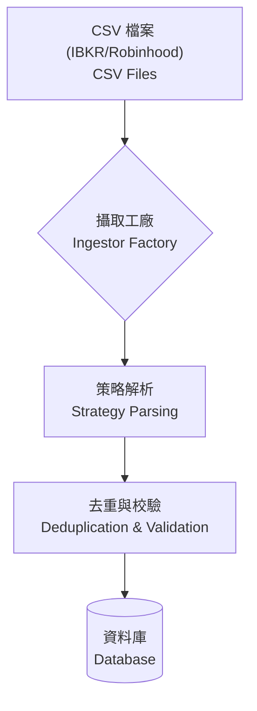

# 快速啟動與操作指南 (Quickstart & User Guide)

> **[繁體中文 (Traditional Chinese)](#zh) | [English](#en)**

<a id="zh"></a>

## 🇹🇼 快速啟動與操作指南

本文件旨在引導您從安裝、啟動到日常操作 AI 投資顧問系統，發揮系統的最大價值。

### 1. 部署方案選擇 (Deployment Options)

| 特性 | 本地輕量版 (Local Docker) | 雲端企業版 (GCP Cloud Run) |
| :--- | :--- | :--- |
| **適用場景** | 個人使用、開發測試、離線分析 | 團隊協作、24/7 自動排程 |
| **資料庫** | SQLite (`.db` 檔案) | Cloud SQL (PostgreSQL) |
| **成本** | **$0** | 低 (依用量計費) |
| **啟動難度** | 極低 (./start.sh) | 中 (需設定 GCP) |

### 2. 本地快速啟動 (Local Quickstart)

#### 🔄 數據攝取流程 (Data Ingestion Workflow)
> [!NOTE]
> 流程圖展示了系統如何處理來自不同券商的交易數據。
> This diagram shows how the system processes trade data from different brokers.



<details>
<summary><b>🛠️ 點擊查看詳細啟動步驟 (Click for Detailed Steps)</b></summary>

#### 前置需求
- [Docker Desktop](https://www.docker.com/products/docker-desktop/)
- [Git](https://git-scm.com/)

#### 啟動指令
```bash
# 1. 下載專案
git clone https://github.com/neohsiung/AI-Investment-Advisor.git
cd AI-Investment-Advisor

# 2. 設定環境變數
cp .env.example .env  # 請在 .env 填入 API Keys

# 3. 一鍵啟動
./start.sh
```
啟動後請訪問：`http://localhost:8501`

</details>

### 3. 日常操作指南 (Operation Guide)

<details>
<summary><b>📊 點擊查看數據管理細節 (Click for Data Management Details)</b></summary>

#### 數據管理
- **匯入交易**: 支援 Robinhood / IBKR CSV 檔。系統會自動去重。
- **股息處理**: 
    - **現金股息**: Action 設為 `DIVIDEND`，Price 設為 `1`。
    - **股票股息**: Action 設為 `BUY`，Price 設為 `0`。
- **融資/槓桿**: 系統自動計算。若 `Cash` 為負值，代表正在使用融資輔助交易。

</details>

#### 顧問聊天室 (Advisor Chat)
- 直接輸入如「AAPL 技術面如何？」或「市場現在安全嗎？」。
- 系統會自動調用 **Momentum (動能)**、**Fundamental (基本面)** 或 **Macro (總經)** 專家進行分析。

### 4. 自動化排程 (Cron Setup)

<details>
<summary><b>⏰ 點擊查看排程建議 (Click for Cron Setup Suggestions)</b></summary>

建議在美股收盤後自動生成報告：
```cron
# 每日動能掃描 (週一至五 06:30)
30 06 * * 1-5 /path/to/scripts/run_daily_check.sh >> /tmp/daily.log 2>&1

# 每週完整報告 (每週六 10:00)
00 10 * * 6 /path/to/scripts/run_weekly_report.sh >> /tmp/weekly.log 2>&1
```

</details>

---

<a id="en"></a>

## 🇺🇸 Quickstart & User Guide

### 1. Deployment Options
Choose between **Local Docker** (Zero cost, Privacy) or **GCP Cloud Run** (Serverless, 24/7 Automation). For local setup, use `./start.sh`.

### 2. Local Quickstart
1.  **Clone**: `git clone ...`
2.  **Env**: `cp .env.example .env` (Add your API Keys).
3.  **Run**: `./start.sh`
4.  **Access**: `http://localhost:8501`

### 3. Operation Guide
- **Data Management**: Import CSV (Robinhood/IBKR) or manual entry.
- **Dividends**: Use `DIVIDEND` for cash or `BUY` at `Price=0` for stock dividends.
- **Advisor Chat**: Ask AI experts (Macro/Momentum/Fundamental) directly for market insights.

### 4. Automation (Cron)
- **Daily Check**: Runs in `Flash` mode to detect alerts.
- **Weekly Report**: Runs in `Deep` mode for full portfolio analysis.

## 🔗 See Also
- [Cloud Deployment Guide](wiki/03_開發者指南-Developer_Guide/雲端部署-Deployment-GCP-CloudRun.md)
- [CLI Reference](wiki/03_開發者指南-Developer_Guide/命令行手冊-CLI-Reference.md)
