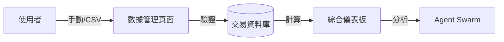

# 快速啟動與操作指南 (Quickstart & User Guide)

> **[繁體中文 (Traditional Chinese)](#zh) | [English](#en)**

---

## 🇹🇼 快速啟動與操作指南 (v3.1)

本文件依據 [文件框架定義](文件框架定義-Document-Frameworks) 編寫，引導一般使用者從零開始掌握 AI 投資顧問的各項功能。

### 1. 核心功能與流程 (Features & Flows)

#### 1.1 資料攝取與管理流程 (Data Flow)
系統支持手動輸入、CSV 匯入與 API 自動同步。

#### 1.2 顧問互動流程 (Advisor Interaction)
- **問題輸入**: 使用者在 [顧問聊天室](核心系統規格-Core-System-Specs) 提問。
- **專家協作**: CIO 調動基礎面、動能面專家生成綜合報告。
- **績效反饋**: [Engineer Agent](未來演進規格-Future-Roadmap-Specs) 追蹤回報品質。

### 2. 操作欄位定義 (Operational Glossary)

| 欄位 | 說明 | 填寫建議 |
| :--- | :--- | :--- |
| **代號 (Ticker)** | 股票或 ETF 代號。 | 必填，例如 `AAPL`, `VOO`。 |
| **動作 (Action)** | 交易類型。 | `BUY`, `SELL`, `DIVIDEND` (現金股息)。 |
| **數量 (Quantity)** | 交易股數。 | 支援 4 位小數。 |
| **槓桿比例** | 針對該筆交易的預期槓桿。 | 系統自動計算槓桿，細節見 [系統全景圖](系統全景圖-System-Landscape)。 |

### 3. 個人成效指標 (Success Metrics for Users)
- **Alpha**: 超額回報（相對於標普 500）。
- **最大回撤 (Max Drawdown)**: 投資組合從峰值回落的最大幅度。目標 < 15%。
- **夏普比率 (Sharpe Ratio)**: 每單位風險的超額回報。目標 > 1.2。

### 4. 疑難排解 (Support & Troubleshooting)

| 問題 | 可能原因 | 解決方案 |
| :--- | :--- | :--- |
| 儀表板顯示損益為 0 | 缺乏初始 `BUY` 紀錄。 | 請手動補齊該標的的歷史買入資訊。 |
| AI 提問無回應 | `TAVILY_API_KEY` 失效。 | 請至 [環境設定](環境設定與本地開發-Environment-Local-Dev) 確認金鑰狀態。 |
| CSV 匯入失敗 | 格式不符或代號錯誤。 | 請下載系統提供的標準模板，並確保代號為美股。 |

---

## 🇺🇸 Quickstart & User Guide

### 1. User Flows
- **Dashboard View**: Real-time NLV, P&L, and Leverage monitoring.
- **Manual Trade**: Single-entry interface for immediate portfolio updates.
- **AI Reports**: Subscription-based daily/weekly PDF notifications via email.

### 2. Glossary
- **Action**: Use `DIVIDEND` for cash payouts; use `BUY` with price `$0` for stock splits.
- **Leverage**: Visual warnings trigger when the portfolio leverage exceeds **1.5x**.

### 3. Troubleshooting
- **Zero Balance**: Ensure initial `DEPOSIT` or `BUY` events are recorded.
- **Agent Errors**: Check internet connectivity or API quotas in [Testing & Services](測試與外部服務整合-Testing-External-Services).

## 🔗 Bidirectional Links
- **Dev Guide**: [Local Dev Setup](環境設定與本地開發-Environment-Local-Dev)
- **PM Specs**: [Core System Specs](核心系統規格-Core-System-Specs)
- **Standards**: [Database & Git Standards](資料庫設計與代碼規範-Database-Git-Standards)
