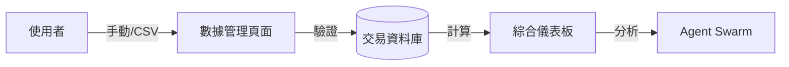

# 快速啟動與操作指南 (Quickstart & User Guide)

> **[繁體中文 (Traditional Chinese)](#zh) | [English](#en)**

---

<a id="zh"></a>

## 🇹🇼 快速啟動與操作指南 (v3.1)

本文件依據 [文件框架定義](文件框架定義-Document-Frameworks) 編寫，引導一般使用者從零開始掌握 AI 投資顧問的各項功能。

### 1. 核心功能與流程 (Features & Flows)

#### 1.1 資料攝取與管理流程 (Data Flow)
系統支持手動輸入、CSV 匯入與 API 自動同步。


#### 1.2 顧問互動流程 (Advisor Interaction)
- **問題輸入**: 使用者在 [AI 投資顧問](前端架構與UX層-Frontend-UX-Layer) 提問。
- **指標分析**: [CIO Agent](服務層開發指南-Service-Layer-Blueprints) 調用專家代理進行多維度審查。
- **績效反饋**: [Engineer Agent](服務層開發指南-Service-Layer-Blueprints) 追蹤回報品質。

### 2. 操作欄位定義 (Operational Glossary)

| 欄位 | 說明 | 填寫建議 |
| :--- | :--- | :--- |
| **代號 (Ticker)** | 股票或 ETF 代號。 | 必填，例如 `AAPL`, `VOO`。 |
| **動作 (Action)** | 交易類型。 | `BUY`, `SELL`, `DIVIDEND` (現金股息)。 |
| **數量 (Quantity)** | 交易股數。 | 支援 4 位小數。 |
| **槓桿比例** | 針對該筆交易的預期槓桿。 | 系統自動計算槓桿，細節見 [系統全景圖](系統全景圖-System-Landscape)。 |

### 📖 使用者操作詳解 (User Operation Details)

### 1. 儀表板觀測 (Dashboard)
- **視覺化指標**: 顯示 NLV、現金比例、總報酬率與目前槓桿比率。
- **風險預警**: 槓桿比率超過 1.5x 顯示黃色警告，超過 2.0x 觸發紅色危險警報，提醒補足保證金。

### 2. 資料管理 (Data Management)
本模組負責系統的確定的性數據來源，支援以下操作：

#### 2.1 手動輸入 (Manual Entry)
- **交易模式**:
    - **依數量 (By Quantity)**: 輸入具體股數與單價。
    - **依槓桿 (By Leverage)**: 輸入「本金」與「槓桿倍數」(e.g., $1000, 3x)，系統自動換算購買力與股數。
- **交易類型**: 支援 `BUY` (買入), `SELL` (賣出), `DIVIDEND` (股息), `DEPOSIT` (入金) 與 `WITHDRAW` (出金)。

#### 2.2 批次匯入 (CSV Import)
- **支援格式**: Robinhood, IBKR, Simple。
- **操作**: 選擇格式、上傳檔案並點擊「開始匯入」。系統執行原子化寫入，確保數據一致性。

### 3. AI 投資顧問 (Advisor Chat)
- **意圖偵測**: 輸入包含股票代碼 (如: AAPL) 的問題，系統自動調用 **Stock Analyst Agent** 進行基本面分析。
- **宏觀諮詢**: 一般性問題將調用 **CIO Agent**，綜合總經環境給予建議。
- **注意**: 此對話為即時諮詢，不影響正式報告數據。

### 4. 深度研究週報 (Deep Research Weekly Report) - v3.3
- **結構化數據**: 透過 Markdown Table 呈現「蜂群洞察」(Swarm Insights) 與「市場焦點數據」(Market Focus Data)。
- **精準引用**: 所有事實陳述皆附帶 `[來源名稱](URL)` 引用，確保資訊可信度。
- **IC 決策**: 包含 Thesis (戰略主軸), Anti-Thesis (反論) 與 Synthesis (關鍵仲裁) 的完整論述。

#### 4.1 手動觸發進階報告 (Advanced Report Trigger)
若需立即生成包含 **Task Planner** 與 **Memory** 整合的完整週報（非 Scheduler 排程），請執行專用生產腳本：
```bash
python run_production_report.py
```
> **注意**: 此腳本會強制啟用 Advanced Tier 模型進行深度推論，並將結果存入 Redis Memory。

### 5. 系統設定 (System Settings)
這是系統的核心控制面板：

- **AI 配置**: 設定 Provider (Gemini, OpenRouter, OpenAI) 與 **Model Tiering**。
    - **Smart Tier**: 用於複雜邏輯推論。
    - **Fast Tier**: 用於快速訊息過濾。
- **排程管理**: 設定 Daily Check 與 Weekly Report 的執行時間（基於自定義時區）。
- **HR 協議**: 監視 Agent 活躍度。若 Agent 超過 7 天無活動，狀態將轉為 **Zombie**，需檢查 API 配置。

### 6. 整合通知設定 (Omni-Channel Setup) - v3.4
本版本新增 LINE Bot 即時推播功能：

#### 6.1 LINE Bot 設定
1.  **取得 Channel Token:**
    *   登入 [LINE Developers Console](https://developers.line.biz/)。
    *   建立新 Channel (Create a new channel)，**務必選擇 'Messaging API' 類型** (不要選擇 LINE Login)。
    *   > **注意**: 若您在 Channel 中看到 `App types: Web app` 且沒有 `Messaging API` 分頁，代表您誤建了 LINE Login Channel。請回到 Provider 頁面重新建立 **Messaging API** Channel。
2.  **設定 Access Token**:
    *   進入 Channel，切換至 **Messaging API** 分頁。
    *   捲動至下方找到 **Channel access token**，點擊 **Issue** 按鈕生成長效 Token。
3.  **設定 Channel Secret**:
    *   切換至 **Basic settings** 分頁，捲動至下方找到 **Channel secret**。
    *   切換至 **Basic settings** 分頁，捲動至下方找到 **Channel secret**。

#### 6.2 本地開發 Webhook 設定 (Local Ngrok Setup)
如果您在本地開發環境測試 LINE Bot，必須使用 `ngrok` 將本地伺服器暴露到公網，才能讓 LINE Platform 傳送 Webhook 驗證。

**方式一：使用 Docker 微服務 (推薦)**
1.  在 `.env` 新增 Authtoken:
    ```env
    NGROK_AUTHTOKEN=你的Token
    ```
2.  啟動服務:
    ```bash
    docker-compose up -d ngrok
    ```
3.  取得 Webhook URL:
    *   瀏覽器開啟 `http://localhost:4040` (ngrok Dashboard)。
    *   複製 **Public URL** (https)。

**方式二：手動執行 ngrok**
1.  安裝並設定 Authtoken。
2.  執行命令: `ngrok http 8000` (指向 MCP Server)。
3.  複製 HTTPS URL。

**設定 Webhook URL**:
*   回到 LINE Developers Console > Messaging API > Webhook settings。
*   貼上 URL 並加上 `/callback`路徑 (例如 `https://a1b2c3d4.ngrok.io/callback`)。
*   開啟 **Use webhook** 開關。
*   點擊 **Verify** 測試連線 (若顯示 Success 即代表連線成功)。

#### 6.3 取得您的 User ID 與加入好友 (Friend & User ID)
**注意**：`LINE_USER_ID` 是指**您的個人 ID** (機器人需要知道發訊息給誰)，而不是機器人的 ID。

1.  **將機器人加入好友**:
    *   在 LINE Developers Console 的 **Messaging API** 分頁，掃描 QR Code。
    *   或者在 **Basic settings** 分頁複製 **Basic ID** (以 `@` 開頭)，在 LINE App 中搜尋ID加入。
2.  **取得您的 User ID**:
    *   **方法一 (推薦 - 開發者本人)**：在 **Basic settings** 分頁的最下方，找到 **Your user ID** (格式如 `U8923...`)。此 ID 僅開發者可見。
    *   **方法二 (通用 - 非開發者)**：
        1. 確保上述 (6.2) Webhook 已設定並成功 Verify。
        2. 在 LINE 對機器人發送隨意一則訊息 (例如 "Hi")。
        3. 查看終端機 Log:
           ```bash
           docker compose logs mcp_server | grep "Received message"
           ```
        4. 您會看到類似 `[LINE] Received message from Uxxxxxxxx...` 的紀錄，該 `U...` 字串即為您的 User ID。
3.  **填入設定檔**:
    將取得的 `U...` ID 填入 `.env`:
    ```env
    LINE_USER_ID=Uxxxxxxxxxxxxxxxxxxxxxxxxxxxxxxxx
    ```

#### 6.4 哨兵監控 (Sentinel Monitor)
系統內建「自適應哨兵 (Adaptive Sentinel)」，自動監控市場異常。
- **觸發機制**: 不再依賴固定數值。系統依據過去 30 天的波動率 (MA + Sigma) 判斷「當前是否異常」。
- **通知形式**: LINE Flex Message (圖文卡片)。
- **操作**: 點擊卡片上的 **[前往 eToro 下單]** 按鈕，即可快速進行避險操作。

---

## ❓ 常見問題與故障排除 (FAQ & Troubleshooting)

**Q: 為什麼槓桿比率顯示不正確？**
A: 請確保「資料管理」中的現金出入金（Deposit/Withdraw）已正確記錄，且已獲取最新股價。

**Q: 收到 `API Key Error`？**
A: 請至「系統設定 -> AI 配置」檢查 API Key 是否有效。

**Q: 報告沒有按時發送？**
A: 檢查「系統設定 -> 排程管理」中的時區設定是否與您的本地預期一致。

### 6. 個人成效指標 (Success Metrics for Users)
- **Alpha**: 超額回報（相對於標普 500）。
- **最大回撤 (Max Drawdown)**: 投資組合從峰值回落的最大幅度。目標 < 15%。
- **夏普比率 (Sharpe Ratio)**: 每單位風險的超額回報。目標 > 1.2。

### 7. 疑難排解 (Support & Troubleshooting)

| 問題 | 可能原因 | 解決方案 |
| :--- | :--- | :--- |
| 儀表板顯示損益為 0 | 缺乏初始 `BUY` 紀錄。 | 請手動補齊該標的的歷史買入資訊。 |
| AI 提問無回應 | `TAVILY_API_KEY` 失效。 | 請至 [環境設定](環境設定與本地開發-Environment-Local-Dev) 確認金鑰狀態。 |
| CSV 匯入失敗 | 格式不符或代號錯誤。 | 請下載系統提供的標準模板，並確保代號為美股。 |

---

<a id="en"></a>

## 🇺🇸 Quickstart & User Guide

### 1. User Flows
- **Dashboard View**: Real-time NLV, P&L, and Leverage monitoring.
- **Manual Trade**: Single-entry interface for immediate portfolio updates.
- **AI Reports**: Subscription-based daily/weekly PDF notifications via email.

### 2. Glossary
- **Action**: Use `DIVIDEND` for cash payouts; use `BUY` with price `$0` for stock splits.
- **Leverage**: Visual warnings trigger when the portfolio leverage exceeds **1.5x**.

## 🇺🇸 User Operation Details (English)

### 1. Dashboard
- **Risk Alerts**: Leverage ratio > 1.5x triggers a Yellow Warning; > 2.0x triggers a Red Margin Call alert.

### 2. Data Management
- **Manual Entry**: Choose "By Quantity" or "By Leverage" (auto-calculates buying power).
- **Import**: Supports Robinhood, IBKR, and Simple CSV formats with atomic verification.

### 3. Advisor Chat
- **Ticker Detection**: Mentioning a symbol (e.g., "TSLA") triggers a deep fundamental dive by specialized agents.

### 4. System Settings
- **Model Tiering**: Configure separate models for "Smart Tasks" vs "Fast Scans" for cost efficiency.
- **HR Protocol**: Monitors agent "heartbeats". Active agents are green; "Zombie" agents require maintenance.

### 5. Notification Setup (LINE Bot)
v3.4 introduces real-time alerts via LINE:

#### 5.1 LINE Configuration
1.  Create a Messaging API Channel on [LINE Developers Console](https://developers.line.biz/).
2.  Get `Channel access token` and `Channel secret`.
3.  Add to `.env`:
    ```env
    LINE_CHANNEL_ACCESS_TOKEN=your_token
    LINE_CHANNEL_SECRET=your_secret
    ```

#### 5.2 Sentinel Alerts
- **Adaptive Logic**: Alerts are triggered based on dynamic market regimes (30-day MA + Sigma), not static numbers.
- **Action**: Click **[Trade on eToro]** in the LINE notification to execute hedging strategies immediately.

### 3. Troubleshooting
- **Zero Balance**: Ensure initial `DEPOSIT` or `BUY` events are recorded.
- **Agent Errors**: Check internet connectivity or API quotas in [Testing & Services](測試與外部服務整合-Testing-External-Services).

## 🔗 Bidirectional Links
- **Dev Guide**: [Local Dev Setup](環境設定與本地開發-Environment-Local-Dev)
- **PM Specs**: [Core System Specs](核心系統規格-Core-System-Specs)
- **Standards**: [Database & Git Standards](資料庫設計與代碼規範-Database-Git-Standards)
