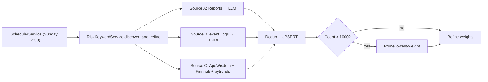
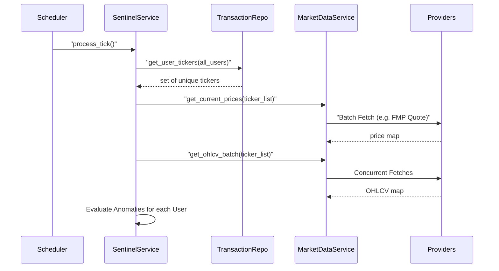
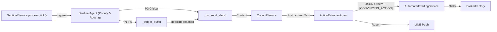

# 哨兵與評議會架構 (Sentinel & Council Architecture)

> [!NOTE]
> **[繁體中文 (Traditional Chinese)](#zh) | [English](#en)**  
> **最新版本 (Latest Version)**: 請參閱版本資訊 (Version History).

### 版本資訊 (Version History)

| v3.8 | 2026-02-15 | 初始 | Event-Driven (Webhooks) + Adaptive Compute. |

---

<a id="zh"></a>

## 🇹🇼 哨兵與評議會架構 (Architecture Overview — v3.8)

本架構融入 **丹尼爾·康納曼 (Daniel Kahneman)** 的《快思慢想》哲學，將系統劃分為兩個認知層次：

### 1. 系統層級 (Cognitive Layers)

#### System 1: 快思 (The Sentinel)

- **角色**: 直覺、反射、模式識別。
- **實作**: `SentinelService` + `Adaptive Thresholds`。
- **特徵**: **Always-on**，成本極低，反應極快。它不進行深度推理，只負責「發現異常」(Pattern Matching) 並喚醒 System 2。

#### System 2: 慢想 (The Council)

- **角色**: 邏輯、運算、辯論、記憶檢索。
- **實作**: `CouncilService` + `Agent Swarm`。
- **算力分層 (Tiered Compute)**:
    - **Advanced (戰略)**: 用於複雜復盤與中長期戰略修正。
    - **Smart (智囊)**: 用於標準議會辯論與細節分析。
    - **Fast (前鋒)**: 用於快速巡檢與基礎工具呼叫。
- **碎形辯論 (Fractal Debate)**: 在生成「日報」或「週報」時，並非只進行一次辯論。而是針對報告中的 **每一個子項目 (每檔股票)**，都必須經過完整的 `Memory -> Debate -> Synthesis` 循環，確保每一個決策點都是深思熟慮的結果。

### 2. 組件設計 (Component Design)

#### 2.1 哨兵服務 — 四維觸發 (Sentinel Service — 4D Multi-Trigger)

位於 `src/services/sentinel_service.py`。

- **職責**: 環境感知器與直覺反應。負責監控市場數據流，當任一維度異常時喚醒 System 2。
- **介面**: `async def process_tick(self)`
- **觸發維度 (Trigger Dimensions)**:

| 維度 | 方法 | 資料源 | 門檻 |
| :--- | :--- | :--- | :--- |
| 📊 VIX 體制 | `_check_vix_anomaly()` | MarketDataService | Adaptive Z-Score / 靜態 VIX > 25 |
| 📉 持倉異動 | `_check_position_moves()` | TransactionService | 日內跌 > 5% 或漲 > 8% |
| 📰 突發新聞 | `_check_breaking_news()` | Tavily (SearchService) | **加權分數 ≥ 0.6** (DB Keywords) |
| 🏦 宏觀異動 | `_check_macro_shifts()` | FRED (FredService) | 利率上升趨勢 / 殖利率曲線倒掛 |
| 💡 知識提煉 | `_poll_single_source("readwise")` | ReadwiseHighlights | `requires_action=True` |
| ⚡ 外部事件 | `process_event()` | Webhooks (MktRecap/TV) | **即時觸發** |

*   **2.1.0 事件驅動演進 (Event-Driven Evolution — v3.8)**:
    除了定時輪詢外，系統現在支援 **Inbound Webhooks**。
    - **入口**: `src/mcp_service/__init__.py` 的 `/webhook/{source}` 端點。
    - **適配器 (Inbound Adapters)**:
        - **MktRecap**: 處理價格/成交量突發警報。
        - **TradingView**: 處理技術指標訊號 (BUY/SELL)。
        - **RSS Bridge**: 處理來自 IFTTT 或 RSS.app 的財經新聞。
    - **機制**: Webhook 接收後 normalized 為 `SentinelEvent` 並透過 `asyncio.create_task` 進行非同步處理，確保高吞吐。

*   **每維度錯誤隔離 (Per-Dimension Error Isolation)**: 任一維度失敗不影響其他維度。
    2.  **GCP (Cloud Run)**: 透過 `Cloud Scheduler` 每分鐘發送 HTTP Request 觸發 API Endpoint。
    3.  **智能冷卻 (Smart Cool-down)**: 
        - 每次觸發前查詢 `event_logs` 資料表。
        - 若 24 小時內存在完全相同 (Title + Content Hash) 的警報，則自動抑制，避免疲勞轟炸。

#### 2.1.1 突發新聞加權與風險關鍵字機制 (Dimension 3)

突發新聞維度使用 DB 驅動的加權關鍵字評分機制，取代硬編碼清單：

*   **架構**: `RiskKeyword` 領域實體 → `risk_keywords` 資料表 → `RiskKeywordRepository` CRUD → `RiskKeywordService` (DI 注入至 SentinelService)。
*   **評分算法**: 每篇搜尋結果匹配所有 active 關鍵字 → 加總 `weight` → 若 `total_score ≥ 0.6` 則觸發警報。
*   **命中追蹤**: 觸發時自動 `record_hit()` → 累積 `hit_count` + `last_hit_date`，供復盤分析用。
*   **復盤機制**: Settings UI 提供 Top 10 命中排行 + 90 天未觸發候選清除名單，支援批次停用。
*   **預設種子**: 160+ 預設關鍵字，涵蓋 8 大風險類別：

| 類別 | 範例 | 預設權重 |
| :--- | :--- | :--- |
| ⚖️ 法律 (Legal) | lawsuit, sec investigation, fraud | 0.85 – 0.9 |
| 💰 財務 (Financial) | bankruptcy, credit downgrade, default | 0.75 – 0.9 |
| 🏭 營運 (Operational) | recall, data breach, ceo resignation | 0.6 – 0.75 |
| 🌍 地緣政治 (Geopolitical) | sanctions, tariff, trade war, 伊朗 | 0.65 – 0.75 |
| 📉 市場 (Market) | crash, margin call, delisted | 0.6 – 0.9 |
| 🏦 總經 (Macro) | 降息, rate cut, cpi, unemployment | 0.5 – 0.75 |
| 💬 情緒 (Sentiment) | panic, fomo, capitulation, 恐慌 | 0.5 – 0.7 |
| 🔧 板塊 (Sector) | ai chip, ev, semiconductor, 半導體 | 0.5 – 0.65 |

##### 2.1.1a 動態關鍵字探索 (Dynamic Keyword Discovery — v5.2.0)

系統支援從 3 個來源自動探索新關鍵字，每週日自動執行：



| Source | 方法 | 成本 |
| :--- | :--- | :--- |
| **Reports** | 過去 7 天報告 → `gpt-4o-mini` batch | ~$0.005/week |
| **Webhook** | `event_logs` → local TF-IDF (n-gram) | $0 |
| **Community** | ApeWisdom (Reddit) + Finnhub + pytrends | $0 |

*   **上限**: 最多 1000 個動態關鍵字，超過則自動砍最低權重非種子關鍵字。
*   **動態閾值**: 預設目標 200，可透過 `SettingsService` (`keyword_target_count`, `keyword_max_count`) 調整。
*   **來源追蹤**: `source` 欄位記錄關鍵字來源 (`seed` / `report` / `webhook` / `trends`)。

#### 2.1.2 全域優先級評估 (Universal Prioritization — v5.4.0)
為了確保系統決策的統一性，所有觸發事件（無論來源是否為外部 Webhook）皆不再提供「硬編碼即時 Bypass」，而是強制進入 **Sentinel Agent** 的優先級判定與議會整理流程：

1.  **全來源覆蓋**: 系統內建維度 (VIX, News, Position) 與外部 Webhook (TradingView, MktRecap) 採一視同仁處理，徹底消除特定來源的特權路徑。
2.  **判定與路由**: `SentinelAgent` 分析事件內容，判定優先級 (P0..P5) 並指定最適合的評議會專家 (Target Agent)。它具備調用「最相關專家 Agent」（如 MacroAgent 或 RiskAgent）進行初步優先級權核的能力。
3.  **動態緩衝**: 
    - **P0 / Systemic Critical**: AI 判定為系統性崩潰或核彈級警報，立即 Bypass 緩衝區發送。
    - **P1 - P5**: 根據 AI 評定套用 15 分鐘至 24 小時的緩衝（見 v5.3.0 級距表）。
4.  **專家驗證**: 對於 P1/P2 事件，`SentinelAgent` 會主動諮詢相關專門 Agent 進行權限加持與二度確認，確保警報具備足夠的專業深度。

#### 2.1.3 結構化行動指令 (Actionable Council Results)
The final decision of the Council is no longer just a plain text summary; it must be extracted through the **ActionExtractorAgent** into a structured `[CONVINCING_ACTION]` JSON block. This ensures unstructured discussion results are precisely converted into instructions readable by the trading system. / 評議會 (Council) 的最終決策不再僅是純文字摘要，而是必須透過 **ActionExtractorAgent** 提取出 `[CONVINCING_ACTION]` 結構化 JSON 區塊。這確保了非結構化的討論結果能精準轉化為交易系統可讀的指令。

- **核心組件 (Core Component)**: `ActionExtractorAgent` (Located in `src/agents/action_extractor.py`). / `ActionExtractorAgent` (位於 `src/agents/action_extractor.py`)。
- **流程 (Workflow)**:
    1. **Text Parsing**: Reads the Council consensus text. / 讀取評議會共識文字。
    2. **Entity Extraction**: Identifies Ticker, Action (BUY/SELL/HOLD), Quantity, Confidence. / 識別 Ticker, Action (BUY/SELL/HOLD), Quantity, Confidence。
    3. **Schema Validation**: Ensures output matches the `AutomatedTradingService` JSON specification. / 確保輸出符合 `AutomatedTradingService` 的 JSON 規格。
- **信心標準 (Confidence Standard)**:
    - **Score 9-10**: Extremely high confidence. Based on the "Confidence Performance Standard," the system can automatically execute operations (requires Auto-Pilot enabled in Settings). / 信心極高。依據「信心把握度標準」，系統可自動執行操作（需 Settings 開啟 Auto-Pilot）。
    - **Score 3-8**: Valuable. Sent to the client for one-click approval. / 具備價值。發送至用戶端等待一鍵核准執行。
    - **Score 1-2**: Observational suggestions. Recorded only, doesn't trigger trade alerts. / 觀察性建議。僅記錄不觸發交易提示。
- **涵蓋範圍 (Operation Scope)**:
    - **持倉操作 (Positions)**: BUY, SELL, TRIM, or STOP-LOSS for specific Tickers. / 特定標的 (Ticker) 的買入、賣出、減碼或停損。
    - **現金管理 (Portfolio/Cash)**: Increasing or decreasing overall cash levels (CASH), global hedging (SQQQ/VIX), or emergency liquidation. / 全局現金水位 (CASH) 的增加或減少（如升息預期導致的減碼）、全域對沖 (SQQQ/VIX) 或 緊急清償 (Liquidate)。

#### 2.1.4 終極防禦協議 (Auto-Hedging & Emergency Liquidation — v4.0)
結合 Webhook 與 `AutomatedTradingService`，實現無人值守的主動防禦。當市場崩潰時，哨兵不需等待評議會緩慢辯論。其觸發的執行評分 (Confidence Score) 現在已從硬編碼改為動態讀取使用者設定 (`emergency_liquidation_score` 與 `auto_hedge_score`)。

```mermaid
flowchart TD
    Start[Event:"High VIX or Panic News] --> Cond1{is_extreme == True?}"
    Cond1 -- Yes --> Cond2{Decision contains<br/>'liquidate', 'hedge', 'panic'?}
    Cond1 --"No --> Normal[Wake Council for Debate]"
    
    Cond2 --"Yes --> Trigger[Fire _trigger_emergency_protocol]"
    Cond2 -- No --> Normal
    
    Trigger -->"Fetch[Fetch Active Tickers]"
    Fetch -->"Loop[For each Ticker]"
    
    Loop -->"Sell["""AutomatedTradingService<br/>Evaluate SELL (Confidence = emergency_score")"]
    Loop -->"Hedge["""Suggest BUY SQQQ (Confidence = hedge_score")"]
    
    ATS["AutomatedTradingService"]
    Sell --> ATS
    Hedge --> ATS
    ATS -->|"Emergency Liquidation / Hedge"| Broker["BrokerFactory"]
    ATS -->"Notify[Omni-Channel Alert: Emergency Liquidation]"
```

##### 2.1.4 擴展性與負載監控 (Scalability & Load Monitoring — v4.3.0)
隨著監控持倉數量的增加，系統採用了 **Ticker 聚合 (Aggregation)** 與 **批量數據擷取 (Batch Fetching)** 策略，顯著提升了在高頻與大規模監控下的性能表現。

##### 監控流程迭代設計 (Iterative Monitoring Flow)
目前的設計將「用戶維度」與「數據維度」分離：
1.  **聚合層 (Aggregation Layer)**: 哨兵掃描所有訂閱用戶，提取所有 active tickers 並轉化為唯一集合 (Set)。
2.  **批量層 (Batch Layer)**: 透過 `MarketDataService` 單次呼叫提供者 API (支援聚合 Quote 與 OHLCV 批量介面)。
3.  **分發層 (Fan-out Layer)**: 抓回數據後，再分發回各個用戶的監控邏輯進行 Threshold 比對。



*   **負載可見性 (Load Visibility)**: `SentinelService` 現在會記錄「監控代碼總數」與「批量擷取延遲」，這些指標已整合至 SigNoz 觀測面板，供 SRE 團隊監控 API 限制風險。

#### 2.2 評議會核心 (The Council Core)
位於 `src/services/council_service.py`。
*   **成員 (Council Members)**: 
    *   **FundamentalAgent**: 關注財報、護城河、估值。
    *   **MomentumAgent**: 關注趨勢、均線、動能。
    *   **RiskAgent**: 關注波動率 (VIX)、下檔風險、資產配置。
    *   **MacroAgent**: 關注利率、通膨、經濟數據 (FRED)。
    *   **SentimentAgent**: 關注市場情緒、新聞氣氛。
*   **運作協議 (The Protocol)**:
    1.  **Convener**: 哨兵發起議題 (e.g., "Earnings Miss detected for NVDA").
    2.  **Memory Recall**: 檢索 LTM 與 STM，進行「經驗復盤」。
    3.  **Fractal Debate**: 針對議題的每個子項目進行正反辯論。
    4.  **Consensus**: Chairperson (CIO) 綜合權衡，產出最終決策。

#### 2.2.1 全投資組合評議會模式 (Map-Reduce Council Pattern)
為了解決 LLM Context 限制並提升 20+ 檔持股的分析深度，系統採用 Map-Reduce 架構：
- **Map (分發)**: 將投資組合拆分為多個 Chunks (例如每塊 5 檔)，併發啟動 `Sub-Council`。
- **Reduce (聚合)**: 收集所有子評議會的 `SIGNAL | RATIONALE`，濃縮為結構化摘要。
- **Synthesis (主席決策)**: CIO Agent 讀取摘要與宏觀背景，生成最終報告。

#### 2.3 自適應算力切換 (Adaptive Compute Toggle — v3.8)
位於 `src/infrastructure/llm_router.py`。
*   **機制**: `SentinelService` 將 `market_volatility` (VIX) 傳遞給 `CouncilService`。
*   **分層路由**:
    - **Advanced**: 顯式標記為 "Deep Research" 或 "Strategy" 的任務。
    - **Smart**: 高波動情境 (VIX > 25) 或深度辯論。
    - **Fast**: 平穩期與例行巡檢。

#### 2.4 動態參數優化 (Dynamic Heuristics)
*   **儲存**: `sentinel_thresholds` 資料表。
*   **權限**: Agents (如 `RiskAgent`) 可根據 ROI 復盤提案修改門檻。

#### 2.4 強化記憶層 (Unified PGVector)
位於 `src/repositories/vector_repository.py`。
*   **完整架構**: 採用標準化 PostgreSQL `pgvector` 擴充套件。
*   **Schema**: `memory_embeddings` (General), `council_minutes` (STM), `strategy_reports` (LTM).

#### 2.5 全通路適配器 (Omni-Channel Adapters)
位於 `src/infra/channels/`。
*   **介面定義**: `IChannelAdapter` (Domain Layer).
*   **LINE Bot實作**: 使用 Flex Message 實現 "Visual Issue Ticket"。

### 3. 資料流 (Data Flow)



1.  **多維偵測**: `SentinelService.process_tick()` 並行執行 5 維度檢測。
2.  **加權新聞評分**: 突發新聞維度載入 DB 中 active 關鍵字，計算加權分數。
3.  **命中追蹤**: 觸發時自動記錄 `hit_count`，供後續復盤與清除。
4.  **聚合觸發**: 任一維度觸發 → 聚合警報訊息 → 喚醒 Council (System 2)。
5.  **主動推播**: 透過 `NotificationService` 發送至所有啟用頻道 (LINE, Slack, Telegram, etc.)。
6.  **閉環執行**: 系統呼叫 `TransactionService` 下單，並寫入 `memory`。

### 4. 記憶體架構與認知循環 (Memory Architecture & Cognitive Cycle)

本系統採用 **Short-Term (STM)** 與 **Long-Term (LTM)** 雙層記憶架構，模擬人類「睡眠鞏固」機制。

#### 4.1 記憶分層
1.  **Short-Term Memory (STM)**:
    *   **載體**: `Daily Council Minutes` (每日評議會紀錄)。
    *   **特性**: 高頻、詳細、包含情緒與當下市場雜訊。
    *   **用途**: 供 `Sentinel` (System 1) 進行快速比對 (Pattern Matching)。
2.  **Long-Term Memory (LTM)**:
    *   **載體**: `Weekly Strategy Reports` (週報戰略)。
    *   **特性**: 低頻、抽象、去雜訊 (Denoised)、結構化。
    *   **用途**: 供 `Council` (System 2) 進行長期趨勢判斷與修正體制 (Regime Shift)。

#### 4.2 記憶鞏固流程 (Consolidation Process)
1.  **Daily (Fast Thinking)**:
    *   每日產出 `Daily Report`，作為 STM 存入 Vector DB。
    *   決策重點: Tactial Alpha (戰術優勢)。
2.  **Weekly (Slow Thinking)**:
    *   每週末觸發 `Consolidation Job`。
    *   **Recall**: 檢索過去 5 日的 STM。
    *   **Refinement**: 執行 `CIO Agent` 的 **Memory Chain Review** 任務，剔除雜訊 (Noise)，提取訊號 (Signal)。
    *   **Save**: 將「精煉後的戰略」存回 LTM，作為下週的指導原則 (Base Prompt Context)。

### 5. 可行性與風險分析 (Feasibility & Risk)

#### 5.1 費用預估 (Cost Estimation)
以 GCP 為基準：
*   **Serverless Tick 模式**: 
    *   **Cloud Run**: 0 實例待命 (Scale to Zero)。每日 1440 次 invocations (每分鐘 1 次)。
    *   **Cloud Scheduler**: $0.10 / month (每 job)。
    *   **Cost**: 計算運算時間極短，預估 **< $2 USD / Month**。
    *   **Docker Local**: 透過 `scheduler` 容器執行，無額外費用。

#### 5.2 技術風險 (Risks)
1.  **冷啟動延遲 (Cold Start)**: Cloud Run 喚醒可能需 3-5 秒。
    *   *Mitigation*: 哨兵監控非高頻交易 (HFT)，秒級延遲可接受。
2.  **LINE Webhook**: 需要 HTTPS 公網 IP 且必須驗證簽章。
    *   *Local Dev*: 必須使用 `ngrok` (或其他 Tunnel)，URL 需填入 LINE Developer Console。
    *   *Prod*: Cloud Run 原生支援 HTTPS，直接設定即可。

---

<a id="en"></a>

## 🇺🇸 Sentinel & Council Architecture (v3.8)

### 1. Architecture Overview (System 1 & 2)

Inspired by Daniel Kahneman's *Thinking, Fast and Slow*, the system is divided into two cognitive layers:

#### System 1: The Sentinel (Fast)
- **Role**: Intuition, Reflex, Pattern Matching.
- **Implementation**: `SentinelService` with **4 trigger dimensions**.
- **Characteristics**: Always-on, low cost. Matches patterns and wakes up System 2.

#### System 2: The Council (Slow)
- **Role**: Logic, Reasoning, Debate.
- **Implementation**: `CouncilService` + `Agent Swarm`.
- **Characteristics**: On-Demand, high cost. Performs fractal debates on issues raised by Sentinel.

### 2. Sentinel Multi-Trigger Evolution
- **Multi-Tier Buffering (v5.3.0)**: Replaced single window with P1-P5 tiers (15m to 24h).
- **Immediate Path**: Webhooks and Critical alerts bypass all buffers.

| Dimension | Method | Source | Threshold |
| :--- | :--- | :--- | :--- |
| VIX Regime | `_check_vix_anomaly()` | MarketDataService | Adaptive Z-Score / VIX > 25 |
| Position Moves | `_check_position_moves()` | TransactionService | Drop > 5% or Spike > 8% |
| Breaking News | `_check_breaking_news()` | Tavily (SearchService) | **Weighted score ≥ 0.6** (DB keywords) |
| Macro Shifts | `_check_macro_shifts()` | FRED | Fed rate up / Yield curve inversion |
| Readwise Insights | `_poll_single_source("readwise")` | ReadwiseHighlights | `requires_action=True` |

#### 2.1 Weighted Risk Keyword System
- **Storage**: `risk_keywords` table with `keyword`, `weight` (0-1), `category`, `hit_count`, `is_active`, `source`.
- **Scoring**: Sum of matched keyword weights per search result. Triggers if `total_score ≥ 0.6`.
- **Hit Tracking**: `record_hit()` on trigger → analytics (Top 10 / Stale 90-day) in Settings UI.
- **Seed**: 160+ default keywords across 8 categories (Legal, Financial, Operational, Geopolitical, Market, Macro, Sentiment, Sector).
- **Dynamic Discovery (v5.2.0)**: 3-source auto-expansion (Reports/LLM, Webhook/TF-IDF, ApeWisdom+Finnhub+pytrends). Max cap: 1000. Weekly auto-pruning.
- **Management**: Settings tab (10th) → add/edit weight/toggle/delete + review analytics.

### 3. Data Flow
Sentinel runs 4 dimension checks in parallel → deduplicates (24h) → aggregates triggers → wakes Council → Omni-Channel push → User approves → Transaction executed.

### 4. Memory Architecture
*   **STM (Daily)**: High-frequency, noisy. Used for pattern matching.
*   **LTM (Weekly)**: Consolidated, denoised. Used for regime shift detection.
*   **Consolidation**: A weekly job refines STM into LTM strategies.

### 5. Cost & Risk
*   **Cost**: < $2/month on GCP using Serverless scaling.
*   **Risks**: Cold starts (3-5s) are acceptable for non-HFT use cases.
