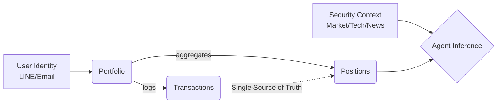
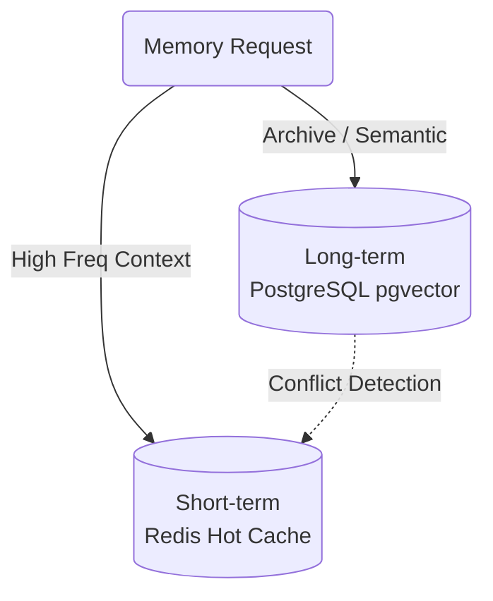

# 數據與記憶核心架構 (Data & Memory Core Specs)

> **[繁體中文 (Traditional Chinese)](#zh) | [English](#en)**

### 版本紀錄 (Version History)
| Date | Version | Description | Author |
| :--- | :--- | :--- | :--- |
| 2026-02-18 | v4.4 | **Master Data Spec**: Unified Domain Models, Memory Hierarchy, and Ingestion Architecture. Integrated **v4.1.8 Stability Fixes** (Global Session Factory, Session Cleanup). | Neo |
| 2026-02-17 | v4.0 | Fully migrated to PostgreSQL + pgvector. | Neo |

---

## 🇹🇼 數據架構與記憶系統 (Data & Memory)

本文件定義系統的數據模型、持久化策略、混合記憶系統與數據攝取工作流。

### 1. 領域模型與資料庫設計 (Domain & DB)

系統採用 **PostgreSQL** 作為核心存儲，支援高精度計算與向量檢索。

#### 1.1 核心實體 (Core Entities)

- **User / UserIdentity**: 支援多通路 (LINE, Email) 映射至唯一 UUID。
- **Portfolio / Position**: 持倉實體，具備內生 `unrealized_pnl` 計算。
- **Transaction**: 原始交易日誌，所有數據的真實來源 (Single Source of Truth)。
- **SecurityContext**: 聚合市場數據、技術指標與財報，作為 Agent 的推理上下文。

#### 1.2 [v4.1.8] 全局連線池管理 (Global Session Management)
為了應對 Agent Swarm 的高併發需求，系統實施了以下連線優化：
- **全域 Session 工廠 (_SessionFactory)**: 位於 `src/data/database.py`，確保所有 Repository 共用同一個連線池感知工廠，避免重複創建 Session 資源。
- **強制 Session 回收 (Session Cleanup)**: 所有 Repository 繼承 `BaseRepository` 並實作 `close_session()`。Agent 在執行完資料讀取後，必須在 `finally` 區塊中調用回收，確保連線即刻釋放。

---

### 2. 混合記憶系統 (Hybrid Memory System)

系統將記憶分為短期的行為上下文與長期的經驗知識。

| 層級 (Tier) | 存儲 (Storage) | 說明 |
| :--- | :--- | :--- |
| **短期記憶 (Hot)** | Redis / Memory | 當前週期的執行上下文、對話歷史。具備 **自適應壓縮 (Adaptive Compression)** 以防止 Token 溢出。 |
| **長期記憶 (Cold)** | PostgreSQL + pgvector | 歷史報告、Alpha 策略、經驗回放 (Experience Replay)。支援語義向量檢索。 |

- **矛盾檢測 (Conflict Detection)**: 系統生成觀點前會檢索歷史記憶，若發現今日觀點與往日存在顯著衝突，將強制 Agent 解釋邏輯轉折。

---

### 3. 數據攝取與槓桿引擎 (Ingestion & Leverage)

#### 3.1 策略模式攝取 (Strategy Pattern)
`IngestorFactory` 根據券商 (Robinhood, IBKR, etoro) 動態調度攝取策略，將原始 CSV 轉化為統一的原子交易批次。

#### 3.2 槓桿引擎 (Leverage Engine)
精確處理淨權益 (Net Equity) 與貸款 (Loan)：
- **部位貸款 (Loan)** = 買入成本 × (槓桿倍數 - 1)
- **淨權益 (Net Equity)** = 部位市值 - 部位貸款

---

### 4. 基礎設施需求 (Infrastructure Requirements)
- **依賴套件**: `psycopg2` (Postgres 適配器), `aiosmtplib` (非同步郵件支援)。
- **緩存依賴**: `Redis 7+` 或 `SQLite` (開發環境回退)。

---

## 🇺🇸 Data & Memory Core Specs

### 1. Persistence Layer
PostgreSQL-backed storage using a **Global Session Factory** to ensure connection stability during high-concurrency agent execution. Mandatory session cleanup is enforced via `BaseRepository`.

### 2. Hybrid Memory
Tiered memory hierarchy:
- **Short-term**: Redis-based hot cache with adaptive summary compression.
- **Long-term**: pgvector-based semantic storage for experience replay.

### 3. Ingestion
Broker-agnostic ingestion via the **Strategy Pattern**, supporting atomic batch commits for Robinhood, IBKR, and eToro.

## 🔗 Bidirectional Links
- **Architecture**: [Architecture Blueprint](架構總綱-Architecture-Blueprint)
- **Dev Guide**: [Service Layer Blueprints](服務層開發指南-Service-Layer-Blueprints)
