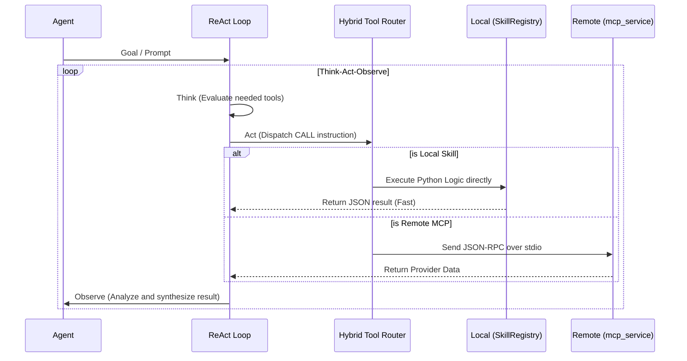

# 智能體調度與通訊規範 (Agentic Orchestration Specs)

> **[繁體中文 (Traditional Chinese)](#zh) | [English](#en)**

### 版本紀錄 (Version History)
| Date | Version | Description | Author |
| :--- | :--- | :--- | :--- |
| 2026-02-18 | v4.3 | **Master Orchestration Spec**: Unified Swarm Protocol, Mesh Protocols, and Task Planning. Integrated **v4.1.8 Stability Fixes** (Lazy Cache, Thread-safe Init, Dict/Str Handling). | Neo |
| 2026-02-14 | v3.5 | Full 7+1 agent roster, Council Fractal Debate, AgentFactory. | Neo |

---

<a id="zh"></a>

## 🇹🇼 智能體蜂群與通訊協定 (Agent Swarm & Mesh)

本文件定義了代理人蜂群 (Agent Swarm) 的角色分工、通訊協議 (Agent Mesh) 與任務規劃引擎 (Task Planning)。

### 1. 代理人蜂群角色 (Agent Swarm Roles)

系統由 **7 個專業專才 + 1 個評議會** 組成，透過 `AgentFactory` 進行動態建構。

| 角色 (Role) | 認知授權 (Mandate) | 核心職責 |
| :--- | :--- | :--- |
| **CIO Agent** | 綜合者 (Synthesizer) | 綜合研究數據，管理風險，產出最終投資報告。 |
| **Macro Strategist** | 週期分析師 (Cycle) | 分析總經數據 (FRED) 與市場週期。 |
| **Fundamental Analyst** | 深度偵探 (Detective) | 財報分析、估值建模 (DCF/PE)。 |
| **Momentum Analyst** | 趨勢獵人 (Hunter) | 技術指標 (RSI/MACD) 與型態辨別。 |
| **Sentiment Analyst** | 行為量化 (Behavioral) | 輿情分析與反向訊號監控。 |
| **Risk Agent** | 風控守門人 (Gatekeeper) | 板塊曝險檢查與持倉相關性監控。 |
| **System Engineer** | 進化工程師 (Evolution) | **[v4.1.8]** 自動優化 Prompt；監控資源洩漏並觸發回收。 |
| **Council Agent** | 辯論仲裁 (Council) | 對每檔標的執行「碎形辯論 (Fractal Debate)」。 |

---

### 2. 通訊協議與執行模型 (Agent Mesh & Execution)

> [!NOTE]
> 系統整合 ReAct (Think-Act-Observe) 模式與混合工具架構，動態路由提昇請求效率。



#### 2.3 [v4.1.8] 穩定性與魯棒性 (Resilience Updates)
- **延遲資源加載 (Lazy Initialization)**: `ResponseCache` 與資料庫連線改為首次調用時初始化，避免 Agent 大規模啟動時併發衝擊連線池。
- **執行緒安全鎖 (Thread-safe Lock)**: 使用 `threading.Lock` 確保快取資料庫僅被初始化一次。
- **響應格式容錯 (Response Robustness)**: 系統（如 `DailyWorkflow`）可自動識別並處理 LLM 返回的 JSON 字典或純文字字串，防止屬性錯誤導致 Workflow 崩潰。

---

### 3. 任務規劃與執行引擎 (Task Planning Engine)

#### 3.1 任務分解 (DAG Decomposition)
`TaskPlanningService` 將高層目標 (Goal) 轉換為有向無環圖 (DAG)：
- **複雜度評分 (Complexity)**: 1-10 分。
- **模型路由 (Routing)**: 根據分數分配 Fast (Flash) / Smart (Pro) / Advanced (Thinking) 模型。

#### 3.2 獎懲機制 (Reward & Penalty)
- **獎勵 (+0.01)**: 任務成功完成，提昇該 Agent 權重。
- **懲罰 (-0.1)**: 執行失敗或超時，降低權重並觸發 Engineer Agent 診斷。

```mermaid
graph TD
    TP[TaskPlanningService] -->"|DAG Decomposition| SO[SwarmOrchestrator]"
    SO -->"CIO[CIO Agent]"
    CIO -->"|Fractal Debate| Council[Council Agent]"
    SO -->"|Parallel Dispatch| Experts[Fundamental, Macro, Sentiment...]"
    Experts -->"|Think-Act-Observe| HR[Hybrid Tool Router]"
    HR -->"|Local| Local[SkillRegistry]"
    HR -->"|Remote| MCP[mcp_service]"
```

### 4. 預期效益與成果 (Expected Outcomes)
- **商業價值 (Business Value)**: 透過 7+1 高度專業化的代理人矩陣，系統能像專業投研團隊一樣覆蓋全球市場角落，消除單一分析師盲區，提升 Alpha 擷取能力。
- **性能指標 (Performance Target)**: 藉由混合任務路由與 `Lazy Cache Ops`，系統可支援並發 100+ 檔標的的深度推理，API 連線無超時，節省近 30% Token 損耗。

---

<a id="en"></a>

## 🇺🇸 Agentic Orchestration Specs

### 1. Swarm Intelligence
A 7+1 agent ecosystem coordinated by the **CIO Agent**. Each agent holds a specialized cognitive mandate (Macro, Fundamental, etc.).

### 2. Mesh Protocols & Resilience
- **ReAct Loop**: Standard Think-Act-Observe cycle.
- **v4.1.8 Stability**: Implements **Lazy Cache Ops** and **Thread-safe DB Singletons** to handle 100+ concurrent ticker analysis without connection pool timeout.

### 3. Workflow Engine
- **Task Planning**: Decouples goals from execution via DAG decomposition.
- **Adaptive Scoring**: Model-tiering based on task complexity.

### 4. Expected Outcomes
- **Business Value**: The 7+1 matrix ensures total market coverage (Macro, Fundamental, Sentiment), eliminating individual analyst blind spots for superior Alpha generation.
- **Performance Target**: Hybrid routing and Lazy Cache operations allow concurrent reasoning on over 100 tickers without DB pool exhaustion, trimming token overhead by ~30%.

## 🔗 Bidirectional Links
- **Architecture**: [Architecture Blueprint](架構總綱-Architecture-Blueprint)
- **Patterns**: [Swarm Patterns](設計模式-智能體集群-Swarm-Patterns)
