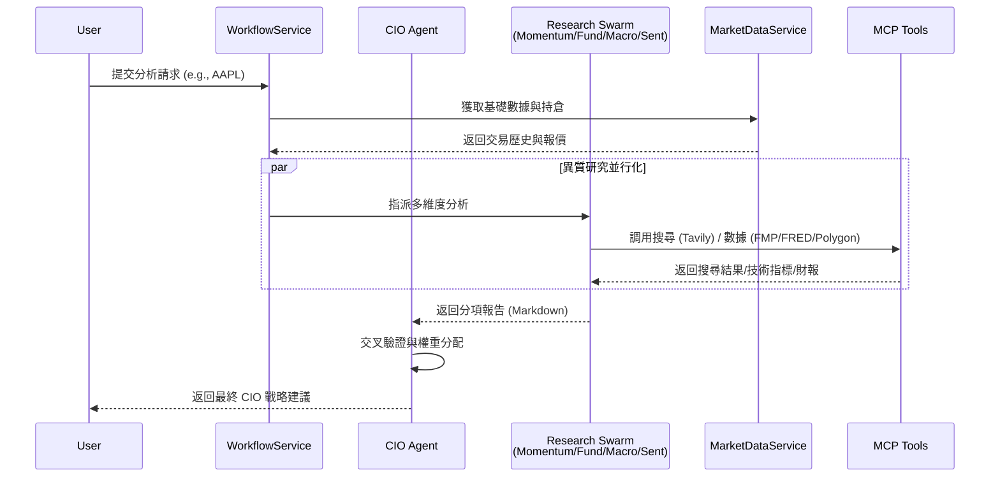
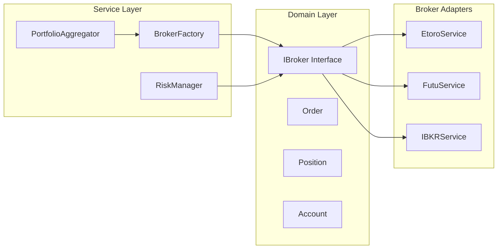

# 核心系統規格 (Core System Specifications)

### 版本紀錄 (Version History)
| Date | Version | Description | Author |
| :--- | :--- | :--- | :--- |
| 2026-02-16 | v3.8 | Sentinel Refinement (Deduplication, Buffering) & Channel Verification | Neo |
| 2026-02-15 | v3.7 | Multi-Tier Agent Architecture (Fast/Smart/Advanced) & Omni-Channel Adapters | Neo |
| 2026-02-14 | v3.5 | Full rewrite — aligned with actual codebase (Multi-Broker, Sentinel, MCP, Swarm) | Neo |
| 2026-01-01 | v3.1 | Initial spec with Agent Mesh & Hybrid Engine | Neo |

> **[繁體中文 (Traditional Chinese)](#zh) | [English](#en)**

---

<a id="zh"></a>

## 🇹🇼 核心系統規格書 (v3.5)

本文件依據 [文件框架定義](文件框架定義-Document-Frameworks) 編寫，反映系統目前已實作的功能與架構。

### 1. 問題與目標 (Problem & Goals)
- **核心痛點**:
    1. 傳統投資者面臨海量數據卻難以轉化為有效決策。
    2. 財務系統常因「AI 幻覺」導致數據計算錯誤，引發資產風險（如槓桿過高）。
    3. 缺乏統一「全局視角」將總經、基本面、技術面與情緒面有機結合。
    4. 跨券商帳戶無法統一管理，風控分散。
- **業務目標**:
    - 建立一套 **0% 幻覺風險** 的確定性計算引擎。
    - 提供「自適應智能」機制，以 **Toggle Algorithm** 在節省 Token 的同時維持分析品質。
    - 實現 **24/7 自動監控** (Sentinel) 與 **多角度評議** (Council)。
    - 統一管理多券商 (Etoro / Futu / IBKR) 資產與風控。

### 2. 功能描述 (Features & Functionality)

#### 2.1 多專家代理集群 (Agent Swarm)

系統採用 **Role × Multi-Tier Agent** 架構，由 7 個專業 Agent 與 1 個評議會組成。為平衡成本與品質，每個角色背後可能是一組 Swarm (Fast/Smart/Advanced)。

**Tier 定義**:
- **Fast Tier (Speed)**: 高速初篩，過濾雜訊 (e.g., Llama-3-8B)。
- **Smart Tier (Balance)**: 標準分析，多模態理解 (e.g., GPT-4o-mini)。
- **Advanced Tier (Depth)**: 深度推理，CoT 與複雜決策 (e.g., o1/Claude-3.5-Sonnet)。

**Agent 角色清單**:


| Agent | 類別 | 核心職責 |
| :--- | :--- | :--- |
| `CIOAgent` | 決策層 | 最終投資裁決、權重分配、交叉驗證。 |
| `FundamentalAgent` | 研究層 | 財報分析、估值建模 (DCF/PE)、財務健康度。 |
| `MomentumAgent` | 研究層 | 技術指標 (RSI/MACD/均線)、趨勢與型態辨識。 |
| `MacroAgent` | 研究層 | 總經數據 (FRED)、聯準會政策、殖利率曲線。 |
| `SentimentAgent` | 研究層 | 新聞情緒 (Tavily)、社群輿情分析。 |
| `RiskAgent` | 風控層 | 持倉風險評估、相關性監控、曝險檢查。 |
| `SystemEngineerAgent` | 演化層 | 自動重寫 Prompt (DSPy)、績效反省與策略優化。 |
| `CouncilAgentAdapter` | 仲裁層 | 碎形辯論 (Fractal Debate)、多角度衝突仲裁。 |

所有 Agent 繼承 `BaseAgent` 抽象基底類別，由 `AgentFactory` (Factory Pattern) 統一建構。

#### 2.2 專家協作時序圖 (Agent Collaboration Workflow)


#### 2.3 混合計算引擎 (Hybrid Engine)
- **確定性計算**: 股價、NLV、槓桿等數值皆由 Python 統計模組執行，**0% 幻覺**。
- **LLM 推論**: 僅用於非數值的「判斷」任務（趨勢解讀、新聞摘要、策略建議）。
- **A2A 思維鏈 (Agent-to-Agent Thought Chain)**: 各專家獨立推理，最後由 CIO 綜合判斷。
- **證據導向退場 (Reason-Based Exit)**: 僅在「買入理由消失」時觸發 SELL。

#### 2.4 多券商架構 (Multi-Broker Architecture)



| 券商 | 實作狀態 | 資產類別 |
| :--- | :--- | :--- |
| **Etoro** | ✅ 完整 (Bridge Service) | 股票、ETF、CFD |
| **Futu (富途)** | ✅ 完整 (futu-api) | 美股、港股 |
| **IBKR** | 🔨 骨架 (ib_insync) | 股/債/期/選 |

- **IBroker 介面**: `get_account()`, `get_positions()`, `execute_order()`, `sync_history()`。
- **BrokerFactory**: 依 `preferred_broker` 設定建立對應服務實例。
- **RiskManager**: Kill Switch、每日交易上限、連續虧損熔斷、板塊曝險上限。
- **PortfolioAggregatorService**: 跨券商統一持倉視圖與資產淨值計算。

#### 2.5 哨兵與評議會 (Sentinel & Council — v3.4)

- **SentinelService**: 7×24 市場事件監聽，偵測異常波動並觸發主動警報。
    - **智能去重 (Deduplication)**: 基於 Content Signature (Topic + Triggers) 抑制 24 小時內的重複警報。
    - **緩衝機制 (Buffering)**: 預設 15 分鐘緩衝視窗，聚合高頻訊號為單一 "Sentinel Event Loop" 報告。
- **CouncilService**: 碎形辯論 (Fractal Debate) — 對每檔持倉執行多角度質疑與反駁。
- **觸發機制**: Sentinel 偵測到事件 → Council 啟動深度評議 → CIO 裁決行動。

#### 2.6 任務規劃引擎 (Task Planning — v3.3)

- **TaskPlanningService**: 將高層目標 (如「生成週報」) 自動分解為可執行的任務 DAG。
- **動態模型選擇**: 依複雜度路由至 Fast (Flash) / Smart (Pro) / Advanced (Thinking)。
- **排程整合**: `SchedulerService` 支援 Cron 排程的日報/週報自動生成。

#### 2.7 記憶與上下文 (Memory System)

- **MemoryService**: 統一的記憶讀寫介面。
- **MemoryFactory**: 依環境自動選擇 Redis (生產) 或 SQLite (本地) 後端。
- **Redis**: 自適應壓縮 (Adaptive Compression)、跨會話上下文 (Cross-Session Context)。
- **SQLite**: `SqliteMemoryRepository` 作為無 Redis 環境的完整替代。

#### 2.8 MCP 整合 (Model Context Protocol)

- **MCP Server** (`src/tools/mcp_server.py`): 標準化工具介面，供各 Agent 調用。
- **MCP Service** (`src/mcp_service/`): FastAPI 微服務，提供外部 Agent 互操作。
- **工具清單**: `get_portfolio`, `search_news`, `get_fundamental_data`, `get_macro_data`。

#### 2.9 通知與整合 (Notifications)

- **LINE Bot**: `notifier.py` 透過 LINE Messaging API 推送日報/週報/警報。
- **Email**: 排程報告以 HTML 格式寄送。

#### 2.11 通道驗證與適配器 (Channel Verification & Adapters — v3.8)

- **全通路適配器 (Omni-Channel Adapter)**: 所有渠道 (Line, Slack, Telegram, Email, Web) 均實作 `IChannelAdapter` 標準介面 (`send_message`, `receive_command`, `authenticate`)。
- **通道驗證 (Channel Verification)**:
    1.  **連線測試**: 系統主動發送測試封包確認 API 狀態。
    2.  **交互驗證**: "Challenge-Response" 流程 (發送驗證碼 V-xxxx -> 使用者回覆 -> Webhook 確認)，確保雙向通訊暢通。

#### 2.10 自律 HR 協議 (HR Protocol & Self-Evolution)

1. **360 度互評**: 每個 Agent 完成協作後對協作者進行評分 (準確度/時效性/邏輯性)。
2. **觸發閾值**: 平均評分 < 3.0 或連續 3 次工具調用異常 → 標記為「待優化」。
3. **Engineer Agent**: 利用 DSPy 自動重寫低分 Agent 的 Prompt，實現持續進化。

### 3. 用戶體驗與使用者故事 (UX & User Stories)

#### 3.1 頁面架構 (Page Architecture)

| 頁面 | 檔案 | 功能 |
| :--- | :--- | :--- |
| 總覽 (Overview) | `dashboard.py` | NLV、Cash、Leverage、ROI、持倉、資產配置、券商分佈。 |
| 績效追蹤 | `01_Portfolio_Performance.py` | 歷史淨值走勢、績效分析。 |
| 分析報告 | `02_Analysis_Reports.py` | 日報/週報瀏覽與下載。 |
| 資料管理 | `03_Data_Management.py` | 手動輸入、CSV 匯入 (Atomic)、交易紀錄。 |
| 顧問對話 | `04_Advisor_Chat.py` | 與 CIO Agent 互動對話。 |
| 系統設定 | `05_Settings.py` | 9 個 Tab: 交易風控、AI 模型、排程、報告試跑、Agent 沙盒、Prompt 管理、HR、外觀、儲存。 |

#### 3.2 故事: 即時監控資產組合 (Dashboard Flow)
- 使用者進入「總覽」→ 系統調用 `MarketDataService` 獲取最新成交價 → 計算 NLV/Cash/Leverage。
- **回饋**: 槓桿 > 1.5x 黃色警告；> 2.0x 紅色危險。
- **欄位細節**:

    | 欄位 | 類型 | 邏輯說明 |
    | :--- | :--- | :--- |
    | 淨流動資產 (NLV) | Currency | Cash + Σ(Qty × Price) |
    | 槓桿比率 | Indicator | TotalMV / NLV |
    | 已實現損益 | Currency | 排除當前持倉後的累計盈虧 |

#### 3.3 故事: 手動記錄交易 (Manual Entry Flow)
- 進入「資料管理 → 手動輸入」→ 選擇「依數量」或「依槓桿」→ 原子化寫入。
- **CSV 匯入**: 支援交易與股利 (現金/配股)，全有或全無 (Atomic Transaction)。

#### 3.4 故事: 與 AI 顧問對話 (Advisor Chat)
- 進入「顧問對話」→ 輸入自然語言 (如「分析 AAPL」) → CIO 啟動 Agent Swarm → 返回結構化報告。

### 4. 技術規格與數據合約 (Technical Specs & Data Contracts)

#### 4.1 核心計算算法 (Mathematical Algorithms)
為確保 0% 幻覺，系統嚴格執行以下公式：

- **淨資產價值 (NLV)**:
  $$NLV = CashBalance + \sum (Quantity_i \times CurrentPrice_i)$$
- **名義總價值 (TNV)**:
  $$TNV = \sum |Quantity_i \times CurrentPrice_i|$$
- **槓桿比率 (Leverage Ratio)**:
  $$Leverage = \frac{TNV}{NLV}$$ (若 $NLV \le 0$，則 Leverage = $\infty$)
- **加權平均成本 (Average Cost - BUY)**:
  $$AvgCost_{new} = \frac{(Qty_{old} \times AvgCost_{old}) + (Qty_{new} \times Price_{new}) + Fees}{Qty_{old} + Qty_{new}}$$

#### 4.2 Agent Mesh 通信合約 (JSON Schemas)

- **工具調用請求 (ToolCallRequest)**:
  ```json
  {
    "tool_name": "string",
    "arguments": {
      "ticker": "string (uppercase)",
      "limit": "integer (optional)"
    }
  }
  ```
- **代理訊息 (AgentMessage)**:
  ```json
  {
    "sender": "string (agent_role)",
    "receiver": "string (agent_role)",
    "content": "string (markdown allowed)",
    "context": "object (state data)"
  }
  ```

#### 4.3 代理狀態機 (Agent State Machine)
1. **IDLE**: 等待任務。
2. **RESEARCHING**: 調用 MCP 工具獲取數據 (Polygon/FMP/FRED/Tavily)。
3. **PONDERING**: LLM 處理 Context 並生成決策。
4. **DECIDED**: 產出 JSON 或 Markdown 報告。
5. **REFLECTING**: (Engineer Agent) 分析準確度並更新 Prompt。

#### 4.4 異構數據源 (Data Sources)

| 數據源 | 用途 | 優先級 |
| :--- | :--- | :--- |
| **Polygon** | 即時/歷史行情 | Primary |
| **FMP** | 財報、估值、新聞 | Primary |
| **FRED** | 總經指標 (利率/CPI/GDP) | Primary |
| **Tavily** | 深度搜尋、即時新聞 | Primary |
| **DuckDuckGo** | 搜尋 Fallback | Secondary |

### 5. 技術與非功能性需求 (Technical & NFR)

- **架構設計**: Clean Architecture — Domain / Repository / Service / UI 分層。詳見 [系統全景圖](系統全景圖-System-Landscape)。
- **設計模式**: Factory (AgentFactory/BrokerFactory)、Repository (SqliteTransactionRepo)、DI、Template Method (BasePage/BaseAgent)。
- **資料模型**: SQLite，詳見 [資料庫設計](資料庫設計與代碼規範-Database-Git-Standards)。
- **可擴展性**: K8s 部署 (Helm Charts)、Ray Cluster、微服務解耦。
- **安全規範**: SAST (`bandit`)、API Key 存於 `.env` / GitHub Secrets。
- **可靠性**: MTTR < 5min (HR 協議自癒)。
- **資料完整性**: CSV 匯入 Atomic Transaction。
- **緩存策略**: 股價 TTL = 300s。
- **錯誤處理**: Agent 失敗返回 `fallback_reason`。
- **測試覆蓋率**: > 75%。

### 6. 成功指標 (Success Metrics)

| 指標 | 目標值 |
| :--- | :--- |
| 夏普比率 (Sharpe Ratio) | > 1.2 |
| 核心分析 P95 延遲 | < 30 秒 |
| 計算幻覺率 | 0% |
| 測試覆蓋率 | > 75% |
| 主動警報延遲 (Sentinel) | < 2 分鐘 |

---

<a id="en"></a>

## 🇺🇸 Core System Specifications (v3.5)

### 1. Problem & Goals
Solving "Information Overload" and "AI Hallucination" in AI-driven finance. Providing a **0% hallucination** deterministic engine with unified multi-broker risk management.

### 2. Features
- **Agent Swarm**: 7 specialized agents (CIO, Fundamental, Momentum, Macro, Sentiment, Risk, Engineer) + Council arbitration, built on `BaseAgent` with `AgentFactory`.
- **Hybrid Analytics**: Deterministic math for calculations + LLM reasoning for qualitative analysis.
- **Multi-Broker**: Unified `IBroker` interface supporting Etoro, Futu, IBKR with centralized `RiskManager` and `BrokerFactory`.
- **Sentinel & Council**: 24/7 event monitoring + Fractal Debate for deep position review.
- **Task Planning**: DAG-based task decomposition with dynamic model routing (Fast/Smart/Advanced).
- **Memory System**: Redis (production) / SQLite (local) via `MemoryFactory`.
- **MCP Integration**: Standardized tool interface for inter-agent and external communication.
- **Notifications**: LINE Bot + Email for automated report delivery.

### 3. UX & User Stories
- **Dashboard**: Real-time NLV, Leverage, P&L with risk thresholds (1.5x/2.0x).
- **Data Management**: Atomic transaction writes with "Leverage Mode" entry and CSV import.
- **Advisor Chat**: Natural language interaction with CIO Agent Swarm.
- **Settings**: 9-tab configuration (Trading & Risk, AI Config, Scheduler, etc.).

### 4. NFR & Reliability
- **Architecture**: Clean Architecture with Factory, Repository, DI, Template Method patterns.
- **Scalability**: K8s + Ray Cluster for high-concurrency.
- **Security**: SAST audits, strict secret management.
- **Test Coverage**: > 75%.

### 5. Success Metrics

| Metric | Target |
| :--- | :--- |
| Sharpe Ratio | > 1.2 |
| P95 Analysis Latency | < 30s |
| Calculation Hallucination | 0% |
| Test Coverage | > 75% |
| Sentinel Alert Latency | < 2min |

## 🔗 Bidirectional Links
- **Architecture**: [System Landscape](系統全景圖-System-Landscape)
- **Database**: [Database Standards](資料庫設計與代碼規範-Database-Git-Standards)
- **Environment**: [Environment Setup](環境設定與本地開發-Environment-Local-Dev)
- **Roadmap**: [Evolutionary Roadmap](產品演進藍圖-Evolutionary-Roadmap)
- **Future**: [Future Roadmap Specs](未來演進規格-Future-Roadmap-Specs)
- **Broker Guide**: [Broker Integration Guide](券商整合指南-Broker-Integration-Guide)
