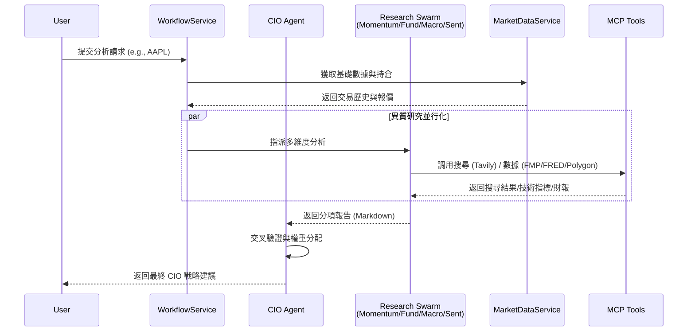

# 核心系統規格 (Core System Specifications)

### 版本紀錄 (Version History)
| Date | Version | Description | Author |
| :--- | :--- | :--- | :--- |
| 2026-02-19 | v4.1 | Wiki Reorganization — standardized folder structure and numbering. | Antigravity |
| 2026-02-16 | v3.8 | Sentinel Refinement (Deduplication, Buffering) & Channel Verification | Neo |
| 2026-02-15 | v3.7 | Multi-Tier Agent Architecture (Fast/Smart/Advanced) & Omni-Channel Adapters | Neo |
| 2026-01-01 | v3.1 | Initial spec with Agent Mesh & Hybrid Engine | Neo |

> **[繁體中文 (Traditional Chinese)](#zh) | [English](#en)**

---

## 🇹🇼 核心系統規格書 (v3.8)

本文件依據 [文件框架定義](../../00_規則規範-Rules/文件框架定義-Document-Frameworks.md) 編寫，反映系統目前已實作的功能與架構。

### 1. 問題與目標 (Problem & Goals)
- **核心痛點**:
    1. 傳統投資者面臨海量數據卻難以轉化為有效決策。
    2. 財務系統常因「AI 幻覺」導致數據計算錯誤，引發資產風險（如槓桿過高）。
    3. 缺乏統一「全局視角」將總經、基本面、技術面與情緒面有機結合。
    4. 跨券商帳戶無法統一管理，風控分散。
- **業務目標**:
    - 建立一套 **0% 幻覺風險** 的確定性計算引擎。
    - 提供「自適應智能」機制，以 **Toggle Algorithm** 在節省 Token 的同時維持分析品質。
    - 實現 **24/7 自動監控** (Sentinel) 與 **多角度評議** (Council)。
    - 統一管理多券商 (Etoro / Futu / IBKR) 資產與風控。

### 2. 功能描述 (Features & Functionality)

#### 2.1 多專家代理集群 (Agent Swarm)

系統採用 **Role × Multi-Tier Agent** 架構，由 7 個專業 Agent 與 1 個評議會組成。為平衡成本與品質，每個角色背後可能是一組 Swarm (Fast/Smart/Advanced)。

**Tier 定義**:
- **Fast Tier (Speed)**: 高速初篩，過濾雜訊 (e.g., Llama-3-8B)。
- **Smart Tier (Balance)**: 標準分析，多模態理解 (e.g., GPT-4o-mini)。
- **Advanced Tier (Depth)**: 深度推理，CoT 與複雜決策 (e.g., o1/Claude-3.5-Sonnet)。

**Agent 角色清單**:

| Agent | 類別 | 核心職責 |
| :--- | :--- | :--- |
| `CIOAgent` | 決策層 | 最終投資裁決、權重分配、交叉驗證。 |
| `FundamentalAgent` | 研究層 | 財報分析、估值建模 (DCF/PE)、財務健康度。 |
| `MomentumAgent` | 研究層 | 技術指標 (RSI/MACD/均線)、趨勢與型態辨識。 |
| `MacroAgent` | 研究層 | 總經數據 (FRED)、聯準會政策、殖利率曲線。 |
| `SentimentAgent` | 研究層 | 新聞情緒 (Tavily)、社群輿情分析。 |
| `RiskAgent` | 風控層 | 持倉風險評估、相關性監控、曝險檢查。 |
| `SystemEngineerAgent` | 演化層 | 自動重寫 Prompt (DSPy)、績效反省與策略優化。 |
| `CouncilAgentAdapter` | 仲裁層 | 碎形辯論 (Fractal Debate)、多角度衝突仲裁。 |

#### 2.2 專家協作時序圖 (Agent Collaboration Workflow)

#### 2.3 混合計算引擎 (Hybrid Engine)
- **確定性計算**: 數值計算皆由 Python 統計模組執行，**0% 幻覺**。
- **LLM 推論**: 僅用於非數值的「判斷」任務（趨勢解讀、新聞摘要、策略建議）。
- **A2A 思維鏈 (Agent-to-Agent Thought Chain)**: 各專家獨立推理，最後由 CIO 綜合判斷。
- **證據導向退場 (Reason-Based Exit)**: 僅在「買入理由消失」時觸發 SELL。

#### 2.4 多券商架構 (Multi-Broker Architecture)
- **IBroker 介面**: 標準化抽象層。
- **BrokerFactory**: 依設定動態切換券商服務實例。
- **RiskManager**: 實作熔斷機制與板塊曝險控制。

#### 2.5 哨兵與評議會 (Sentinel & Council — v3.8)
- **SentinelService**: 7×24 市場事件監聽。
    - **智能去重 (Deduplication)**: 基於 Content Signature 抑制重複警報。
    - **緩衝機制 (Buffering)**: 聚合高頻訊號為單一 Cycle 報告。
- **CouncilService**: 碎形辯論 (Fractal Debate) — 多角度風險挑戰機制。

#### 2.6 混合儲存架構 (Hybrid Strategy — v4.1)
- **SQLAlchemy Core**: 針對複雜行情計算與向量搜尋 (`AlchemyVectorRepository`) 強制使用 Raw SQL 以確保效能與資安性。
- **ORM**: 針對一般物件 (User, Settings) 可選用 ORM 提升維護性。
- **資安唯一原則**: 所有 Raw SQL 必須使用參數化查詢。

#### 2.7 通道驗證與適配器 (Channel Verification — v3.8)
- **全通路適配器 (Omni-Channel Adapter)**: 實作 `IChannelAdapter` 標準介面。
- **通道驗證 (Channel Verification)**: "Challenge-Response" 流程確保通訊暢通。

### 3. 用戶體驗 (UX & User Stories)
- **總覽 (Overview)**: 實時 NLV、Cash、Leverage 監控。
- **資料管理**: 原子化 (Atomic) 交易寫入與 CSV 匯入。
- **顧問對話**: 自然語言驅動的 Agent Swarm 協作分析。

### 4. 成功指標 (Success Metrics)
- **計算幻覺率**: 0%
- **測試覆蓋率**: > 70% (CI 標準 65%)
- **主動警報延遲**: < 2 分鐘

---

## 🇺🇸 Core System Specifications (v3.8)

### 1. Problem & Goals
Providing a **0% hallucination** deterministic engine with unified multi-broker risk management and Agent Swarm analytics.

### 2. Features
- **Agent Swarm**: 7 specialized agents + Council arbitration, using a Multi-Tier routing strategy.
- **Hybrid Strategy Persistence**: Leveraging SQLAlchemy Core for performance/security and ORM for simplicity.
- **Sentinel & Council**: Real-time event deduplication and Fractal Debate for rigorous risk analysis.
- **Channel Verification**: Automated connectivity checks for LINE, Slack, and email notifications.

### 4. Success Metrics
- **Calculation Hallucination**: 0%
- **Test Coverage**: > 70%
- **P95 Latency**: < 30s

## 🔗 Bidirectional Links
- **Architecture**: [System Landscape](../../04_架構觀點-Architect_Views/系統全景圖-System-Landscape.md)
- **Database**: [Database Standards](../../00_規則規範-Rules/資料庫設計與代碼規範-Database-Git-Standards.md)
- **Environment**: [Environment Setup](../../03_開發者指南-Developer_Guide/環境設定與本地開發-Environment-Local-Dev.md)
- **Roadmap**: [Evolutionary Roadmap](../01_規格書-Specs/產品演進藍圖-Evolutionary-Roadmap.md)
- **Wiki Standard**: [Wiki Standard](../../00_規則規範-Rules/文件規範-Wiki-Standard.md)
