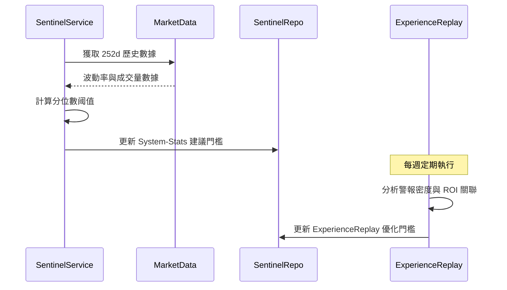

# 配置管理與動態演化 (Config & Evolution Spec)

> **[繁體中文 (Traditional Chinese)](#zh) | [English](#en)**

### 版本紀錄 (Version History)

| Date | Version | Description | Author |
| :--- | :--- | :--- | :--- |
| 2026-03-08 | v4.6 | **Security Hardening**: Replaced MD5 with SHA256; Centralized Secret Redaction in BaseAgent. | Antigravity |
| 2026-02-18 | v4.5 | **Master Config Spec**: Unified Dynamic Configuration and Rule #8 Experience Replay mechanisms. | Neo |
| 2026-02-14 | v1.0 | Initial Release: DB-based Config & Dynamic Thresholds. | Neo |

---

## 🇹🇼 配置管理與系統演化 (Configuration & Evolution)

本文件定義系統的動態配置架構與基於 **Rule #8 (動態指標原則)** 的自我優化機制。

### 1. 動態配置管理 (Dynamic Configuration)

為了實現無重啟更新 (Hot-Reload) 與安全性，系統採用 **資料庫驅動配置 (DB-Driven Config)**。

#### 1.1 存取優先序 (Priority Logic)

設定的讀取遵循以下權重，資料庫設定具備最高優先權：
**DB Settings** > **Environment Variables (.env)** > **Hardcoded Defaults**

#### 1.2 安全管理 (Security)

- **敏感資訊隔離**: API Keys 儲存於加密資料表，前端介面強制使用 Masking 遮蔽。
- **密碼學強化**: 內部識別碼 (如 `signal_id`) 強制使用 SHA256 雜湊。
- **日誌脫敏 (Log Redaction)**: 基於 `BaseAgent` 的全域脫敏機制，確保 `STATE.md` 與日誌中不含敏感秘密。
- **使用者隔離**: 支援基於 `user_id` 的多租戶個性化配置。

---

### 2. 動態指標原則 (Rule #8: Dynamic Variables)

系統嚴禁使用寫死的閾值，所有監控門檻必須具備統計基礎。

#### 2.1 統計校準引擎 (Statistical Calibration)

`SentinelService` 定期執行 `_calibrate_thresholds()`：

- **百分位數基準**: VIX 警報門檻設定為過去 252 個交易日的 90% (High) 與 97.5% (Extreme) 分位數。
- **自適應 Sigma**: 使用價格波動的標準差 (Z-Score) 偵測異常，而非固定百分比漲跌。

#### 2.2 復盤優化機制 (Experience Replay)

`ExperienceReplayService` 負責「閉環優化」，分析過去 7 天的 `event_logs`：

- **噪訊抑制 (Noise Suppression)**: 若指標觸發頻率過高 (7天>10次)，系統會自動縮緊閾值 (+5%) 以降低假警報。
- **ROI 導向校準**: 將警報訊號與後續收益率關聯，自動優化低效能指標的權重。

---

### 3. 校準與復盤流程 (Calibration Flow)

---

## 🇺🇸 Config & Evolution Spec

### 1. DB-Driven Configuration

Ensures hot-reloadable updates without container restarts.
**Priority Stack**: DB > ENV > Defaults.

### 2. Rule #8: Dynamic Thresholds

No hardcoded limits. All sentinel triggers are derived from:

- **Statistical Percentiles**: 90th/97.5th percentile based on 1-year historical data.
- **Experience Replay**: Automated threshold tightening based on alert density and noise analysis.

## 🔗 Bidirectional Links

- **Architecture**: [Architecture Blueprint](架構總綱-Architecture-Blueprint)
- **Sentinel**: [Sentinel & Council Architecture](哨兵與評議會架構-Sentinel-Council-Architecture)
- **Engineering**: [Dynamic Parameter Standards](動態參數規範-Dynamic-Parameter-Standards)
