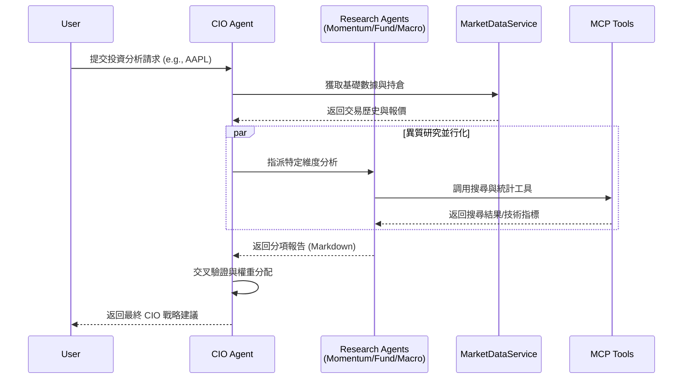
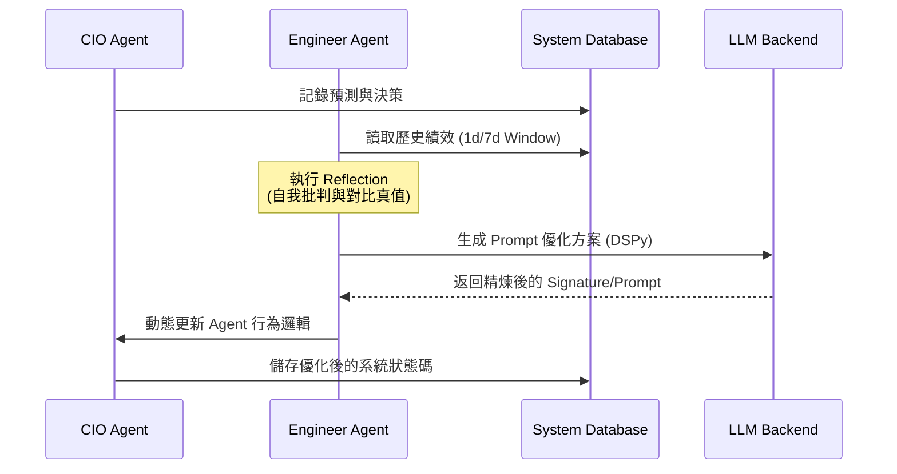

# 核心系統規格 (Core System Specifications)

> **[繁體中文 (Traditional Chinese)](#zh) | [English](#en)**

---

<a id="zh"></a>

## 🇹🇼 核心系統規格書 (v3.1)

本文件依據 [文件框架定義](文件框架定義-Document-Frameworks) 編寫，旨在提供深度、專業且可供 AI IDE 直接實作的功能細節。

### 1. 問題與目標 (Problem & Goals)
- **核心痛點**:
    1. 傳統投資者面臨海量數據卻難以轉化為有效決策。
    2. 財務系統常因「AI 幻覺」導致數據計算錯誤，引發資產風險（如槓桿過高）。
    3. 缺乏統一的「全局視角」將總經、基本面與技術面有機結合。
- **業務目標**:
    - 建立一套 0% 幻覺風險的確定性計算引擎。
    - 提供「自適應智能」機制，在節省 Token 的同時維持分析的時效性。
    - 實現 24/7 自動監控與自我優化。

### 2. 功能描述 (Features & Functionality)
- **多專家代理集群 (Agent Swarm)**: 由 Momentum, Fundamental, Macro, Sentiment 組成研究端，CIO 進行最終裁決。
- **混合計算引擎 (Hybrid Engine)**: 結合 LLM 推論與 Python 統計模組。
- **自律 HR 協議**: 確保後台 Agent 運作穩定，自動偵測並恢復掛掉的服務。

#### 2.1 專家協作時序圖 (Agent Collaboration Workflow)


#### 2.2 自適應優化循環 (Adaptive Reflection Loop)


### 3. 用戶體驗與使用者故事 (UX & User Stories)

#### 3.1 故事: 我想要即時監控我的資產組合與風險 (Dashboard Flow)
- **操作路徑 (User Flow)**:
    1. 使用者進入「總覽 (Overview)」頁面。
    2. 系統背景調用 `MarketDataService` 獲取最新成交價。
    3. 系統計算 NLV (淨資產)、Cash (現金) 與 Leverage (槓桿)。
    4. **回饋**: 若槓桿比率 > 1.5x，顯示黃色警告；> 2.0x，顯示紅色危險區。
- **欄位細節 (Field Specification)**:
    | 欄位名稱 | 類型 | 邏輯說明 |
    | :--- | :--- | :--- |
    | 淨流動資產 (NLV) | Currency | 現金 + 所有持倉市值 (Quantity * Current Price)。 |
    | 槓桿比率 | Indicator | $TotalMarketValue / NLV$。即時更新。 |
    | 已實現損益 | Currency | 排除當前持倉後的累計盈虧。 |

#### 3.2 故事: 我想要精確記錄我的手動交易 (Manual Entry Flow)
- **操作路徑 (User Flow)**:
    1. 進入「資料管理 -> 手動輸入」。
    2. 選擇「輸入模式」: 「依數量」或「依槓桿」。
    3. **場景 (Scenario) - 依槓桿**: 使用者輸入「本金」與「槓桿倍數」(e.g., $1000, 3x)。
    4. 系統自動換算「總購買力」並根據「目前價格」推導預計「股數」。
    5. 點擊「提交」，系統執行原子化寫入 `transactions` 與 `daily_snapshots` 表。
- **欄位細節 (Field Specification)**:
    | 欄位名稱 | 類型 | 驗證規則 |
    | :--- | :--- | :--- |
    | Ticker | Text | 必須是大寫且存在於市場數據庫中。 |
    | 動作 | Select | BUY, SELL, DIVIDEND, DEPOSIT, WITHDRAW。 |
    | 手續費 (Fees) | Float | 不可小於 0。 |

### 4. 技術規格與數據合約 (Technical Specs & Data Contracts)

#### 4.1 核心計算算法 (Mathematical Algorithms)
為確保 0% 幻覺，系統必須嚴格執行以下公式：

- **淨資產價值 (NLV)**:
  $$NLV = CashBalance + \sum (Quantity_i \times CurrentPrice_i)$$
- **名義總價值 (TNV)**:
  $$TNV = \sum |Quantity_i \times CurrentPrice_i|$$
- **槓桿比率 (Leverage Ratio)**:
  $$Leverage = \frac{TNV}{NLV}$$ (若 $NLV \le 0$，則 Leverage = $\infty$)
- **加權平均成本 (Average Cost - BUY)**:
  $$AvgCost_{new} = \frac{(Qty_{old} \times AvgCost_{old}) + (Qty_{new} \times Price_{new}) + Fees}{Qty_{old} + Qty_{new}}$$

#### 4.2 Agent Mesh 通信合約 (JSON Schemas)
所有代理間的工具調用必須符合以下 MCP 格式：

- **工具調用請求 (ToolCallRequest)**:
  ```json
  {
    "tool_name": "string",
    "arguments": {
      "ticker": "string (uppercase)",
      "limit": "integer (optional)"
    }
  }
  ```
- **代理訊息 (AgentMessage)**:
  ```json
  {
    "sender": "string (agent_role)",
    "receiver": "string (agent_role)",
    "content": "string (markdown allowed)",
    "context": "object (state data)"
  }
  ```

#### 4.3 代理狀態機 (Agent State Machine)
代理的生命週期應符合以下狀態切換鏈：
1. **IDLE**: 等待任務。
2. **RESEARCHING**: 正在調用 MCP 工具獲取數據（Polygon/FRED/Tavily）。
3. **PONDERING**: LLM 正在處理 Context 並生成決策。
4. **DECIDED**: 已產出 JSON 或 Markdown 報告。
5. **REFLECTING**: (僅適用於 Engineer Agent) 分析輸出準確度並更新 Prompt。

### 5. 技術與非功能性需求 (Technical & NFR)

- **架構設計**: 詳見 [系統全景圖](系統全景圖-System-Landscape)。
- **資料模型**: 基於 SQLite，詳見 [資料庫設計](資料庫設計與代碼規範-Database-Git-Standards)。
- **可擴展性 (Scalability)**:
    - 支援 K8s 部署 (Helm Charts) 與 Ray Cluster 運算。
    - 微服務解耦，Agent 運算可獨立擴容。
- **安全規範 (Security)**:
    - **SAST**: 每月執行 `bandit` 掃描。
    - **數據安全**: 所有外部 API Key 必須存放於 `.env` 或 GitHub Secrets，嚴禁硬編碼。
- **可靠性 (Reliability)**:
    - 任務 Mean Time To Recovery (MTTR) < 5 分鐘（透過 HR 協議自癒）。
- **資料完整性**: CSV 匯入必須採用「全有或全無」事務 (Atomic Transaction)。
- **緩存策略**: 股價數據 TTL 設為 300 秒，以平衡時效性與 API 成本。
- **錯誤處理**: 若 Agent 調用失敗，必須返回 `fallback_reason` 而非空白或錯誤代碼。

### 6. 成功指標 (Success Metrics)
- **投資績效**: 夏普比率 (Sharpe Ratio) > 1.2。
- **系統效率**: 核心分析回應時間 (P95) < 30 秒。
- **數據精確度**: 計算幻覺率 = 0%。

---

<a id="en"></a>

## 🇺🇸 Core System Specifications (v3.1)

### 1. Problem & Goals
Solving the "Information Overload" and "AI Hallucination" problems in AI-driven finance. Goal: Provide a 0%-hallucination deterministic engine for portfolio risk management.

### 2. Features
- **Agent Mesh**: Multi-agent collaboration protocols.
- **Hybrid Analytics**: Precision math + LLM reasoning.

### 3. UX & User Stories
- **Dashboard Monitoring**: Real-time NLV, Leverage, and P&L detection with risk thresholds (1.5x/2.0x).
- **Data Management**: Atomic transaction writes with advanced "Leverage Mode" entry.

### 4. NFR & Reliability
- **Scalability**: High-concurrency Ray support.
- **Security**: Strict SAST audits and secret management.
- **Success Metrics**: Sharpe Ratio > 1.2, P95 Latency < 30s.

## 🔗 Bidirectional Links
- **Architecture**: [System Landscape](系統全景圖-System-Landscape)
- **Database**: [Database Standards](資料庫設計與代碼規範-Database-Git-Standards)
- **Environment**: [Environment Setup](環境設定與本地開發-Environment-Local-Dev)
