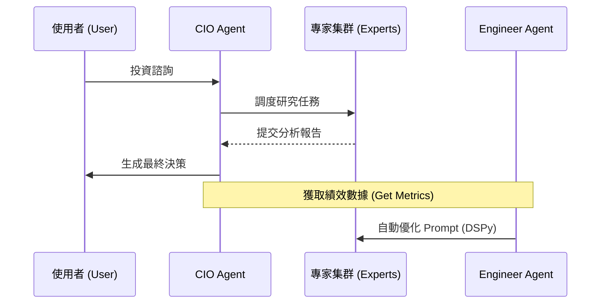

# 核心系統規格 (Core System Specifications)

> **[繁體中文 (Traditional Chinese)](#zh) | [English](#en)**

## 🇹🇼 核心系統規格彙編

本文件整合了系統目前穩定運行的核心功能規格，涵蓋智能代理集群、自適應機制、HR 協議與資料層架構。

### 1. 代理人集群 (Agent Swarm v3/v4)

#### 🤝 代理人協作與反饋 (Agent Interaction & Feedback Loop)
> [!NOTE]
> 序列圖展示了決策過程以及 Engineer Agent 如何根據結果進行優化。
> This sequence diagram shows the decision process and how the Engineer Agent optimizes based on results.

<b>🛡️ 點擊查看角色職責細節 (Click for Role Responsibility details)</b>

- **動能分析師 (Momentum)**: 技術面指標分析 (RSI, MACD, 均線)。
- **基本面分析師 (Fundamental)**: 財務報表與估值分析。
- **市場情緒分析師 (Sentiment)**: 新聞熱度與 VIX 情緒偵測。
- **總體經濟分析師 (Macro)**: FRED 宏觀數據與景氣週期判斷。
- **投資長 (CIO)**: 最終決策者，負責板塊策略與選股報告生成。

**核心流程**: `全局戰略` -> `標的篩選` -> `深度研究 (並行執行)` -> `最終決策報告`。

### 2. 自適應智能 (Adaptive Intelligence)

<b>🧠 點擊查看效率優化細節 (Click for Efficiency Optimization Details)</b>

- **智慧新鮮度 (Smart Freshness)**: 透過 SHA256 雜湊比對輸入內容，若數據未變更則直接返回快取結果，節省 Token。
- **模型分級 (Model Tiering)**: 
    - **SMART 層**: 使用 Gemini 1.5 Pro 進行複雜推理 (CIO, Macro, Engineer)。
    - **FAST 層**: 使用 Gemini 1.5 Flash 進行快速處理 (Momentum, Dispatcher)。
- **互動調度 (Dispatcher)**: 透過 `Advisor Chat` 接收自然語言需求，自動路由至對應專家。

### 3. HR 協議與自我修正 (HR Protocol & Self-Correction)

<b>⚖️ 點擊查看監控與優化細節 (Click for Monitoring & Optimization Details)</b>

- **殭屍偵測**: 自動檢查掃描間隔，超過 7 天未活動的 Agent 將標記為殭屍並發出預警。
- **工程師優化 (Engineer Agent)**: 分析 `PerformanceService` 的歷史勝率，若低於閾值，則自動撰寫並測試新的系統提示詞 (System Prompt)進行熱替換 (Hot-swap)。

### 4. 資料層架構 (Data Layer Strategy)
- **策略模式 (Strategy Pattern)**: 統一數據攝取介面，支援 Robinhood, IBKR 與簡易 CSV。
- **攝取工廠 (Factory)**: 根據輸入自動路由至對應解析器。

---

## 🇺🇸 Core System Specifications

### 1. Agent Swarm
- **Roles**: Specialized experts (Momentum, Fundamental, Macro, Sentiment) managed by the **CIO Agent**.
- **Workflow**: Sector-driven multi-stage analysis (v4).

### 2. Adaptive Intelligence
- **Efficiency**: Hash-based **Smart Freshness** to deduplicate analysis.
- **Tiers**: Hybrid model approach using **SMART** (Pro) and **FAST** (Flash) models.
- **Interaction**: AI Dispatcher for conversational interface.

### 3. HR & Self-Correction
- **Monitoring**: Detects zombie agents (inactive for >7 days).
- **Optimization**: **System Engineer Agent** uses DSPy to optimize prompts based on historical performance (Win Rate).

### 4. Data Layer
- **Ingestion**: Strategy pattern supporting diverse CSV formats (IBKR/Robinhood).
- **Storage**: Standardized schema supporting event logs and agent knowledge.

## 🔗 See Also
- [Future Roadmap Specs](wiki/02_產品經理-Product_Managers/Specs/未來演進規格-Future-Roadmap-Specs.md)
- [Evolutionary Roadmap](wiki/02_產品經理-Product_Managers/產品演進藍圖-Evolutionary-Roadmap.md)
