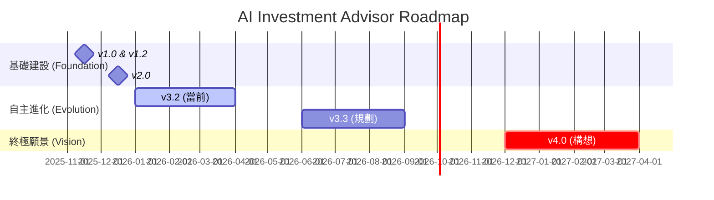

# 產品演進藍圖 (Evolutionary Roadmap)

> **[繁體中文 (Traditional Chinese)](#zh) | [English](#en)**

## 🇹🇼 產品演進藍圖 (Evolutionary Roadmap)

本文件記載了系統從創始到自主進化的里程碑，展示我們如何透過「智慧工程」超越傳統量化交易。

### 📅 產品演變時間線 (Product Evolution Timeline)
> [!NOTE]
> 時間線展示了系統從基礎工具進化到自主 AI 家族辦公室的歷程。
> This timeline shows the journey from a basic tool to an autonomous AI Family Office.

### 1. 2025: 創始與基建 (已達成)
- **v1.0 (Nov)**: 核心分析引擎、基礎 Ingestor 與 Streamlit 介面。
- **v1.2 (Dec)**: **Google OAuth 2.0** 安全整合、雙語在地化。
- **v2.0 (Dec)**: **智慧新鮮度**節省成本、**模型分級** (Smart/Fast)、**HR 協議**監控 Agent 健康。

### 2. 2026 Q1-Q2: 自主校正與分層架構 (當前階段)

#### v3.2 混合分層分析架構 (Hybrid Tiered Architecture)
- **核心策略**: 捨棄全量處理，改用 **事件驅動分層** (API 篩選 -> 新聞快篩 -> 深度分析)。
- **矛盾檢測**: 比對財報數據與文字承諾的一致性。
- **JIT 報告**: 僅在關鍵時刻生成的「機構級投資備忘錄」。

### 3. 未來路徑：危機自癒與演化智能

<b>🚀 點擊查看未來版本細節 (Click to View Future Version Details)</b>

#### v3.3 宏觀對沖與自癒系統 (Planned Jun 2026)
- **絕對報酬**: 目標在空頭市場維持收益。
- **自癒機制**: 當回撤逾 5%，自動啟動 **FinRL** 模擬環境重新優化策略。
- **分散式 Ray**: 利用 Kubernetes 集群進行大規模回測與參數調優。

#### v4.0 個人家族辦公室 (Concept Late 2026)
- **生成式 Alpha**: 自然語言轉代碼。
- **遺傳演算法 (GA)**: 讓 Agent 彼此競爭與「交配」，進化出適應新體制的策略 DNA。
- **目標導向管理**: 自動為「退休」或「購屋」等目標動態滑動配置。

---

## 🇺🇸 Evolutionary Roadmap

### 1. 2025: Genesis (Completed)
Established core analysts, Google OAuth, and cost-saving **Smart Freshness** mechanisms.

### 2. 2026 Q1-Q2: Autonomous Refinement (Current)
- **v3.2**: Event-driven **Tiered Analysis** to maximize cost-efficiency and Alpha.

### 3. Future Path: Anti-fragility & Evolution
- **v3.3 (Jun 2026)**: **Crisis Autopilot** with FinRL self-healing.
- **v4.0 (Late 2026)**: **Generative Alpha** and Personal Family Office via Genetic Algorithms.

## 🔗 See Also
- [Core System Specs](wiki/02_產品經理-Product_Managers/Specs/核心系統規格-Core-System-Specs.md)
- [Future Roadmap Specs](wiki/02_產品經理-Product_Managers/Specs/未來演進規格-Future-Roadmap-Specs.md)
