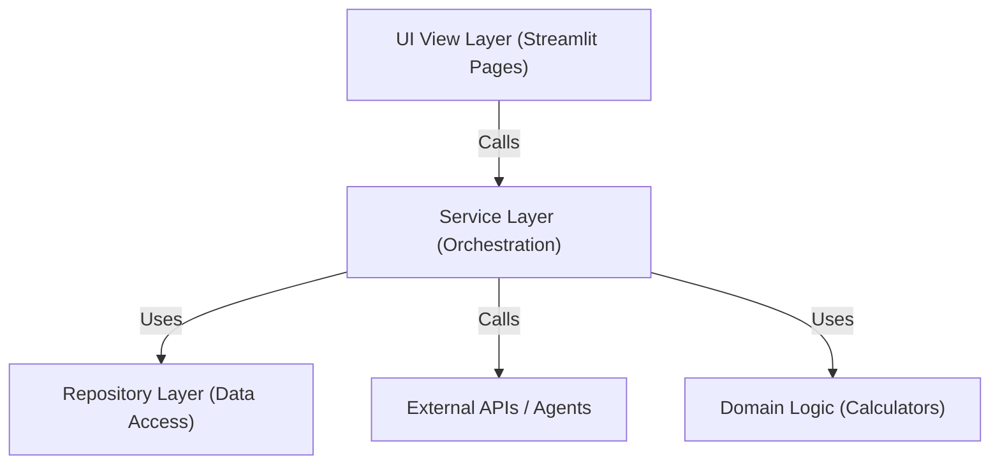
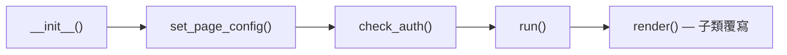
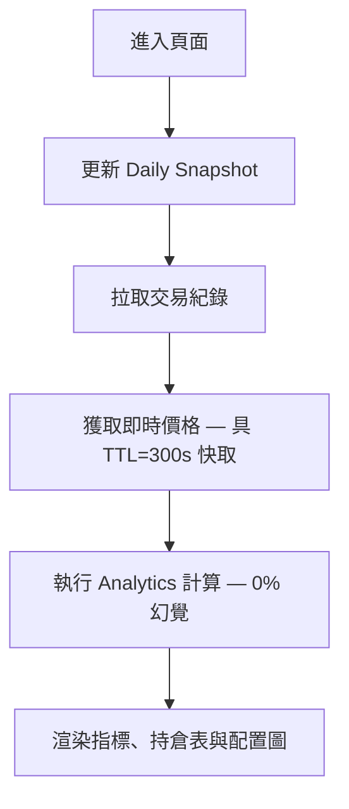
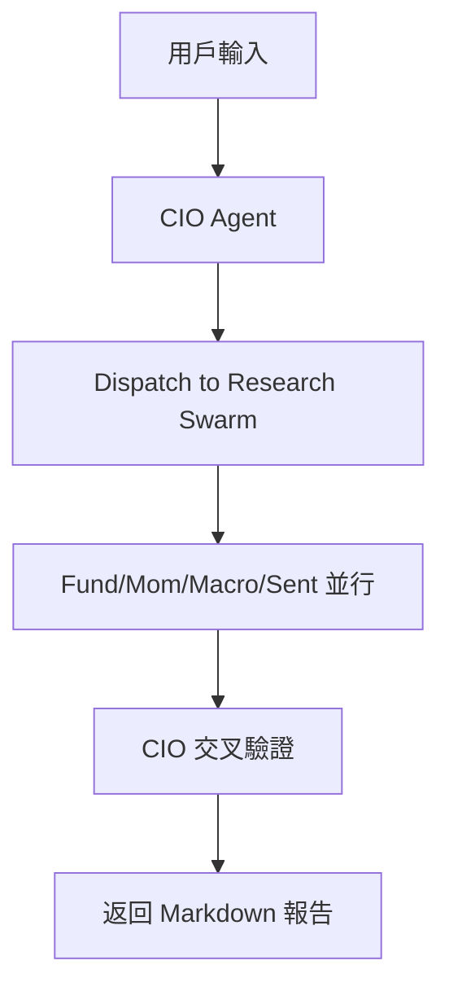

# 前端架構與 UX 層 (Frontend & UX Layer)

> **[繁體中文 (Traditional Chinese)](#zh) | [English](#en)**

### 版本紀錄 (Version History)
| Date | Version | Description | Author |
| :--- | :--- | :--- | :--- |
| 2026-02-14 | v3.5 | Full rewrite — 6 pages, 9 settings tabs, BasePage pattern | Neo |
| 2024-01-04 | v1.0 | Initial Release | Neo |

---

### 1. 視圖與服務分層架構 (View-Service Layered Architecture)

為了提高可維護性與職責分離，本系統採用 **View-Service 分層設計**。

#### 1.1 職責定義 (Roles & Responsibilities)

| 層級 | 位置 | 職責 |
| :--- | :--- | :--- |
| **View Layer** | `src/pages/`, `src/dashboard.py` | UI 渲染、佈局、使用者輸入、Session State。 |
| **Service Layer** | `src/services/` | 數據編排、業務邏輯、快取策略、錯誤處理。 |
| **Repo / Infra** | `src/data/`, `src/utils/` | 數據 CRUD、外部 API 封裝、技術工具集。 |
| **MCP Layer** | `src/mcp_service/` | 跨 Agent 工具共享、A2A 通訊 (FastAPI)。 |

---

### 2. 頁面管理與基類 (Page Architecture)

#### 2.1 BasePage 樣板方法 (Template Method)
所有頁面繼承 `BasePage` (`src/utils/page_base.py`)，強制執行一致的生命週期：

- **`__init__`**: 各頁面自行實例化所需 Service (Composition Root 模式)。
- **`run()`**: 基類統一的進入點，處理錯誤邊界與頁面標題。
- **`render()`**: 子類覆寫，實作業務 UI 邏輯。

#### 2.2 頁面清單 (Page Registry)

| 頁面 | 檔案 | 功能 |
| :--- | :--- | :--- |
| 總覽 (Dashboard) | `src/dashboard.py` | NLV、Cash、Leverage、ROI、持倉、資產配置、券商分佈。 |
| 績效追蹤 | `src/pages/01_Portfolio_Performance.py` | 歷史淨值走勢、績效分析。 |
| 分析報告 | `src/pages/02_Analysis_Reports.py` | 日報/週報瀏覽與下載。 |
| 資料管理 | `src/pages/03_Data_Management.py` | 手動輸入、CSV 匯入 (Atomic)、交易紀錄管理。 |
| 顧問對話 | `src/pages/04_Advisor_Chat.py` | 與 CIO Agent Swarm 互動。 |
| 系統設定 | `src/pages/05_Settings.py` | 9 Tab 設定中心 (見下節)。 |

#### 2.3 設定頁 Tab 架構 (Settings Tabs)

| Tab | 檔案 | 功能 |
| :--- | :--- | :--- |
| 交易與風控 | `trading_tab.py` | Broker 選擇、Kill Switch、板塊曝險、每日交易上限。 |
| AI 設定 | `ai_config_tab.py` | LLM 模型選擇、溫度、Token 上限。 |
| 排程 | `scheduler_tab.py` | Cron 排程設定、日報/週報自動化。 |
| 報告試跑 | `report_dry_run_tab.py` | 單次報告生成測試 (不寄送)。 |
| Agent 沙盒 | `agent_playground_tab.py` | 單一 Agent 互動測試。 |
| Prompt 管理 | `optimization_tab.py` | 查看/編輯 Agent Prompt、觸發 DSPy 優化。 |
| HR 協議 | `hr_protocol_tab.py` | 360° 互評記錄查看。 |
| 外觀 | `appearance_tab.py` | Dark/Light 主題切換。 |
| 儲存 | `storage_tab.py` | 資料庫路徑、備份狀態。 |

### 3. UX 流程 (UX Flows)

#### 3.1 儀表板全景 (Dashboard Flow)

#### 3.2 顧問對話流 (Advisor Chat Flow)

### 4. 技術重點 (Technical Highlights)
- **智慧快取 (`@st.cache_data`)**: TTL=300s 降低 API 成本。
- **狀態管理**: `st.session_state` 管理 `user_id`，跨頁面安全隔離。
- **風險提示**: Leverage > 1.5x 黃色警告、> 2.0x 紅色危險。
- **ThemeService**: CSS 主題注入，支援 Dark/Light 切換。

---

## 🇺🇸 Frontend Architecture & UX (v3.5)

### 1. View-Service Layered Architecture
Strict separation of concerns to enhance maintainability and testability.
- **View Layer**: `src/pages/`, `src/dashboard.py` (Streamlit UI).
- **Service Layer**: `src/services/` (Orchestration & Logic).
- **Repo/Infra**: `src/data/`, `src/utils/` (Data Access & Utils).

### 2. Page Architecture
- **BasePage Template Method**: Unified lifecycle (`__init__` → `run()` → `render()`).
- **6 Pages**: Dashboard, Performance, Reports, Data Management, Advisor Chat, Settings.
- **9 Settings Tabs**: Trading & Risk, AI Config, Scheduler, Report Dry-Run, Agent Playground, Prompt Management, HR Protocol, Appearance, Storage.

### 3. UX Patterns
- **Just-In-Time Calculation**: Metrics computed on-the-fly with current market prices.
- **Risk Highlighting**: Color-coded leverage warnings (1.5x yellow, 2.0x red).
- **Transparent AI**: Agent reasoning displayed alongside raw data.

## 🔗 Bidirectional Links
- **Architecture**: [System Landscape](../04_架構觀點-Architect_Views/系統全景圖-System-Landscape.md)
- **Data Layer**: [Data & Domain Models](../04_架構觀點-Architect_Views/資料與領域模型-Data-Domain-Models.md)
- **Service Layer**: [Service Layer Blueprints](服務層開發指南-Service-Layer-Blueprints.md)
- **BasePage Pattern**: [Template Method](../05_工程手冊-Engineering_Handbook/01_設計模式-Patterns/設計模式-樣板方法-Template-Method.md)
