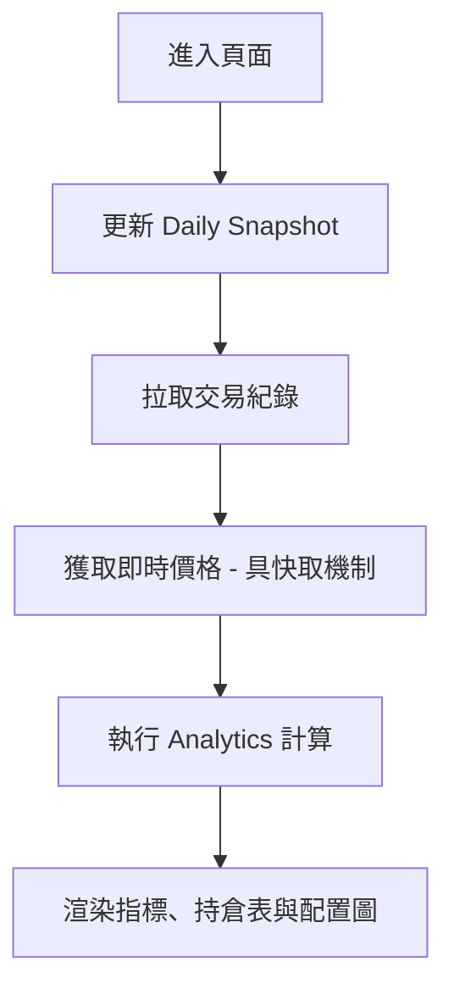

# 前端架構與 UX 層 (Frontend & UX Layer)

> **[繁體中文 (Traditional Chinese)](#zh) | [English](#en)**

---

## 🇹🇼 前端架構與 UX 層 (Interaction Layer)

本文件詳解以 Streamlit 為核心的前端架構，包括頁面管理、狀態同步與用戶體驗設計。

### 1. 頁面管理與基類 (Page Management & BasePage)
系統採用物件導向方式封裝 Streamlit 頁面，統一錯誤處理與頁面生命週期。
- **`BasePage`**: `src/utils/page_base.py`。定義了頁面的標題、圖示與 `run()` 方法。
- **依賴注入 (Dependency Injection)**: 每個頁面在 `__init__` 中自行實例化所需的 Service 層組件（如 `MarketDataService`），體現了簡化版的 **Composition Root**。

### 2. 用戶體驗流程 (UX Flows)

#### 2.1 儀表板全景 (Dashboard Flow)

### 3. 技術點與選型分析 (Technical Analysis)
- **智慧快取 (`@st.cache_data`)**: 對於高成本的 API 請求（如股價），前端層實現了 TTL=300s 的快取，在保證數據時效性的同時極大降低了 API 消耗。
- **狀態管理**: 使用 `st.session_state` 管理用戶登入狀態 (`user_id`)，實現了跨頁面的安全隔離。

---

## 🇺🇸 Frontend Architecture & UX

### 1. Streamlit Composition
- **Object-Oriented Pages**: Each feature (Dashboard, Chat, Settings) is encapsulated in a class inheriting from `BasePage`.
- **Just-In-Time Calculation**: Performance metrics (ROI, P&L) are calculated on-the-fly at the frontend layer to ensure the user always sees live data based on current market prices.

### 2. UX Optimization
- **Highlighting Risk**: High leverage (>2.0x) is explicitly flagged with red color and warning boxes to improve user awareness of financial risk.
- **Visual RAG Feedback**: In the Advisor Chat, agent reasoning is displayed alongside raw data to maintain transparency.

## 🔗 Bidirectional Links
- **Architecture**: [System Landscape](系統全景圖-System-Landscape)
- **Data Layer**: [Data & Domain Models](資料與領域模型-Data-Domain-Models)
- **Service Layer**: [Service Layer Blueprints](服務層開發指南-Service-Layer-Blueprints)
