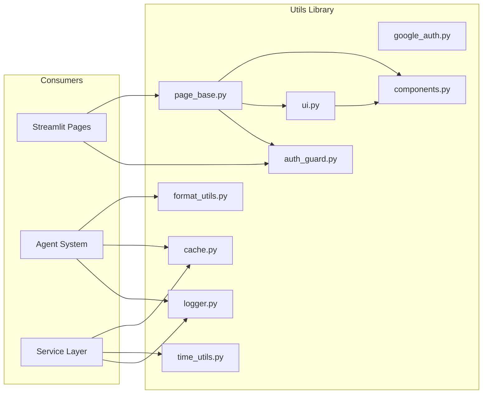
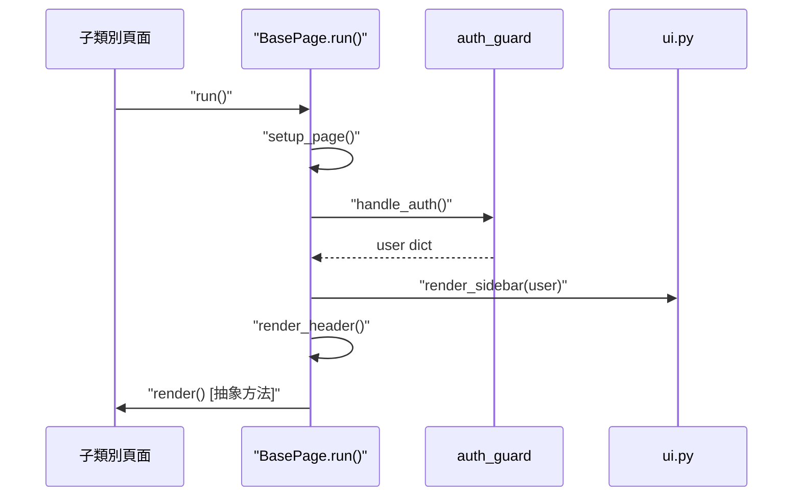

# 工具函式庫指南 (Utils Library Guide)

## 版本紀錄 (Version History)

| Date | Version | Description | Author |
| :--- | :--- | :--- | :--- |
| 2026-02-26 | v1.1 | **Theme System v4.3**: 更新 `ui.py` 主題系統說明 — OS 自動偵測、22 design tokens、手動切換優先 | Antigravity |
| 2026-03-14 | v1.2 | **Auth v5.0**: 更新 `google_auth.py` 與 `auth_guard.py` 以支援 FastAPI Auth Hub (port 8000) | Antigravity |
| 2026-02-21 | v1.0 | 初版：涵蓋 10 個工具模組的完整分類與 API 說明 | Antigravity |

---

## 🇹🇼 概述

`src/utils/` 是系統的**共用工具函式庫**，提供跨模組使用的基礎設施功能。這些工具按職責可分為以下類別：

| 類別 | 模組 | 說明 |
| :--- | :--- | :--- |
| 🔐 認證類 | `auth_guard.py`, `google_auth.py` | 身分驗證與 OAuth 流程 |
| 🎨 UI 類 | `ui.py`, `components.py`, `page_base.py` | Streamlit 前端元件與頁面框架 |
| 📝 格式化類 | `format_utils.py` | Agent 輸出格式化 |
| 💾 快取類 | `cache.py` | Redis 回應快取 |
| ⏰ 時間類 | `time_utils.py` | 時區管理與時間轉換 |
| 📊 日誌類 | `logger.py` | 結構化 JSON 日誌與 OpenTelemetry 整合 |

---

## 架構總覽 (Architecture Overview)



---

## 🔐 認證類 (Authentication)

### `auth_guard.py` — 統一認證閘道

提供 Streamlit 頁面的統一認證入口，防止未驗證時的 UI 閃爍問題。

#### `auth_guard.py` 核心函式

| 函式 | 簽名 | 說明 |
| :--- | :--- | :--- |
| `require_authentication` | `() -> dict` | 統一認證閘道，回傳使用者資訊或中止執行 |

#### `auth_guard.py` 認證狀態流程

```mermaid
stateDiagram-v2
    [*] --> LOADING: 初始化
    LOADING --> UNAUTHENTICATED: st.context.cookies 無 Token
    LOADING --> AUTHENTICATED: st.context.cookies 有效
    UNAUTHENTICATED --> Login_UI: 使用者點擊登入
    Login_UI --> FastAPI_OAuth: 導向 port 8000
    FastAPI_OAuth --> Google_Auth: 獲取授權
    Google_Auth --> FastAPI_Callback: 獲取 Token & Set-Cookie
    FastAPI_Callback --> AUTHENTICATED: 導向 port 8501
    AUTHENTICATED --> Resolve_UUID: 查詢/建立使用者
    Resolve_UUID --> "[*]: 回傳 user dict"
```

#### 回傳值

回傳包含以下欄位的 `dict`：
- `email` — 使用者電子郵件
- `name` — 使用者名稱
- `id` — 系統內部 UUID（v4.0 Patch 自動解析）

> **重要**：若使用者首次登入，會自動透過 `AlchemyUserRepository.create_user()` 建立帳號。

---

### `google_auth.py` — Google OAuth 2.0 整合

完整的 Google OpenID Connect 認證流程實作，支援 Cookie 持久化。

#### `google_auth.py` 核心類別：`GoogleAuth`

| 方法 | 說明 |
| :--- | :--- |
| `__init__(secret_credentials_path, redirect_uri, cookie_key, ...)` | 初始化 OAuth 設定 |
| `login()` | 渲染 `<a href='.../api/auth/login'>` 標籤以啟動後端認證流程 |
| `check_authentification()` | 使用 `st.context.cookies` 同步檢查瀏覽器 Token |
| `logout()` | 清除 Session 並導向後端 `api/auth/logout` 清除 Cookie |
| `get_current_user()` | 從已驗證的 Token 解析使用者資訊 |

#### `google_auth.py` 特性

- **FastAPI Auth Hub**: 認證邏輯完全移交給 `mcp_server` (port 8000)，解決 Streamlit iframe 沙盒限制。
- **原生 Set-Cookie**: 利用 HTTP 層級的 `Set-Cookie` 標頭確保登入狀態的 7 天持久化。
- **同步驗證**: 捨棄非同步的 React Component，改用 `st.context.cookies` 進行極速驗證。

---

## 🎨 UI 類 (User Interface)

### `ui.py` — UI 輔助函式與主題支援

提供 Streamlit 前端的核心 UI 功能，包含主題切換、CSS 載入與側邊欄渲染。

#### 核心函式

| 函式 | 說明 |
| :--- | :--- |
| `safe_page_link(page, label, icon, ...)` | 安全的頁面連結（相容 Streamlit < 1.31.0） |
| `safe_button(label, key, icon, ...)` | 安全的按鈕（相容 Streamlit < 1.35.0） |
| `safe_html(body)` | 安全的 HTML 渲染（相容 Streamlit < 1.34.0） |
| `load_design_system_css()` | 載入主題驅動的 CSS 與 JS 注入（含 OS 自動偵測） |
| `render_theme_switcher(key_suffix, icon_only)` | 渲染明暗主題切換按鈕（設定 `theme_manual=True` 防止 OS 覆蓋） |
| `render_sidebar(user, default_db_path)` | 渲染共用側邊欄（個人資料、主題、登出） |
| `get_plotly_template()` | 取得 Plotly 圖表的主題模板 |
| `render_top_profile(user)` | （已棄用）改用 `render_sidebar` |

#### 主題系統 (v4.3 Unified Theme)

```mermaid
flowchart LR
    A["OS prefers-color-scheme"] -->"|JS| B[""localStorage"]
    B -->"C[""session_state"]
    D["Manual Toggle"] -->|priority| C
    C -->"E[""ThemeService"]
    F["light.json / dark.json"] --> E
    E -->"G["":root CSS vars"]
```

- 22 個 Design Tokens：語意色彩（success/warning/danger/info + bg 變體）、陰影、漸層
- **OS 自動偵測**：透過 `prefers-color-scheme` JS 偵測 macOS 深色模式
- **手動優先**：使用者切換後設定 `theme_manual=True`，不再被 OS 覆蓋
- **WCAG AA**：Dark Mode 色彩經過對比度驗證（如 `#34D399` 取代 `#10B981`）
- CSS 變數透過 `ThemeService.generate_theme_css()` 動態注入 `:root`
- `design_system.css` 全面使用 `var(--saas-*)` 引用，零 hardcoded 色碼

---

### `components.py` — SaaS 風格元件庫

提供專業級的可重用 UI 元件，統一視覺風格。

#### 元件清單

| 元件 | 函式 | 說明 |
| :--- | :--- | :--- |
| 卡片容器 | `saas_card_start(title, subtitle, icon)` | 開始一個 SaaS 風格卡片 |
| 卡片結束 | `saas_card_end()` | 結束卡片容器 |
| 指標卡片 | `saas_metric(label, value, delta, delta_color, icon)` | 數值指標展示（含漲跌色彩） |
| 標籤徽章 | `saas_badge(text, style)` | 狀態標籤（success/warning/danger/info/neutral） |
| 警告橫幅 | `saas_alert(message, style, title)` | 提示訊息橫幅 |
| 區段標題 | `saas_section_header(title, subtitle, icon)` | 頁面區段標題 |

> 所有元件使用 CSS 變數（`var(--saas-*)`）確保主題一致性。

---

### `page_base.py` — 頁面基底類別（Template Method Pattern）

實作**樣板方法模式**，確保所有 Streamlit 頁面擁有一致的生命週期。

#### 核心類別：`BasePage`（抽象類別）

| 方法 | 類型 | 說明 |
| :--- | :--- | :--- |
| `__init__(title, icon, layout)` | 建構子 | 設定頁面標題、圖示與版面 |
| `setup_page()` | 具體方法 | 初始化資料庫、設定頁面組態、載入 CSS |
| `handle_auth()` | 具體方法 | 呼叫 `require_authentication()` |
| `render_sidebar()` | 具體方法 | 渲染共用側邊欄 |
| `render_header()` | 具體方法 | 渲染頁面標題 |
| `render()` | **抽象方法** | 子類別必須實作的主要頁面邏輯 |
| `run()` | 樣板方法 | 協調完整生命週期 |

#### 生命週期



---

## 📝 格式化類 (Formatting)

### `format_utils.py` — Agent 輸出格式化

將 Agent 的各種輸出格式（dict、str、JSON-like string）統一轉換為 Markdown。

#### 核心函式

| 函式 | 簽名 | 說明 |
| :--- | :--- | :--- |
| `format_agent_output` | `(output) -> str` | 智慧格式化 Agent 輸出為 Markdown |

#### 格式化規則

| 輸入類型 | 處理邏輯 |
| :--- | :--- |
| `dict` 含 `sentiment_score` | 格式化為情緒分析結果 |
| `dict` 含 `valuation` | 格式化為基本面估值結果 |
| 一般 `dict` | 轉為 `- **key**: value` 列表 |
| `str`（JSON-like） | 嘗試 `ast.literal_eval` 解析後遞迴格式化 |
| 一般 `str` | 直接回傳 |

---

## 💾 快取類 (Caching)

### `cache.py` — Redis 回應快取

基於 Redis 的 Agent 回應快取層，避免重複的 LLM 呼叫。

#### 核心類別：`ResponseCache`

| 方法 | 簽名 | 說明 |
| :--- | :--- | :--- |
| `__init__` | `(redis_url=None, ttl_hours=24)` | 初始化 Redis 連線，預設 TTL 24 小時 |
| `get` | `(agent_name, prompt) -> Optional[str]` | 查詢快取（Cache HIT/MISS） |
| `set` | `(agent_name, prompt, response)` | 寫入快取（含 TTL） |
| `clear` | `()` | 清除所有 `cache:response:*` 前綴的快取 |

#### 快取鍵生成

```bash
cache:response:{agent_name}:{sha256(agent_name:prompt)}
```

使用 SHA-256 雜湊確保鍵的唯一性與固定長度。

---

## ⏰ 時間類 (Time Management)

### `time_utils.py` — 時區管理與時間轉換

統一管理系統的時區設定，支援多來源優先順序。

#### 核心函式

| 函式 | 說明 |
| :--- | :--- |
| `get_timezone()` | 取得時區物件（優先順序：DB > 環境變數 > 預設 `Asia/Taipei`） |
| `get_current_time()` | 取得設定時區的目前時間 |
| `get_current_date_str()` | 取得 `YYYY-MM-DD` 格式的日期字串 |
| `format_time(dt, fmt)` | 格式化 datetime 為字串 |
| `get_current_utc_time()` | 取得 UTC 時間 |
| `convert_user_time_to_system_time(time_str)` | 將使用者時區的 `HH:MM` 轉為系統時區（用於排程） |
| `get_db_timezone()` | 從資料庫讀取顯示時區設定 |

#### 時區優先順序

```mermaid
graph LR
    DB[資料庫 Settings] -->"|優先| ENV[環境變數 TIMEZONE]"
    ENV -->"|備援| DEFAULT["""Asia/Taipei (預設")"]
```

---

## 📊 日誌類 (Logging)

### `logger.py` — 結構化 JSON 日誌

提供統一的日誌設定，支援 JSON 格式輸出與 OpenTelemetry 整合。

#### 核心函式

| 函式 | 簽名 | 說明 |
| :--- | :--- | :--- |
| `setup_logger` | `(name, level=INFO) -> Logger` | 建立或取得具名 Logger |

#### 特性

| 功能 | 說明 |
| :--- | :--- |
| **JSON 格式** | 使用 `python-json-logger` 輸出結構化日誌 |
| **欄位映射** | `levelname` → `level`, `asctime` → `timestamp`, `name` → `service.name` |
| **單例模式** | 同名 Logger 只建立一次，避免重複 Handler |
| **OpenTelemetry** | 若設定 `OTEL_EXPORTER_OTLP_ENDPOINT`，自動加入 OTLP Log Handler |
| **SigNoz 整合** | 透過 `BatchLogRecordProcessor` 批次匯出至 SigNoz |
| **測試相容性** | 自動偵測 `pytest` 環境並啟用 `propagate`，支援 `caplog` 測試 |

#### 環境變數

| 變數 | 說明 | 預設值 |
| :--- | :--- | :--- |
| `OTEL_EXPORTER_OTLP_ENDPOINT` | OTLP 匯出端點 | 無（停用 OTel） |
| `OTEL_SERVICE_NAME` | 服務名稱 | `investment-advisor` |

---

## 🇺🇸 Summary (English)

The **Utils Library** (`src/utils/`) provides shared infrastructure utilities organized into six categories:

- **Authentication** (`auth_guard.py`, `google_auth.py`): Unified auth gate with Google OAuth 2.0, cookie persistence, and auto user creation.
- **UI** (`ui.py`, `components.py`, `page_base.py`): Unified theme system (22 CSS tokens, OS auto-detection, WCAG AA dark mode), SaaS-style cards/metrics/badges, and Template Method page lifecycle.
- **Formatting** (`format_utils.py`): Smart Markdown formatting for diverse Agent output types.
- **Caching** (`cache.py`): Redis-based response cache with SHA-256 key generation and configurable TTL.
- **Time** (`time_utils.py`): Timezone management with DB > ENV > default priority and user-to-system time conversion.
- **Logging** (`logger.py`): Structured JSON logging with OpenTelemetry OTLP export to SigNoz.

## 🔗 Bidirectional Links
- **Frontend Architecture**: [[前端架構與UX層-Frontend-UX-Layer]]
- **Design Pattern - Template Method**: [[設計模式-樣板方法-Template-Method]]
- **Observability Standards**: [[系統可觀測性與通知規範-Observability-Notification-Standards]]
- **System Configuration**: [[系統設定與金鑰管理-System-Configuration]]
- **Tools Layer**: [[工具層指南-Tools-Layer-Guide]]
