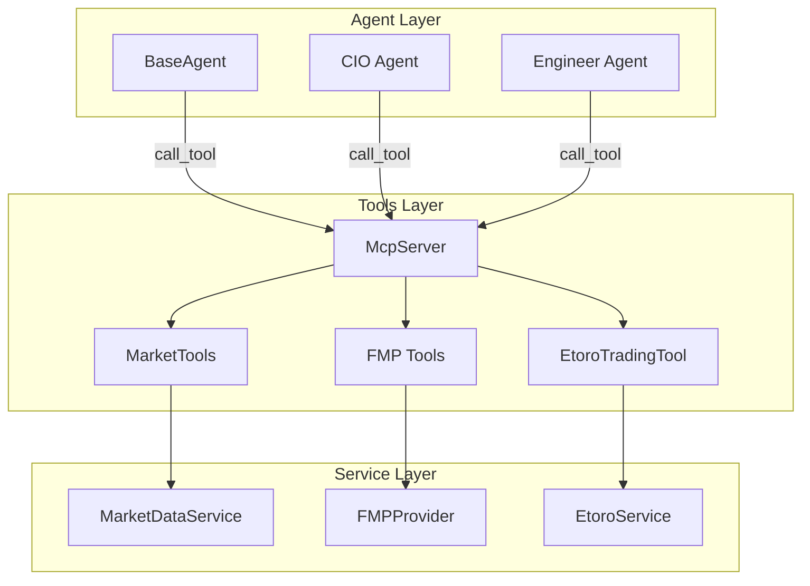

# 工具層指南 (Tools Layer Guide)

### 版本紀錄 (Version History)
| Date | Version | Description | Author |
| :--- | :--- | :--- | :--- |
| 2026-02-21 | v1.0 | 初版：涵蓋 MCP Server、Market Tools、FMP Tools、Etoro Tool | Antigravity |
| 2026-02-22 | v1.1 | 新增 GitHub Tools，優化 MCP Server 穩定性 | Antigravity |

---

## 🇹🇼 概述

Tools 層（`src/tools/`）是 **Agent 系統與外部能力之間的橋樑**。每個工具模組將底層服務（Service Layer / Data Provider）封裝為標準化的 **MCP Tool**，使 AI Agent 能夠透過統一的 `McpServer` 介面呼叫這些功能，而無需直接依賴底層實作。

### 設計理念

1. **統一介面**：所有工具透過 `McpServer.call_tool(name, arguments)` 呼叫，Agent 不需要知道底層是 REST API 還是本地函式。
2. **自動 Schema 生成**：`McpTool` 可從函式的 type hints 自動產生 JSON Schema，減少手動維護成本。
3. **可組合性**：不同的工具模組可以註冊到同一個 `McpServer`，也可以各自獨立運行。
4. **安全約束**：交易類工具（如 `EtoroTradingTool`）內建風控檢查，防止 Agent 無限制下單。

---

## 架構總覽 (Architecture Overview)



---

## 模組詳解 (Module Reference)

### 1. MCP Server (`mcp_server.py`)

MCP（Model Context Protocol）Server 是工具層的核心基礎設施，提供工具的註冊、列舉與呼叫機制。

#### 核心類別

| 類別 | 說明 |
| :--- | :--- |
| `McpTool` | 單一工具的封裝，包含名稱、描述、執行函式與 JSON Schema |
| `McpServer` | 工具註冊中心，管理多個 `McpTool` 實例 |

#### McpTool API

| 方法 | 簽名 | 說明 |
| :--- | :--- | :--- |
| `__init__` | `(name, description, func, schema=None)` | 建立工具；若未提供 schema 則自動從 type hints 生成 |
| `execute` | `(**kwargs) -> Any` | 執行底層函式 |
| `to_dict` | `() -> Dict` | 輸出工具定義（含 `input_schema`），供 LLM 使用 |
| `_generate_schema` | `(func) -> Dict` | 從函式簽名自動推導 JSON Schema |

#### McpServer API

| 方法 | 簽名 | 說明 |
| :--- | :--- | :--- |
| `__init__` | `(name="LocalMCP")` | 建立伺服器實例 |
| `register_tool` | `(tool: McpTool)` | 註冊一個工具 |
| `list_tools` | `() -> List[Dict]` | 列出所有已註冊工具的定義 |
| `call_tool` | `(name, arguments) -> Any` | 依名稱呼叫工具並傳入參數 |

#### 自動 Schema 生成規則

| Python Type Hint | JSON Schema Type |
| :--- | :--- |
| `str` | `string` |
| `int` | `integer` |
| `float` | `number` |
| `bool` | `boolean` |
| `dict` | `object` |
| `list` | `array` |

---

### 2. Market Tools (`market_tools.py`)

封裝 `MarketDataService` 為 Agent 可用的市場數據工具集。

#### 註冊的工具

| 工具名稱 | 說明 | 參數 |
| :--- | :--- | :--- |
| `get_current_price` | 取得股票即時價格 | `ticker: str` |
| `get_news` | 取得特定股票的近期新聞 | 依 `MarketDataService.get_news` |
| `get_financials` | 取得基本面財務數據 | 依 `MarketDataService.get_financials` |
| `get_technical_indicators` | 取得技術指標（RSI, MACD, SMA） | 依 `MarketDataService.get_technical_indicators` |

#### 工廠函式

```python
def create_market_server(market_service=None) -> McpServer:
    """建立並回傳已註冊所有市場工具的 McpServer 實例。"""
```

> **注意**：`get_current_price` 內部有 wrapper 邏輯，可接受單一 ticker 字串或 list，統一轉為 list 後呼叫 `get_current_prices()`。

---

### 3. FMP Tools (`fmp_tools.py`)

將 `FMPProvider` 的進階功能註冊為 MCP 工具，專注於板塊分析與公司資訊。

#### 註冊的工具

| 工具名稱 | 說明 | 參數 |
| :--- | :--- | :--- |
| `get_sector_performance` | 取得所有市場板塊的即時漲跌幅 | 無 |
| `get_stock_peers` | 查詢特定股票的競爭對手/同業 | `ticker: str` |
| `get_company_profile` | 取得公司基本資料（板塊、產業、市值、CEO） | `ticker: str` |

#### 使用方式

```python
from src.tools.fmp_tools import register_fmp_tools
from src.data.providers.fmp_provider import FMPProvider

server = McpServer(name="FMPData")
provider = FMPProvider()
register_fmp_tools(server, provider)
```

---

### 4. Etoro Trading Tool (`etoro_tool.py`)

提供 AI Agent 在 eToro 平台上執行交易的能力，**內建風控約束**。

#### 核心類別：`EtoroTradingTool`

| 方法 | 簽名 | 說明 |
| :--- | :--- | :--- |
| `__init__` | `(user_id: str)` | 初始化，綁定特定使用者 |
| `get_portfolio` | `() -> Dict` | 取得目前投資組合狀態 |
| `place_order` | `(ticker, action, amount, leverage=1, reason="AI Decision") -> Dict` | 下單（BUY/SELL），含原因記錄 |
| `check_status` | `() -> Dict` | 檢查交易是否啟用及風控狀態 |

#### 安全機制

- **Action 驗證**：僅接受 `BUY` 或 `SELL`，其他值回傳錯誤。
- **風控約束**：透過 `EtoroService.check_constraints()` 檢查最大交易次數與熔斷機制。
- **操作日誌**：每筆交易請求都會記錄 Agent 的決策原因（`reason` 參數）。

---

### 5. GitHub Tools (`github_service.py`)

提供 Agent 與 GitHub API 互動的能力，用於管理 Issue、PR 及搜尋儲存庫。

#### 註冊的工具

| 工具名稱 | 說明 | 參數 |
| :--- | :--- | :--- |
| `github_list_issues` | 列出儲存庫中的 Issues | `repo_full_name: str`, `state: str` |
| `github_get_issue_detail` | 取得特定 Issue 的詳細內容與評論 | `repo_full_name: str`, `issue_number: int` |
| `github_create_issue_comment` | 在 Issue 下方新增評論 | `repo_full_name: str`, `issue_number: int`, `body: str` |
| `github_search_repos` | 搜尋 GitHub 儲存庫 | `query: str` |

#### 配置要求

需在環境變數或資料庫 Settings 中設定 `GITHUB_TOKEN` 或 `source_github_api_key`。

---

## 與其他系統的關係

| 相關系統 | 關係 | 參考文件 |
| :--- | :--- | :--- |
| Agent 系統 | Agent 透過 `McpServer` 呼叫工具 | [[代理人戰略協定-Agent-Swarm-Protocol]] |
| Skills 系統 | Skills 也透過 `McpTool` 註冊到 Agent | [[Agent技能系統-Agent-Skills-System]] |
| Service Layer | Tools 封裝 Service 為標準化介面 | [[服務層開發指南-Service-Layer-Blueprints]] |
| 交易系統 | `EtoroTradingTool` 封裝交易服務 | [[交易系統架構-Trading-Architecture]] |
| 數據提供者 | `FMP Tools` 直接使用 `FMPProvider` | [[數據攝取架構-Data-Ingestion-Architecture]] |

---

## 🇺🇸 Summary (English)

The **Tools Layer** (`src/tools/`) bridges AI Agents with external capabilities through a standardized **MCP (Model Context Protocol)** interface. Key modules:

- **`McpServer`** / **`McpTool`**: Core infrastructure for tool registration, discovery, and invocation with auto-generated JSON schemas.
- **`MarketTools`**: Wraps `MarketDataService` (prices, news, financials, technicals).
- **`FMP Tools`**: Registers FMP-specific endpoints (sector performance, peers, company profiles).
- **`EtoroTradingTool`**: Enables AI-driven trading on eToro with built-in risk controls (action validation, circuit breaker, audit logging).

## 🔗 Bidirectional Links
- **Agent Protocol**: [[代理人戰略協定-Agent-Swarm-Protocol]]
- **Skills System**: [[Agent技能系統-Agent-Skills-System]]
- **Service Layer**: [[服務層開發指南-Service-Layer-Blueprints]]
- **Trading Architecture**: [[交易系統架構-Trading-Architecture]]
- **Data Ingestion**: [[數據攝取架構-Data-Ingestion-Architecture]]
