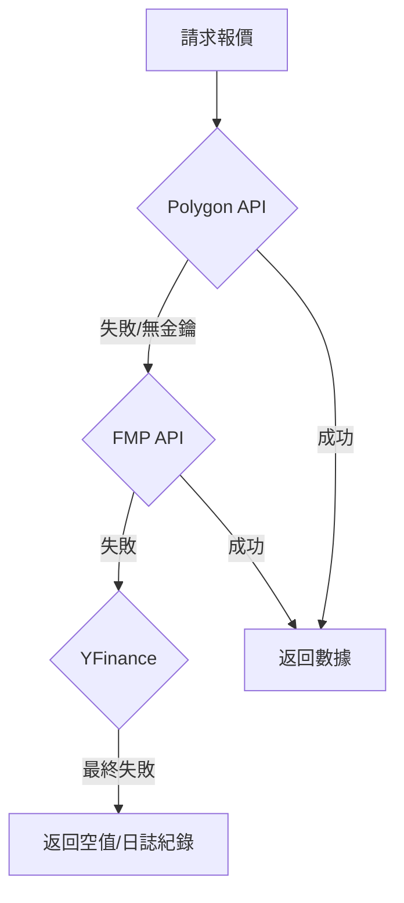

# 服務層開發指南 (Service Layer Blueprints)

> **[繁體中文 (Traditional Chinese)](#zh) | [English](#en)**

### 版本紀錄 (Version History)
| Date | Version | Description | Author |
| :--- | :--- | :--- | :--- |
| 2026-02-15 | v3.6 | Added Leverage Engine & Bilingual Code Standards | Neo |
| 2026-02-14 | v3.5 | Added RiskKeywordRepository, Sentinel 4D triggers, weighted keywords, Tavily pipeline | Neo |
| 2026-02-14 | v3.5 | Full rewrite — 27 services documented, Multi-Broker, Sentinel/Council, Memory | Neo |
| 2024-01-04 | v1.0 | Initial Release (3 services) | Neo |

---

<a id="zh"></a>

## 🇹🇼 服務層開發指南 (v3.5)

本文件依據 [文件框架定義](文件框架定義-Document-Frameworks) 編寫，詳解 `src/services/` 下核心業務邏輯的實作規範。

### 1. 架構概覽 (Overview)
服務層作為「領域邏輯」的承載者，負責協調 Repository 與外部 API。
- **無狀態設計 (Stateless)**: 不持有用戶狀態，透過參數或 Repository 傳入。
- **故障轉移 (Failover)**: `MarketDataService` 等核心服務具備多層級 Provider 退避策略。
- **依賴注入 (DI)**: Service 接受 Repository 介面注入，Details 見 [DI Pattern](設計模式-依賴注入-DI-Pattern)。

### 2. 服務總覽 (Service Registry)

#### 2.1 數據與市場 (Data & Market)

| 服務 | 檔案 | 核心職責 |
| :--- | :--- | :--- |
| `MarketDataService` | `market_data_service.py` | 聚合 Polygon/FMP/YFinance，含退避策略與 TTL=300s 快取。 |
| `FredService` | `fred_service.py` | FRED 總經指標 (利率/CPI/GDP)。 |
| `SearchService` | `search_service.py` | Tavily (主) + DuckDuckGo (備) 搜尋服務。 |
| `BrowserService` | `browser_service.py` | 網頁內容擷取與解析。 |

**退避策略 (Failover Strategy)**:


#### 2.2 多券商與風控 (Multi-Broker & Risk)

| 服務 | 檔案 | 核心職責 |
| :--- | :--- | :--- |
| `BrokerFactory` | `broker_factory.py` | 依據 `preferred_broker` 設定建立 `IBroker` 實例 (Factory Pattern)。 |
| `EtoroService` | `etoro_service.py` | Etoro Bridge API 整合 — 帳戶/持倉/下單/歷史同步。 |
| `FutuService` | `futu_service.py` | 富途 futu-api 整合 — 美港股交易與行情。 |
| `IbkrService` | `ibkr_service.py` | IBKR ib_insync 骨架 — 多資產交易 (Planned)。 |
| `PortfolioAggregatorService` | `portfolio_aggregator_service.py` | 跨券商統一持倉、NLV 與資產配置。 |

#### 2.3 Agent 引擎 (Agent Engine)

| 服務 | 檔案 | 核心職責 |
| :--- | :--- | :--- |
| `WorkflowService` | `workflow_service.py` | 主循環引擎 — Daily/Weekly 報告生成 (Template Method)。 |
| `TaskPlanningService` | `task_planning_service.py` | DAG 任務分解、複雜度評分、動態模型路由。 |
| `HRService` | `hr_service.py` | 360° 互評、Zombie Agent 偵測、績效追蹤。 |
| `RefinementService` | `refinement_service.py` | DSPy Prompt 自動優化 (Engineer Agent 後端)。 |
| `EvaluationService` | `evaluation_service.py` | Agent 產出品質評估。 |

#### 2.4 監控與仲裁 (Monitoring & Arbitration)

| 服務 | 檔案 | 核心職責 |
| :--- | :--- | :--- |
| `SentinelService` | `sentinel_service.py` | 7×24 市場事件監聽，**4 觸發維度**: VIX/持倉異動/加權新聞 (DB 關鍵字)/宏觀指標。 |
| `CouncilService` | `council_service.py` | 碎形辯論 (Fractal Debate) — 對每檔持倉執行多角度質疑。 |

#### 2.5 持久化與記憶 (Persistence & Memory)

| 服務 | 檔案 | 核心職責 |
| :--- | :--- | :--- |
| `MemoryService` | `memory_service.py` | 統一記憶讀寫介面，支援對話/分析上下文。 |
| `MemoryFactory` | `memory_factory.py` | 依環境自動選擇 Redis (生產) 或 SQLite (本地) 後端。 |
| `TransactionService` | `transaction_service.py` | 交易記錄 CRUD、Atomic 匯入。 |
| `IngestionService` | `ingestion_service.py` | CSV 匯入 (交易/股利)、全有或全無。 |
| `RiskKeywordRepository` | `risk_keyword_repository.py` | 風險關鍵字 CRUD + 命中追蹤 + 復盤分析 (30+ 預設種子)。 |

#### 2.6 Dashboard & UI 支援 (UI Support)

| 服務 | 檔案 | 核心職責 |
| :--- | :--- | :--- |
| `AnalyticsService` | `analytics_service.py` | NLV/Leverage/P&L 確定性計算 (0% 幻覺)。**[v3.6 New]** Leverage Engine. |
| `DashboardService` | `dashboard_service.py` | Dashboard 數據聚合與即時指標。 |
| `PerformanceService` | `performance_service.py` | 歷史績效追蹤與趨勢分析。 |
| `SettingsService` | `settings_service.py` | 系統設定 CRUD (SQLite-backed)。 |
| `ThemeService` | `theme_service.py` | CSS 主題管理 (Dark/Light)。 |
| `BacktestService` | `backtest_service.py` | 策略回測引擎。 |

#### 2.7 排程與通知 (Scheduling & Notifications)

| 服務 | 檔案 | 核心職責 |
| :--- | :--- | :--- |
| `SchedulerService` | `scheduler_service.py` | Cron 排程 — 自動日報/週報生成。 |
| Notifier | `src/notifier.py` | LINE Bot 推送 (日報/週報/警報)。 |

### 3. 代理人執行引擎 (Agent Execution Engine)

#### 3.1 ReAct 思考機制 (Think-Act-Observe)
實現於 `BaseAgent.run_tool_loop`：
1.  **Regex 解析**: 解析 `CALL: tool_name({"arg": "val"})` 或 `SEARCH: "query"`。
2.  **McpServer 調度**: 優先搜尋 Local Skills，無則調用 Remote MCP。
3.  **上下文拼接**: 工具輸出封裝為 `System: [Tool Output]` 並重新注入 LLM 歷史。

#### 3.2 A2A 實體化路徑 (Agent Instantiation)
1.  **Factory 介入**: `AgentFactory` 根據名稱動態建立 Agent (支援 `tier` 參數)。
2.  **依賴注入**: 自動注入 `feedback_repo` 與 `market_tools`。
3.  **同步執行**: 目前為同步阻塞調用，適合確定性研究路徑。

#### 3.3 任務規劃引擎 (Task Planning)
*詳見: [任務規劃與執行引擎](任務規劃與執行引擎-Task-Planning-Engine)*
- **核心**: Goal → DAG 分解 → Complexity Scoring → Model Tier Selection。
- **模型路由**: Fast (Flash) / Smart (Pro) / Advanced (Thinking)。

### 4. 槓桿引擎 (Leverage Engine) - v3.6 新增

位於 `AnalyticsService`，負責精確計算帳戶健康度指標：

- **TNV (Total Nominal Value)**: 總名義價值 = $\sum |Position \times Price|$
- **NLV (Net Liquidity Value)**: 淨清算價值 = $Cash + \sum (Position \times Price)$
- **Leverage Ratio**: $TNV / NLV$

**代碼範例 (符合雙語註解規範)**:
```python
def calculate_metrics(self, current_prices, user_id):
    """
    Calculate Leverage Metrics based on current holdings.
    計算基於當前持倉的槓桿指標。
    """
    # 1. Calculate Total Nominal Value (TNV)
    # 1. 計算總名義價值 (TNV)
    tnv = 0.0
    for ticker, qty in holdings:
        price = current_prices.get(ticker, 0.0)
        tnv += abs(qty * price)
    
    # ... (omitted)
    
    return {"leverage_ratio": tnv / nlv}
```

### 5. NFR
- **響應時間**: P95 本地延遲 < 500ms (不含 LLM)。
- **並發**: `ThreadPoolExecutor` 支援 50+ 標的並行分析。

---

<a id="en"></a>

## 🇺🇸 Service Layer Blueprints (v3.6)

### 1. Architecture
- **Model-Service Decoupling**: Services interact with Pydantic models, never raw SQL.
- **Provider Aggregation**: Multiple data sources under a single `MarketDataService`.
- **Factory Pattern**: `BrokerFactory`, `MemoryFactory`, `AgentFactory` for runtime abstraction.

### 2. Service Categories (27 Services)
- **Data & Market** (4): MarketData, Fred, Search, Browser
- **Multi-Broker** (5): BrokerFactory, Etoro, Futu, IBKR, PortfolioAggregator
- **Agent Engine** (5): Workflow, TaskPlanning, HR, Refinement, Evaluation
- **Monitoring** (2): Sentinel (4D Multi-Trigger + Weighted Risk Keywords), Council
- **Persistence** (5): Memory, MemoryFactory, Transaction, Ingestion, **RiskKeyword**
- **UI Support** (6): Analytics (**Leverage Engine v3.6**), Dashboard, Performance, Settings, Theme, Backtest
- **Scheduling** (1): Scheduler + Notifier

### 3. Performance
- **Local Latency**: < 500ms (P95).
- **Throughput**: 50+ tickers in parallel.

## 🔗 Bidirectional Links
- **Architect View**: [System Landscape](系統全景圖-System-Landscape)
- **Dev Guide**: [Local Dev Setup](環境設定與本地開發-Environment-Local-Dev)
- **Patterns**: [Design Patterns Intro](設計模式導讀-Design-Patterns-Intro)
- **Broker Guide**: [Broker Integration](券商整合指南-Broker-Integration-Guide)
