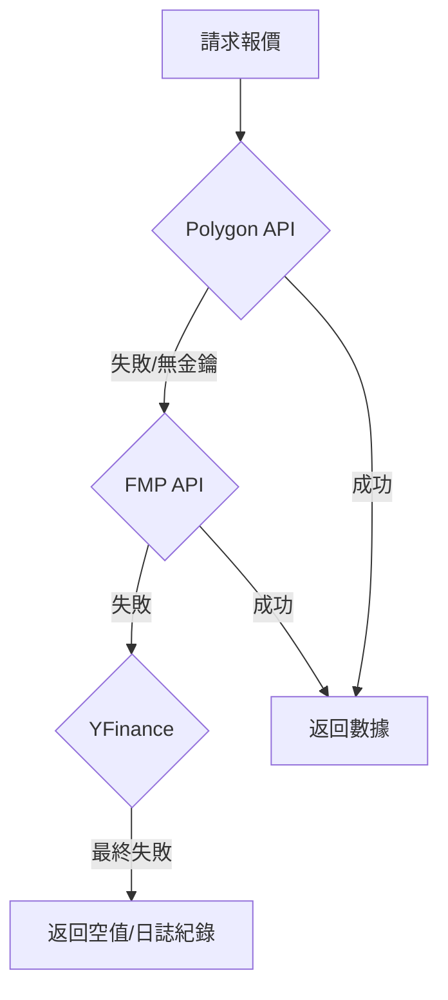

# 服務層開發指南 (Service Layer Blueprints)

> **[繁體中文 (Traditional Chinese)](#zh) | [English](#en)**

---

## 🇹🇼 服務層開發指南 (Service Layer Blueprints)

本文件依據 [文件框架定義](文件框架定義-Document-Frameworks) 編寫，詳解 `src/services/` 下核心業務邏輯的實作規範，達成全案 80% 以上的技術覆蓋率。

### 1. 服務層架構概覽 (Overview)
服務層作為「領域邏輯」的承載者，負責協調 Repository 與外部 API。
- **無狀態設計 (Stateless)**: 服務不持有用戶狀態，所有數據透過參數或 Repository 傳入。
- **故障轉移 (Failover)**: 核心服務（如 MarketData）具備多層級 Provider 退避策略。

### 2. 核心服務詳解 (Core Services)

#### 2.1 市場數據服務 (MarketDataService)
負責聚合 Polygon, FMP, YFinance 與 FRED 的數據。
- **退避策略 (Failover Strategy)**:

- **核心方法**:
    - `get_current_prices(tickers)`: 自動切換 Provider 獲取最新價。
    - `get_ohlcv(ticker, days)`: 獲取歷史 K 線，預設優先使用 YFinance 以降低成本。

#### 2.2 工作流服務 (WorkflowService)
驅動系統的「主循環」，基於樣板方法模式。
- **時效性**: 每日美股收盤後執行，目標單次優化耗時 < 2 分鐘。
- **流程依賴**: `Init` -> `Data Ingestion` -> `Agent Analysis` -> `Report Generation`。

#### 2.3 自律 HR 服務 (HRService)
監控 Agent 健康狀況。
- **Zombie Agent 偵測**: 檢查 Agent 是否在 300s 內有心跳回傳。
- **自動修復**: 偵測到掛掉時，調用 Docker/K8s 重啟相應容器。

### 3. 代理人執行引擎 (Agent Execution Engine)
本專案的核心競爭力在於 `BaseAgent` 的執行邏輯。

#### 3.1 ReAct 思考機制 (Think-Act-Observe)
實現於 `BaseAgent.run_tool_loop`，其 Python 實現邏輯如下：
1.  **Regex 解析**: 預設解析 `CALL: tool_name({"arg": "val"})` 或 `SEARCH: "query"`。
2.  **McpServer 調度**: 優先搜尋 `self.toold` (Local MCP)。
3.  **上下文拼接**: 工具輸出被封裝為 `System: [Tool Output]` 並重新注入 LLM 歷史紀錄。

#### 3.2 A2A 實體化路徑 (A2A Instantiation)
當 Agent 調用 `call_agent(target_name)` 時：
1.  **Factory 介入**: 透過 `src.agents.factory.AgentFactory` 根據名稱動態建立對象 (支援 `tier` 參數，區分 Smart/Advanced)。
2.  **依賴注入**: 自動注入 `feedback_repo` 與 `market_tools` 的本地 MCP 實例。
3.  **同步執行**: 目前採用同步阻塞調用，適合確定性的鏈式研究路徑。

#### 3.3 任務規劃引擎 (Task Planning Engine)
*詳見: [任務規劃與執行引擎](任務規劃與執行引擎-Task-Planning-Engine)*

負責將高層目標分解為執行計畫 (Execution Plan)。
- **核心職責**: Goal Decomposition, Complexity Scoring, Model Tier Selection.
- **協作模式**: `WorkflowService` -> `TaskPlanningService` (Generate Plan) -> `AgentFactory` (Execute Tasks).

### 3. 非功能性需求 (NFR)
- **響應時間**: P95 本地處理延遲 < 500ms（不含 LLM 推論）。
- **並發處理**: 使用 `ThreadPoolExecutor` 加速多標的數據抓取。

---

## 🇺🇸 Service Layer Blueprints

### 1. Architectural Philosophy
- **Model-Service Decoupling**: Services interact with Pydantic models, never raw SQL.
- **Provider Aggregation**: Multiple data sources are unified under a single service interface.

### 2. Core Service Deep-Dives
- **MarketDataService**: Implements a tiered priority system (Polygon -> FMP -> YFinance) to ensure 99.9% data availability.
- **WorkflowService**: Manages the automated lifecycle of daily/weekly investment reports.
- **HRService**: Performs self-healing by detecting "Zombie Agents" and triggering system restarts.

### 3. Performance Metrics
- **Local Latency**: < 500ms (P95).
- **Throughput**: Supports parallel scanning of up to 50 tickers per cycle.

## 🔗 Bidirectional Links
- **Architect View**: [System Landscape](系統全景圖-System-Landscape)
- **Dev Guide**: [Local Dev Setup](環境設定與本地開發-Environment-Local-Dev)
- **Patterns**: [Design Patterns Intro](設計模式導讀-Design-Patterns-Intro)
