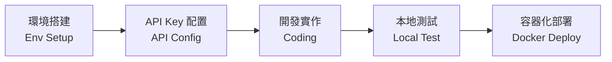

# 環境設定與本地開發 (Environment & Local Dev)

> **[繁體中文 (Traditional Chinese)](#zh) | [English](#en)**

<a id="zh"></a>

## 🇹🇼 環境設定與本地開發指南

本文件引導開發者建置穩定的 Python 開發環境，並熟悉核心 CLI 工具的操作。

### 1. 本地開發架構 (Local Development Architecture)

#### 💻 本地整合開發流程 (Local Development Workflow)
> [!NOTE]
> 流程圖展示了從環境搭建到代碼測試的標準開發循環。
> This diagram illustrates the standard development cycle from environment setup to code testing.



<details>
<summary><b>🐍 點擊查看 Python 與 Conda 詳細設定 (Click for Python & Conda Setup)</b></summary>

#### Python 開發環境 (推薦使用 Conda)
為了避免套件衝突，建議使用 **Miniconda**。
```bash
# 建立虛擬環境
conda create -n ai-advisor python=3.11 -y
conda activate ai-advisor

# 安裝依賴項
pip install -r requirements.txt
```

</details>

### 2. 命令行手冊 (CLI Reference)

<details>
<summary><b>⌨️ 點擊查看 CLI 詳細參數 (Click for Detailed CLI Flags)</b></summary>

`src/cli.py` 是本系統的統一進入點，支援多種運作模式：

- **排程模式 (`scheduler`)**: 啟動長駐守護進程，自動定時執行任務。
- **每日/每週模式 (`daily` / `weekly`)**: 手動觸發分析。
    - `python src/cli.py --mode weekly --user_id <EMAIL>`
- **回測模式 (`backtest`)**: 針對特定代號執行歷史模擬。
    - `python src/cli.py --mode backtest --ticker AAPL`
- **優化模式 (`optimize`)**: 觸發 DSPy 提示詞優化管道。

</details>

### 3. 本地開發工作流
1.  **資料庫控制**: 預設使用 SQLite。若需查看資料，建議使用 VS Code 的 `SQLite Viewer` 套件。
2.  **前端調試**: 修改代碼後，Streamlit 會偵測變更並提示重新載入。
3.  **日誌監控**: 執行 `tail -f logs/system.log` (需先建立目錄) 查看 Agent 推理細節。

---

<a id="en"></a>

## 🇺🇸 Environment & Local Dev

### 1. Setup (Conda Preferred)
Use **Miniconda** for better stability on macOS/Windows.
- `conda create -n ai-advisor python=3.11 -y`
- `conda activate ai-advisor`
- `pip install -r requirements.txt`

### 2. CLI Reference
`src/cli.py` is the main entry point:
- **Scheduler**: `python src/cli.py --mode scheduler`
- **Manual Reports**: Run with `--mode daily` or `--mode weekly --dry-run`.
- **Backtesting**: Use `--mode backtest --ticker <SYMBOL>`.
- **Optimizer**: Use `--mode optimize` to refine agent prompts.

### 3. Local Workflow
- **DB**: SQLite stored in `data/portfolio.db`.
- **Logs**: Run `tail -f logs/system.log` to monitor Agent activities.

## 🔗 See Also
- [Database & Git Standards](wiki/03_開發者指南-Developer_Guide/資料庫設計與代碼規範-Database-Git-Standards.md)
- [Testing & External Services](wiki/03_開發者指南-Developer_Guide/測試與外部服務整合-Testing-External-Services.md)
