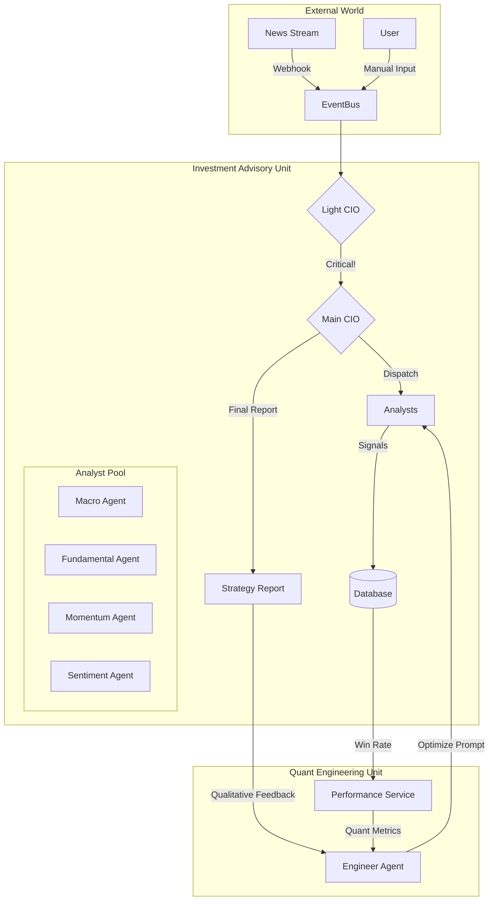
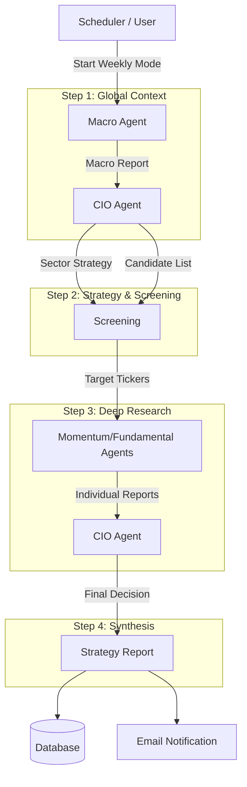

# System Overview

> **[English](#english) | [繁體中文 (Traditional Chinese)](#traditional-chinese)**

## 🇺🇸 System Overview

### Goal
Build a **Dual-Unit** intelligent investment platform involving an "Investment Advisory Unit" for strategy and an "HR Unit" for continuous optimization.

### Architecture (v3.1 - Quant Optimized)
The system consists of two parallel units:

#### 1. Investment Advisory Unit
- **Event Bus**: Central Integration Hub receiving Webhooks and User Inputs.
- **Light CIO (Router)**: Uses **Flash Model** to filter noise.
- **Deep CIO (Decision Maker)**: Uses **Deep Model** (Gemini 1.5 Pro) for complex decisions.
- **Analyst Pool**: Fundamental, Momentum, Macro Agents + **Sentiment Agent (New)**.

#### 2. Quant Feedback Unit (Self-Correction)
- **Engineer Agent**: A specialized "Meta-Agent" (Head of Quant Dev).
- **PerformanceService**: Tracks every signal ("BUY"/"SELL") and computes Win Rate/Alpha.
- **Refinement Engine**: Runs batch attribution analysis, validating past signals against real market data (`MarketDataService`) to update `outcome_score`.
- **Optimization Loop**:
    1.  Refinement Engine scores past recommendations.
    2.  Ingests CIO's qualitative feedback.
    3.  Engineer updates Agent Prompts via **DSPy** to fix weaknesses.

### Core Workflows
1.  **Daily Tactical**: Momentum + Sentiment -> Signal -> CIO Review.
2.  **Weekly Strategy**: Macro + Fundamental -> Rebalancing -> Report.
3.  **Quant Loop**: Weekly Performance Review -> Agent Optimization.

### Codebase Structure
- **src/**: Main Source Code.
    - `agents/`: AI Agents (`CIOAgent`, `EngineerAgent`) and Factory (`AgentFactory`).
    - `data/`: Data access & Ingestor.
    - `pages/`: Streamlit UI (`4_Advisor_Chat.py`, etc).
    - `services/`: Business Logic (`WorkflowService`, `PerformanceService`).
    - `workflow.py`: Entry point delegating to `WorkflowService`.
- **tests/**: Mirror of `src/` (Global Mocks used).
- **data/**: SQLite DB location.
- **k8s/**: Kubernetes manifests.

### Design Patterns (v3.1)
- **Template Method**: `BaseWorkflow` defines the skeleton, subclasses (`DailyWorkflow`) implement specific logic.
- **Factory Pattern**: `AgentFactory` centralizes agent creation and dependency injection.
- **Dependency Injection**: Services and Agents accept repositories/deps via constructor for testability.
- **Observer Pattern**: Engineer observes Agent performance.

---

## 🇹🇼 系統概觀 (System Overview)

### 目標 (Goal)
構建一個**雙部門制 (Dual-Unit)** 的智慧化投資顧問平台。不僅模擬華爾街的「投資顧問部」進行決策，更引入「量化工程部」透過大數據與 Prompt Engineering 持續優化 AI 員工績效。

### 為什麼 (Why)
- **成本與效能平衡**: 透過 **Flash/Deep 雙軌制**，在日常監控使用低成本模型，僅在關鍵時刻調用高算力模型。
- **數據驅動優化**: 系統不應是黑盒子，應透過 **勝率 (Win Rate)** 與 **CIO 反饋** 自動修正邏輯。
- **制度化角色**: 每個 Agent 都有明確的華爾街職位定義 (如高盛分析師 vs 對沖基金經理)。

### 系統架構 (System Architecture v3.1)
本系統由兩個平行運作的單位組成：

#### 3.1 投資顧問部 (Investment Advisory Unit)
負責市場分析與策略輸出。
*   **Event Bus**: 系統整合中樞。
*   **Light CIO (Router)**: 使用 **Flash Model** 過濾噪音。
*   **Deep CIO (Decision Maker)**: 使用 **Deep Model** (如 Gemini 1.5 Pro) 進行複雜決策。
*   **Analyst Pool**: 包含 Momentum, Fundamental, Macro, Sentiment 四大專家。

#### 3.2 量化工程部 (Quant Engineering Unit)
負責系統自我優化 (Meta-Level Optimization)。
*   **Engineer Agent**: 首席量化開發者，負責修改其他 Agent 的大腦 (Prompt)。
*   **PerformanceService**: 記錄每一筆交易訊號，計算歷史勝率。
*   **Refinement Engine**: 負責歸因分析 (Attribution Analysis)，使用真實市場數據驗證過去訊號並更新分數。
*   **Optimization Loop**: 自我修正迴圈，確保系統越用越聰明。

### 3.3 架構圖 (Architecture Diagram)

### 3.4 板塊導向策略流程 (Sector-Based Strategy Workflow - v4)
每週報告生成時，執行以下四階段流程：

### 4. 核心功能流程 (Core Workflows)

#### A. 事件驅動分析 (Event-Driven - Daily)
1.  **Ingest**: 外部新聞/數據進入 Event Bus。
2.  **Filter**: Light CIO 判斷是否值得關注。
3.  **Dispatch**: 若關鍵，Deep CIO 指派特定 Agent (如 Macro Agent 分析降息)。
4.  **Synthesize**: CIO 整合報告並推送建議。

#### B. 板塊導向策略 (Sector Strategy - Weekly)
1.  **Macro Context**: Macro Agent 分析全​​球趨勢。
2.  **Strategy**: CIO 制定板塊輪動策略與篩選標準 (Screener)。
3.  **Research**: 針對篩選出的優質標的進行深度分析 (Momentum/Fundamental)。
4.  **Report**: 綜合產出週報。

#### C. 資料生命週期 (Data Lifecycle)
*   **技術指標**: TTL 3天 (僅保留趨勢)。
*   **財報數據**: TTL 90天 (季度歸檔)。
*   **宏觀數據**: 永久保存 (用於週期比對)。

#### C. 手動注入 (Manual Injection)
使用者可上傳外部報告 (PDF/Text)，經由 Light CIO 指派給特定 Agent 進行摘要與知識庫存入。

### 5. 程式碼結構 (Codebase Structure)
- **src/**: 核心原始碼。
    - `agents/`: AI Agents 實作與工廠模式 (`AgentFactory`).
    - `data/`: 資料存取層 & Ingestor.
    - `pages/`: Streamlit 前端頁面 (包含 `Advisor_Chat`).
    - `services/`: 商業邏輯 (`WorkflowService`, `SchedulerService`).
    - `workflow.py`: 進入點 (Entry Point).
- **tests/**: 單元測試 (Mocking Strategy).
- **data/**: SQLite 資料庫存放位置.
- **deployment/**: 基礎設施設定 (PostgreSQL init).

### 設計模式 (Design Patterns v1.1)
- **Template Method**: `BaseWorkflow` 定義流程骨架，子類別實作具體分析步驟。
- **Factory Pattern**: `AgentFactory` 統一負責 Agent 的建立與依賴注入。
- **Dependency Injection**: 透過建構子注入 Repositories，提升測試可維護性。

