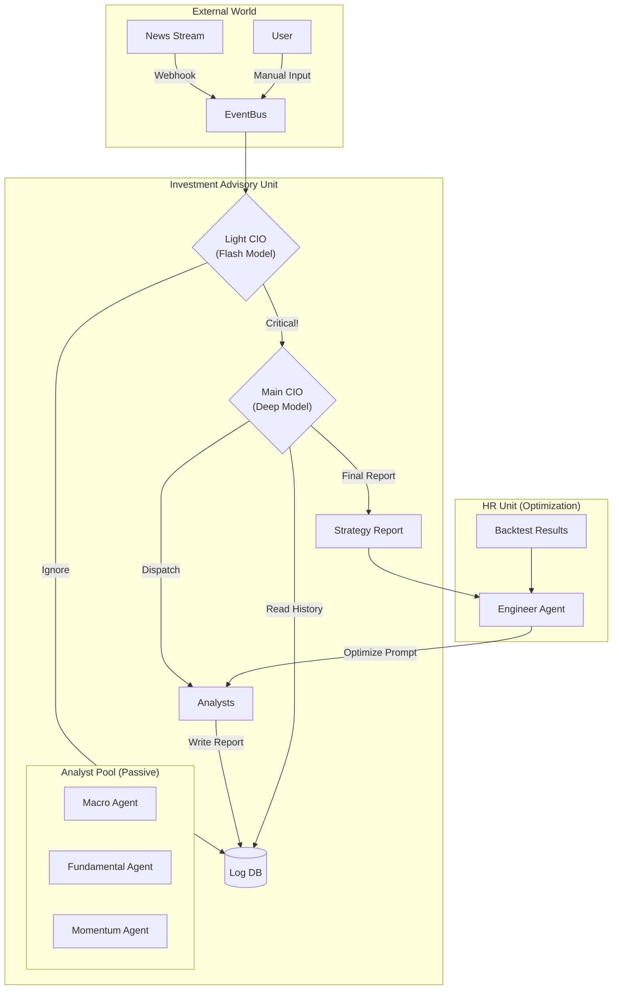

# System Overview

> **[English](#english) | [繁體中文 (Traditional Chinese)](#traditional-chinese)**

## 🇺🇸 System Overview

### Goal
Build a **Dual-Unit** intelligent investment platform involving an "Investment Advisory Unit" for strategy and an "HR Unit" for continuous optimization.

### Architecture (v3)
The system consists of two parallel units:

#### 1. Investment Advisory Unit
- **Event Bus**: Central nervous system receiving Webhooks and User Inputs.
- **Light CIO (Router)**: Uses **Flash Model** to filter noise.
- **Deep CIO (Decision Maker)**: Uses **Deep Model** (Gemini 1.5 Pro) for complex decisions.
- **Analyst Pool**: Fundamental, Momentum, Macro Agents.

#### 2. HR Unit
- **Engineer Agent**: Monitors CIO feedback and backtests.
- **Optimization Loop**: Automatically tunes system prompts.

### Core Workflows
1.  **Event-Driven**: News -> Light CIO -> Main CIO -> Strategy.
2.  **Data Lifecycle**: Tech indicators (3 days) vs Macro (Permanent).
3.  **Manual Injection**: User uploads -> Agent summary.

---

## 🇹🇼 系統概觀 (System Overview)

### 目標 (Goal)
構建一個**雙部門制 (Dual-Unit)** 的智慧化投資顧問平台。不僅模擬華爾街的「投資顧問部」進行決策，更引入「人力資源部」透過 Prompt Engineering 持續優化 AI 員工績效。

### 為什麼 (Why)
- **成本與效能平衡**: 透過 **Flash/Deep 雙軌制**，在日常監控使用低成本模型，僅在關鍵時刻調用高算力模型。
- **主動與被動分離**: 避免資訊過載，分析師平時保持沉默 (Passive)，僅在 CIO 召喚或重大事件時發言。
- **持續演進**: 系統不應是靜態的，應透過 **HR Unit** 自動優化 Prompt，適應市場變遷。

### 系統架構 (System Architecture v3)
本系統由兩個平行運作的單位組成：

#### 3.1 投資顧問部 (Investment Advisory Unit)
負責市場分析與策略輸出。
*   **Event Bus**: 系統的中樞神經，接收新聞 Webhook、使用者手動匯入與排程訊號。
*   **Light CIO (Router)**: 使用 **Flash Model** 過濾噪音。若事件重要性 > 閾值，則喚醒核心團隊。
*   **Deep CIO (Decision Maker)**: 使用 **Deep Model** (如 Gemini 1.5 Pro) 進行複雜決策，並動態調派分析師。
*   **Analyst Pool**: 包含 Momentum, Fundamental, Macro 三大專家，依指令執行深度分析。

#### 3.2 人力資源部 (HR Unit)
負責系統自我優化 (Meta-Level Optimization)。
*   **Engineer Agent (HR)**: 監控 CIO 對分析報告的滿意度，以及回測績效。
*   **Optimization Loop**: 定期調整各 Agent 的 System Prompt (例如：提高 Momentum Agent 對成交量的權重)。

### 3.3 架構圖 (Architecture Diagram)

### 4. 核心功能流程 (Core Workflows)

#### A. 事件驅動分析 (Event-Driven Analysis)
1.  **Ingest**: 外部新聞/數據進入 Event Bus。
2.  **Filter**: Light CIO 判斷是否值得關注。
3.  **Dispatch**: 若關鍵，Deep CIO 指派特定 Agent (如 Macro Agent 分析降息)。
4.  **Synthesize**: CIO 整合報告並推送建議。

#### B. 資料生命週期 (Data Lifecycle)
*   **技術指標**: TTL 3天 (僅保留趨勢)。
*   **財報數據**: TTL 90天 (季度歸檔)。
*   **宏觀數據**: 永久保存 (用於週期比對)。

#### C. 手動注入 (Manual Injection)
使用者可上傳外部報告 (PDF/Text)，經由 Light CIO 指派給特定 Agent 進行摘要與知識庫存入。
