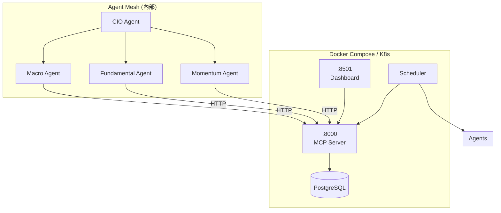

# Agent Mesh 協議 (Agent Mesh Protocol)

本文件說明系統的 Agent 間通訊與協作架構，包含 MCP 工具伺服器與 HR 360 回饋機制。
This document describes the inter-agent communication architecture, including MCP tool server and HR 360 feedback mechanism.

## 1. 微服務架構 (Microservice Architecture)

MCP Server 已獨立為微服務，支援 Docker Compose 和 Kubernetes 部署。



### 1.1 服務端點 (Service Endpoints)

| 端點 | 方法 | 說明 |
|---|---|---|
| `/` | GET | 健康檢查 |
| `/tools/register` | POST | 註冊工具 |
| `/tools/list` | GET | 列出工具 |
| `/tools/call/{name}` | POST | 調用工具 |
| `/agents/message` | POST | Agent 間訊息 |

## 2. MCP 工具伺服器 (MCP Tool Server)

### 2.1 核心概念 (Core Concepts)

| 元件 | 說明 |
|---|---|
| **McpTool** | 封裝可呼叫的工具函式，含名稱、描述、參數 Schema |
| **McpServer** | 工具註冊中心，提供 `register_tool`, `list_tools`, `call_tool` |

### 2.2 已註冊工具 (Registered Tools)

| 工具名稱 | 來源 | 功能 |
|---|---|---|
| `get_current_price` | MarketDataService | 取得即時股價 |
| `get_news` | MarketDataService | 取得相關新聞 |
| `get_financials` | MarketDataService | 取得財務數據 |
| `get_technical_indicators` | MarketDataService | 取得技術指標 |

## 3. HR 360 回饋機制 (HR 360 Feedback)

### 3.1 設計目標 (Design Goals)

- **跨 Agent 評估**: 允許 Agent 互相評分
- **追蹤績效**: 累積評價用於 Engineer Agent 優化
- **偵測殭屍 Agent**: 識別長期未活動的 Agent

### 3.2 資料模型 (Data Model)

```sql
CREATE TABLE agent_reviews (
    id TEXT PRIMARY KEY,
    reviewer TEXT NOT NULL,
    reviewee TEXT NOT NULL,
    score INTEGER NOT NULL,
    comment TEXT,
    context_hash TEXT,
    timestamp TEXT NOT NULL
);
```

### 3.3 使用方式 (Usage)

```python
# Agent 評價另一個 Agent
self.rate_request(
    request_context={"query": "..."},
    reviewee="Fundamental",
    score=4,
    comment="分析完整，但缺少競爭對手比較"
)
```

## 4. 相關檔案 (Related Files)

- [src/tools/mcp_server.py](../../src/tools/mcp_server.py) - MCP 伺服器
- [src/tools/market_tools.py](../../src/tools/market_tools.py) - 市場工具
- [src/repositories/feedback_repository.py](../../src/repositories/feedback_repository.py) - HR 回饋倉儲
- [src/agents/base_agent.py](../../src/agents/base_agent.py) - Agent 基類

---
*Last Updated: 2026-01-04*
