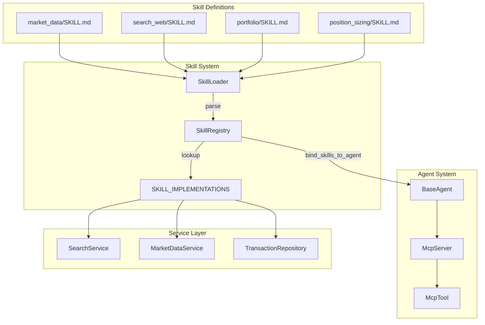
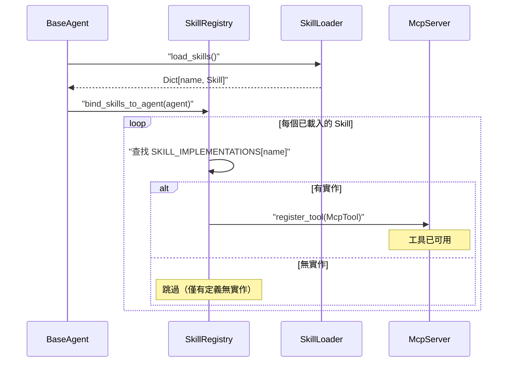
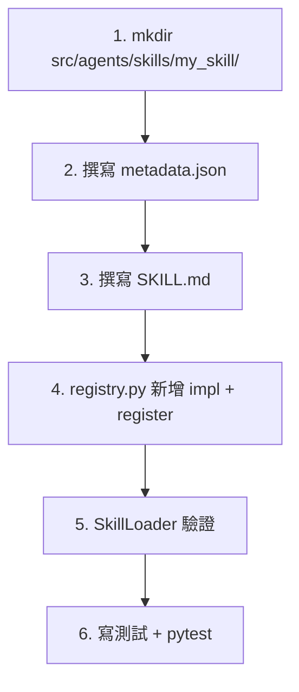

# Agent 技能系統 (Agent Skills System)

### 版本紀錄 (Version History)
| Date | Version | Description | Author |
| :--- | :--- | :--- | :--- |
| 2026-03-21 | v2.2 | 新增 `get_historical_report` Runtime Skill：以支援更深度的戰略回顧分析 | Antigravity |
| 2026-03-21 | v2.1 | 新增 `position_sizing` Runtime Skill：Portfolio-Aware 交易量計算 | Antigravity |
| 2026-03-20 | v2.0 | Phase 3 重構：3-Tier Progressive Disclosure SkillLoader、動態 SkillRegistry 類別、metadata.json 標準 | Antigravity |
| 2026-02-21 | v1.0 | 初版：涵蓋 SkillLoader、Registry、SKILL.md 規範與自定義 Skill 指南 | Antigravity |

---

## 🇹🇼 概述

Agent 技能系統（OpenClaw Skill System）是一套**宣告式的工具擴展框架**，允許開發者透過撰寫 `SKILL.md` 與 `metadata.json` 檔案來定義新的 Agent 能力，而無需修改核心 Agent 程式碼。系統由四個核心元件組成：

| 元件 | 檔案 | 職責 |
| :--- | :--- | :--- |
| **SkillLoader** | `src/agents/skills/skill_loader.py` | **3-Tier 漸進式載入**：Layer 1 (metadata.json) → Layer 2 (SKILL.md frontmatter) → Layer 3 (SKILL.md body) |
| **SkillRegistry** | `src/agents/skills/registry.py` | **動態插件系統**：register/unregister 熱插拔，lazy builtin 延遲載入 |
| **metadata.json** | 各 Skill 目錄下 | Layer 1 輕量元資料：name、version、input/output schema、category、tier、tags |
| **SKILL.md** | 各 Skill 目錄下 | Layer 2+3 宣告式 Skill 定義檔（YAML Frontmatter + Markdown） |

### 設計理念

1. **三層漸進式揭露 (Progressive Disclosure)**：`discover_skills()` 僅讀取 metadata.json 提供輕量發現；`load_skills()` 完整載入 SKILL.md。
2. **動態插件 (Hot-plug)**：`SkillRegistry` 支援 `register()`/`unregister()` 運行時增減技能。
3. **關注點分離**：Skill 定義（SKILL.md + metadata.json）與實作（Registry）分離。
4. **OS 感知 + Category/Tier/Tag 查詢 API**：支援 `get_skills_by_category()`、`get_skills_by_tier()`、`get_skills_by_tag()` 過濾。

---

## 架構總覽 (Architecture Overview)



---

## 核心元件詳解

### 1. SkillLoader — Skill 載入器

**檔案位置**：[`src/agents/skills/skill_loader.py`](skill_loader.py)

負責掃描 `src/agents/skills/` 目錄，解析所有 `SKILL.md` 檔案並建立 `Skill` 資料物件。

#### Skill 資料結構

```python
@dataclass
class Skill:
    name: str                    # 工具名稱（唯一識別符）
    description: str             # 工具描述（供 LLM 理解）
    metadata: Dict[str, Any]     # 元資料（含 OpenClaw 設定）
    instruction: str             # Markdown 指令（注入 System Prompt）
    code_path: Optional[str]     # SKILL.md 所在目錄路徑
```

#### SkillLoader API

| 方法 | 簽名 | 說明 |
| :--- | :--- | :--- |
| `__init__` | `(skills_dir="src/agents/skills")` | 初始化，設定掃描目錄 |
| `load_skills` | `() -> Dict[str, Skill]` | 掃描並載入所有 SKILL.md |
| `get_skill_registry_xml` | `() -> str` | 產生 XML 格式的 Skill 清單（用於 System Prompt 注入） |

#### 載入流程

```mermaid
flowchart TD
    START[load_skills] -->"WALK[os.walk 遞迴掃描]"
    WALK --> FIND{找到 SKILL.md?}
    FIND -->"|是| PARSE[_parse_skill_file]"
    FIND -->"|否| NEXT[繼續掃描]"
    PARSE -->"YAML[解析 YAML Frontmatter]"
    YAML --> CHECK_NAME{有 name 欄位?}
    CHECK_NAME -->"|否| SKIP[跳過]"
    CHECK_NAME -->|是| CHECK_OS{OS 限制檢查}
    CHECK_OS -->|不符合| SKIP
    CHECK_OS -->"|符合| CREATE[建立 Skill 物件]"
    CREATE -->"REGISTER[加入 self.skills]"
    REGISTER --> NEXT
    NEXT --> WALK
```

---

### 2. SkillRegistry — Skill 註冊中心

**檔案位置**：[`src/agents/skills/registry.py`](registry.py)

負責將 Skill 定義與實際的 Python 函式綁定，並註冊到 Agent 的 `McpServer`。

#### 已實作的 Skill

| Skill 名稱 | 函式 | 依賴服務 | 說明 |
| :--- | :--- | :--- | :--- |
| `search_web` | `search_web(query)` | `InternetSearchService` | 執行網路搜尋，回傳前 3 筆結果 |
| `get_market_data` | `get_market_data(ticker)` | `MarketDataService` | 取得股票價格與技術指標 |
| `get_portfolio` | `get_portfolio(user_id)` | `AlchemyTransactionRepository` | 取得使用者持倉與槓桿率 |
| `position_sizing` | `_position_sizing(user_id, ticker, action, intent)` | `BrokerFactory`, `AlchemySettingsRepository` | 計算 Portfolio-Aware 安全交易量（BUY/SELL） |
| `get_historical_report` | `_get_historical_report(user_id, report_type, weeks_ago)` | `AlchemyReportRepository` | 抓取過去一週/多週的特定類型投資報告，用於戰略與敘事回顧對比 |

#### 服務懶載入

Registry 使用**懶載入模式**避免循環依賴與啟動時的重量級初始化：

```python
_search_service = None

def get_search_service():
    global _search_service
    if not _search_service:
        _search_service = InternetSearchService()
    return _search_service
```

#### 綁定流程

`bind_skills_to_agent(agent)` 函式將已載入的 Skill 綁定到 Agent：



---

### 3. SKILL.md — Skill 定義規範

每個 Skill 以獨立目錄存放，包含一個 `SKILL.md` 檔案。

#### 檔案格式

```markdown
---
name: tool_name
description: 工具的自然語言描述
metadata:
  openclaw:
    os: [linux, darwin]
---
## Instruction
給 Agent 的使用指令（Markdown 格式）

### Examples
User: 使用者問題範例
Assistant: <tool_code>tool_name(param="value")</tool_code>
```

#### 欄位說明

| 欄位 | 必填 | 說明 |
| :--- | :--- | :--- |
| `name` | ✅ | 工具的唯一名稱，必須與 `SKILL_IMPLEMENTATIONS` 中的 key 一致 |
| `description` | ✅ | 工具描述，供 LLM 理解何時使用此工具 |
| `metadata.openclaw.os` | ❌ | 支援的作業系統列表（`linux`, `darwin`），空則不限制 |
| `## Instruction` | ✅ | Markdown 格式的使用指令，會注入到 Agent 的 System Prompt |
| `### Examples` | 建議 | 使用範例，幫助 LLM 學習正確的呼叫方式 |

---

## 現有 Skill 清單

### `search_web` — 網路搜尋

| 屬性 | 值 |
| :--- | :--- |
| **目錄** | `src/agents/skills/search_web/` |
| **描述** | Search the internet for financial news, reports, and data |
| **OS 限制** | Linux, macOS |
| **參數** | `query: str` |
| **回傳** | 搜尋結果列表（標題、摘要、連結） |

### `get_market_data` — 市場數據

| 屬性 | 值 |
| :--- | :--- |
| **目錄** | `src/agents/skills/market_data/` |
| **描述** | Fetch quantitative market data for a ticker (Price, Volume, RSI, MACD) |
| **OS 限制** | Linux, macOS |
| **參數** | `ticker: str` |
| **回傳** | 價格與技術指標 |

### `get_portfolio` — 投資組合查詢

| 屬性 | 值 |
| :--- | :--- |
| **目錄** | `src/agents/skills/portfolio/` |
| **描述** | Retrieve the user's current portfolio holdings and leverage |
| **OS 限制** | Linux, macOS |
| **參數** | `user_id: str` |
| **回傳** | 槓桿率與持倉摘要 |

### `position_sizing` — 交易量計算

| 屬性 | 值 |
| :--- | :--- |
| **目錄** | `src/agents/skills/position_sizing/` |
| **描述** | Calculate portfolio-aware trade quantity considering holdings, cash ratio, and risk thresholds |
| **OS 限制** | Linux, macOS |
| **參數** | `user_id: str`, `ticker: str`, `action: BUY/SELL`, `intent: full_close/partial_reduce/auto` |
| **回傳** | JSON: `recommended_quantity`, `actual_holding`, `cash_ratio_before`, `reason` |

### `get_historical_report` — 歷史報告檢索

| 屬性 | 值 |
| :--- | :--- |
| **目錄** | `src/agents/skills/historical_report/` |
| **描述** | Fetch a historical investment report (e.g., last week's WeeklyWorkflow) to compare current signals and justify strategy adjustments. |
| **OS 限制** | Linux, macOS |
| **參數** | `user_id: str`, `report_type: str`, `weeks_ago: int` |
| **回傳** | 過去特定週數的投資報告文字內容 |

---

## 如何新增自定義 Skill

### 步驟 1：建立 Skill 目錄

```bash
mkdir -p src/agents/skills/my_new_skill/
```

### 步驟 2：撰寫 SKILL.md

```markdown
---
name: my_new_skill
description: 描述這個工具的用途，讓 LLM 知道何時該使用它。
metadata:
  openclaw:
    os: [linux, darwin]
---
## Instruction
詳細說明如何使用此工具。

### Examples
User: 觸發此工具的使用者問題範例
Assistant: <tool_code>my_new_skill(param="value")</tool_code>
```

### 步驟 3：實作函式

在 `src/agents/skills/registry.py` 中新增實作：

```python
def my_new_skill(param: str) -> str:
    """實作邏輯"""
    try:
        # 呼叫對應的 Service
        result = some_service.do_something(param)
        return str(result)
    except Exception as e:
        logger.error(f"Skill my_new_skill failed: {e}")
        return f"Error: {e}"
```

### 步驟 4：註冊到 SKILL_IMPLEMENTATIONS

```python
SKILL_IMPLEMENTATIONS = {
    "search_web": search_web,
    "get_market_data": get_market_data,
    "get_portfolio": get_portfolio,
    "my_new_skill": my_new_skill,  # 新增
}
```

### 步驟 5：驗證

```bash
python -c "
from src.agents.skills.skill_loader import SkillLoader
loader = SkillLoader()
skills = loader.load_skills()
print(f'Loaded {len(skills)} skills: {list(skills.keys())}')
print(loader.get_skill_registry_xml())
"
```

---

## System Prompt 注入

`SkillLoader.get_skill_registry_xml()` 產生的 XML 會被注入到 Agent 的 System Prompt 中：

```xml
<tools>
  <tool name="search_web">
    <description>Search the internet for financial news, reports, and data.</description>
    <instruction>
      Use this tool to search for real-time information...
    </instruction>
  </tool>
  <tool name="get_market_data">
    <description>Fetch quantitative market data for a ticker.</description>
    <instruction>
      Use this tool to get technical and fundamental data...
    </instruction>
  </tool>
</tools>
```

這使得 LLM 能夠理解可用的工具及其使用方式，並在適當時機呼叫。

---

## 🇺🇸 Summary (English)

The **Agent Skills System** (OpenClaw Skill System) is a declarative tool extension framework consisting of three components:

- **SkillLoader** (`skill_loader.py`): Recursively scans `src/agents/skills/` for `SKILL.md` files, parses YAML frontmatter + Markdown instructions, and supports OS-based filtering.
- **SkillRegistry** (`registry.py`): Maps skill definitions to Python implementations using lazy-loaded services (`InternetSearchService`, `MarketDataService`, `AlchemyTransactionRepository`) and binds them as `McpTool` instances to Agent `McpServer`.
- **SKILL.md**: Declarative skill definition files with YAML frontmatter (`name`, `description`, `metadata`) and Markdown instructions injected into Agent System Prompts as XML.

**Current Skills**: `search_web` (internet search), `get_market_data` (price & indicators), `get_portfolio` (holdings & leverage), `position_sizing` (portfolio-aware trade quantity calculation), `get_historical_report` (historic strategic review).

## 如何新增自訂 Skill (How to Add a Custom Skill)

> 詳細 Agent 開發技能參見 `.agent/skills/skill-scaffolding/SKILL.md`

### 流程圖



### Step 1: 建立目錄

```bash
mkdir -p src/agents/skills/<skill_name>
```

### Step 2: metadata.json (Layer 1)

```json
{
  "name": "<skill_name>",
  "version": "1.0.0",
  "description": "Skill 用途描述",
  "category": "research|market|portfolio|analysis",
  "tier": "fast|smart|advanced",
  "input_schema": {
    "type": "object",
    "properties": {
      "param1": {"type": "string", "description": "說明"}
    },
    "required": ["param1"]
  },
  "output_schema": {"type": "string", "description": "回傳說明"},
  "platform": ["linux", "darwin"],
  "tags": ["tag1"]
}
```

### Step 3: SKILL.md (Layer 2+3)

```markdown
---
name: <skill_name>
description: 與 metadata.json 一致
metadata:
  openclaw:
    os: [linux, darwin]
---
## Instruction
說明 Agent 何時使用、怎麼使用

### Examples
User: 問句範例
Assistant: <tool_code><skill_name>(param1="value")</tool_code>
```

### Step 4: registry.py 註冊

```python
# 在 registry.py 新增
def _<skill_name>(user_id: str, param1: str) -> str:
    try:
        from src.services.<module> import <Service>
        svc = <Service>(user_id=user_id)
        return str(svc.<method>(param1))
    except Exception as e:
        logger.error(f"Skill <skill_name> failed: {e}")
        return f"Error: {e}"

# 在 _ensure_builtins() 中加入
self.register("<skill_name>", _<skill_name>)
```

### Step 5: 驗證

```bash
python -c "from src.agents.skills.skill_loader import SkillLoader; l=SkillLoader(); print(l.load_skills().keys())"
python -m pytest tests/ --tb=short
```

### Skill 分類原則

| 類別 | 存放位置 | 說明 |
|------|----------|------|
| **Runtime Skill** | `src/agents/skills/` | Agent 運行時可呼叫的 MCP Tool |
| **Agent Dev Skill (框架通用)** | `.agent/skills/` | 跨專案使用的開發規範 |
| **Agent Dev Skill (專案專屬)** | `.agent/skills/` | 僅限本專案的最佳實踐 |


## 🔗 Bidirectional Links
- **Agent Protocol**: [[代理人戰略協定-Agent-Swarm-Protocol]]
- **Tools Layer**: [[工具層指南-Tools-Layer-Guide]]
- **MCP Server**: [[工具層指南-Tools-Layer-Guide]]
- **Service Layer**: [[服務層開發指南-Service-Layer-Blueprints]]
- **Intent Classification**: [[意圖分類與NLP引擎-Intent-Classification-NLP-Engine]]
- **Prompt Engineering**: [[提示詞工程規範-Prompt-Engineering-Specs]]
