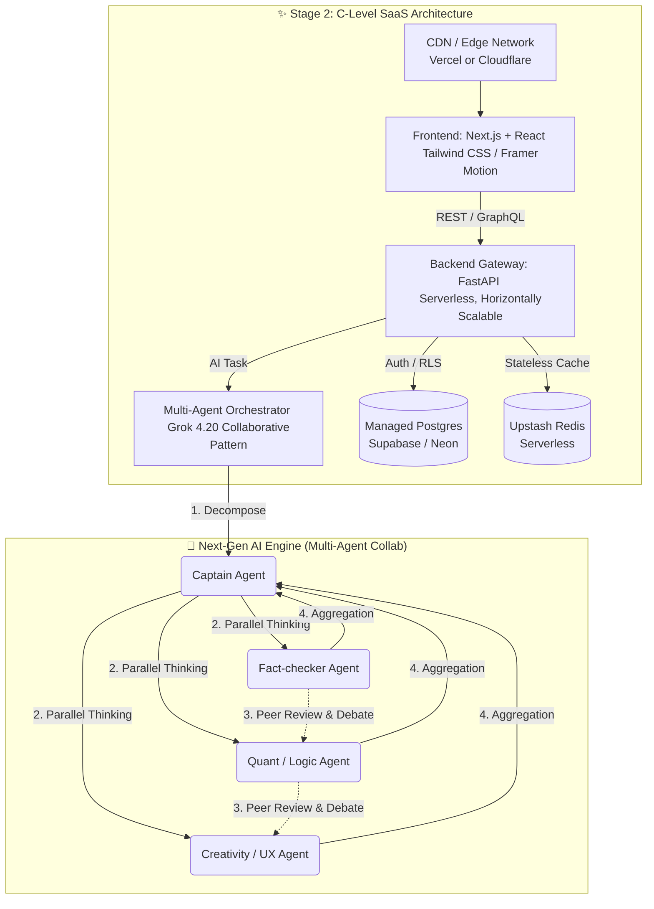

# 🚀 C端 SAAS 平台：技術層級評估與演進計畫 (B2C SaaS Tech Stack Evolution Plan)

## 📌 執行摘要 (Executive Summary)

為了將 **AI Investment Advisor** 從目前的「概念驗證 (POC) / 內部專業工具」進化為「面向大眾的 C端 (B2C) SaaS 服務」，我們針對目前的技術棧進行全方位的重新檢視。
本指南借鑑 **Google Cloud Well-Architected Framework** 的核心原則，擴充並重新定義了業界 B2C SaaS 服務的黃金標準（涵蓋可靠性、效能、成本、安全性、卓越營運等），並量化我們目前的落差。
最後，借鏡業界最前沿的 **Grok 4.20 Beta 的 4 Agents** 多智能體協同架構，提出兼具長青性與擴展性的系統演進解決方案。

> 🤖 **核心開發哲學：AI-Support First (AI 輔助優先)**
> 本次所有的技術選型皆基於一個絕對前提：**必須對 AI Agent (如 Cursor, Copilot, Antigravity) 具備最高度的代碼生成友善性**。我們選擇 Next.js、Tailwind、FastAPI 與 TypeScript/Python 雙生態，是因為這些技術擁有網路上最龐大的訓練資料，且其聲明式 (Declarative) 的語法特色，能讓 AI 代理人以極高的準確率進行大規模重構與功能開發。

> 👉 **深入了解技術細節**: 若欲探索 Next.js/K8s/Temporal 等具體技術的選型考量與 PAAS 搬遷優勢，請參閱 **[C端 SAAS 技術選型深度解析 (B2C Tech Stack Deep Dive)](C端-SAAS-技術選型深度解析-B2C-Tech-Stack-Deep-Dive)**。

---

## 🔍 一、現狀盤點與技術選型初衷 (Current Tech Stack & Initial Rationale)

在專案的最初開發階段（0 到 1），我們的目標是「快速驗證 AI 投資邏輯、建立混合記憶體架構（RAG）並確保可觀測性」。以下是現行技術棧的盤點及其選型原因：

| 元件層級 | 現行工具 | 原始應用場域 (Original Use Case) | 我們為何選擇它 (Why We Chose It) | 長遠在 C 端 SaaS 的隱患 (SaaS Bottlenecks) |
| :--- | :--- | :--- | :--- | :--- |
| **前端 (Frontend)** | **Streamlit** | 資料科學內部儀表板、ML 模型快速原型展示 | 開發速度極快，Python Native，無需前端工程師即可呈現複雜圖表 (Plotly)。 | 它是 Stateful (WebSocket) 設計，不易進行水平擴展 (Horizontal Scaling)；自定義品牌樣式與極致 UI/UX 能力受限；行動端體驗 (Mobile UX) 較弱。 |
| **後端 (Backend)** | **FastAPI** | 高效能非同步微服務、機器學習 API | 非同步基因契合 Agentic Swarm (如 DSPy/OpenAI 行為)，自動化文件 (Swagger) 降低接線成本。 | 完全契合，可繼續沿用擔任 AI 微服務大腦，但在 C 端高併發下可能需要拆分「一般流量 (CRUD)」與「AI 推理邏輯」。 |
| **資料庫 (Database)** | **PostgreSQL (pgvector)** | 關聯式資料庫、GIS、進階地理或向量查詢 | 一站式滿足 `Hot-Warm-Cold` 的 `Warm` 層結構化數據，外加 `pgvector` 原生支持 RAG 語義搜尋。 | 在本機 Docker 中為單點架構 (SPOF)；未來面臨海量 C 端用戶時需要具備高可用叢集 (HA Cluster) 或換用 Managed Cloud Database。 |
| **快取 (Cache)** | **Redis** | 極速 In-Memory 鍵值存儲、Job Queue | 擔任 `Hot` 層語義短暫緩存、狀態管理、減少大語言模型 (LLM) 冗餘請求。 | 本機單體運行，擴展至 C端 時需應對叢集分片 (Sharding) 問題。 |
| **任務調度 (Workflow)**| **n8n / schedule** | 企業內部無代碼自動化工作流、輕量級定時任務 | 輕鬆搭建與外部 (LINE/Slack) 整合的 Webhook；輕量級 Cron 任務用 `schedule` 實現每日報表。 | 長期面臨萬級用戶任務調度時，其重試機制與 Queue 管理不穩定；過度依賴無代碼圖形介面難以進行複雜版控。 |
| **可觀測 (Observability)**| **SigNoz (OTel)** | 雲端原生分散式追蹤與日誌監控 (代替 Datadog) | 開源且強大的 APM，能完美追蹤 AI Agent 延遲與成本，具備企業級洞察力。 | 非常重型，吃重記憶體與 CPU。未來大規模部署可能需轉移至雲代管 APM (如 Datadog 或 Sentry) 以省下自建維護成本。 |

---

## 📏 二、B2C SaaS 業界標準與落差衡量 (Industry Standards & Gap Analysis)

要成為千萬級 C 端 SaaS，系統必須遵循 **[Google Cloud Well-Architected Framework](https://docs.cloud.google.com/architecture/framework?hl=zh-tw)** 的支柱與核心原則（例如：分離式架構、全代管服務、無狀態設計、因應變化設計等）。我們以此框架結合使用者體驗 (UX) 進行重新評量：
`Gap Score = [Industry Standard] - [Current Benchmark]`

### 1. 可靠性與無狀態架構 (Reliability / Availability)
*   **📚 業界標準**: 遵循「使用無狀態架構 (Stateless)」核心原則，提供 99.99% 的 Uptime。基礎架構支持 Multi-AZ (多可用區) 備援，負載平衡器自動剔除故障節點。系統支援容錯與快速自動重啟。
*   **📉 落差衡量方式**: 使用壓測工具模擬節點癱瘓並測量恢復時間 (RTO)；檢驗連線中斷時，狀態保留能否在各個 Pods 之間共享與無縫恢復。
*   **⚠️ 我們在哪裡**: 目前基於單節點的 `docker-compose`。Streamlit 為 Stateful (WebSocket) 設計，一旦網路波動或容器重啟，使用者畫面和狀態會立即重置。單點故障 (SPOF) 風險極高。**[Gap: 嚴重落差]**

### 2. 效能最佳化 (Performance Optimization)
*   **📚 業界標準**: 遵循「分離式架構 (Decoupled Architecture)」，API 端點的 95th Percentile (P95) 延遲 < 100ms，前端資源的第一個內容繪製 (FCP) < 1.5s。利用內容傳遞網路 (CDN) 進行邊緣運算。
*   **📉 落差衡量方式**: 使用 Google Lighthouse 評分 (標準需 > 90)；利用 APM (如我們現有的 SigNoz) 嚴格追蹤 API 與前端渲染的反應時間。
*   **⚠️ 我們在哪裡**: Streamlit 的 DOM 會隨圖表數量過度龐大而嚴重拖累客戶端效能。Python 高效能處理了 AI 分析，但過於依賴 Server 渲染畫面反而成了整體系統瓶頸。**[Gap: 中高落差]**

### 3. 成本最佳化 (Cost Optimization)
*   **📚 業界標準**: 遵循「簡化設計並使用全代管服務 (Managed Services)」，追求 Pay-as-you-go 或將單一使用者的邊際成本降至最低。具備強硬的多租戶策略與 LLM 成本控制防護閘 (Token usage caps, Fallback models)。
*   **📉 落差衡量方式**: 計算每活躍用戶 (MAU) 基礎設施成本；每千筆 AI 推理請求的 API 及 Token 損耗費。
*   **⚠️ 我們在哪裡**: SigNoz 及 Postgres 需要巨量的本機固定開發開銷 (Local 環境需耗用至少 10GB 以上 RAM)。目前已有 Agent 的階層式路由，但尚未針對 C端 大量用戶引入防護閘欄與 API 請求限流。**[Gap: 中度落差]**

### 4. 安全性、隱私權與卓越營運 (Security & Operational Excellence)
*   **📚 業界標準**: 零信任網路設計、端到端 TLS 傳輸加密，遵守 GDPR 及相關金融隱私法規。利用 IaC (Infrastructure as Code) 與自動化 CI/CD pipeline 完成無縫交付與監控。
*   **📉 落差衡量方式**: SAST (靜態代碼分析) 漏洞數；自動化發佈所需時間；資料庫是否做到多租戶強制資料隔離 (Row-Level Security, RLS)。
*   **⚠️ 我們在哪裡**: 雖然本地的安全控制逐漸成形，但在共用資料庫的 C 端場景中，徹底的多租戶資料隔離與精細的管理員憑證發放仍有落差。**[Gap: 高落差]**

### 5. 使用者體驗 (UX - User Experience)
*   **📚 業界標準**: 像素級完美的品牌設計語言 (Design System)、金融級信任感的深色模式、具有呼吸感的微互動 (Micro-animations)，且行動端優先 (Mobile First) 或 PWA 支援。
*   **📉 落差衡量方式**: 使用者留存率 (Retention Rate)、A/B 測試追蹤按鈕點擊率等漏斗分析。
*   **⚠️ 我們在哪裡**: Streamlit 開發快捷但無法實踐動態微互動與深度手機適配體驗，這會嚴重打擊 C端 使用者的信任感與流暢感受。**[Gap: 嚴重落差]**

### 6. 開發者體驗與專案架構 (Developer Experience & Tooling)
*   **📚 業界標準**: 採用 Monorepo 架構以便於跨團隊並發開發與語法共享。使用具備依賴鎖定 (Lockfile) 的現代套件管理器。OpenAPI 與內部 Wiki 文檔必須作為獨立微服務管理。
*   **📉 落差衡量方式**: 環境設定耗時 (Time to First PR)、編譯與解決依賴衝突的時間。
*   **⚠️ 我們在哪裡**: 全域過度依賴傳統的 `requirements.txt`，難以徹底解決複雜套件鎖定，且 API / Wiki 文檔散落，尚未實現標準化 Monorepo (如 Turborepo 或 uv workspace)。**[Gap: 中度落差]**

---

## 🛠️ 三、架構轉型與長遠執行方案 (Next Steps: Architectural Transformation)

為徹底填平標準落差，因應極大規模的 C 端請求，我們提出**「雲端原生分離與智能體升級」(Cloud-Native & Multi-Agent Evolution)** 計畫：

### 🎯 方案 1：前端解耦與無狀態化 (Next.js / React)
* **GCWAF 原則對齊**: 使用無狀態架構、分離式架構。
* **技術選型**: `Next.js` (React Ecosystem) + `Tailwind CSS` + `shadcn/ui`。
* **做法**: 完全淘汰有狀態的 Streamlit。FastAPI 退居單純的 Backend Gateway 提供極速 JSON API。由前端團隊負責建立獨立的 Fintech Design System 並部署於 Vercel 等具備 CDN 邊緣節點的平台。

### 🎯 方案 2：基礎設施雲端化與容器編排過渡 (Cloud Native & Kubernetes)
* **為何轉換**: 解決 **Availability** 與 **Cost** 難題。系統需在「客戶端本地輕量 (Client)」與「雲端高可用 (Cloud)」之間保持環境一致性 (Environment Parity)。
* **技術選型**: `Docker Compose` (Client 場景) / `Kubernetes (K8s) + Helm` (Cloud 場景) + Managed Storage。
* **做法**: 
  1. **容器大一統與 Kubernetes 遷移**：所有的元件維持容器化。客戶端 (Client) 為了輕量維持使用 Docker Compose，但為了 C端 高併發規模擴展 (Scale-out)，雲端服務將平滑遷移至 Kubernetes (K8s)。編寫統一的 Helm Charts，讓 Client 和 Cloud 的配置幾乎相同，僅差在擴容策略 (HPA) 的有無。
  2. **卸載有狀態服務**：在 K8s 中，將 Database (`Supabase` 或 Managed Postgres) 與 Cache (`Upstash` 或 ElastiCache) 卸載為外部全代管服務 (Managed Services)，讓 K8s 內的 API 節點保持純無狀態 (Stateless)，達成按需極速增長的擴容能力。
  3. **Workflow**: 從基於容器的 n8n / custom scheduler 轉移到專為高度非同步與重試打造的 `Temporal.io`。

### 🎯 方案 3：C 端訂閱與多租戶安全防護 (Multi-Tenant Auth)
* **GCWAF 原則對齊**: 安全性、隱私權與法規遵循。
* **技術選型**: `Clerk` (身分驗證) + `Stripe` (支付)。
* **做法**: 將現有依賴 Local 的配置與使用者狀態改為強硬的企業級身分認證 (JWT)。對每筆資料引入 `tenant_id` 落實 RLS 隔離，並結合訂閱等級架設 LLM API 防護閘。

### 🎯 方案 4：AI 引擎演進 - 平行協作多智能體系統 (Multi-Agent Collaboration)
* **長遠發展參考**: 借鑑 [Grok 4.20 Beta 的 4 Agents 多智能體協同架構](https://help.apiyi.com/en/grok-4-20-beta-4-agents-guide-en.html)。
* **為何轉換**: 面對 C端的複雜多樣的請求，單一模型或單純的順序串聯極易產生「幻覺 (Hallucination)」。透過創建平行協作系統，還原「專家圓桌會議」。
* **做法**: 演化目前的 Agent Swarm 路線，建立一組同時並行的多職責 Agent 系統：
  1. **任務拆解 (Task Decomposition)**：系統的大腦 (Captain) 不自己解題，而是將使用者的複雜請求拆分為查核、計算、視覺化建議等。
  2. **平行思考 (Parallel Thinking)**：事實查核 Agent (搜尋資料)、量化邏輯 Agent (運算推斷) 及 排版撰述 Agent (文案與 UX) **同時展開**工作，提升運算延遲效能。
  3. **內部辯論與同儕審查 (Internal Discussion & Peer Review)**：在向使用者交出答案前，各 Agent 會針對彼此產出的結論進行交叉質詢。例如邏輯計算 Agent 會核對與事實查核 Agent 的數據是否吻合。這能有效濾除單體模型的錯覺。
  4. **聚合輸出 (Aggregated Output)**：由 Captain 將辯論無誤的最終結論完美融合，回傳給使用者。

### 🎯 方案 5：Monorepo 建設與現代套件管理 (Monorepo & Package Management)
* **為何轉換**: 隨著系統分拆為前端、智能體大腦、通知等微服務，單一 `requirements.txt` 容易造成依賴衝突並缺乏 Lockfile 的資安保護。此外，API 與架構 Wiki 需獨立管理以因應團隊擴張。
* **技術選型**: `Turborepo` (前端層級) / `uv` 或 `Poetry` (後端強固依賴管理), `Docusaurus` (文檔)。
* **做法**: 
  1. **Monorepo 結構確立**：確立單體代碼庫結構，確保前後端型別定義與 CI/CD 高效共享。
  2. **淘汰 requirements.txt**：將依賴升級為 `uv` 或 `Poetry`，具備隔離開發虛擬環境 (Workspace) 與完美 Lockfile 解析能力。
  3. **獨立文檔服務 (Docs Service)**：將 Swagger OpenAPI 與內部 Wiki 置於同一個 Repo 內，但抽取為單獨編譯與部署的獨立微服務 (Standalone Service)，大幅提升開發者查閱體驗與治理清晰度。

---

## 📅 四、落地計畫推演 (Implementation Roadmap)

1. **Phase 1: API 解耦與 Monorepo 基礎建設 (Weeks 1-2)**
   - 抽出 Streamlit 邏輯全面向下沉積至 FastAPI Router。
   - 淘汰 `requirements.txt`，導入 `uv` 構建現代化 Monorepo 依賴與 Workspace。
   - 資料庫層級導入多租戶識別 (tenant_id)。
2. **Phase 2: 新前端 MVP 與獨立文檔微服務 (Weeks 3-5)**
   - 啟動 Next.js 專案，結合 Tailwind 建立現代化 Fintech 介面。
   - 將 OpenAPI (Swagger) 與 Wiki 收攏為 Monorepo 內的「開發者文檔微服務 (Docs Service)」。
3. **Phase 3: 容器編排 K8s 演進與壓測 (Weeks 6-7)**
   - 建立 Kubernetes Helm Charts。針對 Client 端與 Cloud 端建立對稱設定 (差異僅在副本數 Scale / HPA 配置)。
   - 連接外部 Auth (Clerk) 並將有狀態資料庫 (Postgres/Redis) 從 K8s 內移交給外部代管 Serverless 平台。
   - 進行 K6 壓力測試 (目標 99.99% Uptime 及承受 10,000 Concurrent Users)。
4. **Phase 4: 多智能體協同引擎重構 (Weeks 8-10)**
   - 參照 Grok 4.20 的 4-agent 平行審查模式，重構目前的 DSPy AI 核心執行單元，實踐平行調度與辯論。
5. **Phase 5: 全面切換與 C 端推廣 (Weeks 11+)**
   - 系統發布於 K8s 正式雲端環境，並推送 PWA 版本給 C端 使用者。

> 💡 **最終結論**: 本專案將擁抱 Google Cloud 的卓越營構成為準則；前端摒棄 Streamlit 改以 Next.js 構建強勁無狀態架構；後端 AI 引擎升級至平行協作的多智能體辯論系統 (Multi-Agent Collab)。這是我們從「研發測試車」躍升為「千萬量產級 C 端金融 SaaS」唯一且具備高度防禦力的長遠路徑。
