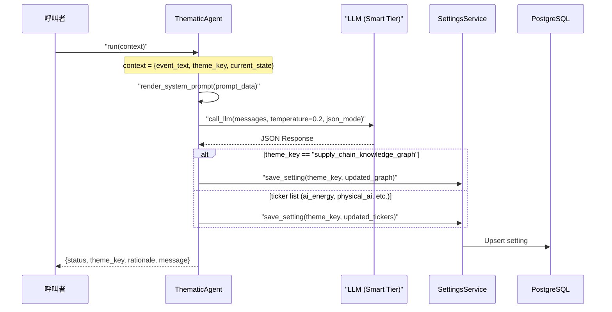
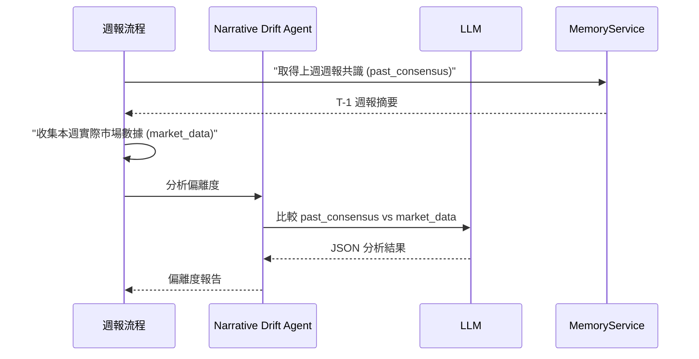

# 主題分析與供應鏈引擎 (Thematic Analysis & Supply Chain Engine)

### 版本紀錄 (Version History)
| Date | Version | Description | Author |
| :--- | :--- | :--- | :--- |
| 2026-02-21 | v1.0 | 初版：完整記錄 Thematic Agent、Supply Chain Service 與 Narrative Drift 機制 | Antigravity |

---

<a id="zh"></a>

## 🇹🇼 主題分析與供應鏈引擎概覽

本系統透過 **ThematicAgent** 和 **SupplyChainService** 的協作，實現動態的產業主題追蹤與供應鏈知識圖譜管理。同時，**Narrative Drift Agent** 負責審計過去的投資敘事，計算偏離度並提供修正建議。

### 系統架構圖

```mermaid
graph TB
    subgraph 事件來源 Event Sources
        NEWS[市場新聞/事件]
        SCHED[排程器 Scheduler]
        USER[使用者手動觸發]
    end

    subgraph 主題分析引擎 Thematic Engine
        TA[ThematicAgent<br>src/agents/thematic.py]
        PROMPT[thematic_agent.txt<br>系統提示詞]
        LLM[LLM Router<br>Smart/Flash Tier]
    end

    subgraph 供應鏈服務 Supply Chain Service
        SCS[SupplyChainService<br>src/services/supply_chain_service.py]
        KG[Knowledge Graph<br>知識圖譜]
        SP[Shortage Premium<br>短缺溢價計算]
    end

    subgraph 敘事偏離分析 Narrative Drift
        NDA[Narrative Drift Agent]
        NDP[narrative_drift_agent.txt]
        WEEKLY[週報生成流程]
    end

    subgraph 持久化 Persistence
        SS[SettingsService]
        DB["(PostgreSQL<br>settings 表")]
    end

    NEWS --> TA
    SCHED --> TA
    USER --> TA

    TA --> PROMPT
    TA --> LLM
    TA --> SS

    SCS --> KG
    SCS --> SP
    SCS --> SS

    TA -.->|更新| KG
    TA -.->|更新| SS

    NDA --> NDP
    NDA --> LLM
    WEEKLY --> NDA

    SS --> DB
```

---

## 🎯 ThematicAgent — 主題最佳化代理人

### 基本資訊

| 項目 | 說明 |
| :--- | :--- |
| **檔案** | [`src/agents/thematic.py`](thematic.py) |
| **繼承** | `BaseAgent` |
| **名稱** | `Thematic Optimization` |
| **提示詞** | [`prompts/thematic_agent.txt`](thematic_agent.txt) |
| **快取 TTL** | 24 小時 |
| **預設 Tier** | `smart` |

### 職責

ThematicAgent 負責根據突發新聞和市場事件，動態更新產業主題追蹤清單和供應鏈知識圖譜。它是系統「自我演化」能力的核心組件。

### 分析流程



### 輸入 Context

| 欄位 | 類型 | 說明 |
| :--- | :--- | :--- |
| `event_text` | `string` | 新聞或事件描述 |
| `theme_key` | `string` | 要更新的設定鍵（如 `physical_ai_tickers`、`ai_energy_tickers`、`supply_chain_knowledge_graph`） |
| `current_state` | `dict/list` | 該設定的目前值 |

### LLM 輸出格式

#### Ticker 清單更新
```json
{
  "theme": "ai_energy",
  "updated_tickers": ["CEG", "VST", "MSFT", "NRG"],
  "rationale": "NRG Energy announced major nuclear power expansion for AI datacenters."
}
```

#### 供應鏈圖譜更新
```json
{
  "theme": "supply_chain",
  "updated_graph": {
    "NVDA": {"bottlenecks": ["CoWoS", "HBM3e"], "suppliers": ["TSM", "MU"]}
  },
  "rationale": "New HBM3e capacity from SK Hynix reduces bottleneck severity."
}
```

### 提示詞設計 (`thematic_agent.txt`)

系統提示詞定義了 ThematicAgent 的角色為「主題最佳化專家」，核心指令包括：
1. 評估事件是否暗示新公司正在成為主題的領導者或受益者
2. 判斷現有公司是否正在失去相關性
3. 輸出更新後的完整 Ticker 清單或供應鏈關係
4. **嚴格 JSON 輸出**：不允許 Markdown 格式

---

## 🔗 SupplyChainService — 供應鏈知識圖譜服務

### 基本資訊

| 項目 | 說明 |
| :--- | :--- |
| **檔案** | [`src/services/supply_chain_service.py`](supply_chain_service.py) |
| **依賴** | `SettingsService` |
| **持久化鍵** | `supply_chain_knowledge_graph` |

### 知識圖譜結構

知識圖譜以 JSON 格式儲存在 `settings` 表中，結構如下：

```json
{
  "NVDA": {"bottlenecks": ["CoWoS", "HBM3e"], "suppliers": ["TSM", "MU", "000660.KS"]},
  "AMD":  {"bottlenecks": ["CoWoS", "HBM3"],  "suppliers": ["TSM", "MU", "000660.KS"]},
  "AAPL": {"bottlenecks": ["3nm Node"],        "suppliers": ["TSM"]},
  "MSFT": {"bottlenecks": ["AI Servers", "Power"], "suppliers": ["NVDA", "SMCI", "CEG", "VST"]},
  "GOOGL":{"bottlenecks": ["TPU Structuring"], "suppliers": ["AVGO", "MRVL"]},
  "AMZN": {"bottlenecks": ["Custom Silicon", "Datacenter Power"], "suppliers": ["MRVL", "CEG"]},
  "META": {"bottlenecks": ["GPU Clusters", "Optics"], "suppliers": ["NVDA", "ANET", "COHR"]},
  "TSM":  {"bottlenecks": ["Packaging Capacity (CoWoS)"], "suppliers": ["ASML", "AMAT"]}
}
```

### 圖譜建構方式

```mermaid
flowchart TD
    START[載入知識圖譜] --> CHECK{settings 中<br>有已儲存的圖譜?}
    
    CHECK -->"|是| LOAD[載入已儲存圖譜]"
    CHECK -->|否| BOOTSTRAP{使用者有<br>活躍持倉?}
    
    BOOTSTRAP -->"|是| AGENT[呼叫 ThematicAgent<br>從持倉自動建構圖譜]"
    BOOTSTRAP -->"|否| DEFAULT[使用預設 MAG7 圖譜]"
    
    AGENT -->"SAVE[儲存至 settings]"
    DEFAULT --> SAVE
    SAVE -->"READY[圖譜就緒]"
    LOAD --> READY
```

**三階段載入策略**：
1. **Phase 1**: 從 `SettingsService` 載入已儲存的圖譜
2. **Phase 0 (Cold Start)**: 若無圖譜，從使用者的活躍持倉自動建構（透過 ThematicAgent）
3. **Fallback**: 使用預設的 MAG7 供應鏈圖譜

### 短缺溢價計算 (Shortage Premium)

`get_shortage_premium(ticker)` 方法評估標的是否受到供應鏈瓶頸的「短缺溢價」影響：

| 角色 | 邏輯 | 範例 |
| :--- | :--- | :--- |
| **約束創造者** | 若 ticker 在圖譜中（如 MAG7），其高 CapEx 創造瓶頸 | NVDA → CoWoS/HBM3e 瓶頸 |
| **溢價受益者** | 若 ticker 出現在其他公司的 `suppliers` 中 | TSM 受益於 NVDA/AMD/AAPL 的需求 |

**輸出範例**：
```python
{
    "has_premium": True,
    "bottlenecks": ["CoWoS", "HBM3e"],
    "suppliers": ["TSM", "MU", "000660.KS"],
    "narrative": "**Supply Chain Bottleneck Alert**: High CapEx velocity from NVDA is creating constraints in CoWoS, HBM3e. Consider 'Shortage Premium' for key suppliers: TSM, MU, 000660.KS."
}
```

### 圖譜更新方式

| 方式 | 說明 |
| :--- | :--- |
| **ThematicAgent** | LLM 根據事件自動更新 |
| **CLI 腳本** | `python scripts/update_dynamic_settings.py supply --ticker NVDA --bottlenecks "CoWoS" --suppliers "TSM"` |
| **Dashboard** | 透過 Settings 頁面手動編輯 |

---

## 📐 Narrative Drift — 敘事偏離度分析

### 基本資訊

| 項目 | 說明 |
| :--- | :--- |
| **提示詞** | [`prompts/narrative_drift_agent.txt`](narrative_drift_agent.txt) |
| **角色** | System 2 Auditor（系統二審計員） |
| **觸發時機** | 週報生成流程中 |

### 偏離度計算流程



### 輸入模板

提示詞接收兩個關鍵變數：
- `{{past_consensus}}` — 上週週報的 CIO 共識敘事
- `{{market_data}}` — 本週實際市場行情數據

### 分析維度

| 維度 | 說明 |
| :--- | :--- |
| **Core Thesis** | 上週的核心論點是什麼？ |
| **Reality Check** | 市場數據是否驗證或推翻了該論點？ |
| **Accuracy Score** | 1-10 分的準確度評分（10 = 完全準確） |
| **Narrative Delta** | 偏離的具體原因 |
| **Correction** | 若分數低於 7，提供具體的修正建議 |

### 輸出格式

```json
{
    "core_thesis": "Inflation is cooling, pivot to Growth stocks",
    "reality_check": "CPI came in higher than expected, Growth stocks sold off 3%",
    "accuracy_score": 4,
    "narrative_delta_rationale": "Premature call on inflation cooling; sticky services inflation ignored",
    "suggested_correction": "Maintain defensive positioning until next CPI confirms trend"
}
```

### 在週報中的呈現

偏離度分析結果會整合到週報的「記憶鏈回顧 (Memory Chain Review)」章節：
- **準確度評分 (Accuracy)**: X/10
- **偏離理由 (Rationale)**: 具體說明
- **本週修正建議 (Correction)**: 可執行的策略調整

---

<a id="en"></a>

## 🇺🇸 Thematic Analysis & Supply Chain Engine (English)

### Overview

The Thematic Analysis & Supply Chain Engine provides the system's ability to **self-evolve** its investment thesis tracking. It consists of three interconnected components:

1. **ThematicAgent**: An LLM-powered agent that evaluates market events and dynamically updates thematic stock lists and supply chain graphs
2. **SupplyChainService**: Manages a knowledge graph mapping MAG7 CapEx → hardware bottlenecks → component suppliers, enabling "Shortage Premium" analysis
3. **Narrative Drift Agent**: A System 2 auditor that compares past investment narratives against actual market outcomes, calculating accuracy scores and suggesting corrections

### Key Design Decisions

| Decision | Rationale |
| :--- | :--- |
| **JSON-only LLM output** | Ensures programmatic parsing of ThematicAgent responses |
| **Cold Start Bootstrap** | Automatically builds supply chain graph from user's active portfolio |
| **Settings-based persistence** | Knowledge graph stored in `settings` table for easy CRUD via Dashboard |
| **Temperature 0.2** | Low creativity for factual supply chain analysis |
| **24h Cache TTL** | Prevents redundant LLM calls for the same event |

### Shortage Premium Logic

The system identifies two types of supply chain participants:
- **Constraint Creators**: Companies whose massive CapEx creates bottlenecks (e.g., NVDA's demand for CoWoS packaging)
- **Premium Beneficiaries**: Suppliers who benefit from structural capacity constraints (e.g., TSM benefits from NVDA/AMD/AAPL demand)

This analysis is integrated into the fundamental analysis pipeline, providing supply-chain-aware investment signals.

## 🔗 相關文件 (Related Documents)
- **代理人協定**: [[代理人戰略協定-Agent-Swarm-Protocol]]
- **配置管理**: [[配置管理架構-Configuration-Management]]
- **動態指標**: [[動態指標與復盤機制-Dynamic-Indicators-and-Experience-Replay]]
- **記憶架構**: [[記憶系統與Redis架構-Memory-Redis-Architecture]]
- **腳本操作**: [[腳本操作手冊-Scripts-Operations-Guide]]
