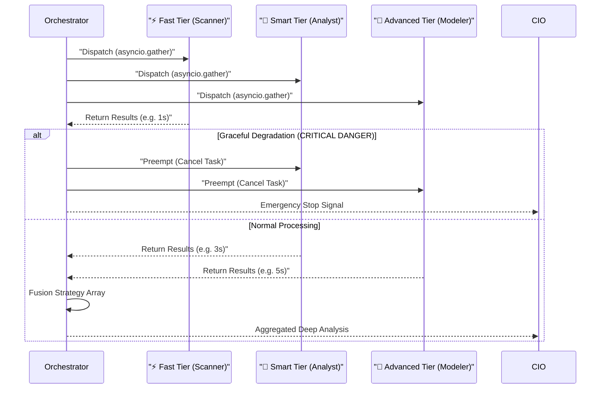

# 代理人戰略協定與認知授權 (Agent Swarm Protocol & Cognitive Mandates)

### 版本紀錄 (Version History)
| Date | Version | Description | Author |
| :--- | :--- | :--- | :--- |
| 2026-03-20 | v5.1 | **Phase 4 重構**：可插拔聚合策略 (`ConcatStrategy`/`MajorityVoteStrategy`/`WeightedVoteStrategy`)、`DegradationChain` 緊急降級、`run_consensus()` 共識投票 API、動態 `reward_delta`/`penalty_delta` | Antigravity |
| 2026-03-12 | v5.0 | **Universal Prioritization**: Integrated `SentinelAgent` as the entry gate for all triggers, enforcing AI-driven classification and priority assessment (P1-P5) before Council review. / **全域優先級評估**：整合 `SentinelAgent` 作為所有觸發器的入口閘道，在評議會審查前執行 AI 驅動的分類與優先級評估 (P1-P5)。 | Antigravity |
| 2026-02-28 | v4.3 | **Context Safety & WAL Protocol**: Implemented `_check_context_window` and `_perform_silent_flush` into `BaseAgent` to handle extreme long-context overflow safely without memory loss. | Agent |
| 2026-02-27 | v4.2 | **Graceful Degradation Fix**: Enforced strict `asyncio.Task.cancel()` and `await` on pre-empted Swift/Adv tier tasks to prevent orphaned event loops in non-async testing environments. | Neo |
| 2026-02-21 | v4.1 | **Thematic & Narrative Drift Agents**: Added ThematicAgent at system level and Narrative Drift Agent (System 2 auditor for CIO narrative accuracy). | Neo |
| 2026-02-14 | v3.5 | Full 7+1 agent roster, Council Fractal Debate, AgentFactory | Neo |
| 2024-01-04 | v1.0 | Initial 4-agent design | Neo |

> **[繁體中文 (Traditional Chinese)](#zh) | [English](#en)**

---

<a id="zh"></a>

## 🇹🇼 代理人戰略協定 (v4.1)

**代理人蜂群架構 (Agent Swarm Architecture)** 將投資顧問從線性流程轉變為由 **9 個專業 Agent + 1 個評議會** 組成的協作生態系統。每個 Agent 在嚴格的「認知授權 (Cognitive Mandate)」下運作，並通過「投資委員會協定 (IC Protocol)」與「碎形辯論 (Fractal Debate)」進行互動。

### 🏛️ 架構圖 (Architecture Diagram - v4.1)

```mermaid
graph TD
    user((User/Webhook)) -->"|Triggers| SENT[Sentinel Agent]"
    SENT -->|Classification & Priority| CIO[CIO Agent]
    CIO -->|Broadcast| ORCH{Swarm Orchestrator}
    
    subgraph "Milestone 5: RoleSwarm Clusters"
        subgraph "Sentiment Swarm"
            SENT_FAST[News Scanner]
            SENT_ADV[Social Pulse]
        end
        
        subgraph "Fundamental Swarm"
            FUND_FAST[Risk Scanner]
            FUND_SMART[Revenue Extractor]
            FUND_ADV[Valuation Modeler]
        end
        
        MOM[Momentum Analyst]
        MACRO[Macro Strategist]
    end
    
    subgraph "Thematic & Narrative Layer"
        THEMATIC[Thematic Agent]
        NARRATIVE[Narrative Drift Agent]
    end
    
    subgraph "Risk & Evolution Layer"
        RISK[Risk Agent]
        ENG[System Engineer Agent]
    end

    ORCH --> SENT_FAST & SENT_ADV
    ORCH --> FUND_FAST & FUND_SMART & FUND_ADV
    ORCH --> MOM & MACRO
    
    SENT_FAST & SENT_ADV & FUND_FAST & FUND_SMART & FUND_ADV & MOM & MACRO -->|Insights / Attributes| ORCH
    ORCH -->|Aggregated Protocol| CIO
    
    CIO <-->|Validate| RISK
    CIO <-->|Fractal Debate| COUNCIL{Council}
    
    THEMATIC -->"|Update Theme Lists & Supply Chain| SETTINGS[""(Settings/DB")]
    NARRATIVE -->|Narrative Delta & Corrections| CIO
    
    ENG -->|Generate Alpha Code & Backtest| SETTINGS
    
    DECISION[Final Decision] -->|"Extract Trades"| ACT_EXT[ActionExtractor Agent]
    ACT_EXT -->|"Structured Orders"| ATS[Automated Trading Service]
```

### 1. 代理人建構 (Agent Construction)
所有 Agent 繼承 `BaseAgent`，由 `AgentFactory` (Factory Pattern) 統一建構。
- **Factory**: `src/agents/factory.py` — `create_agent(name, tier)` 動態建立。
- **依賴注入**: 自動注入 `feedback_repo`、`market_tools`、`mcp_server`。
- **Tier 系統**: `Fast` (Flash) / `Smart` (Pro) / `Advanced` (Thinking)。
- **安全上下文管理 (Context Guard & WAL Protocol)**: BaseAgent 實作了 Token 預留墊 (預設 4,000 tokens)。當上下文逼近上限時，會觸發 `_perform_silent_flush`，透過 `SYSTEM SILENT COMMAND` 讓 LLM 自動輸出 `WAL_CHECKPOINT` 並保存至專屬 workspace 的 `STATE.md` 中，接著截斷訊息歷史，保證「不丟失推論脈絡的前提下釋放 Token 負載」。

### 2. 蜂群角色 (Agent Swarm Roles)

> [!TIP]
> 蜂群生態系將專才 Agent 視為微服務節點，各司其職並由 CIO 或 Council 統一整合。

| 角色 (Role) | 認知授權 (Mandate) | 核心職責 (Responsibilities) | 產出 (Outputs) | 核心工具 / 檔案 |
| :--- | :--- | :--- | :--- | :--- |
| **CIO** | 綜合者與仲裁者 | 整合多模態輸入，使用衝突解決矩陣解決分歧，管理組合風險。 | 最終投資報告、再平衡指令 | `cio.py` |
| **Macro** | 週期架構師 | 識別市場週期、分析利率/通膨/地緣政治。 | Risk-On/Off 資產配置觀點 | `get_macro...`, `macro.py` |
| **Fundamental** | 由下而上偵探 | 財報分析、估值建模 (DCF/PE)、護城河評估。 | 個股投資論述 (B/S/H) | `get_val...`, `fundamental.py` |
| **Momentum** | 趨勢獵人 | 技術指標分析 (RSI/MACD)、趨勢與型態辨識。 | 技術面訊號與進出場時機 | `get_ohlcv`, `momentum.py` |
| **Sentiment** | 行為計量分析師 | 新聞情緒、社群輿情、反向訊號偵測。 | 情緒分數與行為警示 | `web_search`, `sentiment.py` |
| **Risk** | 風控守門人 | 持倉風險評估、相關性監控、板塊曝險檢查。 | Risk Score、曝險警報 | `risk.py` |
| **Engineer** | 自我進化工程師 | 分析 Agent 績效、自動生成 Alpha 因子代碼並執行基因演算法。 | 量化策略代碼 (高 Sharpe) | `system_engineer_agent.py` |
| **Thematic** | 供應鏈優化師 | 動態更新主題股票清單 (如 AI Energy) 與供應鏈知識圖譜。 | 主題清單 (`updated_tickers`) | `thematic.py` |
| **Narrative Drift** | System 2 審計師 | 識別上週敘事與本週實際行情的「敘事偏離」，提供修正建議。 | Accuracy Score、修正建議 | `prompts/narrative_drift...` |
| **ActionExtractor**| 結構化翻譯員 | 解析非結構化評議文本，提取符合交易系統規格的 JSON。 | 結構化交易指令 | `action_extractor.py` |
| **Council** | 評議會仲裁 | 對每檔持倉執行碎形辯論 (多角度質疑 → 反駁 → 裁決)。 | 加權辯論結論 | `council_adapter.py` |

### 3. 技能系統與註冊表 (Agent Skills & Registry — v3.6)
為了提升 Agent 的執行效能，系統將通用功能封裝為 **本地技能 (Local Skills)**，避免過度的 LLM 推理。

*   **技能下載器 (SkillLoader)**: 位於 `src/agents/skills/skill_loader.py`，負責解析 `SKILL.md` 規格。
*   **技能註冊表 (SkillRegistry)**: 位於 `src/agents/skills/registry.py`，將規格綁定至具體的 Python 實作。
*   **核心技能範例**:
    *   `search_web`: 整合 Tavily 金融搜尋。
    *   `get_market_data`: 獲取 OHLCV 與技術指標。
    *   `get_portfolio`: 獲取投資組合摘要與槓桿率。
*   **優勢**: **本地執行 (Local Execution)** 消除網路延遲，並提供型態檢查的參數傳遞。

### 4. 蜂群編排與效能演化 (Swarm Orchestration & Evolution — v4.0)
系統透過 `SwarmOrchestrator` 與 `RoleSwarm` 實現真正的非同步並行任務分發與結果聚合。

#### 4.1 三階層並發架構 (3-Tier Concurrency Architecture)


*   **編排模式**:
    *   **Broadcast (廣播)**: 將單一任務並行發送。
    *   **Batch Run (批次)**: 透過 `RoleSwarm` 針對不同股票指派動態叢集。
    *   **Graceful Degradation (優雅降級)**: 當 Fast Tier 觸發 Emergency Stop 優先搶佔時，系統會嚴密執行 `asyncio.Task.cancel()` 並於事件迴圈中強制 `await` 被取消的任務 (Smart/Adv)，避免產生孤兒進程 (Orphan Tasks) 或 `Event loop is closed` 例外異常，確保非同步環境 (如 CI/CD pytest) 的高穩定性。
*   **動態歸因機制 (Auto-Attribution)**: 依循動態指標原則，系統透過 `AttributionAnalyzer` 獨立以 Raw SQL 掃描判斷的準確率與 ROI，自動上調 (Reward) 或下修 (Penalty) 該 Agent 的信任權重。

### 5. 投資委員會協定 (IC Protocol)

#### 3.1 每日健康檢查 (Daily Health Check)
- **觸發**: CIO 於開盤時發起。
- **行動**: 各 Agent 檢查儀表板 (利率/個股/情緒指標)。
- **匯報**: Agent 提交「每日簡報」→ CIO 綜合裁決。

#### 3.2 衝突解決矩陣 (Conflict Resolution Matrix)
| 體制 (Regime) | 權重排序 |
| :--- | :--- |
| **財報季 (Earnings)** | Fundamental > Momentum > Macro |
| **危機/修正 (Crisis)** | Macro > Momentum > Fundamental |
| **泡沫/狂熱 (Bubble)** | Sentiment > Momentum > Fundamental |

#### 3.3 碎形辯論 (Fractal Debate — Council)
- **觸發**: Sentinel 偵測異常事件 或 Agent 意見分歧 > 閾值。
- **流程**: Council 對持倉逐一執行正反辯論 → 產出加權結論 → CIO 最終裁決。

#### 3.4 思維鏈強制 (R.P.A. Loop)
所有 Agent 遵循：
- **推理 (Reasoning)**: 「為什麼會發生？」(因果)
- **計畫 (Plan)**: 「需要什麼資訊？」(工具選擇)
- **行動 (Action)**: 「執行工具/產出。」

### 4. MCP 整合策略 (MCP Integration)
- **個人工具箱 (Local Skills)**: 每個 Agent 擁有本地 MCP 工具 (計算、解析)。
- **共享服務 (Remote MCP)**: 市場數據、新聞搜尋等共享服務。
- **A2A 通訊**: Hub-and-Spoke (CIO 協調)，路線圖: Mesh 網路。

---

<a id="en"></a>

## 🇺🇸 Agent Swarm Protocol (v4.1)

### Agents (9 + Council)
| Agent | Mandate | File |
|:---|:---|:---|
| CIO | Synthesizer & Arbitrator | `cio.py` |
| Macro | Cycle Architect | `macro.py` |
| Fundamental | Bottom-Up Detective | `fundamental.py` |
| Momentum | Trend Hunter | `momentum.py` |
| Sentiment | Behavioral Quant | `sentiment.py` |
| Risk | Risk Gatekeeper | `risk.py` |
| Engineer | Self-Evolution Engineer | `engineer.py` |
| Thematic | Theme & Supply Chain Optimizer | `thematic.py` |
| Narrative Drift | System 2 Auditor | `prompts/narrative_drift_agent.txt` |
| Council | Fractal Debate Arbitrator | `council_adapter.py` |
| ActionExtractor | Structured Translator | `action_extractor.py` |

### Agent Skills & Registry (v3.6)
- **SkillLoader**: Parses `SKILL.md` specifications.
- **SkillRegistry**: Binds specifications to Python implementations (`registry.py`).
- **Core Skills**: `search_web`, `get_market_data`, `get_portfolio`.

### Swarm Orchestration (v3.6)
- **Orchestrator**: Parallel dispatch (Broadcast/Batch) and fan-in aggregation.
- **Adaptive Evolution**: Reward/Penalty system based on performance metrics (Success/Latency/Quality).

### IC Protocol
1. **Daily Health Check**: CIO triggers, agents report daily briefs.
2. **Conflict Resolution**: Regime-weighted matrix (Earnings/Crisis/Bubble).
3. **Fractal Debate**: Council performs multi-angle challenge on each position.
4. **R.P.A. Loop**: Reasoning → Plan → Action.

## 🔗 Bidirectional Links
- **Architecture**: [System Landscape](系統全景圖-System-Landscape)
- **Communication**: [Agent Mesh Protocols](底層通信協議-Agent-Mesh-Protocols)
- **Sentinel & Council**: [Sentinel & Council](哨兵與評議會架構-Sentinel-Council-Architecture)
- **PM Specs**: [Core System Specs](核心系統規格-Core-System-Specs)
