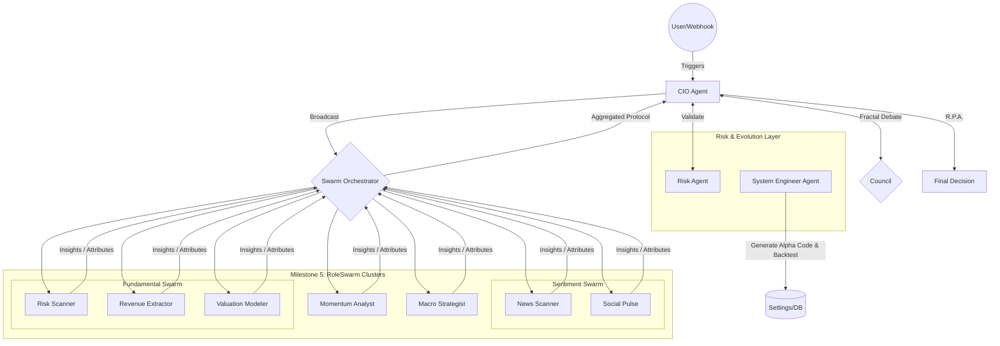

# 代理人戰略協定與認知授權 (Agent Swarm Protocol & Cognitive Mandates)

### 版本紀錄 (Version History)
| Date | Version | Description | Author |
| :--- | :--- | :--- | :--- |
| 2026-02-18 | v3.6 | **Agent Skills & Orchestration**: Integrated `SkillRegistry` and `SwarmOrchestrator` with adaptive performance tracking (Reward/Penalty). | Neo |
| 2026-02-14 | v3.5 | Full 7+1 agent roster, Council Fractal Debate, AgentFactory | Neo |
| 2024-01-04 | v1.0 | Initial 4-agent design | Neo |

> **[繁體中文 (Traditional Chinese)](#zh) | [English](#en)**

---

## 🇹🇼 代理人戰略協定 (v3.5)

**代理人蜂群架構 (Agent Swarm Architecture)** 將投資顧問從線性流程轉變為由 **7 個專業 Agent + 1 個評議會** 組成的協作生態系統。每個 Agent 在嚴格的「認知授權 (Cognitive Mandate)」下運作，並通過「投資委員會協定 (IC Protocol)」與「碎形辯論 (Fractal Debate)」進行互動。

### 🏛️ 架構圖 (Architecture Diagram - v4.0)

### 1. 代理人建構 (Agent Construction)
所有 Agent 繼承 `BaseAgent`，由 `AgentFactory` (Factory Pattern) 統一建構。
- **Factory**: `src/agents/factory.py` — `create_agent(name, tier)` 動態建立。
- **依賴注入**: 自動注入 `feedback_repo`、`market_tools`、`mcp_server`。
- **Tier 系統**: `Fast` (Flash) / `Smart` (Pro) / `Advanced` (Thinking)。

### 2. 蜂群角色 (Agent Swarm Roles)

#### 2.1 首席投資官 (CIO Agent)
*   **認知授權**: 「綜合者與仲裁者 (Synthesizer & Arbitrator)」
*   **職責**:
    *   整合多模態輸入 (宏觀、基本面、動量、情緒)。
    *   使用 **衝突解決矩陣** 解決分歧，參考 Council 碎形辯論結果。
    *   管理投資組合風險與最終決策。
    *   **Safety Fallback**: 績效服務失效 → 等權重裁決 + Max Leverage 0.95x。
*   **產出**: 最終投資報告與再平衡指令。
*   **檔案**: `src/agents/cio.py`

#### 2.2 宏觀策略師 (Macro Strategist)
*   **認知授權**: 「週期架構師 (Cycle Architect)」
*   **職責**: 識別市場週期、分析利率/通膨/地緣政治。
*   **產出**: Risk-On vs. Risk-Off 資產配置觀點。
*   **工具**: `get_macro_indicators` (FRED)。
*   **檔案**: `src/agents/macro.py`

#### 2.3 基本面分析師 (Fundamental Analyst)
*   **認知授權**: 「由下而上偵探 (Bottom-Up Detective)」
*   **職責**: 財報分析、估值建模 (DCF/PE)、護城河評估。
*   **產出**: 個股投資論述 (BUY/SELL/HOLD)。
*   **工具**: `get_valuation`, `get_company_profile` (FMP)。
*   **檔案**: `src/agents/fundamental.py`

#### 2.4 動量分析師 (Momentum Analyst)
*   **認知授權**: 「趨勢獵人 (Trend Hunter)」
*   **職責**: 技術指標分析 (RSI/MACD/均線)、趨勢與型態辨識。
*   **產出**: 技術面訊號與進出場時機。
*   **工具**: `get_current_price`, `get_ohlcv` (Polygon/FMP)。
*   **檔案**: `src/agents/momentum.py`

#### 2.5 情緒分析師 (Sentiment Analyst)
*   **認知授權**: 「行為計量分析師 (Behavioral Quant)」
*   **職責**: 新聞情緒、社群輿情、反向訊號偵測。
*   **產出**: 情緒分數與行為警示。
*   **工具**: `web_search` (Tavily)。
*   **檔案**: `src/agents/sentiment.py`

#### 2.6 風險代理 (Risk Agent)
*   **認知授權**: 「風控守門人 (Risk Gatekeeper)」
*   **職責**: 持倉風險評估、相關性監控、板塊曝險檢查。
*   **產出**: Risk Score、曝險警報、Rebalance 建議。
*   **觸發**: CIO 裁決前必經 Risk 驗證。
*   **檔案**: `src/agents/risk.py`

#### 2.7 系統工程師 (System Engineer Agent)
*   **認知授權**: 「自我進化工程師 (Self-Evolution Engineer & Alpha Seeker)」
*   **職責**: 分析 Agent 績效、自動生成 Alpha 量化因子代碼並執行基因演算法迴圈回測。
*   **產出**: 經回測驗證 (最佳 Sharpe Ratio) 的量化策略代碼 (儲存於 Repo)。
*   **觸發**: 獨立的演化排程或低績效觸發。
*   **檔案**: `src/agents/system_engineer_agent.py`與`src/agents/engineer.py`

#### 2.8 評議會 (Council Agent Adapter)
*   **職責**: 對每檔持倉執行碎形辯論 (Fractal Debate)。
*   **機制**: 多角度質疑 → 反駁 → 綜合裁決。
*   **觸發**: Sentinel 偵測異常 或 CIO 深度評議時。
*   **檔案**: `src/agents/council_adapter.py` (Adapter Pattern)

### 3. 技能系統與註冊表 (Agent Skills & Registry — v3.6)
為了提升 Agent 的執行效能，系統將通用功能封裝為 **本地技能 (Local Skills)**，避免過度的 LLM 推理。

*   **技能下載器 (SkillLoader)**: 位於 `src/agents/skills/skill_loader.py`，負責解析 `SKILL.md` 規格。
*   **技能註冊表 (SkillRegistry)**: 位於 `src/agents/skills/registry.py`，將規格綁定至具體的 Python 實作。
*   **核心技能範例**:
    *   `search_web`: 整合 Tavily 金融搜尋。
    *   `get_market_data`: 獲取 OHLCV 與技術指標。
    *   `get_portfolio`: 獲取投資組合摘要與槓桿率。
*   **優勢**: **本地執行 (Local Execution)** 消除網路延遲，並提供型態檢查的參數傳遞。

### 4. 蜂群編排與效能演化 (Swarm Orchestration & Evolution — v4.0)
系統透過 `SwarmOrchestrator` 與 `RoleSwarm` 實現真正的非同步並行任務分發與結果聚合。

#### 4.1 三階層並發架構 (3-Tier Concurrency Architecture)

*   **編排模式**:
    *   **Broadcast (廣播)**: 將單一任務並行發送。
    *   **Batch Run (批次)**: 透過 `RoleSwarm` 針對不同股票指派動態叢集。
*   **動態歸因機制 (Auto-Attribution)**: 依循動態指標原則，系統透過 `AttributionAnalyzer` 獨立以 Raw SQL 掃描判斷的準確率與 ROI，自動上調 (Reward) 或下修 (Penalty) 該 Agent 的信任權重。

### 5. 投資委員會協定 (IC Protocol)

#### 3.1 每日健康檢查 (Daily Health Check)
- **觸發**: CIO 於開盤時發起。
- **行動**: 各 Agent 檢查儀表板 (利率/個股/情緒指標)。
- **匯報**: Agent 提交「每日簡報」→ CIO 綜合裁決。

#### 3.2 衝突解決矩陣 (Conflict Resolution Matrix)
| 體制 (Regime) | 權重排序 |
| :--- | :--- |
| **財報季 (Earnings)** | Fundamental > Momentum > Macro |
| **危機/修正 (Crisis)** | Macro > Momentum > Fundamental |
| **泡沫/狂熱 (Bubble)** | Sentiment > Momentum > Fundamental |

#### 3.3 碎形辯論 (Fractal Debate — Council)
- **觸發**: Sentinel 偵測異常事件 或 Agent 意見分歧 > 閾值。
- **流程**: Council 對持倉逐一執行正反辯論 → 產出加權結論 → CIO 最終裁決。

#### 3.4 思維鏈強制 (R.P.A. Loop)
所有 Agent 遵循：
- **推理 (Reasoning)**: 「為什麼會發生？」(因果)
- **計畫 (Plan)**: 「需要什麼資訊？」(工具選擇)
- **行動 (Action)**: 「執行工具/產出。」

### 4. MCP 整合策略 (MCP Integration)
- **個人工具箱 (Local Skills)**: 每個 Agent 擁有本地 MCP 工具 (計算、解析)。
- **共享服務 (Remote MCP)**: 市場數據、新聞搜尋等共享服務。
- **A2A 通訊**: Hub-and-Spoke (CIO 協調)，路線圖: Mesh 網路。

---

## 🇺🇸 Agent Swarm Protocol (v3.5)

### Agents (7 + Council)
| Agent | Mandate | File |
|:---|:---|:---|
| CIO | Synthesizer & Arbitrator | `cio.py` |
| Macro | Cycle Architect | `macro.py` |
| Fundamental | Bottom-Up Detective | `fundamental.py` |
| Momentum | Trend Hunter | `momentum.py` |
| Sentiment | Behavioral Quant | `sentiment.py` |
| Risk | Risk Gatekeeper | `risk.py` |
| Engineer | Self-Evolution Engineer | `engineer.py` |
| Council | Fractal Debate Arbitrator | `council_adapter.py` |

### Agent Skills & Registry (v3.6)
- **SkillLoader**: Parses `SKILL.md` specifications.
- **SkillRegistry**: Binds specifications to Python implementations (`registry.py`).
- **Core Skills**: `search_web`, `get_market_data`, `get_portfolio`.

### Swarm Orchestration (v3.6)
- **Orchestrator**: Parallel dispatch (Broadcast/Batch) and fan-in aggregation.
- **Adaptive Evolution**: Reward/Penalty system based on performance metrics (Success/Latency/Quality).

### IC Protocol
1. **Daily Health Check**: CIO triggers, agents report daily briefs.
2. **Conflict Resolution**: Regime-weighted matrix (Earnings/Crisis/Bubble).
3. **Fractal Debate**: Council performs multi-angle challenge on each position.
4. **R.P.A. Loop**: Reasoning → Plan → Action.

## 🔗 Bidirectional Links
- **Architecture**: [System Landscape](系統全景圖-System-Landscape)
- **Communication**: [Agent Mesh Protocols](底層通信協議-Agent-Mesh-Protocols)
- **Sentinel & Council**: [Sentinel & Council](哨兵與評議會架構-Sentinel-Council-Architecture)
- **PM Specs**: [Core System Specs](核心系統規格-Core-System-Specs)
