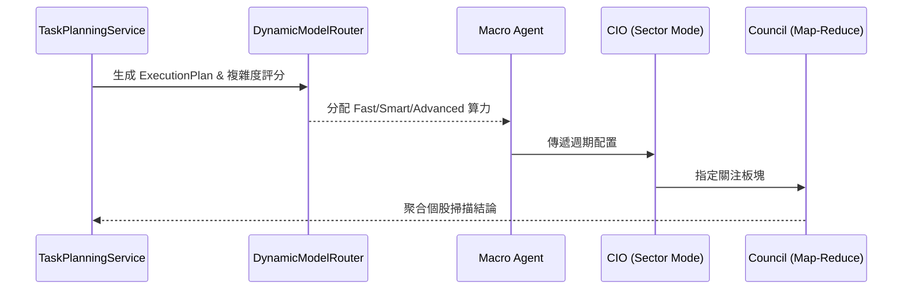

# 任務規劃與執行引擎 (Task Planning & Execution Engine)

> **[繁體中文 (Traditional Chinese)](#zh) | [English](#en)**
> **最新版本 (Latest Version)**: 請參閱文件頂部的版本紀錄 (Iteration Record).

### 版本紀錄 (Version History)
| Date | Version | Description | Author |
| :--- | :--- | :--- | :--- |
| 2026-02-21 | v4.1 | **DynamicModelRouter refactor**: Replaced LiteLLM references with rule-based `DynamicModelRouter`, updated tier definitions and task plan structure | Neo |
| 2026-02-07 | v3.3 | Updated Report Synthesis Logic (Integrated Pattern) | Neo |
| 2026-01-14 | v3.2 | Initial Release with TaskPlanningService | Neo |

---

## 🇹🇼 任務規劃與執行引擎 (Overview)

任務規劃與執行引擎是 v4.x 架構的核心組件，旨在解耦「目標設定」與「任務執行」。透過引入 `TaskPlanningService` 與 `DynamicModelRouter` 規則式多模型路由架構，系統能夠根據任務複雜度、市場波動度與辯論輪次動態選擇最佳 AI 模型層級，並生成結構化的執行計劃 (`ExecutionPlan`)。

### 1. 核心組件 (Core Components)

#### 1.1 任務規劃服務 (TaskPlanningService — `src/services/task_planning_service.py`)
負責將高層次的用戶目標 (Goal) 分解為可執行的任務序列 (`ExecutionPlan`)。
*   **Goal Decomposition**: 將 "Generate Weekly Report" 分解為 "Market Cycle Analysis", "Sector Rotation & Swarm Insight", "Supply Chain Deep-Dive" 等子任務。
*   **Complexity Scoring**: 每個 `Task` 包含 `complexity` (1-10) 與 `estimated_tokens` 欄位。
*   **Model Tiering**: 根據複雜度分配模型層級 (`fast`, `smart`, `advanced`)。
*   **策略模式**: 支援 `standard_weekly` (硬編碼最佳實踐工作流) 與 `dynamic` (LLM 推理生成自訂計畫) 兩種策略。

#### 1.2 動態模型路由器 (DynamicModelRouter — `src/infrastructure/llm_router.py`)
系統透過 `DynamicModelRouter` 規則引擎，根據上下文動態選擇模型層級：
*   **Tier 1: Fast (⚡ 前鋒)** (e.g., Gemini-Flash): Sentinel 監控、新聞過濾、簡單任務。**預設層級**。
*   **Tier 2: Smart (🧠 智囊)** (e.g., GPT-4o): Council 辯論、複雜分析、程式碼生成。
*   **Tier 3: Advanced (🚀 戰略)** (e.g., Claude Sonnet): 深度研究、策略精煉、Alpha 生成。

**路由規則 (Routing Rules)**:
| 規則 | 條件 | 升級至 |
| :--- | :--- | :--- |
| **高波動危機** | `market_volatility > 25.0` (VIX) | Smart |
| **深度辯論仲裁** | `round_num > 3` | Smart |
| **複雜/危險主題** | 包含 `crash`, `crisis`, `panic`, `black swan` 等關鍵字 | Smart |
| **戰略/深度研究** | 包含 `deep research`, `strategy` 關鍵字 | Advanced |

### 2. 工作流與數據流 (Workflow & Data Flow)

#### 2.1 標準週報生成流程 (Standard Weekly Workflow)

1.  **Plan Phase**:
    *   `WeeklyWorkflow` 調用 `TaskPlanningService` 生成標準化 `TaskPlan`。
2.  **Execute Phase**:
    *   **Macro Agent**: 分析市場週期。
    *   **CIO Agent (Sector Mode)**: 制定板塊輪動策略。
    *   **Council (Map-Reduce)**: 發動分散式 `Analysts` 對持倉與候選名單進行深度掃描。
3.  **Synthesize Phase (Integrated Pattern)**:
    *   **Assembly**: `BaseWorkflow._assemble_integrated_report` 負責將詳細的辯論過程 (Detailed Analysis) 注入報告。
    *   **Refinement**: `CIOAgent.polish_report` 執行最終潤飾，確保行動指令表 (Actionable Orders) 的格式正確且包含持倉權重。

### 3. 關鍵機制 (Key Mechanisms)

#### 3.1 Gap Filling Logic (補倉邏輯)
*   **觸發條件**: Active Holdings Count < 15。
*   **執行路徑**: Macro (Cycle) -> Sector (Theme) -> Fundamental (Quality) -> Technical (Entry)。

#### 3.2 Swarm Insights (蜂群洞察)
*   整合 Momentum (動能)、Sentiment (情緒) 與 Fundamental (基本面) 的多維度訊號。
*   CIO Agent 作為最終仲裁者 (Arbiter)，解決不同 Agent 間的觀點衝突。

### 4. 預期效益與成果 (Expected Outcomes)
- **商業價值 (Business Value)**: 解耦任務規劃與實際執行，讓系統能像人類基金經理一樣「先定戰略再下戰術」，確保研究報告的邏輯嚴密性與連貫性。
- **性能指標 (Performance Target)**: 透過 `DynamicModelRouter` 的規則式動態路由，將低複雜度任務導向低成本模型 (如 Gemini-Flash)，相較全域使用 GPT-4o 可節省高達 40% 的 API 成本，同時維持決策品質。危機情境自動升級至 Smart 層級確保分析深度。

---

## 🇺🇸 Task Planning & Execution Engine

### 1. Overview
The Task Planning & Execution Engine decouples "Goal Setting" from "Task Execution" via `TaskPlanningService` and `DynamicModelRouter` rule-based routing.

### 2. Core Components
*   **TaskPlanningService** (`src/services/task_planning_service.py`): Decomposes goals into `ExecutionPlan` with `Task` dataclasses (complexity, model_tier, estimated_tokens). Supports `standard_weekly` and `dynamic` strategies.
*   **DynamicModelRouter** (`src/infrastructure/llm_router.py`): Rule-based tier selection (Fast/Smart/Advanced) based on market volatility, debate round, topic keywords, and research depth.

### 3. Workflow & Data Flow
#### Standard Weekly Workflow
1.  **Plan Phase**: Generate `TaskPlan`.
2.  **Execute Phase**: Macro Analysis -> Sector Rotation -> Council Analysis (Map-Reduce).
3.  **Synthesize Phase (Integrated Pattern)**:
    *   **Assembly**: Injects detailed transcripts into the final report via `_assemble_integrated_report`.
    *   **Refinement**: CIO applies `polish_report` for formatting and readability (Editor Mode).

### 4. Key Mechanisms
*   **Gap Filling**: Triggered when active holdings < 15.
*   **Swarm Insights**: Cross-agent signal integration with CIO arbitration.

### 5. Expected Outcomes
- **Business Value**: Decoupled planning forces the system to strategize before executing, ensuring logical consistency akin to a human portfolio manager.
- **Performance Target**: Rule-based `DynamicModelRouter` routes simple tasks to cost-effective models (e.g., Gemini-Flash), reducing API expenditure by up to 40% without compromising analytical depth. Crisis scenarios auto-escalate to Smart tier for deeper analysis.

