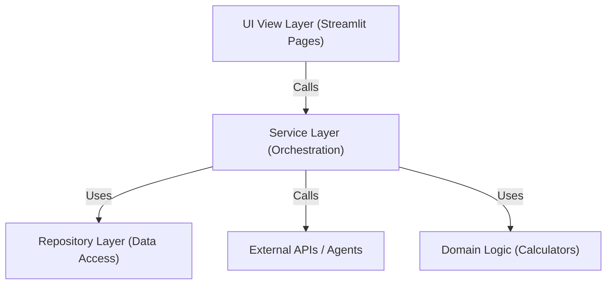

# 前端與服務架構 (Frontend & Service Architecture)

> **[繁體中文 (Traditional Chinese)](#zh) | [English](#en)**

---

## 🇹🇼 架構概觀 (Architecture Overview)

為了提高系統的可維護性 (Maintainability)、可測試性 (Testability) 與職責分離 (Separation of Concerns)，本專案在 v3.3 版本中引入了 **View-Service 分層架構**。此架構明確區分了「UI 渲染」與「業務邏輯編排」的職責。

### 1. 分層設計 (Layer Design)

本系統採用經典的三層式架構變體，特別針對 Streamlit 的狀態管理特性進行了優化：

#### 1.1 視圖層 (View Layer)
*   **職責**: 負責 UI 佈局、元件渲染、接收使用者輸入與 Session State 狀態管理。
*   **位置**: `src/pages/*.py`, `src/dashboard.py`.
*   **原則**: 
    - 不應包含複雜的數據處理或 API 呼叫邏輯。
    - 透過依賴注入 (Dependency Injection) 或直接實例化 Service 來獲取數據。
    - **組件化**: 複雜頁面 (如 `Settings`) 拆分為多個獨立的 Tab 組件 (`src/pages/settings_tabs/*.py`)。

#### 1.2 服務層 (Service Layer)
*   **職責**: 負責數據編排 (Orchestration)、業務邏輯流控制、快取策略 (Caching) 與錯誤處理。
*   **位置**: `src/services/*.py`.
*   **關鍵組件**:
    - `DashboardService`: 聚合交易紀錄、即時報價與資產計算。
    - `PerformanceService`: 處理績效回測與損益分析。
    - `ThemeService`: 集中管理 CSS 樣式與視覺主題邏輯。
*   **原則**:
    - 純 PythonClass，不依賴 Streamlit UI 函數 (除了 `@st.cache` 裝飾器)。
    - 易於進行單元測試 (Unit Test)。

#### 1.3 存儲與基礎層 (Repository & Infrastructure)
*   **職責**: 負責單純的數據 CRUD 與外部 API 封裝。
*   **位置**: `src/repositories/*.py`, `src/utils/*.py`.

#### 1.4 MCP 服務層 (MCP Service Layer)
*   **職責**: 負責跨 Agent 工具共享與 A2A 通訊 (使用 FastAPI)。
*   **位置**: `src/mcp_service/*.py`.
*   **性質**: 獨立運行的 Microservice，提供 HTTP API。

---

## 🇺🇸 Technical Architecture

To enhance maintainability and testability, the project adopts a **View-Service Layered Architecture**, strictly separating UI rendering from business logic orchestration.

### 1. Core Layers

#### 1.1 View Layer (UI)
*   **Role**: Handles rendering layout, user inputs, and Streamlit session state.
*   **Principles**: 
    - Logic-free views.
    - Modularized components (e.g., `src/pages/settings_tabs/`).
    - Delegates data fetching to Services.

#### 1.2 Service Layer (Business Logic)
*   **Role**: Orchestrates data flow, aggregates data sources, and handles caching/errors.
*   **Key Services**:
    - `DashboardService`: Orchestrates transactions and market data.
    - `ThemeService`: Centralizes styling logic.
*   **Principles**:
    - Testable (decoupled from UI rendering).
    - Encapsulates complex business rules.

### 2. Implementation Benefits
- **Testability**: Services can be tested in isolation (achieved 75% coverage).
- **Modularity**: Large pages like Settings are broken down into manageable sub-components.
- **Reusability**: Core logic (e.g., Theme management) is reusable across different pages.

## 🔗 Bidirectional Links
- **System Landscape**: [System Landscape](系統全景圖-System-Landscape.md)
- **Developer Guide**: [Environment & Local Dev](環境設定與本地開發-Environment-Local-Dev)
