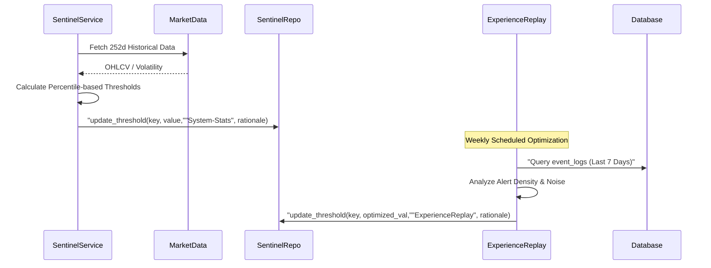

# 動態指標與復盤機制 (Dynamic Indicators & Experience Replay)

### 版本紀錄 (Version History)

| Date | Version | Description | Author |
| :--- | :--- | :--- | :--- |
| 2026-03-08 | v1.4 | **Risk & Cash Calibration**: Generalized Ticker mandates and added Inflation-adjusted Dynamic Cash logic. | Antigravity |
| 2026-03-05 | v1.3 | **Rule #8 Compliance**: Added `EvaluationService` dynamic thresholding. | Antigravity |
| 2026-02-21 | v1.2 | Added Real-time Accuracy Analytics and Performance Tracking logic. | Neo |
| 2026-02-18 | v1.1 | Standardized structure and added English translations. | Neo |
| 2026-02-14 | v1.0 | Initial Release: Based on Rule #8. | Neo |

---

## 🇹🇼 概述 (Overview)

根據系統核心規範 **Rule #8 (動態指標原則)**，本系統嚴禁使用寫死 (Hardcoded) 的閾值。所有監控門檻必須基於歷史數據計算或透過復盤機制進行自動調整。

### 1. 技術架構 (Technical Architecture)

- **SentinteService.risk_consistency**: 執行風險與配置的一致性校準。
  - **Balanced Profile**: 強制限制槓桿率為 1.70x。
  - **動態現金比例 (Dynamic Cash Ratio)**: 基於通膨 (CPI) 與市場波動度 (VIX) 自動校準。公式：`Target = Base * (1 + Inflation) * VIX_Mod`。

#### 1.2 復盤優化與敘事偵測 (Experience Replay & Narrative)

`ExperienceReplayService` 負責「閉環優化」(Closed-loop Optimization)：

- **敘事漂移偵測 (Narrative Drift Detection)**: 比對每日記錄的 `conviction_level` (信心) 與 `time_horizon` (持有期限)，偵測 System 1 (情動) 是否偏離了初始的投資主題 (Signal)。
- **現金優化 (Cash Optimization)**: 透過 `optimize_cash_ratio()` 根據歷史回撤與獲利能力動態微調目標水位。
- **噪訊抑制 (Noise Suppression)**: 若某個指標在 7 天內觸發超過 10 次，系統會判定為噪訊過大，自動調高 (例如 +5%) 該閾值。
- **ROI 導向校準**: 將警報訊號與後續 30 天的投資回報率 (ROI) 關聯，自動過濾無效訊號。

#### 1.3 即時準確度分析 (Real-time Accuracy Analytics)

`PerformanceService` 現整合了 `recommendations` 資料表，用於分析 AI 訊號的真實效能：

- **訊號價格擷取 (Price at Signal)**: 當 Agent 發出訊號時，系統自動記錄當時的市場價格。
- **準確度計算 (Accuracy Calculation)**: 通過比對 `price_at_signal` 與當前市場價（或結算價），計算每個 Agent 的成功率 (Success Rate)，作為動態調整權重的依據。

### 2. 數據流圖 (Data Flow)

### 3. 設定與管理 (Configuration)

所有的動態門檻皆儲存於 `sentinel_thresholds` 資料表。

| 欄位 | 說明 |
| :--- | :--- |
| `key` | 指標鍵值 (如 `vix_high`) |
| `value` | 當前生效之數值 |
| `last_optimized_by` | 最後優化來源 (System-Stats/ExperienceReplay) |
| `roi_hint` | 指標效能指標 (分析 ROI 關聯性) |

---

## 🇺🇸 Overview (Dynamic Heuristics)

Following **Rule #8 (Dynamic Variable Principle)**, hardcoded thresholds are strictly forbidden. All monitoring levels are derived from historical statistics or adjusted via the Experience Replay loop.

### 1. Statistical Calibration

- **Percentile-based**: Uses 90th and 97.5th percentiles of the past 252 days (1-year trading window).
- **Z-Score Logic**: Adaptive Sigma detection for intra-day price anomalies.

### 2. Experience Replay Service

- **Noise Suppression**: Frequency-based adjustment. If a trigger fires >10 times in 7 days, the threshold is automatically tightened (+5%).
- **ROI Correlation**: Connects alert signals to subsequent portfolio performance to filter out false positives.

### 3. Management

Thresholds are stored in the `sentinel_thresholds` table and managed by `SentinelRepository`.

## 🔗 Bidirectional Links

- **Sentinel Architecture**: [Sentinel & Council Architecture](哨兵與評議會架構-Sentinel-Council-Architecture)
- **Domain Models**: [Data & Domain Models](資料與領域模型-Data-Domain-Models)
