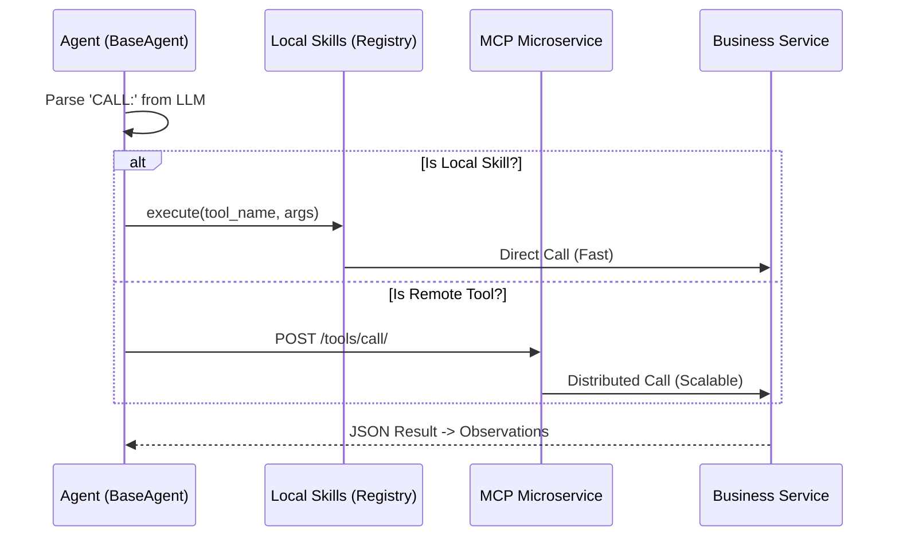

# 底層通信協議 (Agent Mesh Protocols)

> **[繁體中文 (Traditional Chinese)](#zh) | [English](#en)**
> **最新版本 (Latest Version)**: 請參閱文件頂部的版本紀錄 (Iteration Record).

### 版本紀錄 (Version History)
| Date | Version | Description | Author |
| :--- | :--- | :--- | :--- |
| 2026-02-07 | v1.1 | Enhanced "Tools & Skills" architecture (Local Skills + Remote MCP) | Neo |
| 2024-01-04 | v1.0 | Initial Release | Neo |

---

<a id="zh"></a>

## 🇹🇼 底層通信協議與 Agent Mesh (Internal Specs)

本文件依據 [文件框架定義](文件框架定義-Document-Frameworks) 編寫，詳細定義了 Agent Mesh 的通訊規範、安全性要求與工具調用協議。

### 1. 通訊框架 (Communication Framework)
系統採用雙層通訊架構，兼顧單機開發的便利性與分散式叢集的擴展性。
- **協定類型**: HTTP/1.1 + gRPC (內部)。
- **訊息格式**: JSON。

#### 1.1 混合工具架構 (Hybrid Tool Architecture)
為了平衡效能與擴展性，系統採用 **本地技能 (Local Skills)** 與 **遠端服務 (Remote MCP)** 並行的架構：

1.  **本地技能 (Local Skills - "The Brain")**:
    -   **機制**: 透過 `SkillLoader` 讀取 `SKILL.md` 並綁定 Python 實作。
    -   **執行**: 在 Agent 行程內 **本地執行**，無網路延遲。
    -   **用途**: 高頻邏輯運算、資料解析、格式化。
    -   **優勢**: 極致效能 (Optimal Performance)。

2.  **MCP 微服務 (Remote MCP - "The Interface")**:
    -   **機制**: FastAPI 微服務，提供 HTTP 介面。
    -   **執行**: 跨行程/跨容器調用。
    -   **用途**: 公共 API、外部系統整合、儀表板數據獲取。
    -   **優勢**: 高擴展性 (Scalability) 與解耦 (Decoupling)。

#### 1.2 訊息結構定義 (Protocol Schemas)

##### [NEW] 工具註冊 (Tool Registration)
```json
{
  "name": "string",
  "description": "string",
  "parameters": {
    "key": "type (str/int/float)",
    "description": "human readable"
  }
}
```

##### [NEW] Agent 間通訊 (Inter-Agent Message)
```json
{
  "sender": "string",
  "receiver": "string",
  "content": "markdown_string",
  "context": { "key": "any" }
}
```

### 2. 執行模型：ReAct 迴圈 (Execution Model: ReAct)
Agent 不僅僅是單次調用，而是透過 **Think-Act-Observe** 模式自主探索。

#### 2.1 思考-行動-觀察週期的邏輯 (Cycle Logic)
1.  **Think**: Agent 根據提示詞判斷是否需要外部工具。
2.  **Act**: LLM 輸出特定格式字串 `CALL: tool_name({"arg": "val"})`。
3.  **Observation**: 系統解析指令，優先尋找 **Local Skills**，若無則調用 **Remote MCP**，並將結果回傳。

#### 2.2 工具調用生命週期 (Tool Call Lifecycle)


### 3. Agent 對 Agent 網格 (Agent-to-Agent Mesh)
本系統目前採用的 A2A 機制確保了任務的高度專業化與並行處理。

- **靜態實例 (Static Mode)**: 透過 `AgentFactory` 直接進行對等實體化調用。
- **訊息路由 (Message Mode)**: (v3.2+) 透過 `mcp_service/agents/message` 進行非同步任務分發，適合長耗時的研究任務。

### 4. 工具集詳細定義 (Toolset Specification)
所有工具均透過 `Registry` (Local) 或 `MCP Service` (Remote) 暴露。

| 工具名稱 | 輸入參數 (Types) | 業務邏輯 / 數據源 | 執行模式 |
| :--- | :--- | :--- | :--- |
| `get_current_price` | `ticker` (str) | [MarketDataService](服務層開發指南-Service-Layer-Blueprints) | Local/Remote |
| `get_valuation` | `ticker` (str) | FMP (Ratios, PE, PB) | Local/Remote |
| `get_company_profile` | `ticker` (str) | FMP/Polygon | Local/Remote |
| `web_search` | `query` (str) | Tavily (Financial Context) | Local/Remote |
| `get_macro_indicators` | - | FRED (GDP, CPI, Rates) | Local/Remote |

### 5. 安全與品質要求 (Security & Quality NFR)

- **預防 SQL 注入 (SQLi Prevention)**:
    - **強制規範**: 嚴禁在 Repo 層使用字串格式化拼接 SQL。
    - **範例**: `conn.execute("SELECT * FROM t WHERE id = ?", (id,))`。
- **機密管理 (Secrets Management)**:
    - 所有 API Keys 不得明文出現於日誌或代碼。
    - 採用 `Environment Repository` 模式加載加密變數。
- **HR 回饋協議**:
    - Agent 互相對報告品質評分 (1-5 分)，存儲於 `agent_reviews` 表。
    - 當平均評分 < 3.0 時，觸發 [Engineer Agent](核心系統規格-Core-System-Specs) 的 Prompt 重調。

### 6. 成功指標 (Success Metrics)
- **工具調用成功率**: > 99.5%。
- **注入漏洞發生率**: 0 (由 SAST `bandit` 保證)。

---

<a id="en"></a>

## 🇺🇸 Agent Mesh Protocols

### 1. Framework
We utilize a **Hybrid Tool Architecture** combining **Local Skills** (for performance) and **Remote MCP Services** (for scalability).
- **Communication**: JSON payloads over HTTP/1.1 (External) and direct function calls (Internal).

### 2. Execution Model
Agents use the **ReAct** (Think-Act-Observe) loop.
- **Priority**: Local Skills are checked first. If not found, a remote MCP call is made.

### 3. Toolset Spec
Standardized interfaces for `get_current_price`, `get_news`, etc. Shared business logic ensures consistency across both local and remote execution modes.

### 4. Security (NFR)
- **SQLi**: Mandatory use of parameterized queries.
- **Secrets**: Encrypted storage and environment-only loading.
- **HR Protocols**: Automated cross-agent scoring loop.

### 5. Success Metrics
- **Tool Success Rate**: > 99.5%.
- **Zero-Injection Policy**: Verified by SAST.

## 🔗 Bidirectional Links
- **Architecture**: [System Landscape](系統全景圖-System-Landscape)
- **PM Specs**: [Core System Specs](核心系統規格-Core-System-Specs)
- **DB Design**: [Database Standards](資料庫設計與代碼規範-Database-Git-Standards)
